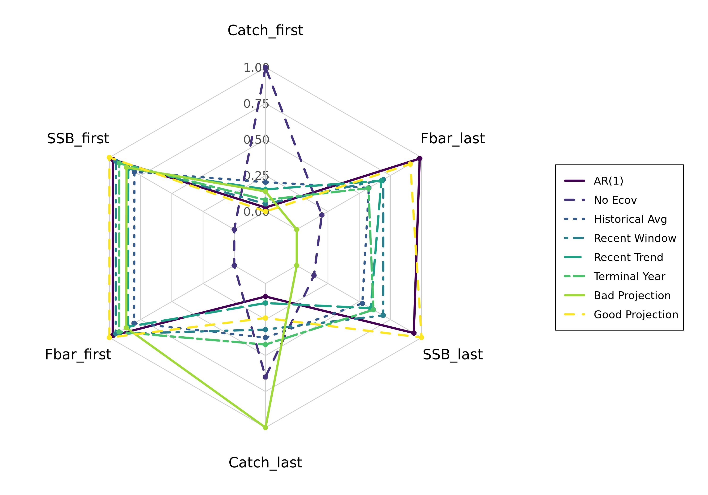

\doublespacing


```{=tex}
\begin{center}
    
\textbf{\Large Applying effective environmental forecasts to Management Strategy Evaluation of yellowtail flounder}
    
\textsc{Sophie Wulfing$^{1*}$ Chengxue Li$^{3}$ Scott I. Large$^{2}$ Vincent Saba$^{2}$ Gavin Fay$^{1}$ Kamran Walsh$^{1}$\\}
\vspace{3 mm}
\normalsize{\indent $^1$School for Marine Science and Technology, University of Massachusetts Dartmouth, New Bedford, MA, 02747, USA\\ $^2$NOAA, National Marine Fisheries Service, Woods Hole, MA 02543, USA\\ $^3$School of Marine and Atmospheric Sciences, Stony Brook University, Stony Brook, NY 11794, USA\\}
$\text{*}$ Corresponding authors: Sophie Wulfing (SophieWulfing@gmail.com)
\end{center}
```

\newpage

\linenumbers

```{r setup, include=FALSE}
knitr::opts_chunk$set(echo = FALSE, warning = FALSE, message = FALSE, dev="cairo_pdf", cache = FALSE)
setwd("C:/Users/swulfing/Documents/GitHub/UMassD/YT_proj/Manuscripts/Draft3")

library(png)
library(ggplot2)
library(tidyr)
library(dplyr)
library(scales)
library(knitr)
library(ggpubr)
library(gridExtra)

PlotLocations <- '/Plots'

ModNames_proj <- c("Mod_AR1Ecov", "Mod_NoEcov", "Mod_HistAvgEcov", "Mod_RecWindEcov", "Mod_RecTrendEcov", "Mod_TermYear", "Mod_BadProj", "Mod_GoodProj")
ModNames_bias <-   c("Mod_AR1Ecov", "Mod_NoEcov", "Mod_LOWEcov", "Mod_MEDLOWEcov", "Mod_MEDEcov", "Mod_HIGHEcov")
ModNames_biasOMs <- c("Mod_LOWEcov", "Mod_MEDLOWEcov", "Mod_MEDEcov", "Mod_HIGHEcov")

Proj_ests <- readRDS('C:/Users/swulfing/Documents/GitHub/UMassD/YT_proj/Manuscripts/Draft3/Projections_data.rds')
FiveYr_ests <- readRDS('C:/Users/swulfing/Documents/GitHub/UMassD/YT_proj/Manuscripts/Draft3/5Yr_data.rds')
FiveYrSENS_ests <- readRDS('C:/Users/swulfing/Documents/GitHub/UMassD/YT_proj/Manuscripts/Draft3/5YrSENS_data.rds')
NAARE_ests <- readRDS('C:/Users/swulfing/Documents/GitHub/UMassD/YT_proj/Manuscripts/Draft3/NAARE_data.rds')

BRP_data <- readRDS('C:/Users/swulfing/Documents/GitHub/UMassD/YT_proj/Manuscripts/Draft3/BRP_data.rds')

cohorts <- data.frame(readRDS('C:/Users/swulfing/Documents/GitHub/UMassD/YT_proj/Manuscripts/Draft3/Cohort_data.rds'))

scenarios <- readRDS('C:/Users/swulfing/Documents/GitHub/UMassD/YT_proj/Manuscripts/Draft3/scenarios.rds')

# Biases
HIGH_ests <- readRDS('C:/Users/swulfing/Documents/GitHub/UMassD/YT_proj/Manuscripts/Draft3/Biases/High_data.rds') 
HIGH_ests$OM_name <- 'HIGH'

MED_ests <- readRDS('C:/Users/swulfing/Documents/GitHub/UMassD/YT_proj/Manuscripts/Draft3/Biases/Med_data.rds')
MED_ests$OM_name <- 'MED'

MEDLOW_ests <- readRDS('C:/Users/swulfing/Documents/GitHub/UMassD/YT_proj/Manuscripts/Draft3/Biases/MedLow_data.rds') 
MEDLOW_ests$OM_name <- 'MEDLOW'

LOW_ests <- readRDS('C:/Users/swulfing/Documents/GitHub/UMassD/YT_proj/Manuscripts/Draft3/Biases/Low_data.rds')
LOW_ests$OM_name <- 'LOW'

# STILL TO DO:
# Fix em temp lot: citation and page layout
# RTA citation
# Make supplemental material
# Write performance metrics in Methods (once results finished)
```

# ABSTRACT

A changing climate is influencing oceanographic processes in complex ways, and different fish stocks have been shown to respond differently to shifting ocean conditions. Therefore, classifying these climate effects on fishery dynamics is of increasing importance to managers. Climate forecast products, such as the Modular Ocean Model from the NOAA Geophysical Fluid Dynamics Laboratory, could help address these challenges as management advice based on environmental forcing has been shown to improve the accuracy of stock assessments across various fisheries. In this study, we use Management Strategy Evaluation (MSE) to analyze the different choices made when projecting or forecasting future environmental conditions within assessments, what subsequent catch advice is generated from the MSE, and how this affects long-term fishery dynamics. We use the Georges Bank Yellowtail Flounder (*Limanda ferruginea*) as it is an important stock to the Northeast groundfish fishery, its recruitment has been shown to be impacted by bottom ocean temperatures, and this relationship is explicitly included in the assessment used to provide managemetn advice. Results focusing on recruitment-environment relationships show that using a 5 year temperature average to project forward in the management period most accurately estimates ‘true’ environmental covariates. However, among different projection decisions, including integrating environmental forecasts of varying accuracy, there is a limited impact on the model performance and output, and the model is more influenced by changes to recruitment variability and assessment frequency.


# INTRODUCTION

As the world’s oceans are complex physical and chemical systems, climate change has impacted oceans in a variety of ways such as increased water temperature and acidification, and changes in ocean currents [@fabry2008; @guinotte2008; @abraham2013; @sydeman2015; @wilson2016; @poloczanska2016; @garcíamolinos2017; @friedland2022; @cheng2024]. As a result, different marine species are projected to have complex and varying responses to these environmental shifts depending on species’ life histories, thermal tolerances, mobility, and other aspects of the species’ biology [@guinotte2008; @chown2010; @honischGeologicalRecordOcean2012; @puntFisheriesManagementClimate2014; @stewartCombinedClimatePreymediated2014; @sydeman2015; @poloczanska2016; @wilson2016; @chaikin2024]. This creates compounding challenges when managing commercially-important fisheries. Fish stocks have already been shown to alter food chain interactions as well as increase fishing effort by changing distributions away from traditional fishing grounds or changing the time of year in which they visit these areas [@overholtz2011; @albouy2014; @stewartCombinedClimatePreymediated2014; @sydeman2015; @poloczanska2016; @wilson2016; @garcíamolinos2017; @tommasi2017; @fulton2021;  @chaikin2024].

In the 2010's, the US Northeast continental shelf has warmed faster than any other marine ecosystem in the United States [@saba2016; @kleisner2017; @saba2023]. The varying responses to climate change across fished species has presented challenges in accurately assessing stock health of various species in the region, however this environmental information has rarely been incorporated into stock assessments in the Northeast U.S. [@hare2016; @kleisner2017; @mazur2023]. These model covariates have been shown to reduce retrospective patterns and increase projection accuracy in New England stocks of species including Atlantic Cod, haddock, yellowtail flounder, and winter flounder [@buckley2004; @klein2017]. However, incorporating environmental covariates into stock assessments is difficult and a very explicit and strong relationship between environmental change and population dynamics must be shown or else improper use of an environmental covariate could lead to poorer rather than better estimation performance [@haltuchPromisesPitfallsIncluding2011; @puntFisheriesManagementClimate2014; @ehrlén2015; @brittenIdentificationPerformanceStockrecruitment2024; @millerFactorsAffectingInferences2023].

The current structure of management in the United States includes periodic, scheduled evaluations of stock status and subsequent management advice called Management Track Assessments (MTAs) [@nefscManagementTrackStock2026]. Here, managers must take current data regarding the stock’s health and make decisions for the next several years regarding catch advice and management measures. This means that the assessment and predictions of stock health must hold up over several years until the next MTA. Therefore, managers must make multiple decisions regarding predicted stock-recruit relationships, mortality, and how to consider environmental and population uncertainty in these assessment models. The incorporation of environmental covariates has been shown to decrease this uncertainty in management predictions across many stocks worldwide [@hollowedIntegratingEcosystemAspects2011; @wayteManagementImplicationsIncluding2013; @puntFisheriesManagementClimate2014; @tommasiManagingLivingMarine2017; @stramClimateReadinessSynthesis2022; @mazurConsequencesIgnoringClimate2023; @sabaNOAAFisheriesResearch2023]. However, decisions on how exactly to project environmental conditions between MTAs are important to consider when predicting stock dynamics. With recent improvements, ocean dynamic models are able to offer improved predictions of future stock dynamics and are being used in stocks worldwide. However, the spatial and temporal scale of these models is relevant [@hobday2016]. Future climate is also difficult to estimate as there is a lot of uncertainty and climate change is a very chaotic process [@puntFisheriesManagementClimate2014]. As assessments attempt to capture future population trends, forecasting environmental trends is also imperative, however this can be challenging as optimal decisions can change depending on scale, species, and which environmental covariates are used [@kellImplicationsClimateChange2005; @hollowed2011; @tommasi2017; @stramClimateReadinessSynthesis2022]. In a simulation-estimation experiment, @brittenIdentificationPerformanceStockrecruitment2024 found that there was no discernable difference in stock dynamics if ocean temperature was predicted using a self-updating average called a first-order Auto Regressive (AR(1)) model or if the temperature was predicted using the mean of the last five years. Further, @kellImplicationsClimateChange2005 showed that climate change has a limited effect in the short term for Atlantic cod, and only long term simulations showed an effect on stock dynamics and recovery. @hansellCollapseRecoveryCollapse2025 used both recent averages and AR(1) estimations of future climate to predict that Georges Bank yellowtail flounder stocks could recover under certain climate conditions, but the efficacy and catch advice of each projection was not compared. This project aims to build off of these findings. Here, we expand the types of projections that have been tested by previous research, simulate over a greater number of years than what other similar studies have, and assess how catch advice and fishery dynamics may respond to changing projections.

Management Strategy Evaluations (MSEs) are decision making frameworks that allow assessors to simulate and compare the sustainability and tradeoffs associated with different management decisions [@hollowed2011; @tommasi2017; @mazur2023; @saba2023]. As a state-space framework, MSEs use feedback loops between the Operating Model (OM), which simulates the ‘real-world’ fishery dynamics such as stock recruitment, growth, natural mortality, and fishing mortality, and the Estimation Model (EM), which simulates a management assessment. The EM essentially ‘samples’ the OM to calculate its own estimations of stock status, predicted fishing mortality, and gives subsequent catch advice based on the estimated health of the real world system in the OM [@bunnefeldManagementStrategyEvaluation2011; @puntManagementStrategyEvaluation2016]. This is intended to replicate real-world stock assessments, which are imperfect representations of real-world dynamics and set catch advice for several years in advance. Applying climate change covariates and MSE to New England groundfish has shown to improve the robustness of stock assessments [@mazur2023]. Populations’ responses to climate change can be complex, as fish exhibit different sensitivities to environmental conditions depending on their lifestage, and different environmental changes (i.e. increased sea surface or bottom temperature, changes in salinity, and altered currents) will have different effects on populations [@hollowed2011]. Further, we test the dynamics of a three vs. a five-year assessment, as some stocks are transitioning to a less frequent assessment cycle in the Northeast United States [@CurrentStockAssessment2026]. Our aim is to understand the long-term impacts of these choices and to know their influence on how climate should be considered in these assessments. As fisheries change in response to these altered dynamics, the need for climate-ready fisheries management is imperative [@stramClimateReadinessSynthesis2022; @saba2023]. The MSE framework allows for simultaneous testing of these features, while considering the pros and cons of different hypothetical measures to determine the appropriate management response to these changing conditions [@punt2016].

The yellowtail flounder (*Limanda ferruginea*) has a long history of harvest in the US Atlantic Coast. However due to stock collapse in the 1980s, it is now primarily caught as bycatch in other surrounding fisheries [@northeastfisheriessciencecenteru.s.YellowtailFlounderResearch2025]. Yellowtail flounder is managed as three distinct stocks in the Northeast US; Southern New England, Gulf of Maine, and Georges Bank. Yellowtail flounder are sensitive to water temperatures at the larval phase [@laurence1981; @xuEvaluatingUtilityGulf2018]. The Georges Bank stock has been shown to shift its distribution northward in response to warming ocean temperatures [@murawski1993; @nye2009; @hyun2014]. This stock has been in decline starting in the 1970s, leading to a collapse in the early 1990s [@stone2004]. Recently, ocean bottom temperature has been shown to have a strong link to the recruitment of Georges Bank yellowtail flounder, and the incorporation of this environmental covariate has been shown to improve stock assessment accuracy and prediction success [@johnsonYellowtailFlounderLimanda1999; @kerr2022; northeastfisheriessciencecenteru.s.YellowtailFlounderResearch2025]. Because this relationship between environment and stock dynamics has a clear linkage, inclusion of environmental covariates have improved assessment success, and this stock has a long history of data collection, we use Georges Bank yellowtail flounder as a case study. We aim to incorporate bottom temperature into stock assessments and the MSE framework in order to assess the management performance of different choices when projecting bottom temperature and subsequent tactical fishery management advice when determining catch advice of Georges Bank yellowtail flounder.


# METHODS

## Operating Model Development and Conditioning

Operating models were conditioned on the current assessment for the Georges Bank yellowtail flounder [@northeastfisheriessciencecenteru.s.YellowtailFlounderResearch2025]. Operating models, estimation models, and all simulation testing was conducted using  the R package whamMSE [@Cheng2025]. As per the model parameterization in yellowtail stock assessment, process error was included in the estimates of Numbers At Age (NAA) estimates. 100 simulations were run with each experiment, allowing for different realizations of various possible fishery dynamics. As the data used to condition the OM spanned from 1973 to 2022, this was considered the hindcast period and model dynamics were projected until 2072 to test a 50 year projection period.

For the environmental covariate of bottom temperature, we used a dataset developed by @dupontavice2023, which is also used in the Georges Bank yellowtail flounder stock assessment [@northeastfisheriessciencecenteru.s.YellowtailFlounderResearch2025]. We projected the ‘real-world’ temperature in the OM by conducting a linear regression on the existing data points and then projecting future temperatures along this trendline with added variation around a normal distribution. First, the Woods Hole Assessment Model was fitted to real Yellowtail flounder data from the NEFSC survey to serve as the basis for the OM. This base-OM was used to estimate parameters for numbers-at-age, selectivity, recruitment, and ecological covariate. These parameters were then treated as ‘truth’ in our simulation and were used in the second OM we developed for the projections. This second OM, with all of the parameters already estimated, fixes the environmental covariate at a true state with no process error, however observation error is still included. This allowed us to run the 100 simulations of various temperature projections in our Estimation Model while maintaining the same ‘real-world’ state to allow us to compare EM performances. 

### Bias Experiment

As a first experiment, we tested the consequences of using incorrect climate projections in the EM under different real world climate scenarios in the OM.

In the base-case scenario, ocean floor temperatures were projected by taking the overall trend of the hindcast data and continuing that trend forward for the 50 year projection period with added variability. In the hindcast period from 1972 to 2022, ocean floor temperatures were increasing at about 0.02 °C per year. For the base-case scenario, this trend was projected forward from 2023 to 2072 as a time-variant annual mean of a normal distribution. The temperature for any projection year was drawn from that normal distribution, using the standard deviation estimated by @dupontavice2023 for bottom temperatures in the hindcast period.

We then considered three more climate scenarios: a low-temperature scenario where the trend of this time-variant annual mean was -0.04 (multiplying the hindcast trend by -2), a medium-low scenario where the time variant annual mean had a -0.02 (multiplying the hindcast trend by -1) change per year, and a high-temperature scenario where the time-variant annual mean was 0.04 (multiplying the hindcast trend by 2). All scenarios used the same standard deviation found from the @dupontavice2023 hindcast period.

### Projection, 5-year, and Sensitivity Tests

In the subsequent experiments, we tested how different projection choices in the EM affect fishery dynamics in a normal yellowtail flounder assessment scenario with a three year assessment cycle, a 5 year assessment period, and an experiment using a reduced random effects on NAA of 0.2. As each EM uses a different projected temperature time series, the impact of these different temperature time series may be absorbed by the random effects on NAA, so the observable impact of different bottom temperatures may be hidden by this variation in the NAA. Reducing these random effects will give the ecological covariate a more direct impact on future dynamics, amplifying the effects of different projection choices. 

## EMs

The Estimation Model (EM) simulates the assessment and catch advice process in the fishery, including observation errors. Stock assessments were tested with the catch advice following the  0.75 Fmsy NEFMC control rule, meaning catch is limited to 75% of what is calculated to be the maximum rate of sustainable extraction in the assessment. We tested a 50 year projection period, simulating 50 years of fishery dynamics, with the EM conducting an assessment and setting catch advice every three years. 

### Temperature Bias in EMs 

For the bias test, we used the four OM scenarios as the four ‘real-world’ temperature trends and tested them against four EMs that were identical except for this temperature projection (figure  \@ref(fig:EMTemps)). The purpose of this experiment was to assess the performance of Estimation Models using an incorrect assumption of temperature trends in assessment processes, and how these consequences change under different future climate scenarios. Each of the four OM temperature time series (low-temperature, medium-low temperature, the base case, and the high-temperature scenarios) were then tested against EMs using the same four temperature trends, simulating a negative, slightly-negative, and positive bias scenario along with the base-case  (no bias) temperature trend. This experiment was also meant to test the use of ocean temperature forecast products, such as the  Modular Ocean Model (MOM6) from the NOAA Geophysical Fluid Dynamics Laboratory. The temperature scenarios tested in this research span a similar range as the scenario outputs of MOM6. Each combination of real world temperature trends and bias forecasts in the EM was simulated 100 times to ensure robustness of model results. Any non-converged models resulted in the elimination of that whole simulation. 

```{r EMTemps, fig.cap = 'Temperature projections of the different Bias tests. In each test, one of these four temperture time series was used as the OM and this was tested against 4 EMs; each using one of the time series as a hypothetical assumption about temperature trends', echo = FALSE, warning = FALSE, message = FALSE}
knitr::include_graphics("Biases/EMtempPlot.png")
```

### Projection EMs

After comparing biased projections through the MSE process, the experiment was repeated except we used only the original OM temperature projection (the one that maintains the trend from the @dupontavice2023 data set). For the EMs, two biased projections were kept (a 'bad' projection, which assumed a low-bias where temperature was decreasing over time, and doubled the rate of temperature change compared to the OM, and a 'good' projection, which has no bias and maintained the general trend of temperature increase with added stochasticity). The purpose of keeping these two biased time series was to compare ‘correct’ and ‘incorrect’ assumptions about climate with different projection choices in the Estimation Model. For the various projection choices, stock advice is given with different assumptions for how climate will change over the three-year timespan in between assessments. The process for calculating different temperature projections is shown in figure \@ref(fig:EMTempsProj), but at each assessment year, each projection choices takes into account the most recent environmental information (in this case bottom temperature) of the previous years and calculates an assumed temperature time series over the next three years (until the next stock assessment, where temperature predictions are recalculated given the most recent environmental data).

Figure \@ref(fig:EMTempsProj) demonstrates the various projection options tested in this experiment. AR(1) (Auto-Regressive1) projection uses an updated mean at each timestep for the projection. As this is a default setting in WHAM, we are using this as a comparison projection. However, as this process is updated yearly, it doesn't represent a realistic management approach. In real management, information is only updated at each management year, including bottom temperature. The Recent Window process uses the mean of the previous 5 years in its projection. Historical average uses the average of all data points collected in the hindcast period of 1972-2022. The Recent Trend process, similar to Recent Window, takes the last 5 years of data and uses the linear regression of the last 5 years as its projection. The Terminal Year projection uses the final temperature observation across the projection period. We also included a ‘Good Projection’ which uses the same general trend of temperature as in the OM with added stochasticity. A Bad Projection was also included. Same as the negative-bias in the previous experiment, this projection tests projection with a bias significantly lower than temperatures from the OM. We also tested an EM with No Temperature time series used (not pictured in figure \@ref(fig:EMTempsProj)) - This projection does not consider environmental covariates in its projection. 

### 5-year and Sensitivity EMs

We repeated the experiment with different projection choices, but with a reduced parameter for random effects on this stocks recruitment (from 0.655 to 0.2 in recruitment and from 0.72 to 0.2 in age classes 2+) Lower variance on recruitment forces interannual variation in recruitment to respond more directly to environmental variation which could potentially amplify the consequences of different projection choices.

We also tested how changing assessment intervals would influence fishery dynamics under different projection choices, increasing the time period in between assessments from three years to every five years. This reduced management schedule is being adopted for various stocks in the Northeast United States, so this experiment is intended to assess the performance of less frequent stock assessments under changing ocean conditions.

```{r EMTempsProj, echo = FALSE, warning = FALSE, message = FALSE, results = 'hide', fig.cap = "Graphical representation of each projection choice. For comparison, the OM (or real world) temperature trends are shown in black a) the AR(1), the default setting in WHAM, is shown in blue. The good projection (green) and the bad projection (red) were calculated using the same slope as the OM and adding variaiton for the good projection, and this slope was multiplied by -2 in the 'bad projection' to simulate an incorrect assumption about long term temperature trends. b) Historical average (orange) uses the entire hindcast period to assume one temperature average across the projection. Terminal year (purple) simply uses the last temperature measurment recorded in the hindcast period and assumes bottom temperatures won't change from this number in the whole projection period. c) Recent window approach uses the average temperature in the last 5 years and uses this average for the next three years until the next assessment, after which this 5 year recent average is recalculated and projected for the next three years. Recent trend has a similar continuously-updating process, but uses projects a linear regression of the last 5 years' temperature data into the next three year projection period until the next assessment. d) a visualization of all temperature time series that are used in this experiment"}

### Setup ####

df_HA <- data.frame(year = scenarios[["HistAvg"]][["year"]],
                    mean = c(rep(scenarios[["HistAvg"]][["mean"]][51], 50), scenarios[["HistAvg"]][["mean"]][51:102]),
                    groupID = c(rep(1,50), rep(2:18, each = 3), 18))

df_RW <- data.frame(year = scenarios[["RecWind"]][["year"]],
                    mean = c(rep(mean(scenarios[["RecWind"]][["mean"]][1:50]), 50), scenarios[["RecWind"]][["mean"]][51:102]),
                    groupID = c(rep(1,50), rep(2:18, each = 3), 18))

df_RT <- data.frame(year = scenarios[["RecTrend"]][["year"]],
                    mean = c(rep(mean(scenarios[["RecTrend"]][["mean"]][1:50]), 50), scenarios[["RecTrend"]][["mean"]][51:102]),
                    groupID = c(rep(1,50), rep(2:18, each = 3), 18))

for(i in 1:length(unique(df_HA$groupID))){
  df_test <- df_HA %>%
    filter(df_HA$groupID == i)
  lm_summary <- summary(lm(mean ~ year, df_test))
  new_pt <- lm_summary[["coefficients"]][1] + (lm_summary[["coefficients"]][2] * (max(df_test$year) + 1))
  newYr <- data.frame(year = (max(df_test$year) + 1),
                      mean = new_pt,
                      groupID = i)
  df_HA <- rbind(df_HA, newYr)
}

df_HA <- df_HA %>% 
  mutate(mean = if_else(groupID == 1, NA, mean))

for(i in 1:length(unique(df_RW$groupID))){
  df_test <- df_RW %>%
    filter(df_RW$groupID == i)
  lm_summary <- summary(lm(mean ~ year, df_test))
  new_pt <- lm_summary[["coefficients"]][1] + (lm_summary[["coefficients"]][2] * (max(df_test$year) + 1))
  newYr <- data.frame(year = (max(df_test$year) + 1),
                      mean = new_pt,
                      groupID = i)
  df_RW <- rbind(df_RW, newYr)
}

df_RW <- df_RW %>% 
  mutate(mean = if_else(groupID == 1, NA, mean))

for(i in 1:length(unique(df_RT$groupID))){
  df_test <- df_RT %>%
    filter(df_RT$groupID == i)
  lm_summary <- summary(lm(mean ~ year, df_test))
  new_pt <- lm_summary[["coefficients"]][1] + (lm_summary[["coefficients"]][2] * (max(df_test$year) + 1))
  newYr <- data.frame(year = (max(df_test$year) + 1),
                      mean = new_pt,
                      groupID = i)
  df_RT <- rbind(df_RT, newYr)
  if(i == 2){
    dash_ex <- data.frame(year = 2017:2022,
                          mean = NA)
    for(j in 1:nrow(dash_ex)){
      dash_ex$mean[j] <- lm_summary[["coefficients"]][1] + (lm_summary[["coefficients"]][2] * dash_ex$year[j])
    }
  }
}

df_RT <- df_RT %>% 
  mutate(mean = if_else(groupID == 1, NA, mean))

### 1 ####

p1 <- ggplot() +
  #geom_line(aes(color = "OM")) +
  
  geom_line( aes(x = c(rep(NA, 50), scenarios[["AR1"]][["year"]][51:102]),
                 y = c(rep(NA, 50),scenarios[["AR1"]][["mean"]][51:102]), color = 'AR1'), linewidth = 1) +
  
  # geom_line( aes(x = c(rep(NA, 50), scenarios[["HistAvg"]][["year"]][51:102]),
  #                y = c(rep(NA, 50), scenarios[["HistAvg"]][["mean"]][51:102]), color = 'HistAvg')) +
  # 
  # geom_line( aes(x =c(rep(NA, 50),  scenarios[["RecWind"]][["year"]][51:102]),
  #                y = c(rep(NA, 50), scenarios[["RecWind"]][["mean"]][51:102]), color = 'RecWind')) +
  # 
  # geom_line( aes(x = c(rep(NA, 50), scenarios[["RecTrend"]][["year"]][51:102]),
  #                y = c(rep(NA, 50), scenarios[["RecTrend"]][["mean"]][51:102]), color = 'RecTrend')) +
  # 
  # geom_line( aes(x = c(rep(NA, 50), scenarios[["TermYear"]][["year"]][51:102]),
  #                y = c(rep(NA, 50), scenarios[["TermYear"]][["mean"]][51:102]), color = 'TermYear')) +
  # 
  geom_line( aes(x = c(rep(NA, 50), scenarios[["GoodProj"]][["year"]][51:102]),
                 y = c(rep(NA, 50), scenarios[["GoodProj"]][["mean"]][51:102]), color = 'GoodProj'), linewidth = 1) +
  
  geom_line( aes(x = c(rep(NA, 50), scenarios[["BadProj"]][["year"]][51:102]),
                 y = c(rep(NA, 50), scenarios[["BadProj"]][["mean"]][51:102]), color = 'BadProj'), linewidth = 1) +
  
  geom_line(aes(x = scenarios[["OM"]][["year"]],
                y = scenarios[["OM"]][["mean"]], color = 'OM'), linewidth = 1) + # om_with_data_P$rep$Ecov_x # om_with_data_P$input$data$Ecov_obs
  geom_vline(xintercept = seq(2022, 2072, by = 3), linetype="dashed", color = "black") +
  geom_vline(xintercept=2022, color = "black", linetype = 'dashed', linewidth = 1.5) +
  # geom_vline(xintercept=2025, linetype="dashed", color = "black") +
  # geom_vline(xintercept=2028, linetype="dashed", color = "black") +
  scale_color_manual(name='Projection',
                     breaks=c('OM', 'AR1', 'GoodProj', 'BadProj'), # breaks=c('OM', 'AR1', 'RecWind', 'HistAvg', 'RecTrend', 'TermYear', 'GoodProj', 'BadProj'),
                     values=c('OM'="#000000", 
                              'AR1'="#1A85FF",
                              # 'RecWind' = "#F5C710" ,
                              # 'HistAvg' =  "#3283FE",
                              # 'RecTrend' = "#00BA38",
                              # 'TermYear' = "red",
                              'GoodProj' = 'green',
                              'BadProj' = 'red'),
                     labels = c('OM','AR(1)','Good Projection', 'Bad Projection')) +
  xlim(2020,2072) +
  # ylab("Bottom Temperature (°C)") +
  # # xlim(2017,2026) +
  # xlab("Year") +
  ylab("") +
  xlab("") +
  ggtitle("a)") +
  theme_classic()


  
### 2 ####

p2 <- ggplot() +
  #geom_line(aes(color = "OM")) +
  
  # geom_line( aes(x = c(rep(NA, 50), scenarios[["AR1"]][["year"]][51:102]),
  #                y = c(rep(NA, 50),scenarios[["AR1"]][["mean"]][51:102]), color = 'AR1'), linewidth = 1) +
  # 
  # geom_line( aes(x = scenarios[["HistAvg"]][["year"]],
  #                y = c(rep(mean(scenarios[["HistAvg"]][["mean"]][1:50]), 50), scenarios[["HistAvg"]][["mean"]][51:102]), color = 'HistAvg', group = scenarios[["HistAvg"]][["groupID"]]), linewidth = 1) +
  geom_line(data = df_HA, aes(x = year, y = mean, color = 'HistAvg', group = groupID), linewidth = 1) +

  # geom_line( aes(x =c(rep(NA, 50),  scenarios[["RecWind"]][["year"]][51:102]),
  #                y = c(rep(NA, 50), scenarios[["RecWind"]][["mean"]][51:102]), color = 'RecWind')) +
  # 
  # geom_line( aes(x = c(rep(NA, 50), scenarios[["RecTrend"]][["year"]][51:102]),
  #                y = c(rep(NA, 50), scenarios[["RecTrend"]][["mean"]][51:102]), color = 'RecTrend')) +

  geom_line( aes(x = c(rep(NA, 50), scenarios[["TermYear"]][["year"]][51:102]),
                 y = c(rep(NA, 50), scenarios[["TermYear"]][["mean"]][51:102]), color = 'TermYear'), linewidth = 1) +

  # geom_line( aes(x = c(rep(NA, 50), scenarios[["GoodProj"]][["year"]][51:102]),
  #                y = c(rep(NA, 50), scenarios[["GoodProj"]][["mean"]][51:102]), color = 'GoodProj'), linewidth = 1) +
  # 
  # geom_line( aes(x = c(rep(NA, 50), scenarios[["BadProj"]][["year"]][51:102]),
  #                y = c(rep(NA, 50), scenarios[["BadProj"]][["mean"]][51:102]), color = 'BadProj'), linewidth = 1) +
  
  geom_line(aes(x = scenarios[["OM"]][["year"]],
                y = scenarios[["OM"]][["mean"]]), linewidth = 1, color = '#000000') + # om_with_data_P$rep$Ecov_x # om_with_data_P$input$data$Ecov_obs
  geom_vline(xintercept = seq(2025, 2072, by = 3), linetype="dashed", color = "black") +
  geom_vline(xintercept=2022, color = "black", linetype = 'dashed', linewidth = 1.5) +
  # geom_vline(xintercept=2028, linetype="dashed", color = "black") +
  scale_color_manual(name='',
                     breaks=c('HistAvg', 'TermYear'), # breaks=c('OM', 'AR1', 'RecWind', 'HistAvg', 'RecTrend', 'TermYear', 'GoodProj', 'BadProj'),
                     values=c(#'OM'="#000000", 
                              # 'AR1'="#1A85FF",
                              # 'RecWind' = "#F5C710" ,
                              'HistAvg' =  "orange",
                              # 'RecTrend' = "#00BA38",
                              'TermYear' = '#5D3A9B'
                              # 'GoodProj' = 'green',
                              # 'BadProj' = 'red'
                              ),
                     labels = c('Historical Average','Terminal Year')) +
  geom_segment(aes(y = 7.368982, yend = 7.368982, x = 1972, xend = 2022), color = 'orange', linetype = 'dashed') +
  annotate("point", x = 2022, y = 8.062910, colour = '#5D3A9B', size = 5.5, shape = 16) +
  xlim(1972,2072) +
  # ylab("Bottom Temperature (°C)") +
  # # xlim(2017,2026) +
  # xlab("Year") +
  ylab("") +
  xlab("") +
  ggtitle("b)") +
  theme_classic()


### 3 ####

p3 <- ggplot() +
  #geom_line(aes(color = "OM")) +
  
  # geom_line( aes(x = c(rep(NA, 50), scenarios[["AR1"]][["year"]][51:102]),
  #                y = c(rep(NA, 50),scenarios[["AR1"]][["mean"]][51:102]), color = 'AR1'), linewidth = 1) +
  # 
  # geom_line( aes(x = scenarios[["HistAvg"]][["year"]],
  #                y = c(rep(mean(scenarios[["HistAvg"]][["mean"]][1:50]), 50), scenarios[["HistAvg"]][["mean"]][51:102]), color = 'HistAvg'), linewidth = 1) +
  # 
  geom_line(data = df_RW, aes(x = year, y = mean, color = 'RecWind', group = groupID), linewidth = 1) +
  geom_line(data = df_RT, aes(x = year, y = mean, color = 'RecTrend', group = groupID), linewidth = 1) +

  # geom_line( aes(x = c(rep(NA, 50), scenarios[["RecTrend"]][["year"]][51:102]),
  #                y = c(rep(NA, 50), scenarios[["RecTrend"]][["mean"]][51:102]), color = 'RecTrend'), linewidth = 1) +

  # geom_line( aes(x = c(rep(NA, 50), scenarios[["TermYear"]][["year"]][51:102]),
  #                y = c(rep(NA, 50), scenarios[["TermYear"]][["mean"]][51:102]), color = 'TermYear'), linewidth = 1) +
  # 
  # geom_line( aes(x = c(rep(NA, 50), scenarios[["GoodProj"]][["year"]][51:102]),
  #                y = c(rep(NA, 50), scenarios[["GoodProj"]][["mean"]][51:102]), color = 'GoodProj'), linewidth = 1) +
  # 
  # geom_line( aes(x = c(rep(NA, 50), scenarios[["BadProj"]][["year"]][51:102]),
  #                y = c(rep(NA, 50), scenarios[["BadProj"]][["mean"]][51:102]), color = 'BadProj'), linewidth = 1) +
  
  geom_line(aes(x = scenarios[["OM"]][["year"]],
                y = scenarios[["OM"]][["mean"]]), linewidth = 1, show.legend = FALSE, color = '#000000') + # om_with_data_P$rep$Ecov_x # om_with_data_P$input$data$Ecov_obs
  geom_vline(xintercept = seq(2025, 2072, by = 3), linetype="dashed", color = "black") +
  geom_vline(xintercept=2022, color = "black", linetype = 'dashed', linewidth = 1.5) +
  # geom_vline(xintercept=2028, linetype="dashed", color = "black") +
  scale_color_manual(name='',
                     breaks=c('RecWind', 'RecTrend'), # breaks=c('OM', 'AR1', 'RecWind', 'HistAvg', 'RecTrend', 'TermYear', 'GoodProj', 'BadProj'),
                     values=c(#'OM'="#000000", 
                              # 'AR1'="#1A85FF",
                              'RecWind' = "#F5C710" ,
                              # 'HistAvg' =  "orange",
                              'RecTrend' = "#00BA38"
                              # 'TermYear' = '#5D3A9B'
                              # 'GoodProj' = 'green',
                              # 'BadProj' = 'red'
                     ),
                     labels = c('Recent Window','Recent Trend')) +
  geom_segment(aes(y = 8.216753, yend = 8.216753, x = 2017, xend = 2022), color = "#F5C710", linetype = 'dashed') +
  geom_segment(aes(y = min(dash_ex$mean), yend = max(dash_ex$mean), x = 2017, xend = 2022), color = "#00BA38", linetype = 'dashed') +
  xlim(2017,2028) +
  # ylab("Bottom Temperature (°C)") +
  # # xlim(2017,2026) +
  # xlab("Year") +
  ylab("") +
  xlab("") +
  ggtitle("c)") +
  theme_classic()


# ### 4 ####
# 
# p4 <- ggplot() +
# 
#   geom_line( aes(x = c(rep(NA, 50), scenarios[["AR1"]][["year"]][51:102]),
#                  y = c(rep(NA, 50),scenarios[["AR1"]][["mean"]][51:102]), color = 'AR1')) +
#   
#   geom_line( aes(x = c(rep(NA, 50), scenarios[["HistAvg"]][["year"]][51:102]),
#                  y = c(rep(NA, 50), scenarios[["HistAvg"]][["mean"]][51:102]), color = 'HistAvg')) +
#   
#   geom_line( aes(x =c(rep(NA, 50),  scenarios[["RecWind"]][["year"]][51:102]),
#                  y = c(rep(NA, 50), scenarios[["RecWind"]][["mean"]][51:102]), color = 'RecWind')) +
#   
#   geom_line( aes(x = c(rep(NA, 50), scenarios[["RecTrend"]][["year"]][51:102]),
#                  y = c(rep(NA, 50), scenarios[["RecTrend"]][["mean"]][51:102]), color = 'RecTrend')) +
#   
#   geom_line( aes(x = c(rep(NA, 50), scenarios[["TermYear"]][["year"]][51:102]),
#                  y = c(rep(NA, 50), scenarios[["TermYear"]][["mean"]][51:102]), color = 'TermYear')) +
#   
#   geom_line( aes(x = c(rep(NA, 50), scenarios[["GoodProj"]][["year"]][51:102]),
#                  y = c(rep(NA, 50), scenarios[["GoodProj"]][["mean"]][51:102]), color = 'GoodProj')) +
#   
#   geom_line( aes(x = c(rep(NA, 50), scenarios[["BadProj"]][["year"]][51:102]),
#                  y = c(rep(NA, 50), scenarios[["BadProj"]][["mean"]][51:102]), color = 'BadProj')) +
#   
#   geom_line(aes(x = scenarios[["OM"]][["year"]],
#                 y = scenarios[["OM"]][["mean"]], color = 'OM')) + 
#   
#   geom_vline(xintercept=2022, color = "black", linetype = 'dashed', linewidth = 1.5) +
#   
#   
#   scale_color_manual(name='Model',
#                      breaks=c('OM', 'AR1', 'RecWind', 'HistAvg', 'RecTrend', 'TermYear', 'GoodProj', 'BadProj'),
#                      values=c('OM'="#000000", 
#                               'AR1'="#1A85FF",
#                               'RecWind' = "#F5C710" ,
#                               'HistAvg' =  "orange",
#                               'RecTrend' = "#00BA38",
#                               'TermYear' = '#5D3A9B',
#                               'GoodProj' = 'green',
#                               'BadProj' = 'red'),
#                      labels = c('OM','AR(1)', 'Recent Average', 'Historical Average', 'Recent Trend', 'Terminal Year','Good Projection', 'Bad Projection')) +
#   xlim(2022,2072) +
#   # ylab("Bottom Temperature (°C)") +
#   # # xlim(2017,2026) +
#   # xlab("Year") + 
#   ylab("") +
#   xlab("") +
#   ggtitle("d)") +
#   theme_classic()

fig <- ggpubr::ggarrange(p1, p2, p3, nrow = 3, heights = c(1,1,1.1))


# 3. Add common axis titles
annotate_figure(fig,
                bottom = text_grob("Year", color = "black", size = 14),
                left = text_grob("Bottom Temperature (°C)", color = "black", rot = 90, size = 14))

```

## Performance Metrics

First, EM performance was evaluated by comparing the first and last ten years of each EM in the simulation period. We compared the advice that each EM produced, and the trade-offs associated with each. Then, we compared the accuracy of each EM when calculating the ecological covariate, and compared this with the 'true' covariate in the OM. Inter-annual catch variation of each EM was also assessed to understand how stable the catch advice would be in each experiment. Finally, we calculated the percent of recruitment variation that was caused by bottom temperature in each of the projection, 5-year, and sensitivity experiments.

# RESULTS

Before assessing the performance of each model, each EM simulated was tested for convergence. If any of the EM models did not converge, that whole simulation across experiments was removed from the results to ensure comparability across results. Convergence checks were used from the r package TMB [@TMB2016].

## Bias Tests

Using positive bias in temperature in the EM leads to management regimes that prioritize high $\bar{F}$ and SSB throughout the time series (figure \@ref(fig:BiasRadars)). However, catch remains lower in these scenarios. Negatively-biased EMs start with lower catch advice, but tend to increase the amount of suggested catch in the final years of the simulation. Final SSB and $\bar{F}$, however, are lower in these simulations than those that assumed high temperatures in the EM (high positive bias).

```{r BiasRadars, echo = FALSE, warning = FALSE, message = FALSE, fig.cap = "Performance of each EM Projection in the first and last ten years of the simulation for a) low, b) medium-low, c) medium, and d) high real-world temperature scenarios."}

library(png)
library(grid)
library(gridExtra)

p1 <- readPNG("Biases/radar_LOW.png")
p2 <- readPNG("Biases/radar_MEDLOW.png")
p3 <- readPNG("Biases/radar_MED.png")
p4 <- readPNG("Biases/radar_HIGH.png")
p5 <- readPNG("Biases/radarLegend_BIAS.png")

grid.arrange(rasterGrob(p1), rasterGrob(p2), rasterGrob(NA), rasterGrob(p3), rasterGrob(p4), rasterGrob(p5), nrow = 2, widths = c(2.5, 2.5, 0.6))

```

The annual variation of catch was different across different projection choices in the EM, however were generally higher in warmer OM scenarios. Temperature trajectories that matched that of the OM (e.g. the positive-bias scenario in the EM combined with the high temperature scenario in the OM) most closely matched the amount of variation in the AR(1) process. EM models that did not include an ecov, or used the negative or very negative temperature biases resulted in higher annual catch variation than the other EM projections (Supplementary Material, Figure 1).


The estimated parameters for the environmental covariate are shown in figure \@ref(fig:paramEstsbias) compared to that of the OM in each bias test (the black vertical line). Across the EMs, negative-biased EMs tended to underestimate this covariate, while positive-biased projections resulted in an over-estimation of this covariate. Conversely, EMs meant to emulate the real world scenarios by using the correct temperature projection (green projections in figure \@ref(fig:paramEstsbias)) generally out-performed the biased projections, with the exception of the low climate scenario. 

<!-- When comparing the resulting spawning stock biomass (SSB) and fishing mortality ($\bar{F}$) from these simulations, the direction of bias in the EMs had more of an impact on the results than the accuracy of the projection to the OM. Across climate scenarios, higher bias EMs tended to estimate higher SSB trends in the projection period and lower $\bar{F}$, however subsequent catch advice remains relatively similar across the different biases, regardless of climate scenario. Further, in warmer climate scenarios, the differences among calculated $\bar{F}$ becomes greater across EMs; using a lower temperature bias results in higher, more variable $\bar{F}$ estimations. These figures are provided in the supplemental material. -->

```{r paramEstsbias, echo = FALSE, warning = FALSE, message = FALSE, fig.cap = "Estimated environmental parameter from each EM compared to the 'true' value in the OM on the y axis. Colors correspond to if the EM had a positive temperature bias (red), a negative temperature bias (blue), or if the EM intended to accurately reflect climate dynamics (i.e. AR(1) process or temperature projection that had no bias, and matched that of the OM) (green). The dashed black line indicates where these two estimations would be equal"}

Bias_ests <- list(HIGH_ests, MED_ests, MEDLOW_ests, LOW_ests)

# BIASES
medTablebias <- data.frame(EM_name = c(),
                            seed = c(),
                            OM_name = c(),
                            ecov_med_om = c(),
                            ecov_med_em = c(),
                            percentDifference = c(),
                            ecov_sd = c(), 
                            bias_dir = c())

for(i in 1:4){
  data_use <- Bias_ests[[i]]

  #mean
  data_clean <- data_use %>%
  group_by(EM_name, seed_no) %>%
  summarize(ecov_med_om = round(median(Ecov_beta_R_OM, na.rm = TRUE), digits = 3),
            ecov_med_em = round(median(Ecov_beta_R_EM, na.rm = TRUE), digits = 3),
            ecov_sd = round(sd(Ecov_beta_R_EM, na.rm = TRUE), digits = 3)) %>%
    mutate(percentDifference = (ecov_med_em - ecov_med_om)/ecov_med_om)
  
  data_clean$OM_name <- i
  
  data_clean <- data_clean %>%
    select(EM_name, seed_no, OM_name, ecov_med_om, ecov_med_em, percentDifference, ecov_sd)
  
    for(j in 1:nrow(data_clean)){
  #meanTablebias <- merge(meanTablebias, data_clean, by = 'EM_name')
    if(i == 1){
      if(data_clean$EM_name[j] == 'Mod_AR1Ecov'| data_clean$EM_name[j] == 'Mod_HIGHEcov'){data_clean$bias_dir[j] <- 'S'} else {data_clean$bias_dir[j] <- 'L'}
      }

    if(i == 2){
      if(data_clean$EM_name[j] == 'Mod_AR1Ecov'| data_clean$EM_name[j] == 'Mod_MEDEcov'){data_clean$bias_dir[j] <- 'S'} else if (data_clean$EM_name[j] == 'Mod_LOWEcov' | data_clean$EM_name[j] == 'Mod_MEDLOWEcov'){data_clean$bias_dir[j] <- 'L'} else{data_clean$bias_dir[j] <- 'H'}
    }
    if(i == 3){
      if(data_clean$EM_name[j] == 'Mod_AR1Ecov'| data_clean$EM_name[j] == 'Mod_MEDEcov'){data_clean$bias_dir[j] <- 'S'} else if (data_clean$EM_name[j] == 'Mod_LOWEcov' | data_clean$EM_name[j] == 'Mod_MEDLOWEcov'){data_clean$bias_dir[j] <- 'L'} else{data_clean$bias_dir[j] <- 'H'}
      if(data_clean$EM_name[j] == 'Mod_AR1Ecov'| data_clean$EM_name[j] == 'Mod_MEDLOWEcov'){data_clean$bias_dir[j] <- 'S'} else if (data_clean$EM_name[j] == 'Mod_LOWEcov'){data_clean$bias_dir[j] <- 'L'} else{data_clean$bias_dir[j] <- 'H'}
    }
    if(i == 4){
      if(data_clean$EM_name[j] == 'Mod_AR1Ecov'| data_clean$EM_name[j] == 'Mod_LOWEcov'){data_clean$bias_dir[j] <- 'S'} else{data_clean$bias_dir[j] <- 'H'}
    }

  # }
  # bias_compare <- rbind(bias_compare, data_clean)
}


data_clean$bias_dir <- factor(data_clean$bias_dir, levels = c('L','S','H'))

  #colnames(data_clean) <- c('EM', 'OM', 'OM Ecov', 'EM Ecov', 'Percent Change', 'SD')

  medTablebias <- rbind(medTablebias, data_clean)
}


medTablebias$EM_name <- factor(medTablebias$EM_name, levels = c("Mod_NoEcov","Mod_LOWEcov", "Mod_MEDLOWEcov", "Mod_MEDEcov", "Mod_HIGHEcov", "Mod_AR1Ecov"))

p <- list()

scenarioNames <- c('High', 'Medium', 'Medium-Low', 'Low') #c('Medium-Low','Low','High', 'Medium')

for(i in c(3,4,1,2)){
  data_use <- Bias_ests[[i]]
  
  plotdata <- medTablebias %>%
    filter(OM_name == i) %>%
    filter(EM_name != "Mod_NoEcov")
  
  p[[i]] <- ggplot(plotdata, aes(x = EM_name, y = ecov_med_em, fill = bias_dir)) +
    geom_boxplot(show.legend = TRUE) +
    scale_fill_manual(name = 'Bias',
                      values = c("L" = "blue", "S" = "green", "H" = "red") ,
                     labels = c('Negative', 'None', 'Positive'),
                     drop = FALSE) +
    scale_x_discrete(labels= c('Low', 'Medium-Low','Medium','High','AR(1)')) +
    geom_hline(yintercept = median(plotdata$ecov_med_om), linetype = "dashed", color = "black") +
    ylim(-0.75, -0.1) +
    labs(title = paste('Climate Scenario:', scenarioNames[i])) +#ggtitle (i) + 
    theme(axis.title = element_blank(),
          plot.title = element_text(size = 10)) +
    coord_flip()
}

annotate_figure(ggarrange(p[[1]], p[[2]], p[[3]], p[[4]], nrow = 4, common.legend = TRUE, legend = 'right'), left = text_grob("Forecast", rot = 90, vjust = 1, hjust = 0.5, size = 14))


```

## Projection Tests

All projection choices had a similar performance at the beginning and end of the projection period, with low catch and high SSB and $\bar{F}$ throughout the simulation period (figure \@ref(fig:projectionRadar)). Models that did not use an ecov had high catch estimates both in the beginning and the end, however SSB and $\bar{F}$ remained low in both timeframes. The ‘bad projection’ maintained low catch in the beginning with high $\bar{F}$ and SSB estimates, which was similar to the other projections. However, at the end of the 50 year simulation, the ‘bad projection’ suggests high catch management scenarios, while SSB and $\bar{F}$ remain low at the end of the simulation. Similar results can be seen with the different projections choices in the experiment where we tested a 5 year management period and the sensitivity experiment where the variation of Numbers at Age was reduced to 0.2 (Figure 2 in Supplementary Material).

```{r projectionRadar, out.width = '75%',fig.cap = 'Performance of each EM Projection for the first and last ten years of the simulation', echo = FALSE, warning = FALSE, message = FALSE}



```

When comparing the parameter for the environmental covariate across different projections (figure \@ref(fig:paramEstsproj)), the most accurate estimation of the ecological covariate was the projection that used recent window approach, where the median calculated ecological covariate across simulations actually matched that of the OM. Historical average and 'bad' projections had the largest range of estimated ecological covariates across simulations. The relative estimation error in estimating the ecological covariate was the same with reduced random effects on recruitment, where recent average produced the most accurate estimation of the ‘true’ ecological covariate, and relatively poorer performances from  historical average (Figure 3 and Figure 4 in Supplementary Material). Further, only the recent trend projection tended to overestimate the ecological covariate, while the other projections tended to underestimate. Across projections, neither the regular test nor the reduced random effects on Numbers At Age test had consistently better accuracy in estimating this covariate across the simulations. One possible explanation for the limited impact of projection choices on long-term dynamics can be seen in figure \@ref(fig:cohorts), which shows the Catch At Age at a random timeframe before the projection period begins. Here, we see that, even though temperature is limiting recruitment (black boxes in the bar chart), this is a very small proportion of overall catch, and therefore our overall ability to detect responses to changing environments.

```{r paramEstsproj, fig.cap = 'Estimated ecological covariates for the different temperature projections in the EM compared to the "true" value in the OM.', echo = FALSE, warning = FALSE, message = FALSE}
### DO WE WANT THIS INFO IN TABLE OR GRAPH FORM


library(dplyr)

# PROJECTIONS
paramEsts_projs <- Proj_ests %>%
  filter(EM_name != 'Mod_NoEcov') %>%
  group_by(EM_name) %>%
  summarize(OM_ecov = round(median(Ecov_beta_R_OM, na.rm = TRUE), digits = 3),
          med_ecov = round(median(Ecov_beta_R_EM, na.rm = TRUE), digits = 3),
          sd_ecov = round(sd(Ecov_beta_R_EM, na.rm = TRUE), digits = 3)) %>%
    rowwise() %>%
    mutate(PercentChange = ((med_ecov - OM_ecov)/OM_ecov) * 100) %>%
  select(EM_name, OM_ecov, med_ecov, PercentChange, sd_ecov) %>%
  mutate(EM_name = case_when(
    EM_name == 'Mod_AR1Ecov' ~ 'AR(1)',
    EM_name == 'Mod_BadProj' ~'Bad Projection',
    EM_name == 'Mod_GoodProj' ~'Good Projection',
    EM_name == 'Mod_HistAvgEcov' ~'Historical Average',
    EM_name == 'Mod_RecTrendEcov' ~'Recent Trend',
    EM_name == 'Mod_RecWindEcov' ~'Recent Window',
    EM_name == 'Mod_TermYear' ~'Terminal Year'
  ))

#Ecov_processPars_mean

paramEsts_projs$PercentChange <- round(paramEsts_projs$PercentChange, digits = 3)

colnames(paramEsts_projs) <- c('EM Name','OM Ecov','Median Ecov','Percent Change', 'Ecov Standard Dev.')
# 
# kable(paramEsts_projs, caption = 'Ecov parameter estimates, standard deviation, and rho for each EM for projection')


boxplot_test <- Proj_ests %>%
  filter(EM_name != 'Mod_NoEcov')

ggplot(data = boxplot_test, aes(x = EM_name, y = Ecov_beta_R_EM)) +
  geom_boxplot() +
  geom_hline(yintercept = -0.3969783, color = 'red', linetype = 'dashed') +
  scale_x_discrete(labels= c('AR(1)','Bad Projection','Good Projection','Historical Average','Recent Trend','Recent Window','Terminal Year')) +
  xlab('Projection') +
  ylab('Calculated Ecological Covariate') +
  theme(axis.text.x=element_text(color = "black", size=11, angle=30, vjust=.8, hjust=0.8)) 


```

```{r cohorts, echo = FALSE, warning = FALSE, message = FALSE, fig.cap = 'Yearly cohorts and recruited cohort (black) from a randomly selected timeframe before the simulation period.'}

cohorts1 <- cohorts %>%
  select(Year, EM_name, seed_no, CAA1, CAA2, CAA3, CAA4, CAA5, CAA6) %>%
  rowwise() %>%
  filter(Year >= 2000 & Year <= 2005)

cohorts1 <- pivot_longer(cohorts1, names_to = 'Age', values_to = 'CAA', cols = starts_with('CAA'))

cohorts1$Age <- as.numeric(gsub("[^0-9]", "", cohorts1$Age))

cohorts1 <- cohorts1 %>%
  rowwise() %>%
  mutate(Cohort = (Year + 1) - Age) %>%
  mutate(CAA = CAA / 10^6)

cohorts1$Cohort <- as.factor(cohorts1$Cohort)

bartest <- cohorts1 %>%
  filter(Year == Cohort)


ggplot(cohorts1, aes(fill = Cohort, x = Year, y = CAA)) +
  geom_bar(position = 'stack', stat = 'identity') +
  geom_col(
    data = bartest,
    aes(x = Year, y = CAA, group = Cohort), 
    position = "stack", 
    color = "black",       # Outline color
    linewidth = 0.2,       # Outline thickness
    fill = NA              # Keeps the original fill visible
  ) +
  scale_y_continuous(labels = scales::comma) + 
  ylab('Catch At Age (Millions)') 


```

## Sensitivity and 5-year Assessment Tests

The experiments with low variance of numbers at age and the experiments with the 5-year assessment period had similar relative performances of the different projection choices (figure 2 in Supplementary Material). However, reducing the variance on the Numbers at Age resulted in lower annual catch variation when compared to the original assessment test (figure \@ref(fig:CatchVariation)). SSB and $\bar{F}$ followed a similar pattern (Supplemental Material, figure 5). Further, reducing the variation on Numbers at Age, resulted in a significantly higher proportion of variation in recruitment being attributed to the ecological covariate (fig \ref(fig:ecovContribution))

```{r CatchVariation, echo = FALSE, warning = FALSE, message = FALSE, fig.show='hold', fig.align='center', out.width = '50%', fig.cap = 'Interannual variation in catch for the a) regular projections and the b) projections with reduced variation on Numbers at Age'}

knitr::include_graphics(c("C:/Users/swulfing/Documents/GitHub/UMassD/YT_proj/Manuscripts/Draft3/Plots/Projection/Catch_variation.png",
                        "C:/Users/swulfing/Documents/GitHub/UMassD/YT_proj/Manuscripts/Draft3/Plots/NAARE/Catch_variation.png"))


```

```{r ecovContribution, echo = FALSE, warning = FALSE, message = FALSE, fig.cap = "Percent of recruitment variation that can be explained by the ecological covariate in each projection choice.", cache = TRUE}


cohortsN <- data.frame(readRDS('Cohort_dataNAARE.rds'))
cohortsP <- data.frame(readRDS('Cohort_dataPROJ.rds'))
cohorts5 <- data.frame(readRDS('Cohort_data5YR.rds'))

for(i in 1:nrow(cohortsN)){
  cohortsN$BH[i] <- (exp(cohortsN$SR_Alpha[i]) * cohortsN$SSB[i])/(exp(cohortsN$SR_Beta[i]) + cohortsN$SSB[i])
  cohortsN$TempEffect[i] <- cohortsN$Ecov_beta_R_OM[i] * cohortsN$Temp_OM[i]
  cohortsN$Epsilon[i] <- cohortsN$OM_NAA_devs[i]
}

cohorts_NAARE <- cohortsN %>%
  mutate(R_t = log(BH) + TempEffect + Epsilon) %>%
  mutate(Ecov_t = log(BH) + TempEffect) %>%
  group_by(EM_name, seed_no) %>%
  summarize(var_Ecovt = var(Ecov_t),
            var_Rt = var(R_t)) %>%
  mutate(contribution = var_Ecovt/var_Rt)


for(i in 1:nrow(cohortsP)){
  cohortsP$BH[i] <- (exp(cohortsP$SR_Alpha[i]) * cohortsP$SSB[i])/(exp(cohortsP$SR_Beta[i]) + cohortsP$SSB[i])
  cohortsP$TempEffect[i] <- cohortsP$Ecov_beta_R_OM[i] * cohortsP$Temp_OM[i]
  cohortsP$Epsilon[i] <- cohortsP$OM_NAA_devs[i]
}

cohorts_PROJ <- cohortsP %>%
  mutate(R_t = log(BH) + TempEffect + Epsilon) %>%
  mutate(Ecov_t = log(BH) + TempEffect) %>%
  group_by(EM_name, seed_no) %>%
  summarize(var_Ecovt = var(Ecov_t),
            var_Rt = var(R_t)) %>%
  mutate(contribution = var_Ecovt/var_Rt)


for(i in 1:nrow(cohorts5)){
  cohorts5$BH[i] <- (exp(cohorts5$SR_Alpha[i]) * cohorts5$SSB[i])/(exp(cohorts5$SR_Beta[i]) + cohorts5$SSB[i])
  cohorts5$TempEffect[i] <- cohorts5$Ecov_beta_R_OM[i] * cohorts5$Temp_OM[i]
  cohorts5$Epsilon[i] <- cohorts5$OM_NAA_devs[i]
}

cohorts_5YR <- cohorts5 %>%
  mutate(R_t = log(BH) + TempEffect + Epsilon) %>%
  mutate(Ecov_t = log(BH) + TempEffect) %>%
  group_by(EM_name, seed_no) %>%
  summarize(var_Ecovt = var(Ecov_t),
            var_Rt = var(R_t)) %>%
  mutate(contribution = var_Ecovt/var_Rt)
  


cohorts_NAARE$Experiment <- 'Reduced NAA Variation'
cohorts_PROJ$Experiment <- 'Three-Year Assessment (default)'
cohorts_5YR$Experiment <- 'Five-Year Assessment'

cohort_combine <- rbind(cohorts_NAARE, cohorts_PROJ, cohorts_5YR)


ggplot(cohort_combine, aes(x = EM_name, y = contribution, fill = Experiment)) +
  geom_boxplot() +
  ylab('Percent Contribution of Ecov \n to Recruitment Variation') +
  xlab('EM Temperature Projection') +
  scale_x_discrete(labels = c('Ar(1)','Bad Projection','Good Projection','Historical Average','No Ecov','Recent Trend','Recent Window','Terminal Year')) +
  theme(axis.text.x = element_text(angle = 45, hjust = 1))
```

# Discussion

Although using different projections performed similarly, our results show that high-temperature scenarios in the OM resulted in lower but more variable catch, suggesting warmer climate futures may pose challenges for the future of the Georges Bank yellowtail flounder as warming oceans could lead to a reduction in fishery production. Yearly catch variation could also be higher if stock assessments do not capture this temperature increase. However, beyond catch variability, using a time series in the Estimation Model that had a bias compared to that of the Operation Model had a limited impact on the overall model dynamics. In other words, using a negative or positive bias in a temperature time series will result in similar management advice, regardless of the real-world temperature changes. This is despite the fact that EMs that use a low-biased time series will generally underestimate the ecological covariate, and high-biased scenarios will generally overestimate the ecological covariate. We can see a similar trend in choice of projection, where most projection choices, with the exception of the AR(1) process and an EM that does not include an ecological covariate, have similar starting and ending catch advice, SSB, and $\bar{F}$. However, when comparing which EM most closely calculates the ecological covariate in the OM, using the recent window approach gave the most consistently close estimation, even in tests with reduced variation on NAA and five-year assessment cycles. This projection even outperformed the Ar(1) process, which uses a yearly self-updating mean of temperature. These findings demonstrate that ocean forecast products such as MOM6 may be used for predicting future temperature scenarios, but using a projection in stock assessments may also adequately capture fishery dynamics.

Therefore, we recommend using the recent window approach to incorporating temperature projections in stock assessments, however there is not a large long-term impact of using other projection methods. This is in line with previous literature for yellowtail flounder, which has shown that there is little discernible difference between projections that used a continued estimated environmental process, ones that fixed the environmental process at recent 5 year average, and a third EM which used the observed environmental index [@brittenIdentificationPerformanceStockrecruitment2024]. This research also noted that the specific stock-recruitment relationship defined in the model will change the environmental affect size due to the placement of the environmental covariate in the stock-recruit equation. @mcclatchieReassessmentStockRecruit2010 found that for Pacific sardine, *Sardinops sagax*, temperature actually did not have a relationship with recruitment, and the correlation between temperature parameters and recruitment depended on the amount of autocorrelation in the temperature time series, although the specific mechanism that links Pacific sardine recruitment is less clear than with yellowtail flounder.

One possible explanation for the limited impact on catch advice is demonstrated in figure \ref(fig:cohorts). For Georges Bank Yellowtail, the environmental covariate has a lagged controlling effect on recruitment (CITE RT SORRY I MESSED UP THAT CITATION). Over time, the negative effects of high temperature could be masked by density-dependent mortality, or other factors that occur during the lag. @kellImplicationsClimateChange2005 found that the long-term performance and calculated reference points of Atlantic cod stock depended on if ocean temperatures were linked to juvenile survival versus the carrying capacity of the stock. Further, there may be a greater difference in model outputs if the environmental covariate had a direct effect on distribution, carrying capacity, catchability, mortality, behavioral, migratory, spawning, or metabolic processes; life history traits that can all be affected by environmental change [@puntFisheriesManagementClimate2014; @stockWoodsHoleAssessment2021], indicating a need for further research on projection choices for environmental covariates that affect other parts of life history. Catch advice is not very dependent on recruitment, and because this environmental link is also lagged, these combined factors could be masking the effect. Further, @haltuchPromisesPitfallsIncluding2011 has shown that incorrectly including environmental covariates in the stock does not have a large effect on biomass reference points or relative errors of the model. A review by @puntFisheriesManagementClimate2014 has also shown that short and medium-term fisheries management simulations are generally not greatly improved by incorporating environmental covariates. This research served to test a longer-term simulation and found a similar result. However, if there is a high temporal contrast in the ‘real world’ or OM, incorporating the environmental covariate in the estimation model can improve model accuracy [@millerFactorsAffectingInferences2023]. This could indicate that these results may change depending on the amount of future variation in ocean bottom temperatures.

This trend of different projections having similar impacts on model dynamics extends to our tests of five-year assessment cycles and reduced variation on Numbers At Age. In both of these experiments, all projections behaved similarly in the long term, with recent window approach most accurately calculated the ecological covariate. Reducing NAA variation, however, did reduce the interannual catch variation, which possibly indicated more stable fishery dynamics as there is less year-to-year changes in fishing advice. In these experiments, the amount of variation in recruitment that the ecological covariate explains is much higher (figure \@ref(fig:CatchVariation)), meaning that uncertainty around NAA could be absorbing some of the impacts of changing temperature projections. Improving our understanding of this stock-recruit relationship and the factors that cause variation in NAA could amplify the effects of choosing incorrect temperature time series or the consequences of different projection choices.

Future ocean conditions are expected to be highly variable in coming years due to climate change, [@wangClimateProjectionsSelected2010], so understanding potential impacts on fishery dynamics is vital. Overall, we found that projection decisions had a limited effect on catch advice and fishery dynamics in an MSE framework and other model components, such as assessment frequency and recruitment variation, had a larger influence on catch and management advice. This could be due to the nature of the environmental link to Georges Bank Yellowtail flounder, indicating a need for further research on how this type of link will affect model dynamics over different projection decisions. 


\newpage


**References**


