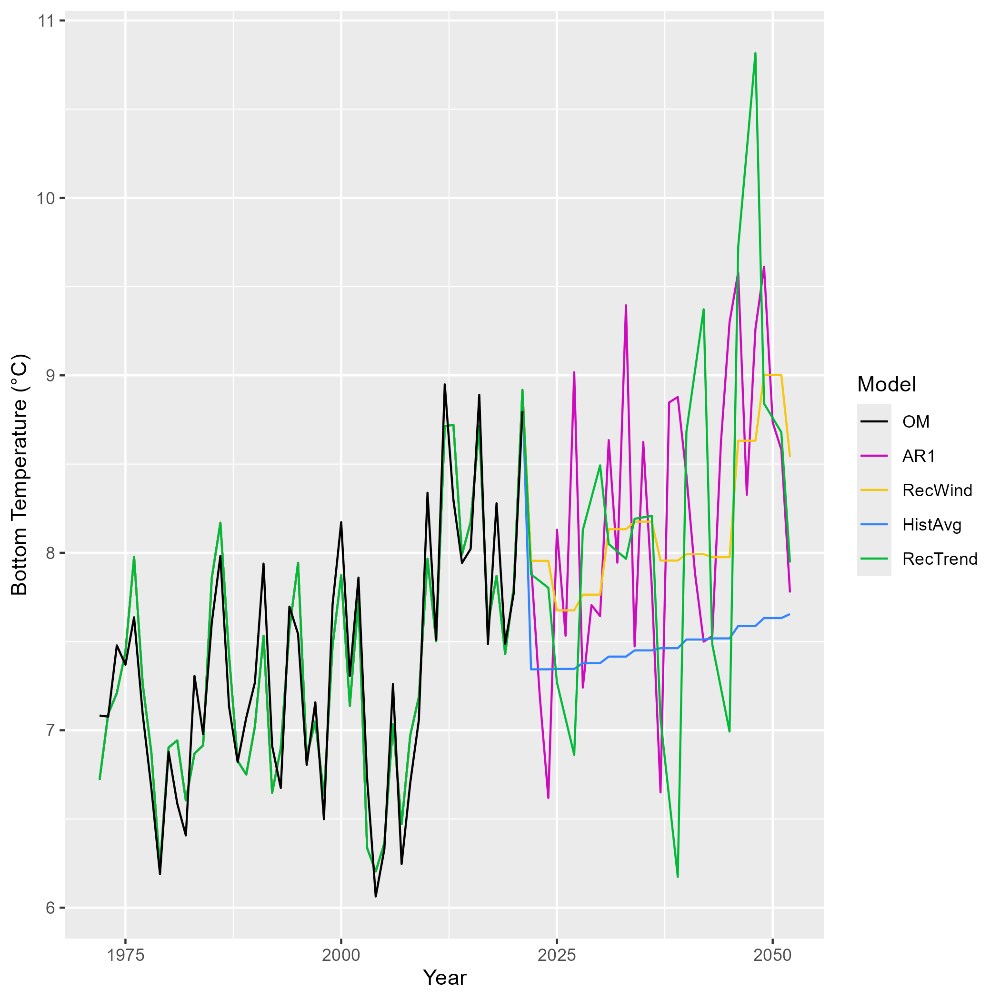

\doublespacing

```{=tex}
\begin{center}
    
\textbf{\Large Applying effective environmental forecasts to Management Strategy Evaluation of yellowtail flounder}
    
\textsc{Sophie Wulfing$^{1*}$ Gavin Fay$^{1}$ Chengxue Li$^{3}$ Scott I. Large$^{2}$ Vincent Saba$^{2}$\\}
\vspace{3 mm}
\normalsize{\indent $^1$School for Marine Science and Technology, University of Massachusetts Dartmouth, University of New Hampshire, 02747, MA, USA\\ $^2$NOAA, National Marine Fisheries Service, Narragansett, RI 02882, USA\\ $^3$School of Marine and Atmospheric Sciences, Stony Brook University, Stony Brook, NY 11794, USA\\}
$\text{*}$ Corresponding authors: Sophie Wulfing (SophieWulfing@gmail.com)
\end{center}
```
\newpage

\linenumbers

```{r setup, include=FALSE}
knitr::opts_chunk$set(echo = FALSE, warning = FALSE, message = FALSE, dev="cairo_pdf", cache = TRUE)
setwd("C:/Users/swulfing/Documents/GitHub/UMassD/YT_proj/Manuscripts")
```

# ABSTRACT

# INTRODUCTION

As the world’s oceans are complex physical and chemical systems, climate change has impacted oceans in a variety of ways such increased water temperature and acidification, and changes in ocean currents [@fabry2008; @guinotte2008; @abraham2013; @sydeman2015; @wilson2016; @poloczanska2016; @garcíamolinos2017; @friedland2022; @cheng2024]. As a result, different marine species are projected to have complex and varying responses to these environmental shifts depending on species’ life histories, thermal tolerances, mobility, and other aspects of the species’ biology [@guinotte2008; @chown2010; @honischGeologicalRecordOcean2012; @punt2014; @stewart2014; @sydeman2015; @poloczanska2016; @wilson2016; @chaikin2024]. This creates compounding challenges when managing commercially-important fisheries. As some species will shift ranges northward or to deeper waters in search of colder temperatures, this will disrupt historical food chains as predators and prey may shift in different directions, or range shifts will introduce new interactions between predator and prey species that have historically not overlapped [@overholtz2011; @albouy2014; @stewartCombinedClimatePreymediated2014; @sydeman2015; @wilson2016; @garcíamolinos2017; @chaikin2024]. Further, as fish populations may experience distribution shifts, annual growth patterns, or vary in abundance, this has potential to increase catch effort as historical fishing grounds and times may now not line up with fish stocks’ new life history dynamics [@overholtz2011; @poloczanska2016; @tommasi2017; @fulton2021]. New species may also shift their ranges into a commonly fished area, potentially opening up new commercial opportunities [@stewart2014].

The US Northeast continental shelf has warmed faster than any other marine ecosystem in the United States [@saba2016; @kleisner2017; @saba2023]. The varying responses to climate change across fished species has presented challenges in accurately assessing stock health of various species in the region [@hare2016; @kleisner2017]. Environmental covariates have rarely been incorporated into stock assessments in the Northeast [@mazur2023]. These covariates have been shown to reduce retrospective patterns and increase projection accuracy in New England populations such as Atlantic Cod, haddock, yellowtail flounder, and winter flounder [@buckley2004; @klein2017]. However, incorporating environmental covariates into stock assessments is difficult and a very clear and strong relationship between environmental change and population dynamics must be shown or else improper use of an environmental covariate could lead to poorer rather than better estimation performance [@haltuch2011; @punt2014; @ehrlén2015; @britten; @miller2023].

Management Strategy Evaluations (MSEs) are decision making frameworks that allow assessors to simulate and compare the sustainability and tradeoffs associated with different management decisions [@hollowed2011; @tommasi2017; @mazur2023; @saba2023]. Applying climate change covariates and MSE to New England groundfish has shown to improve the robustness of stock assessments [@mazur2023]. However, applications of MSEs can still be challenging, as climate change shifts population baselines and creates dynamics that are harder to predict in biological systems. This demonstrates a need for further research on how to incorporate these environmental conditions into the MSE framework [@hollowed2011; @punt2016; @stramClimateReadinessSynthesis2022; @saba2023]. Populations’ responses to climate change can be complex, as fish exhibit different sensitivities to environmental conditions depending on their lifestage, and different environmental changes (i.e. increased sea surface or bottom temperature, changes in salinity, and altered currents) will have different effects on populations [@hollowed2011].

Further, decisions on how to project environmental conditions are important to consider when predicting stock dynamics. With recent improvements, ocean dynamic models are able to offer improved predictions of future stock dynamics and are being used in stocks worldwide. However, the spatial and temporal scale of these models is relevant [@hobday2016]. Future climate is also difficult to estimate as there is a lot of uncertainty and climate change is a very chaotic process [@punt2014]. As assessments attempt to capture future population trends, forecasting environmental trends is also imperative, however this can be challenging as optimal decisions can change depending on scale, species, and which environmental covariates are used [@hollowed2011; @tommasi2017; @stram2022]. In a simulation-estimation experiment, @britten found that there was no discernable difference if projections continued the AR1 process or if the environmental covariate projection was calculated as the mean of the last 5 years. This project aims to build off of this finding by expanding the projections tested, simulating over a greater number of years, and seeing how catch advice and fishery dynamics may respond to changing projections.

The yellowtail flounder (Limanda ferruginea) has a long history of harvest in the US Atlantic Coast. However due to stock collapse in the 1980s, it is now primarily caught as bycatch in other surrounding fisheries (CITE RTA). Yellowtail flounder is managed as three distinct stocks in the Northeast US; Southern New England, Gulf of Maine, and Georges Bank. Yellowtail flounder are sensitive to water temperatures at the larval phase [@laurence1981]. The Georges Bank stock has been shown to shift its distribution northward in response to warming ocean temperatures [@murawski1993; @nye2009; @hyun2014]. This stock has been in decline starting in the 1970s, leading to a collapse in the early 1990s [@stone2004]. Recently, ocean bottom temperature has been shown to have a strong link to the recruitment of Georges Bank yellowtail flounder, and the incorporation of this environmental covariate has been shown to improve stock assessment accuracy and prediction success [@johnsonYellowtailFlounderLimanda1999; @kerr2022; CITE RESEARCH TRACK]. Because this relationship between environment and stock dynamics has a clear linkage, inclusion of environmental covariates have improved assessment success, and this stock has a long history of data collection, we will use Georges Bank yellowtail flounder as a case study. We aim to incorporate bottom temperature into stock assessments and the Management Strategy Evaluation framework in order to assess different choices when projecting bottom temperature in Georges Bank and how this affects forecasts in assessments and subsequent tactical fishery management advice of Georges Bank yellowtail flounder.

<!-- STILL DO DO: READ PROPOSAL AND ADD VERBIAGE HERE -->

# METHODS

To conduct the MSE process, we used trawl survey data from the Northeast Fisheries Science Center (NEFSC) and outputs from the Woods Hole Assessment Model (WHAM). WHAM was developed by researchers at NEFSC, and is a state-space stock assessment model which incorporates climate variables into fishery processes [@stockWoodsHoleAssessment2021]. The stock data used was collected by the NEFSC fall and spring surveys, the DFO spring survey, as well as commercial data, which spanned from 1973 to 2022. Choices for weights-at-age, natural mortality, fleet selectivity, recruitment and maturity were derived from results from the 2024 research track assessment on yellowtail flounder (CITE ASSESSMENT) and these numbers are available in the supplemental material. The output of the WHAM model was then used in the R package whamMSE (CITE CHENG) to simulate the MSE process. This package creates an Operating Model (OM) which simulates fishery dynamics, including fishing and stock dynamics. As a state space model, the OM incorporates process-error in its dynamics, but the values generated by the OM represent the ‘true’ values of the fishery. The Estimation Model (EM) simulates the survey and assessment process in the fishery, including observation errors. Stock assessments were tested with the 0.75 Fmsy NEFMC control rule. We tested a 50 year MSE period where assessments were conducted every three years.

For the environmental covariate of bottom temperature, we used a dataset developed by @dupontavice2023, which is also used in the Georges Bank yellowtail flounder stock assessment CITE ASSESSMENT. We projected the ‘real-world- temperature by conducting a linear regression on the existing data points and then projecting future temperatures along this trendline with added variation around a normal distribution. The package whamMSE was used to conduct the Management Strategy Evaluation CITECHENG. In this simulation, the environmental covariate was treated as a latent variable in the operating model, therefore process error of the ecov was turned off in the OM so only the specified projection was modeled in the “real world” scenario of our simulation. First, the Wood’s Hole Assessment Model was fitted to real Yellowtail flounder data from the NEFSC survey to serve as the basis for the OM. This base-OM was used to estimate parameters for numbers-at-age, selectivity, recruitment, and ecological covariate. These parameters were then treated as ‘truth’ in our simulation and were used in the second OM we developed for the projections. This second OM, with all of the parameters already estimated, fixes the environmental covariate at a true state with no process error, however observation error is still included in this process. This allowed us to run multiple simulations of various temperature projections in our Estimation Model while maintaining the same ‘real-world’ state

We then tested various EMs that were identical except for this temperature projection. Instead of using a single time series throughout the projection, all EMs were changed to simulate real-life stock assessment processes, where the three-year projection was recalculated at each assessment year step given the previous three years of data. Descriptions of temperature projections are described in figure \ref{EMTemps}:

(ref: emtemps) Temperature projections used in each EM. AR1 (Auto-Regressive1) - This projection uses an updated mean at each timestep. AR1 processes are given by equation GIVE NUMBER, which uses an updated mean at each timestep for the projection. NewWind - (New Window) This process uses the mean of the previous 5 years in its projection. NewTrend - (New Trend) Similar to new window, this process takes the last 5 years of data and uses the linear regression of the last 5 years as its projection
HistAvg - (Historical average) Uses the average of all datapoints collected. NoTemp - (No temperature) This projection does not consider environmental covariates it its projection


```{r EMTemps, fig.cap = '(ref:emtemps)\\label{EMTemps}'}

```

After comparing projections through the MSE process, the experiment was repeated except we compared three projections: one that was accurate to the latent OM environmental covariate, one that consistently overestimated bottom temperature, and a third that under estimated bottom temperatures.

After the MSE process was conducted in both experiments, we compared the outputs of each model and the subsequent catch advice to emerge from the model. We then compared estimated natural and fishing mortality, spawning stock biomass, and estimated recruitment in each model in order to understand how different assumptions in creating environmental projections propagates reflects real-world dynamics and how this ultimately affects management decisions.


\newpage

**References**
