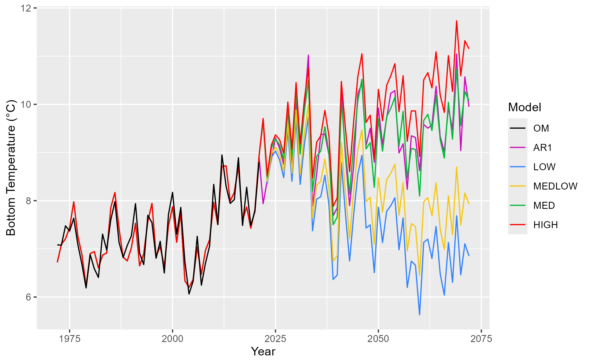
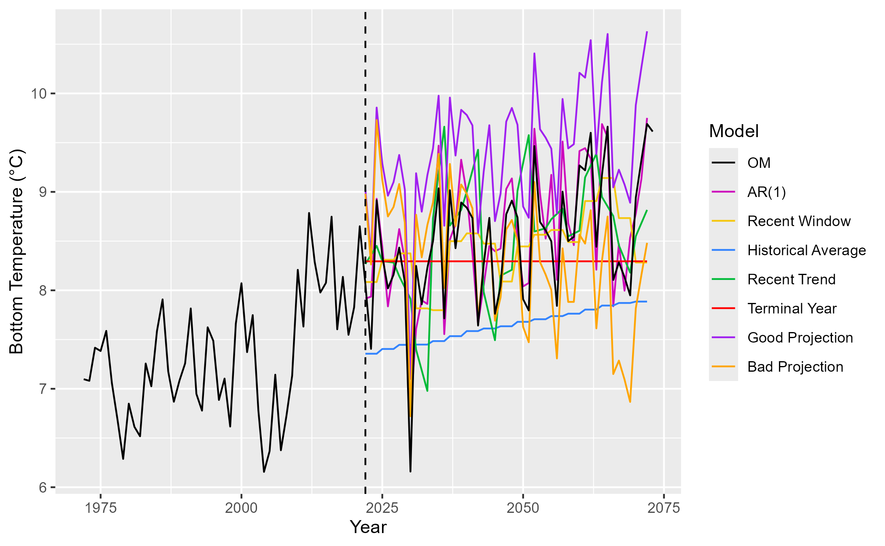
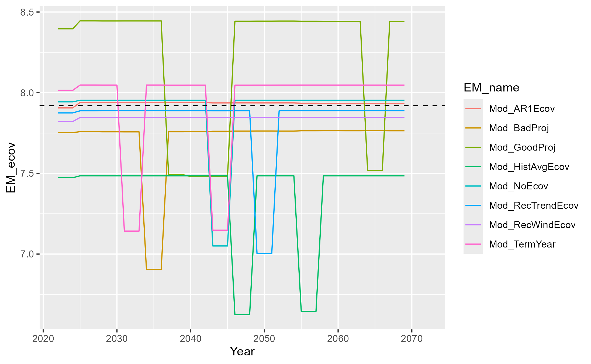
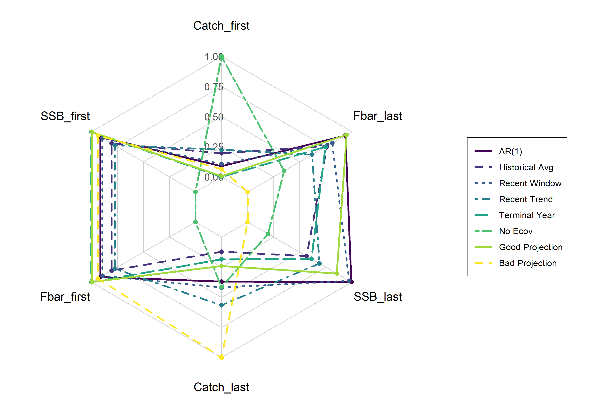

\doublespacing


```{=tex}
\begin{center}
    
\textbf{\Large Applying effective environmental forecasts to Management Strategy Evaluation of yellowtail flounder}
    
\textsc{Sophie Wulfing$^{1*}$ Chengxue Li$^{3}$ Scott I. Large$^{2}$ Vincent Saba$^{2}$ Gavin Fay$^{1}$\\}
\vspace{3 mm}
\normalsize{\indent $^1$School for Marine Science and Technology, University of Massachusetts Dartmouth, University of New Hampshire, 02747, MA, USA\\ $^2$NOAA, National Marine Fisheries Service, Woods Hole, MA 02543, USA\\ $^3$School of Marine and Atmospheric Sciences, Stony Brook University, Stony Brook, NY 11794, USA\\}
$\text{*}$ Corresponding authors: Sophie Wulfing (SophieWulfing@gmail.com)
\end{center}
```

\newpage

\linenumbers

```{r setup, include=FALSE}
knitr::opts_chunk$set(echo = FALSE, warning = FALSE, message = FALSE, dev="cairo_pdf", cache = FALSE)
setwd("C:/Users/swulfing/Documents/GitHub/UMassD/YT_proj/Manuscripts")

library(png)
library(ggplot2)
library(dplyr)
library(knitr)
library(ggpubr)
library(gridExtra)

PlotLocations <- 'C:/Users/swulfing/Documents/GitHub/UMassD/YT_proj/Manuscripts/Plots'

ModNames_proj <- c("Mod_AR1Ecov", "Mod_HistAvgEcov", "Mod_RecWindEcov", "Mod_RecTrendEcov", "Mod_TermYear", "Mod_NoEcov")
ModNames_bias <-  c("Mod_AR1Ecov", "Mod_LOWEcov", "Mod_MEDLOWEcov", "Mod_MEDEcov", "Mod_HIGHEcov", "Mod_NoEcov")
ModNames_biasOMs <- c("Mod_LOWEcov", "Mod_MEDLOWEcov", "Mod_MEDEcov", "Mod_HIGHEcov")

Proj_ests <- readRDS('C:/Users/swulfing/Documents/MSE_results/Combo/Projections_data.rds')
Bias_ests <- readRDS('C:/Users/swulfing/Documents/MSE_results/Biases/Biases_data.rds')
BRP_data <- readRDS('C:/Users/swulfing/Documents/MSE_results/BRP_data.rds')
```

# ABSTRACT

The US Northeast Continental shelf is the fastest warming marine ecosystem in the United States, so understanding this change is imperative to maintaining the sustainability and productivity of this region's fishery. Fished stocks in the region have exhibited different distributional shifts in response to changing ocean temperatures, chemistry, and currents. Management Strategy Evaluation (MSE) is a technique in fisheries management to simulate and compare the likely outcomes of different management actions, assess trade-offs of different management options, and has been used to create more climate-ready management plans. The Georges Bank Yellowtail Flounder (*Limanda ferruginea*) is an important stock to the Northeast groundfish fishery and its recruitment has been shown to be impacted by bottom ocean temperatures. However, predicting future environmental covariates such as bottom temperature can be challenging, as these conditions are subject to high stochasticity. For this reason, our goal is to analyze the different choices made when projecting or forecasting future environmental conditions within assessments, what subsequent catch advice is generated from the MSE, and how this affects long-term fishery dynamics. Results focusing on recruitment-environment relationships have shown that different projection decisions, including integrating environmental forecasts, have a limited impact on the model performance and output, and we will expand on these findings by comparing the MSE results under different climate scenarios, informed by ocean model forecast products.

# INTRODUCTION

As the world’s oceans are complex physical and chemical systems, climate change has impacted oceans in a variety of ways such as increased water temperature and acidification, and changes in ocean currents [@fabry2008; @guinotte2008; @abraham2013; @sydeman2015; @wilson2016; @poloczanska2016; @garcíamolinos2017; @friedland2022; @cheng2024]. As a result, different marine species are projected to have complex and varying responses to these environmental shifts depending on species’ life histories, thermal tolerances, mobility, and other aspects of the species’ biology [@guinotte2008; @chown2010; @honischGeologicalRecordOcean2012; @punt2014; @stewart2014; @sydeman2015; @poloczanska2016; @wilson2016; @chaikin2024]. This creates compounding challenges when managing commercially-important fisheries. As some species will shift ranges northward or to deeper waters in search of colder temperatures, this will disrupt historical food chains as predators and prey may shift in different directions, or range shifts will introduce new interactions between predator and prey species that have historically not overlapped [@overholtz2011; @albouy2014; @stewartCombinedClimatePreymediated2014; @sydeman2015; @wilson2016; @garcíamolinos2017; @chaikin2024]. Further, as fish populations may experience distribution shifts, annual growth patterns, or vary in abundance, this has potential to increase catch effort as historical fishing grounds and times may now not line up with fish stocks’ new life history dynamics [@overholtz2011; @poloczanska2016; @tommasi2017; @fulton2021]. New species may also shift their ranges into a commonly fished area, potentially opening up new commercial opportunities [@stewart2014].

The US Northeast continental shelf has warmed faster than any other marine ecosystem in the United States [@saba2016; @kleisner2017; @saba2023]. The varying responses to climate change across fished species has presented challenges in accurately assessing stock health of various species in the region, however these environmental covariates have rarely been incorporated into stock assessments in the Northeast U.S. [@hare2016; @kleisner2017; @mazur2023]. These covariates have been shown to reduce retrospective patterns and increase projection accuracy in New England populations such as Atlantic Cod, haddock, yellowtail flounder, and winter flounder [@buckley2004; @klein2017]. However, incorporating environmental covariates into stock assessments is difficult and a very clear and strong relationship between environmental change and population dynamics must be shown or else improper use of an environmental covariate could lead to poorer rather than better estimation performance [@haltuch2011; @punt2014; @ehrlén2015; @britten; @miller2023].

Management Strategy Evaluations (MSEs) are decision making frameworks that allow assessors to simulate and compare the sustainability and tradeoffs associated with different management decisions [@hollowed2011; @tommasi2017; @mazur2023; @saba2023]. Applying climate change covariates and MSE to New England groundfish has shown to improve the robustness of stock assessments [@mazur2023]. However, applications of MSEs can still be challenging, as climate change shifts population baselines and creates dynamics that are harder to predict in biological systems. This demonstrates a need for further research on how to incorporate these environmental conditions into the MSE framework [@hollowed2011; @punt2016; @stramClimateReadinessSynthesis2022; @saba2023]. Populations’ responses to climate change can be complex, as fish exhibit different sensitivities to environmental conditions depending on their lifestage, and different environmental changes (i.e. increased sea surface or bottom temperature, changes in salinity, and altered currents) will have different effects on populations [@hollowed2011].

Further, decisions on how to project environmental conditions are important to consider when predicting stock dynamics. With recent improvements, ocean dynamic models are able to offer improved predictions of future stock dynamics and are being used in stocks worldwide. However, the spatial and temporal scale of these models is relevant [@hobday2016]. Future climate is also difficult to estimate as there is a lot of uncertainty and climate change is a very chaotic process [@punt2014]. As assessments attempt to capture future population trends, forecasting environmental trends is also imperative, however this can be challenging as optimal decisions can change depending on scale, species, and which environmental covariates are used [@kellImplicationsClimateChange2005; @hollowed2011; @tommasi2017; @stram2022]. In a simulation-estimation experiment, @brittenIdentificationPerformanceStockrecruitment2024 found that there was no discernable difference if projections continued the AR1 process or if the environmental covariate projection was calculated as the mean of the last 5 years. Further, @kellImplicationsClimateChange2005 showed that climate change has a limited effect in the short term for Atlantic cod, and only long term simulations showed an affect on stock dynamics and recovery. This project aims to build off of this finding by expanding the projections tested, simulating over a greater number of years, and seeing how catch advice and fishery dynamics may respond to changing projections.

The yellowtail flounder (*Limanda ferruginea*) has a long history of harvest in the US Atlantic Coast. However due to stock collapse in the 1980s, it is now primarily caught as bycatch in other surrounding fisheries (CITE RTA). Yellowtail flounder is managed as three distinct stocks in the Northeast US; Southern New England, Gulf of Maine, and Georges Bank. Yellowtail flounder are sensitive to water temperatures at the larval phase [@laurence1981]. The Georges Bank stock has been shown to shift its distribution northward in response to warming ocean temperatures [@murawski1993; @nye2009; @hyun2014]. This stock has been in decline starting in the 1970s, leading to a collapse in the early 1990s [@stone2004]. Recently, ocean bottom temperature has been shown to have a strong link to the recruitment of Georges Bank yellowtail flounder, and the incorporation of this environmental covariate has been shown to improve stock assessment accuracy and prediction success [@johnsonYellowtailFlounderLimanda1999; @kerr2022; CITE RESEARCH TRACK]. Because this relationship between environment and stock dynamics has a clear linkage, inclusion of environmental covariates have improved assessment success, and this stock has a long history of data collection, we will use Georges Bank yellowtail flounder as a case study. We aim to incorporate bottom temperature into stock assessments and the Management Strategy Evaluation framework in order to assess different choices when projecting bottom temperature in Georges Bank and how this affects forecasts in assessments and subsequent tactical fishery management advice of Georges Bank yellowtail flounder.

<!-- STILL DO DO: READ PROPOSAL AND ADD VERBIAGE HERE -->

# METHODS

To conduct the MSE process, we used trawl survey data from the Northeast Fisheries Science Center (NEFSC) and outputs from the Woods Hole Assessment Model (WHAM). WHAM was developed by researchers at NEFSC, and is a state-space stock assessment model which incorporates climate variables into fishery processes [@stockWoodsHoleAssessment2021]. The stock data used was collected by the NEFSC fall and spring surveys, the DFO spring survey, as well as commercial data, which spanned from 1973 to 2022. Choices for weights-at-age, natural mortality, fleet selectivity, recruitment and maturity were derived from results from the 2024 research track assessment on yellowtail flounder (CITE ASSESSMENT, see carvalho et al 2017 from class reading for good presentation of wham choices) and these numbers are available in the supplemental material. The output of the WHAM model was then used in the R package whamMSE (CITE CHENG) to simulate the MSE process. This package creates an Operating Model (OM) which simulates fishery dynamics, including fishing and stock dynamics. As a state space model, the OM incorporates process-error in its dynamics, but the values generated by the OM represent the ‘true’ values of the fishery. The Estimation Model (EM) simulates the survey and assessment process in the fishery, including observation errors. Stock assessments were tested with the 0.75 Fmsy NEFMC control rule. We tested a 50 year MSE period where assessments were conducted every three years.

For the environmental covariate of bottom temperature, we used a dataset developed by @dupontavice2023, which is also used in the Georges Bank yellowtail flounder stock assessment CITE ASSESSMENT. We projected the ‘real-world- temperature by conducting a linear regression on the existing data points and then projecting future temperatures along this trendline with added variation around a normal distribution. The package whamMSE was used to conduct the Management Strategy Evaluation CITECHENG. In this simulation, the environmental covariate was treated as a latent variable in the operating model, therefore process error of the ecov was turned off in the OM so only the specified projection was modeled in the “real world” scenario of our simulation. First, the Wood’s Hole Assessment Model was fitted to real Yellowtail flounder data from the NEFSC survey to serve as the basis for the OM. This base-OM was used to estimate parameters for numbers-at-age, selectivity, recruitment, and ecological covariate. These parameters were then treated as ‘truth’ in our simulation and were used in the second OM we developed for the projections. This second OM, with all of the parameters already estimated, fixes the environmental covariate at a true state with no process error, however observation error is still included in this process. This allowed us to run multiple simulations of various temperature projections in our Estimation Model while maintaining the same ‘real-world’ state.

We then tested various EMs that were identical except for this temperature projection. Instead of using a single time series throughout the projection, all EMs were changed to simulate real-life stock assessment processes, where the three-year projection was recalculated at each assessment year step given the previous three years of data. Descriptions of temperature projections are described in figure \@ref(fig:EMTemps). For the first experiment, we first compared EM temperature projections with varying levels of bias. We developed four scenarios: High Ecov, where the overall trend of the OM temperature projection was doubled to simulate a high bias in projections; Medium Ecov, where the EM uses the same temperature as the OM; Medium-Low Ecov, where the overall trend was multiplied by -1 to simulate low bias in projections; and Low Ecov, where the overall trend was multiplied by -2 to simulate a very low bias in projections. Each simulation was run 100 times to ensure robustness of model results. Any non-converged model resulted in the elimation of that whole simulation.

```{r EMTemps, fig.cap = 'Temperature projections of the different Bias tests. The medium projection follows the overall trend of historical data, and this was used as a baseline for the other bias projections', echo = FALSE, warning = FALSE, message = FALSE}

```

This simulation was then repeated with the OM changing it's baseline projection to use the High, Medium, Medium-Low, and Low temperature projections to compare how hypothetical future climate scenarios may change the outcome of having a biased projection. Each of these OMs were tested against each climate projection in the EMs.

After comparing projections through the MSE process, the experiment was repeated except we used only the original OM temperature projection (the one that maintains the trend from the overall data set). For the EMs, the two extreme bias projections were kept (High Ecov and Low Ecov), along with various projection choices that, at each assessment year, self-update with the previous years' temperature information. A new temperature projection is then calculated from that in the EM and projected for the next three years until the next assessment. The different projection choices used in the experiment are described in figure \@ref(fig:EMTempsProj).

<!-- FIX TO INCLUDE NEW STUFF Temperature projections used in each EM. AR1 (Auto-Regressive1) - This projection uses an updated mean at each timestep. AR1 processes are given by equation GIVE NUMBER, which uses an updated mean at each timestep for the projection. NewWind - (New Window) This process uses the mean of the previous 5 years in its projection. NewTrend - (New Trend) Similar to new window, this process takes the last 5 years of data and uses the linear regression of the last 5 years as its projection HistAvg - (Historical average) Uses the average of all datapoints collected. NoTemp - (No temperature) This projection does not consider environmental covariates it its projection. -->

```{r EMTempsProj, echo = FALSE, warning = FALSE, message = FALSE, fig.cap = ' Temperature projections used in each EM. AR1 (Auto-Regressive1) - This projection uses an updated mean at each timestep for the projection. NewWind (New Window) - This process uses the mean of the previous 5 years in its projection. HistAvg (Historical average) - Uses the average of all datapoints collected. NewTrend (New Trend) - Similar to new window, this process takes the last 5 years of data and uses the linear regression of the last 5 years as its projection. TermYear (Terminal Year) - Uses the terminal year of historical data across the projection period. GoodProj (Good projection) - Uses the same time series as the OM. BadProj (Bad projection) - Same as the MedLow bias in the previous experiment, this projection tests projection with a low bias. NoTemp - (No temperature, not pictured) This projection does not consider environmental covariates it its projection.'}


```

After the MSE process was conducted in both experiments, we compared the outputs of each model and the subsequent catch advice to emerge from the model. We then compared estimated natural and fishing mortality, spawning stock biomass, and estimated recruitment in each model in order to understand how different assumptions in creating environmental projections propagates reflects real-world dynamics and how this ultimately affects management decisions.

# RESULTS

Before assessing the accuracy of each model, each EM simulated was tested for convergence. If any of the EM models did not converge, the whole seed was removed from the results to ensure comparability across results. Convergence checks were used from the r packages TMP and nlminb CITE PACKAGES.

## Bias Tests

SEE HANSELL PAPER FOR A GOOD DISCUSSION ON THE CONSEQUENCES OF OVER VS UNDERESTIMATING ECOV 

The estimated parameters for the environmental covariate are shown in figure \@ref(fig:paramEstsbias) compared to that of the OM in each bias test (the black vertical line). Across the EMs, the accuracy of the estimated parameter (in relation to the ‘real’ one calculated by the OM) was generally higher when projections overestimated the temperature timeseries, and lower for low bias projections. Observing how this parameter is estimated over time, projections that were similar to the OM or had slight bias remained around the calculated OM parameter, while the projections with high bias tended to diverge away from this ‘true’ mean (figure \@ref(fig:biasProjOverTime)). However, the subsequent catch advice from the EMs, spawning stock biomass (SSB), fishing mortality ($\bar{F}$), and predicted catch from the OM stays relatively consistent across EMs over the time series. These figures are provided in the supplemental material.

```{r paramEstsbias, echo = FALSE, warning = FALSE, message = FALSE, fig.cap = "Estimated environmental parameter from each EM compared to the 'true' value in the OM on the y axis. Colors correspond to if the EM had a high temperature bias (red), a low temperature bias (blue), or if the EM intended to accurately reflect climate dynamics (i.e. AR1 process or temperature projection that matched that of the OM) (green). The dashed black line indicates where these two estimations would be equal"}

# BIASES
meanTablebias <- data.frame(EM_name = c(),
                            seed = c(),
                            OM_name = c(),
                            ecov_mean_om = c(),
                            ecov_mean_em = c(),
                            percentDifference = c(),
                            ecov_sd = c(), 
                            bias_dir = c())

for(i in 1:4){
  data_use <- Bias_ests[[i]]

  #mean
  data_clean <- data_use %>%
  group_by(EM_name, seed_no) %>%
  summarize(ecov_mean_om = round(mean(Ecov_beta_R_OM, na.rm = TRUE), digits = 3),
            ecov_mean_em = round(mean(Ecov_beta_R_EM, na.rm = TRUE), digits = 3),
            ecov_sd = round(sd(Ecov_beta_R_EM, na.rm = TRUE), digits = 3)) %>%
    mutate(percentDifference = (ecov_mean_em - ecov_mean_om)/ecov_mean_om)
  
  data_clean$OM_name <- i
  
  data_clean <- data_clean %>%
    select(EM_name, seed_no, OM_name, ecov_mean_om, ecov_mean_em, percentDifference, ecov_sd)
  
    for(j in 1:nrow(data_clean)){
  #meanTablebias <- merge(meanTablebias, data_clean, by = 'EM_name')
    if(i == 1){
      if(data_clean$EM_name[j] == 'Mod_AR1Ecov'| data_clean$EM_name[j] == 'Mod_LOWEcov'){data_clean$bias_dir[j] <- 'S'} else {data_clean$bias_dir[j] <- 'H'}
      }

    if(i == 2){
      if(data_clean$EM_name[j] == 'Mod_AR1Ecov'| data_clean$EM_name[j] == 'Mod_MEDLOWEcov'){data_clean$bias_dir[j] <- 'S'} else if (data_clean$EM_name[j] == 'Mod_LOWEcov'){data_clean$bias_dir[j] <- 'L'} else{data_clean$bias_dir[j] <- 'H'}
    }
    if(i == 3){
      if(data_clean$EM_name[j] == 'Mod_AR1Ecov'| data_clean$EM_name[j] == 'Mod_MEDEcov'){data_clean$bias_dir[j] <- 'S'} else if (data_clean$EM_name[j] == 'Mod_LOWEcov' | data_clean$EM_name[j] == 'Mod_MEDLOWEcov'){data_clean$bias_dir[j] <- 'L'} else{data_clean$bias_dir[j] <- 'H'}
    }
    if(i == 4){
      if(data_clean$EM_name[j] == 'Mod_AR1Ecov'| data_clean$EM_name[j] == 'Mod_HIGHEcov'){data_clean$bias_dir[j] <- 'S'} else{data_clean$bias_dir[j] <- 'L'}
    }

  # }
  # bias_compare <- rbind(bias_compare, data_clean)
}


data_clean$bias_dir <- factor(data_clean$bias_dir, levels = c('L','S','H'))

  #colnames(data_clean) <- c('EM', 'OM', 'OM Ecov', 'EM Ecov', 'Percent Change', 'SD')

  meanTablebias <- rbind(meanTablebias, data_clean)
}


meanTablebias$EM_name <- factor(meanTablebias$EM_name, levels = c("Mod_NoEcov","Mod_LOWEcov", "Mod_MEDLOWEcov", "Mod_MEDEcov", "Mod_HIGHEcov", "Mod_AR1Ecov"))

p <- list()

scenarioNames <- c('High', 'Medium', 'Medium-Low', 'Low') #c('Medium-Low','Low','High', 'Medium')

for(i in c(3,4,1,2)){
  data_use <- Bias_ests[[i]]
  
  plotdata <- meanTablebias %>%
    filter(OM_name == i) %>%
    filter(EM_name != "Mod_NoEcov")
  
  p[[i]] <- ggplot(plotdata, aes(x = EM_name, y = ecov_mean_em, fill = bias_dir)) +
    geom_boxplot(show.legend = TRUE) +
    scale_fill_manual(name = 'Bias',
                      values = c("L" = "blue", "S" = "green", "H" = "red") ,
                     labels = c('Low', 'None', 'High'),
                     drop = FALSE) +
    scale_x_discrete(labels= c('Low', 'Medium-Low','Medium','High','AR(1)')) +
    geom_hline(yintercept = mean(plotdata$ecov_mean_om), linetype = "dashed", color = "black") +
    ylim(-0.75, -0.1) +
    labs(title = paste('Climate Scenario:', scenarioNames[i])) +#ggtitle (i) + 
    theme(axis.title = element_blank(),
          plot.title = element_text(size = 10)) +
    coord_flip()
}

annotate_figure(ggarrange(p[[1]], p[[2]], p[[3]], p[[4]], nrow = 4, common.legend = TRUE, legend = 'right'), left = text_grob("Forecast", rot = 90, vjust = 1, hjust = 0.5, size = 14))


```

```{r biasProjOverTime, echo = FALSE, warning = FALSE, message = FALSE, fig.cap = 'Calcualted environmnetal covariates from the EM updated at each assessment period. The "True" OM value is shown in the horizontal dashed line'}

p <- list()

for(i in 1:length(Bias_ests)){

paramEsts_yearprojs <- Bias_ests[[i]] %>%
  filter(EM_name != 'Mod_NoEcov') %>%
  group_by(EM_name, Year) %>%
  filter(Year > 2023) %>%
  summarize(mean_OM = mean(Ecov_beta_R_OM),
            mean_EM = mean(Ecov_beta_R_EM))

p[[i]] <- ggplot(paramEsts_yearprojs, aes(x = Year, y = mean_EM, color = EM_name)) +
  geom_line() +
  geom_hline(yintercept = mean(paramEsts_yearprojs$mean_OM), color = 'black', linetype = 'dashed')

}

ggarrange(p[[1]], p[[2]], p[[3]], p[[4]], nrow = 4, common.legend = TRUE, legend = 'right')
```

## Projection Tests

When comparing the parameter for the environmental covariate across different projections (table \@ref(tab:paramEstsproj)) , the most accurate estimation of the ecological covariate was the projection that used recent window approach, with only a 1.3% change from the ‘true’ value. Both the recent trend projection and the ‘good’ projection estimated this parameter poorly, with an almost 30% difference between the true covariate and the estimation in the EM. The calculated parameter estimates at each assessment year show that the Historical average and AR1 process tended to underestimate the ecological covariate while the other projections generally over-estimated this trend (figure \@ref(fig:timeseriesparam)). However, figure \@ref(fig:timeseriesproj) shows the catch advice, SSB, $\bar{F}$, and predicted catch from the OM of each projection test. Similar to the bias tests, these model outputs were very similar and all converged to similar estimations.

```{r paramEstsproj, fig.cap = 'Estimated ecological covariates in for the different biased temperature projections in the EM compared to the "true" value in the OM.', echo = FALSE, warning = FALSE, message = FALSE}
### DO WE WANT THIS INFO IN TABLE OR GRAPH FORM


library(dplyr)

# PROJECTIONS
paramEsts_projs <- Proj_ests %>%
  filter(EM_name != 'Mod_NoEcov') %>%
  group_by(EM_name) %>%
  summarize(OM_ecov = round(mean(Ecov_beta_R_OM, na.rm = TRUE), digits = 3),
          mean_ecov = round(mean(Ecov_beta_R_EM, na.rm = TRUE), digits = 3),
          sd_ecov = round(sd(Ecov_beta_R_EM, na.rm = TRUE), digits = 3)) %>%
    rowwise() %>%
    mutate(PercentChange = ((mean_ecov - OM_ecov)/OM_ecov) * 100) %>%
  select(EM_name, OM_ecov, mean_ecov, PercentChange, sd_ecov) %>%
  mutate(EM_name = case_when(
    EM_name == 'Mod_AR1Ecov' ~ 'AR(1)',
    EM_name == 'Mod_BadProj' ~'Bad Projection',
    EM_name == 'Mod_GoodProj' ~'Good Projection',
    EM_name == 'Mod_HistAvgEcov' ~'Historical Average',
    EM_name == 'Mod_RecTrendEcov' ~'Recent Trend',
    EM_name == 'Mod_RecWindEcov' ~'Recent Window',
    EM_name == 'Mod_TermYear' ~'Terminal Year'
  ))

#Ecov_processPars_mean

paramEsts_projs$PercentChange <- round(paramEsts_projs$PercentChange, digits = 3)

colnames(paramEsts_projs) <- c('EM Name','OM Ecov','Mean Ecov','Percent Change', 'Ecov Standard Dev.')

kable(paramEsts_projs, caption = 'Ecov parameter estimates, standard deviation, and rho for each EM for projection')


boxplot_test <- Proj_ests %>%
  filter(EM_name != 'Mod_NoEcov')

ggplot(data = boxplot_test, aes(x = EM_name, y = Ecov_beta_R_EM)) +
  geom_boxplot() +
  geom_hline(yintercept = -0.3969783, color = 'red', linetype = 'dashed') +
  scale_x_discrete(labels= c('AR(1)','Bad Projection','Good Projection','Historical Average','Recent Trend','Recent Window','Terminal Year')) +
  xlab('Projection') +
  ylab('Calculated Ecological Covariate') +
  theme(axis.text.x=element_text(color = "black", size=11, angle=30, vjust=.8, hjust=0.8)) 


```

```{r timeseriesparam, fig.cap = 'Estimated ecological covariates in for the different temperature projection choices in the EM compared to the "true" value in the OM.'}
#

labels = c('AR(1)','Bad Projection','Good Projection','Historical Average','Recent Trend','Recent Window','Terminal Year')

paramEsts_yearprojs <- Proj_ests %>%
  filter(EM_name != 'Mod_NoEcov') %>%
  group_by(EM_name, Year) %>%
  filter(Year > 2023) %>%
  summarize(mean_OM = mean(Ecov_beta_R_OM),
            mean_EM = mean(Ecov_beta_R_EM))

ggplot(paramEsts_yearprojs, aes(x = Year, y = mean_EM, color = EM_name)) +
  geom_line() +
  geom_hline(yintercept = mean(paramEsts_yearprojs$mean_OM), color = 'black', linetype = 'dashed')
```

```{r timeseriesproj, fig.cap = 'Catch advice (top), SSB (second), FBar (third), and predicted catch (bottom) calculated from each EM over the projection period', echo = FALSE, warning = FALSE, message = FALSE}
library(scales)
p <- list()

catchAdvice_projs <- Proj_ests %>%
  #filter(Year >= 2024) %>%
  group_by(EM_name, Year) %>%
  summarize(mean_catchAdvice = mean(Catch_advice),
          sd_catchAdvice = sd(Catch_advice),
          mean_SSB = mean(SSB),
          sd_SSB = sd(SSB),
          mean_FBar = mean(FBar),
          sd_FBar = sd(FBar),
          mean_Pred_catch = mean(Pred_catch),
          sd_Pred_catch = sd(Pred_catch))


p[[1]] <- ggplot(data = catchAdvice_projs, aes(x = Year, y = mean_catchAdvice, group = EM_name, color = EM_name)) +
  #geom_ribbon(aes(ymin = mean_catchAdvice - sd_catchAdvice, ymax = mean_catchAdvice + sd_catchAdvice, fill = EM_name), alpha = 0.2) +
    geom_line() +
  ylab('Mean Catch Advice (kmt)') +
  scale_color_discrete(name = "EM",
                       labels = c('AR(1)','Bad Projection','Good Projection','Historical Average','No Ecov','Recent Trend','Recent Window','Terminal Year')) +
  scale_y_continuous(labels = scales::comma)
  # scale_y_continuous(labels = scales::label_number_si())

p[[2]] <- ggplot(data = catchAdvice_projs, aes(x = Year, y = mean_SSB, group = EM_name, color = EM_name)) +
  #geom_ribbon(aes(ymin = mean_SSB - sd_SSB, ymax = mean_SSB + sd_SSB, fill = EM_name), alpha = 0.2) +
    geom_line() +
  ylab('Mean SSB (kmt)') +
  scale_color_discrete(name = "EM",
                       labels = c('AR(1)','Bad Projection','Good Projection','Historical Average','No Ecov','Recent Trend','Recent Window','Terminal Year')) +
  scale_y_continuous(labels = scales::comma)

p[[3]] <- ggplot(data = catchAdvice_projs, aes(x = Year, y = mean_FBar, group = EM_name, color = EM_name)) +
  #geom_ribbon(aes(ymin = mean_FBar - sd_cFBar, ymax = mean_FBar + sd_FBar, fill = EM_name), alpha = 0.2) +
    geom_line() +
  ylab('Mean Fbar') +
  scale_color_discrete(name = "EM",
                       labels = c('AR(1)','Bad Projection','Good Projection','Historical Average','No Ecov','Recent Trend','Recent Window','Terminal Year'))

p[[4]] <- ggplot(data = catchAdvice_projs, aes(x = Year, y = mean_Pred_catch, group = EM_name, color = EM_name)) +
  #geom_ribbon(aes(ymin = mean_mean_Pred_catch - mean_Pred_catch, ymax = mean_mean_Pred_catch + sd_mean_Pred_catch, fill = EM_name), alpha = 0.2) +
    geom_line() +
  ylab('Mean Predicted Catch (kmt)') +
  scale_color_discrete(name = "EM",
                       labels = c('AR(1)','Bad Projection','Good Projection','Historical Average','No Ecov','Recent Trend','Recent Window','Terminal Year')) +
  scale_y_continuous(labels = scales::comma)

ggpubr::ggarrange(p[[1]], p[[2]], p[[3]], p[[4]], nrow = 4, common.legend = TRUE, legend = 'right')

```

```{r fixSSBIssue}

test <- Proj_ests %>%
  filter(Year >=2020 & Year <=2025) %>%
  select(Year, EM_name, seed_no, SSB, SSB_EM) %>%
  mutate(SSB_diff = ((SSB_EM - SSB)/SSB) * 100)


EMs <- unique(test$EM_name)

for(i in 1:length(EMs)){
  
  usethis <- test %>%
    filter(EM_name == EMs[i])
  
  p <- ggplot(usethis, aes(x = Year, y = SSB_diff, group = seed_no, color = seed_no)) +
    geom_line() +
    labs(title = EMs[i])
  
  print(p)
  
}

ggplot(test, aes(x = EM_name, y = SSB_diff)) +
  geom_boxplot()

test_2 <- test %>%
  group_by(EM_name, Year) %>%
  summarise(mean = mean(SSB_diff, na.rm = TRUE),
            sd = sd(SSB_diff))

ggplot(test_2, aes(x = Year, y = mean, group = EM_name, color = EM_name)) +
  geom_line()


```

Differences in estimated recruitment between the EM and OM is shown in figure \@ref(fig:timeseriesrecruit), where there is noticeable variation between the EM estimations and that of the OM but for most years, the EMs tended to under estimate recruitment compared to that of the OM. Comparing the calculated variation in recruitment (figure \@ref(fig:recruitmentDevs)) between models that used an ecological covariate and the No Ecov projection of the same seed, we can estimate the percentage of this variation that is captured in the ecological covariate. All models had a mean percentage of variation between 5% and 10%. The AR1 process and the 'Bad' projection both had the highest range of recruitment variations, with the AR1 process reaching a maximum of 20.6 % of variation in recruitment being explained by the ecological covariate. The Recent Trend and 'Good' projection displayed the smallest range of variation that was captured by the ecological covariate.

```{r timeseriesrecruit, fig.cap = 'Percent difference of the calcualted recruitment per assessment year in each EM compared to the OM.', echo = FALSE, warning = FALSE, message = FALSE}
#

paramEsts_yearprojs <- Proj_ests %>%
  filter(EM_name != 'Mod_NoEcov') %>%
  group_by(EM_name, Year) %>%
  filter(Year > 2023) %>%
  summarize(mean_OM = mean(OM_NAA_youngest),
            mean_EM = mean(EM_NAA_youngest)) %>%
  mutate(percentDiff = (mean_EM - mean_OM)/ mean_OM)

om_recruit <- paramEsts_yearprojs %>%
  group_by(Year) %>%
  summarize(mean = mean(mean_OM),
            sd = sd(mean_OM))

ggplot(paramEsts_yearprojs, aes(x = Year, y = percentDiff, color = EM_name)) +
  geom_line() +
  # geom_line(paramEsts_yearprojs, aes(x = Year, y = mean_EM, color = EM_name)) +
  # geom_line(om_recruit, aes(x = om_recruit$Year, y = om_recruit$mean, color = 'black'))
  geom_hline(yintercept = 0, color = 'black', linetype = 'dashed')
```

```{r recruitmentDevs, fig.cap = 'Percent of recruitment deviation EXPLAINED BY THE ECOV IN EACH  MODEL. MAKE SURE YOU CHANGE YOUR RESULTS PARAGRAPHS TO SAY THIS. ALSO FIX THIS BASED ON CHENG EMAIL', echo = FALSE, warning = FALSE, message = FALSE}

data_recruit <- Proj_ests %>%
  select(Year, EM_name, seed_no, EM_NAAsigma_youngest) %>%
  filter(EM_name != 'Mod_NoEcov', Year > 2021)

data_recruit$EM_NAAsigma_youngest <- exp(data_recruit$EM_NAAsigma_youngest)

data_ecovNone <- Proj_ests %>%
  select(Year, EM_name, seed_no, EM_NAAsigma_youngest) %>%
  filter(EM_name == 'Mod_NoEcov', Year > 2021) %>%
  select(Year, seed_no, EM_NAAsigma_youngest)
colnames(data_ecovNone) <- c('Year', 'seed_no', 'recDevs_noEcov')

data_ecovNone$recDevs_noEcov <- exp(data_ecovNone$recDevs_noEcov)


recruitmentDevs <- merge(data_recruit, data_ecovNone, all.x = TRUE, by = c('Year', 'seed_no'))
recruitmentDevs <- recruitmentDevs %>%
  rowwise() %>%
  mutate(percentEcov = (EM_NAAsigma_youngest*100) / recDevs_noEcov)
  # mutate(percentDiff = (EM_NAAsigma_youngest - recDevs_noEcov)/recDevs_noEcov) %>%
  # mutate(percentEcov = 1 - (EM_NAAsigma_youngest / recDevs_noEcov))

idk <- recruitmentDevs %>%
  group_by(EM_name, seed_no) %>%
  summarize(mean = mean(percentEcov, na.rm = TRUE))

# meanDevs <- recruitmentDevs %>%
#   group_by(Year, EM_name) %>%
#   summarise(mean = mean(percentDiff))


ggplot(idk, aes(x = EM_name, y = mean)) +
  geom_boxplot() +
  xlab('EM') +
  ylab('Percent of recruitment deviation explained by ecov') +
  scale_x_discrete(labels= c('AR(1)','Bad Projection','Good Projection','Historical Average','Recent Trend','Recent Window','Terminal Year')) +
  theme(axis.text.x=element_text(color = "black", size=11, angle=30, vjust=.8, hjust=0.8)) 

```

```{r AutoCorrRecruitment, fig.cap = 'WRITE THIS ONCE YOU ARE DONE', echo = FALSE, warning = FALSE, message = FALSE}


autoTest <- Proj_ests %>%
  select(Year, EM_name, seed_no, OM_NAA_devs, EM_NAA_devs)

ems <- unique(autoTest$EM_name)
seeds <- unique(autoTest$seed_no)

autoCorr <- data.frame(EM = c(),
                       seed = c(),
                       pval_OM = c(),
                       phi_hat_OM = c(),
                       pval_EM = c(),
                       phi_hat_EM = c()
                       )

for(i in 1:length(ems)){
  for(j in 1:length(seeds)){
    
    useData <- autoTest %>%
      filter(EM_name == ems[i] & seed_no == seeds[j])
    
    x_EM <- useData$EM_NAA_devs
    x_OM <- useData$OM_NAA_devs
    
    fit_OM <- lm(x_OM[-1] ~ x_OM[-length(x_OM)] - 1)  # AR(1) through origin
    summary(fit_OM) # should have p > 0.05 indicating there's no AR1 autocorrelation, meaning very likely to be IID
    
    fit_EM <- lm(x_EM[-1] ~ x_EM[-length(x_EM)] - 1)  # AR(1) through origin
    summary(fit_EM) # should have p > 0.05 indicating there's no AR1 autocorrelation, meaning very likely to be IID
    
    data_List <- data.frame(
      EM = ems[i],
      seed = seeds[j],
      pval_OM = summary(fit_OM)$coefficients[, "Pr(>|t|)"],#coef(fit_OM)[4],
      phi_hat_OM = coef(fit_OM)[1], #phi_hat # Should be near 0 if you define NAA for age 1 to be IID in your model
      pval_EM = summary(fit_EM)$coefficients[, "Pr(>|t|)"],#coef(fit_EM)[4],
      phi_hat_EM = coef(fit_EM)[1]
    #phi_hat # Should be near 0 if you define NAA for age 1 to be IID in your model
    )
    
     autoCorr <- rbind(autoCorr, data_List)
  }
}


ggplot(autoCorr, aes(x = EM, y = pval_OM)) + #Line means p >0.05, meaining no AR1 autoCor, most likely IID
  geom_boxplot() +
  geom_hline(yintercept = 0.05)

ggplot(autoCorr, aes(x = EM, y = pval_EM)) + #Line means p >0.05, meaining no AR1 autoCor, most likely IID
  geom_boxplot() +
  geom_hline(yintercept = 0.05)


ggplot(autoCorr, aes(x = EM, y = phi_hat_OM)) + #Line means phi hat near 0 meaning NAA is IID 
  geom_boxplot() +
  geom_hline(yintercept = 0)

ggplot(autoCorr, aes(x = EM, y = phi_hat_EM)) +
  geom_boxplot() +
  geom_hline(yintercept = 0)


```

Looking at the stock status, all of the EMs under-estimated the yellowtail’s overfished status, but all models projected that this stock would remain overfished for most of the projection period (figure \@ref(fig:ReferencePoints)). Similarly, the EMs also under- estimated the overfishing status, but this varied between status being over and under the overfishing threshold (the red horizontal line) over the course of the time series. In this case, each EM overestimated the FXSPR reference point when compared to the reference point used in the operating model (figure \@ref(fig:BRPPerDiff)).

```{r ReferencePointsMSY, eval = FALSE}
#### THIS IS THE TYPE AS MSY AS A PROXY
MSYOverfishedStatus <- BRP_data %>%
  filter(Year >= 2024) %>%
  group_by(EM_name, Year) %>%
  summarize(OM_Overfishing = mean(MSYOverfishing_OM, na.rm = TRUE),
            EM_Overfishing = mean(MSYOverfishing_EM, na.rm = TRUE),
            SD_Overfishing = sd(MSYOverfishing_EM, na.rm = TRUE),
            OM_Overfished = mean(Overfished_OM, na.rm = TRUE),
            EM_Overfished = mean(Overfished_EM, na.rm = TRUE),
            SD_Overfished = sd(Overfished_EM, na.rm = TRUE)
            )


ggplot(data = MSYOverfishedStatus, aes(x = Year, y = EM_Overfished)) +
  geom_point(aes(y = EM_Overfished), color = 'orange') +
  geom_point(aes(y = OM_Overfished), color = 'black') +
  geom_hline(yintercept = 1, linetype = 'dashed', color = 'red') +
  facet_wrap(vars(EM_name))

ggplot(data = MSYOverfishedStatus, aes(x = Year, y = EM_Overfishing)) +
  geom_point(aes(y = EM_Overfishing), color = 'orange') +
  geom_point(aes(y = OM_Overfishing), color = 'black') +
  geom_hline(yintercept = 1, linetype = 'dashed', color = 'red') +
  ylim(-1, 10) +
  facet_wrap(vars(EM_name))

```

```{r ReferencePoints, out.width="45%", fig.cap="Overfished (left) and overfishing (right) status over the projected time series for each EM. Overfished and overfishing thresholds are shown in the horizonal red line", fig.show='hold', fig.align='center', echo = FALSE, warning = FALSE, message = FALSE}
#### NOT USING MSY AS PROXY
# OverfishedStatus <- BRP_data %>%
#   filter(Year >= 2024) %>%
#   group_by(EM_name, Year) %>%
#   summarize(OM_Overfishing = log10(mean(Overfishing_OM, na.rm = TRUE)),
#             EM_Overfishing = log10(mean(Overfishing_EM, na.rm = TRUE)),
#             SD_Overfishing = log10(sd(Overfishing_EM, na.rm = TRUE)),
#             OM_Overfished = log10(mean(Overfished_OM, na.rm = TRUE)),
#             EM_Overfished = log10(mean(Overfished_EM, na.rm = TRUE)),
#             SD_Overfished = log10(sd(Overfished_EM, na.rm = TRUE))
#             )

OverfishedStatus <- BRP_data %>%
  filter(Year >= 2024) %>%
  group_by(EM_name, Year) %>%
  summarize(OM_Overfishing = mean(Overfishing_OM, na.rm = TRUE),
            EM_Overfishing = mean(Overfishing_EM, na.rm = TRUE),
            SD_Overfishing = sd(Overfishing_EM, na.rm = TRUE),
            OM_Overfished = mean(Overfished_OM, na.rm = TRUE),
            EM_Overfished = mean(Overfished_EM, na.rm = TRUE),
            SD_Overfished = sd(Overfished_EM, na.rm = TRUE)
            )


ggplot(data = OverfishedStatus, aes(x = Year, y = EM_Overfished)) +
  geom_point(aes(y = EM_Overfished), color = 'orange') +
  geom_point(aes(y = OM_Overfished), color = 'black') +
  geom_hline(yintercept = 1, linetype = 'dashed', color = 'red') +
  facet_wrap(vars(EM_name))

ggplot(data = OverfishedStatus, aes(x = Year, y = EM_Overfishing)) +
  geom_point(aes(y = EM_Overfishing), color = 'orange') +
  geom_point(aes(y = OM_Overfishing), color = 'black') +
  geom_hline(yintercept = 1, linetype = 'dashed', color = 'red') +
  facet_wrap(vars(EM_name))

```

```{r BRPPerDiff, fig.cap = 'Percent difference of the calculated FXSPR reference point in each EM compared to the OM.', echo = FALSE, warning = FALSE, message = FALSE}

BRP_calcd <- BRP_data %>%
  filter(Year >= 2024) %>%
  rowwise() %>%
  mutate(BPR_PerDiff = (exp(EM_log_FXSPR_static) - exp(OM_log_FXSPR_static)) /exp(OM_log_FXSPR_static))


ggplot(BRP_calcd, aes(x = EM_name, y = BPR_PerDiff)) +
  geom_boxplot()

```

In the model performance (figure \@ref(fig:radar)), however, these differences have a minimal impact on the overall accuracy of these models. With the exception of the model without an ecological covariate and the model with a biased projection, all models performed similarly when comparing SSB, Catch, and $\bar{F}$ of the first and terminal years of the projection. The calculated SSB, ($\bar{F}$), and predicted catch from the terminal three years of the projection period show similar patterns of similarity across EMs (figure \@ref(fig:projterminal3)).

```{r radar, fig.cap = 'Relative performance of each EM', echo = FALSE, warning = FALSE, message = FALSE}

```

```{r projterminal3, out.width="30%", fig.cap="Fbar, SSB, and catch of terminal 3 years of MSE in projections test", fig.show='hold', fig.align='center', echo = FALSE, warning = FALSE, message = FALSE}

knitr::include_graphics(c("C:/Users/swulfing/Documents/GitHub/UMassD/YT_proj/Manuscripts/Plots/Combo/RadarPlot_fix/Performance_Boxplot/Fbar_global_last_10_years.png",
                          
                        "C:/Users/swulfing/Documents/GitHub/UMassD/YT_proj/Manuscripts/Plots/Combo/RadarPlot_fix/Performance_Boxplot/Catch_last_10_years.png",
                        
                        "C:/Users/swulfing/Documents/GitHub/UMassD/YT_proj/Manuscripts/Plots/Combo/RadarPlot_fix/Performance_Boxplot/SSB_last_10_years.png"))


```

# DISCUSSION

The results from the bias test show that, while incorporating the ecological covariate helps model performance overall, the trajectory of the projection of temperature used in predicting future simulations will predictably under or over estimate the ecological parameter depending on the type of bias. However, the overall result had a limited impact on the SSB, $\bar{F}$, and subsequent catch. This is because regardless of the bias in the projection, indicating that bottom temperature's overall affect on recruitment may have a limited impact on the status of the fishery over time. @kellImplicationsClimateChange2005 found that the specific climate scenario modeled in the OM had a limited affect on the recoverability of Atlantic cod stocks.

However, this test was more of a hypothetical exploration of how diverging temperature projections changes the outputs of the model. In reality, stock assessments use hindcast environmental information, so it is not realistic that an assessment would continue to use a temperature trajectory that diverges away from the real environmental conditions. Instead, stock assessments incorporate the most recent data and use this information to make predictions until the next assessment. This is why our projections test updated its temperature predictions with the previous three years of information. Similar to the bias tests, we found that incorporating the environmental covariate resulted in slightly different dynamics, but overall followed similar trajectories. Some models appeared to do better with some metrics (e.g. recent window projections resulted in the most accurate ecological covariate, whereas the 'good' projection performed the most poorly here, it estimated the smallest range of recruitemnt deviations being explained by the ecological covariate), but this had a limited impact in the overall fishery dynamics, even in the long term. This is in line with previous literature for yellowtail flounder, which has shown that there is little discernible difference between projections that used a continued estimated environmental process, ones that fixed the environmental process at recent 5 year average, and a third EM which used the observed environmental index [@brittenIdentificationPerformanceStockrecruitment2024]. This research also noted that the specific stock-recruitment relationship defined in the model will change the environmental affect size due to the placement of the environmental covariate in the stock-recruit equation. @mcclatchieReassessmentStockRecruit2010 found that for Pacific sardine, *Sardinops sagax*, temperature actually did not have a relationship with recruitment, and the correlation between temperature parameters and recruitment depended on the amount of autocorrelation in the temperature time series, although the specific mechanism that links Pacific sardine recruitment is less clear than with yellowtail flounder. This may also be due to the amount of recruitment variation that was explained by the ecological covariate. In these simulations, the percentage of variation explained by the ecological covariate had a maximum of 20.6% in one simulation, yet @deoliveiraLimitsUseEnvironmental2005 found that management strategies do not show any benefits to risk and average catch if the ecological covariate explains less than 50% of recruitment variation. None of the simulations in this experiment exceeded 50%.

This could be the result of the type of link that the environmental covariate makes with the population. For Georges Bank Yellowtail, the environmental covariate has a lagged controlling effect on recruitment (CITE RT). Over time, the negative effects of high temperature could be masked by density-dependent mortality, or other factors that occur during the lag. @kellImplicationsClimateChange2005 found that the long-term performance and calculated reference points of Atlantic cod stock depended on if ocean temperatures were linked to juvenile survival versus the carrying capacity of the stock. Further, there may be a greater difference in model outputs if the environmental covariate had a direct effect on distribution, carrying capacity, catchability, mortality, behavioral, migratory, spawning, or metabolic processes; life history traits that can all be affected by environmental change [@puntFisheriesManagementClimate2014; @stockWoodsHoleAssessment2021], indicating a need for further research on projection choices for environmental covariates that affect other parts of life history. Catch advice is not very dependent on recruitment, and because this environmental link is also lagged, these combined factors could be masking the effect. Further, @haltuchPromisesPitfallsIncluding2011 has shown that incorrectly including environmental covariates in the stock does not have a large effect on biomass reference points or relative errors of the model. A review by @puntFisheriesManagementClimate2014 has also shown that short and medium-term fisheries management simulations are generally not greatly improved by incorporating environmental covariates. This research served to test a longer-term simulation and found a similar result. However, if there is a high temporal contrast in the ‘real world’ or OM, incorporating the environmental covariate in the estimation model can improve model accuracy [@millerFactorsAffectingInferences2023]. This could indicate that these results may change depending on the amount of future variation in ocean bottom temperatures.

Future ocean conditions are expected to be highly variable in coming years due to climate change, [@wangClimateProjectionsSelected2010], so understanding potential impacts on fishery dynamics is vital. Overall, we found that projection decisions had a limited effect on catch advice and fishery dynamics in an MSE framework, and this could be due to the nature of the environmental link to Georges Bank Yellowtail flounder, indicating a need for further research on how this type of link will affect model dynamics over different projection decisions. 

<!-- WOULD THE DIFFERENTEE BETWEEN REC TREND AND REC WINDOW BE MORE ABOUT THE GENERAL TREND OF THE PROJECTION (I.E. RECENTLY INCREASING THEREFORE REC TREND WITH GENERALLY INCREASE?) -->
<!-- WHAT IS THE RECRUITMENT DEVIATIONS GRAPH TELLING UUUUUU -->
<!-- gET ADVICE ON TEH REF POINTS FIGURE -->
<!-- GENERALLY UNDER EST RECRUITMENT AND STOCK STATUS -->
\newpage

**References**


