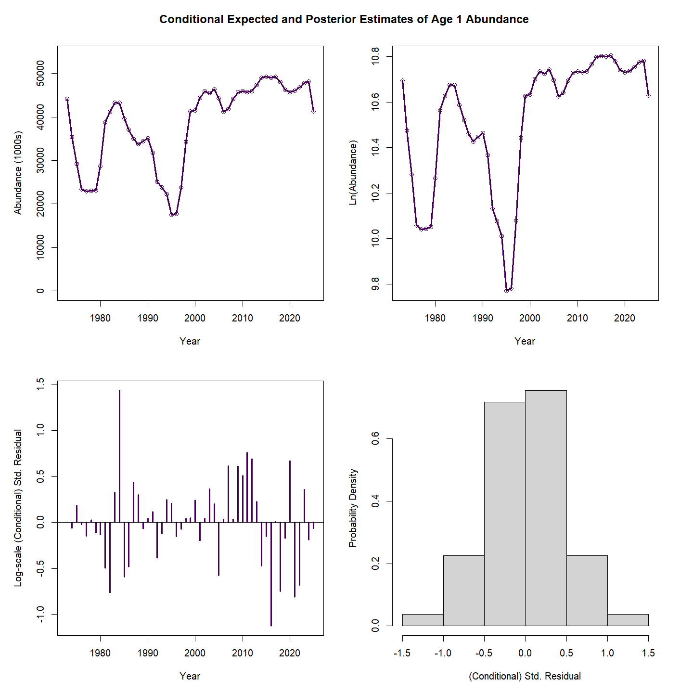
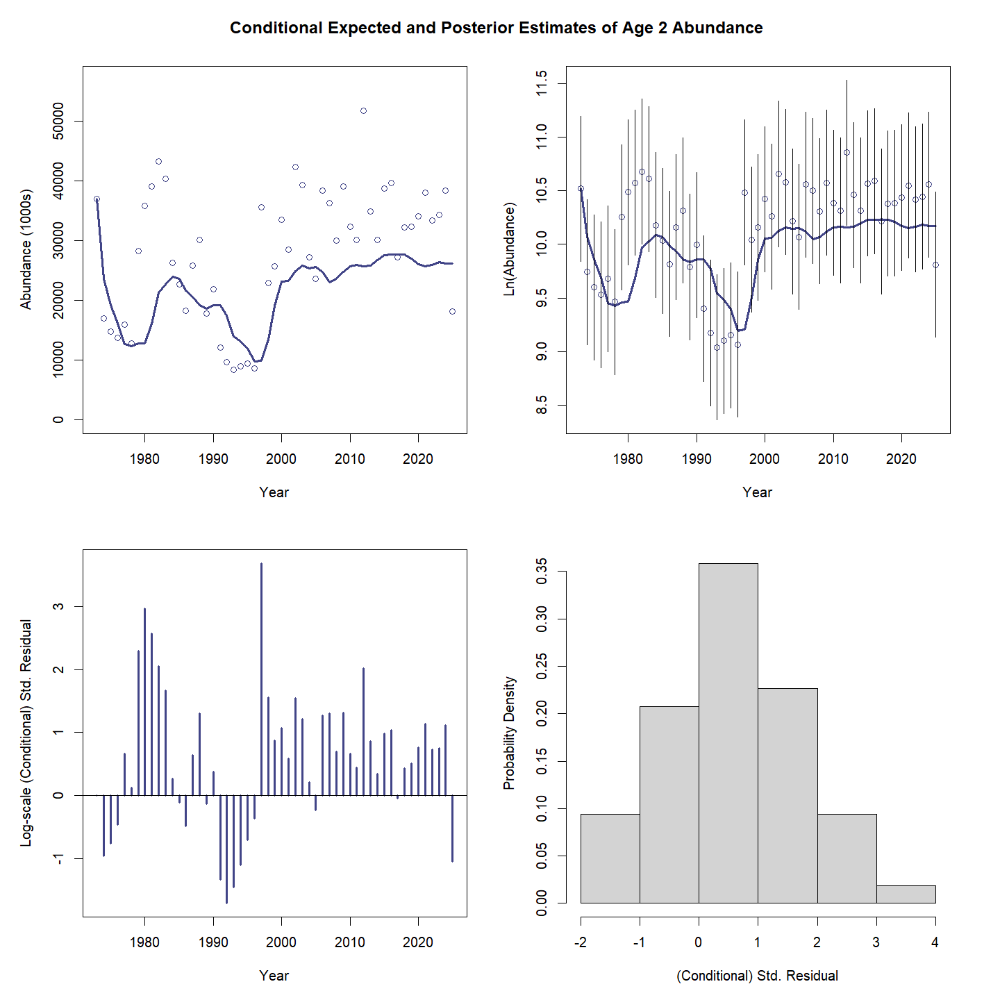
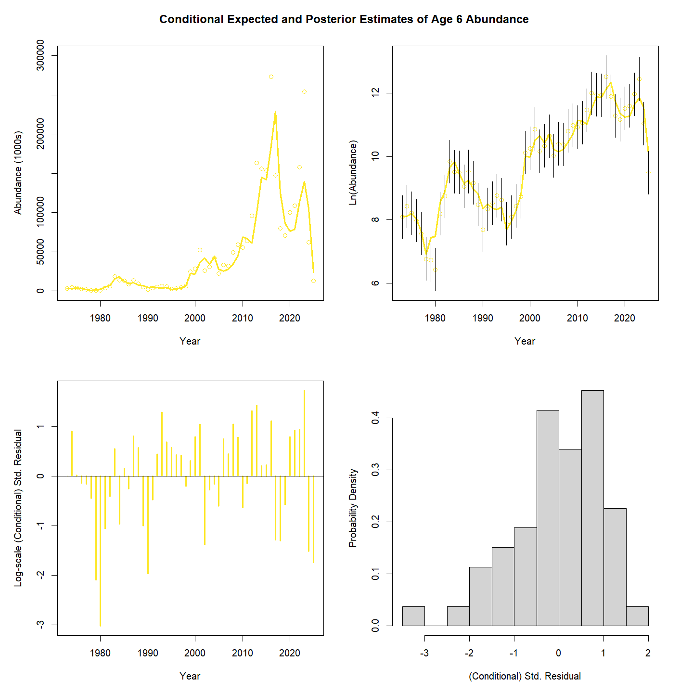
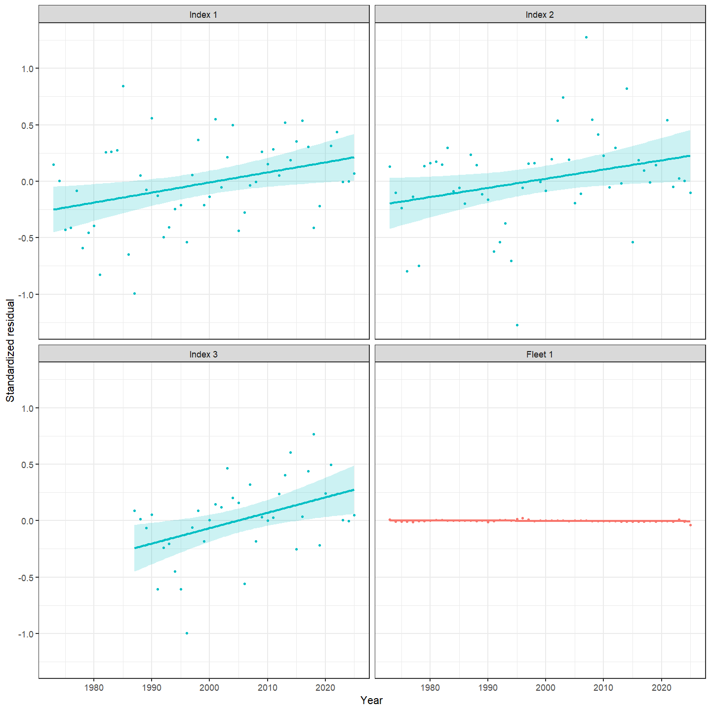
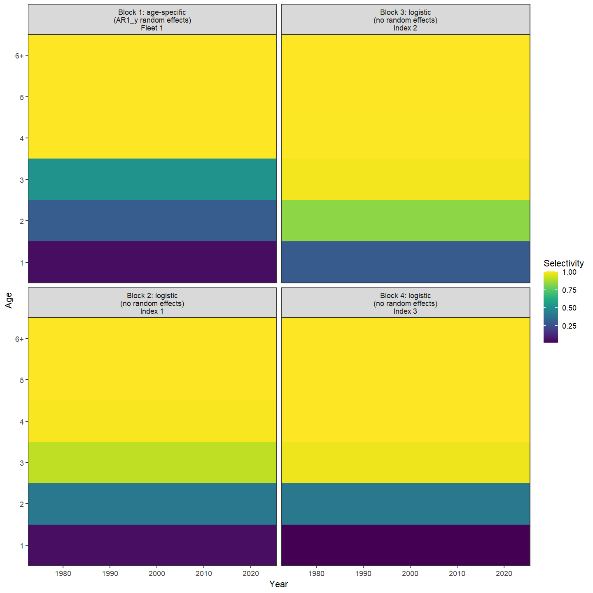
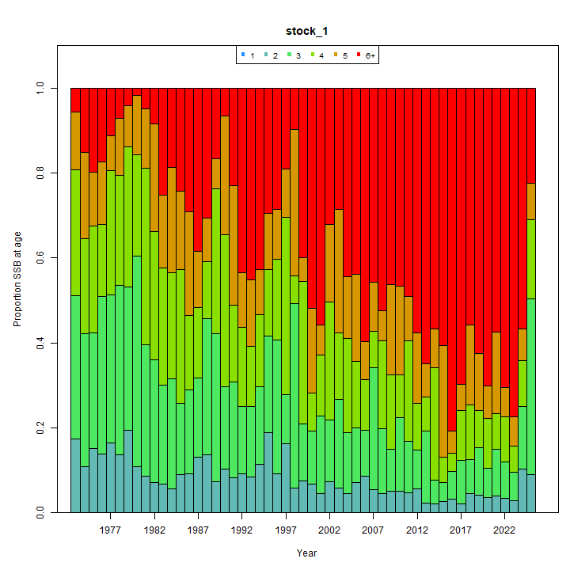
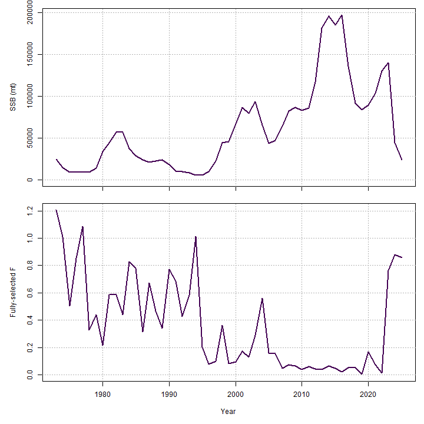
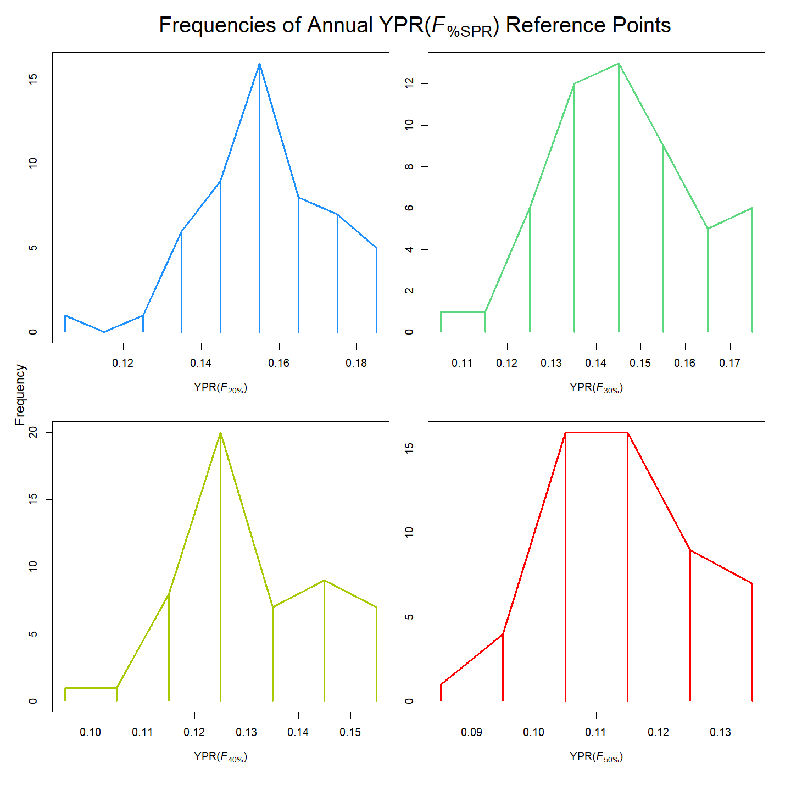
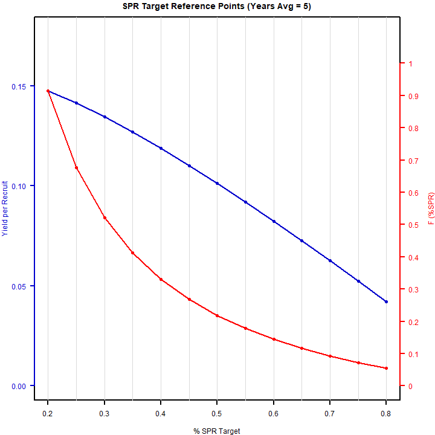

---
output:
  html_document:
    df_print: paged
    keep_md: yes
  word_document: default
  pdf_document:
    fig_caption: yes
    includes:
    keep_tex: yes
    number_sections: no
title: "WHAM Figures and Tables"
header-includes:
  - \usepackage{longtable}
  - \usepackage{booktabs}
  - \usepackage{caption,graphics}
  - \usepackage{makecell}
  - \usepackage{lscape}
  - \renewcommand\figurename{Fig.}
  - \captionsetup{labelsep=period, singlelinecheck=false}
  - \newcommand{\changesize}[1]{\fontsize{#1pt}{#1pt}\selectfont}
  - \renewcommand{\arraystretch}{1.5}
  - \renewcommand\theadfont{}
---

# {.tabset}

## Figures {.tabset}

### Input

<!-- --><!-- --><!-- --><!-- --><!-- --><!-- --><!-- --><!-- --><!-- --><!-- --><!-- --><!-- --><!-- --><!-- -->

### Diagnostics

<!-- --><!-- --><!-- --><!-- --><!-- --><!-- --><!-- --><!-- --><!-- --><!-- --><!-- --><!-- --><!-- --><!-- --><!-- --><!-- --><!-- --><!-- --><!-- --><!-- --><!-- --><!-- --><!-- --><!-- --><!-- --><!-- --><!-- --><!-- --><!-- --><!-- --><!-- --><!-- --><!-- --><!-- -->

### Results

<!-- --><!-- --><!-- --><!-- --><!-- --><!-- --><!-- --><!-- --><!-- --><!-- --><!-- --><!-- --><!-- --><!-- --><!-- --><!-- --><!-- --><!-- --><!-- --><!-- -->

### Retro

<!-- --><!-- --><!-- --><!-- --><!-- --><!-- --><!-- --><!-- -->

### Reference points

<!-- --><!-- --><!-- --><!-- --><!-- --><!-- --><!-- --><!-- --><!-- --><!-- -->

### Miscellaneous

<!-- --><!-- --><!-- --><!-- --><!-- --><!-- --><!-- --><!-- --><!-- --><!-- --><!-- --><!-- --><!-- --><!-- --><!-- --><!-- --><!-- --><!-- --><!-- --><!-- -->

## Tables {.tabset}

### Parameter estimates

<table class="table" style="margin-left: auto; margin-right: auto;">
<caption>Parameter estimates, standard errors, and confidence intervals. Rounded to 3 decimal places.</caption>
 <thead>
  <tr>
   <th style="text-align:left;">   </th>
   <th style="text-align:right;"> Estimate </th>
   <th style="text-align:right;"> Std. Error </th>
   <th style="text-align:right;"> 95\% CI lower </th>
   <th style="text-align:right;"> 95\% CI upper </th>
  </tr>
 </thead>
<tbody>
  <tr>
   <td style="text-align:left;"> stock 1 Mean Recruitment </td>
   <td style="text-align:right;"> $81557.433$ </td>
   <td style="text-align:right;"> $26507.439$ </td>
   <td style="text-align:right;"> $43133.009$ </td>
   <td style="text-align:right;"> $154211.705$ </td>
  </tr>
  <tr>
   <td style="text-align:left;"> stock 1 NAA $\sigma$ (age 1) </td>
   <td style="text-align:right;"> $0.590$ </td>
   <td style="text-align:right;"> $0.101$ </td>
   <td style="text-align:right;"> $0.421$ </td>
   <td style="text-align:right;"> $0.827$ </td>
  </tr>
  <tr>
   <td style="text-align:left;"> stock 1 NAA $\sigma$ (ages 2-6+) </td>
   <td style="text-align:right;"> $0.625$ </td>
   <td style="text-align:right;"> $0.050$ </td>
   <td style="text-align:right;"> $0.535$ </td>
   <td style="text-align:right;"> $0.730$ </td>
  </tr>
  <tr>
   <td style="text-align:left;"> index 1 fully selected q </td>
   <td style="text-align:right;"> $1.799\times 10^{-4}$ </td>
   <td style="text-align:right;"> $0.012$ </td>
   <td style="text-align:right;"> $1.041\times 10^{-62}$ </td>
   <td style="text-align:right;"> $1000.000$ </td>
  </tr>
  <tr>
   <td style="text-align:left;"> index 2 fully selected q </td>
   <td style="text-align:right;"> $1.493\times 10^{-4}$ </td>
   <td style="text-align:right;"> $0.010$ </td>
   <td style="text-align:right;"> $1.487\times 10^{-62}$ </td>
   <td style="text-align:right;"> $1000.000$ </td>
  </tr>
  <tr>
   <td style="text-align:left;"> index 3 fully selected q </td>
   <td style="text-align:right;"> $1.918\times 10^{-4}$ </td>
   <td style="text-align:right;"> $0.014$ </td>
   <td style="text-align:right;"> $2.498\times 10^{-67}$ </td>
   <td style="text-align:right;"> $1000.000$ </td>
  </tr>
  <tr>
   <td style="text-align:left;"> index 4 fully selected q </td>
   <td style="text-align:right;"> $1.566\times 10^{-4}$ </td>
   <td style="text-align:right;"> $0.011$ </td>
   <td style="text-align:right;"> $1.303\times 10^{-66}$ </td>
   <td style="text-align:right;"> $1000.000$ </td>
  </tr>
  <tr>
   <td style="text-align:left;"> fleet 1 Selectivity for age 1 (Block 1) </td>
   <td style="text-align:right;"> $0.009$ </td>
   <td style="text-align:right;"> $0.589$ </td>
   <td style="text-align:right;"> $3.862\times 10^{-57}$ </td>
   <td style="text-align:right;"> $1.000$ </td>
  </tr>
  <tr>
   <td style="text-align:left;"> fleet 1 Selectivity for age 2 (Block 1) </td>
   <td style="text-align:right;"> $0.280$ </td>
   <td style="text-align:right;"> $17.729$ </td>
   <td style="text-align:right;"> $5.599\times 10^{-76}$ </td>
   <td style="text-align:right;"> $1.000$ </td>
  </tr>
  <tr>
   <td style="text-align:left;"> fleet 1 Selectivity for age 3 (Block 1) </td>
   <td style="text-align:right;"> $0.876$ </td>
   <td style="text-align:right;"> $55.480$ </td>
   <td style="text-align:right;"> $0.000$ </td>
   <td style="text-align:right;"> $1.000$ </td>
  </tr>
  <tr>
   <td style="text-align:left;"> fleet 1 Selectivity for age 4 (Block 1) </td>
   <td style="text-align:right;"> $0.780$ </td>
   <td style="text-align:right;"> $49.383$ </td>
   <td style="text-align:right;"> $2.940\times 10^{-245}$ </td>
   <td style="text-align:right;"> $1.000$ </td>
  </tr>
  <tr>
   <td style="text-align:left;"> fleet 1 Selectivity for age 5 (Block 1) </td>
   <td style="text-align:right;"> $0.433$ </td>
   <td style="text-align:right;"> $27.425$ </td>
   <td style="text-align:right;"> $6.490\times 10^{-96}$ </td>
   <td style="text-align:right;"> $1.000$ </td>
  </tr>
  <tr>
   <td style="text-align:left;"> fleet 1 Selectivity for age 6+ (Block 1) </td>
   <td style="text-align:right;"> $0.071$ </td>
   <td style="text-align:right;"> $4.469$ </td>
   <td style="text-align:right;"> $8.078\times 10^{-60}$ </td>
   <td style="text-align:right;"> $1.000$ </td>
  </tr>
  <tr>
   <td style="text-align:left;"> index 1 Selectivity for age 1 (Block 2) </td>
   <td style="text-align:right;"> $0.009$ </td>
   <td style="text-align:right;"> $0.618$ </td>
   <td style="text-align:right;"> $1.555\times 10^{-61}$ </td>
   <td style="text-align:right;"> $1.000$ </td>
  </tr>
  <tr>
   <td style="text-align:left;"> index 1 Selectivity for age 2 (Block 2) </td>
   <td style="text-align:right;"> $0.174$ </td>
   <td style="text-align:right;"> $11.897$ </td>
   <td style="text-align:right;"> $6.719\times 10^{-72}$ </td>
   <td style="text-align:right;"> $1.000$ </td>
  </tr>
  <tr>
   <td style="text-align:left;"> index 1 Selectivity for age 3 (Block 2) </td>
   <td style="text-align:right;"> $0.941$ </td>
   <td style="text-align:right;"> $64.404$ </td>
   <td style="text-align:right;"> $0.000$ </td>
   <td style="text-align:right;"> $1.000$ </td>
  </tr>
  <tr>
   <td style="text-align:left;"> index 1 Selectivity for age 4 (Block 2) </td>
   <td style="text-align:right;"> $0.567$ </td>
   <td style="text-align:right;"> $38.791$ </td>
   <td style="text-align:right;"> $4.241\times 10^{-135}$ </td>
   <td style="text-align:right;"> $1.000$ </td>
  </tr>
  <tr>
   <td style="text-align:left;"> index 1 Selectivity for age 5 (Block 2) </td>
   <td style="text-align:right;"> $0.218$ </td>
   <td style="text-align:right;"> $14.903$ </td>
   <td style="text-align:right;"> $9.767\times 10^{-76}$ </td>
   <td style="text-align:right;"> $1.000$ </td>
  </tr>
  <tr>
   <td style="text-align:left;"> index 1 Selectivity for age 6+ (Block 2) </td>
   <td style="text-align:right;"> $0.031$ </td>
   <td style="text-align:right;"> $2.104$ </td>
   <td style="text-align:right;"> $2.606\times 10^{-62}$ </td>
   <td style="text-align:right;"> $1.000$ </td>
  </tr>
  <tr>
   <td style="text-align:left;"> index 2 Selectivity for age 1 (Block 3) </td>
   <td style="text-align:right;"> $0.150$ </td>
   <td style="text-align:right;"> $10.234$ </td>
   <td style="text-align:right;"> $9.883\times 10^{-70}$ </td>
   <td style="text-align:right;"> $1.000$ </td>
  </tr>
  <tr>
   <td style="text-align:left;"> index 2 Selectivity for age 2 (Block 3) </td>
   <td style="text-align:right;"> $0.952$ </td>
   <td style="text-align:right;"> $64.867$ </td>
   <td style="text-align:right;"> $0.000$ </td>
   <td style="text-align:right;"> $1.000$ </td>
  </tr>
  <tr>
   <td style="text-align:left;"> index 2 Selectivity for age 3 (Block 3) </td>
   <td style="text-align:right;"> $0.481$ </td>
   <td style="text-align:right;"> $32.753$ </td>
   <td style="text-align:right;"> $1.919\times 10^{-112}$ </td>
   <td style="text-align:right;"> $1.000$ </td>
  </tr>
  <tr>
   <td style="text-align:left;"> index 2 Selectivity for age 4 (Block 3) </td>
   <td style="text-align:right;"> $0.167$ </td>
   <td style="text-align:right;"> $11.407$ </td>
   <td style="text-align:right;"> $4.361\times 10^{-71}$ </td>
   <td style="text-align:right;"> $1.000$ </td>
  </tr>
  <tr>
   <td style="text-align:left;"> index 2 Selectivity for age 5 (Block 3) </td>
   <td style="text-align:right;"> $0.079$ </td>
   <td style="text-align:right;"> $5.364$ </td>
   <td style="text-align:right;"> $9.416\times 10^{-65}$ </td>
   <td style="text-align:right;"> $1.000$ </td>
  </tr>
  <tr>
   <td style="text-align:left;"> index 2 Selectivity for age 6+ (Block 3) </td>
   <td style="text-align:right;"> $0.012$ </td>
   <td style="text-align:right;"> $0.792$ </td>
   <td style="text-align:right;"> $2.434\times 10^{-61}$ </td>
   <td style="text-align:right;"> $1.000$ </td>
  </tr>
  <tr>
   <td style="text-align:left;"> index 3 Selectivity for age 1 (Block 4) </td>
   <td style="text-align:right;"> $0.009$ </td>
   <td style="text-align:right;"> $0.687$ </td>
   <td style="text-align:right;"> $3.140\times 10^{-66}$ </td>
   <td style="text-align:right;"> $1.000$ </td>
  </tr>
  <tr>
   <td style="text-align:left;"> index 3 Selectivity for age 2 (Block 4) </td>
   <td style="text-align:right;"> $0.211$ </td>
   <td style="text-align:right;"> $15.607$ </td>
   <td style="text-align:right;"> $5.011\times 10^{-81}$ </td>
   <td style="text-align:right;"> $1.000$ </td>
  </tr>
  <tr>
   <td style="text-align:left;"> index 3 Selectivity for age 3 (Block 4) </td>
   <td style="text-align:right;"> $0.906$ </td>
   <td style="text-align:right;"> $66.932$ </td>
   <td style="text-align:right;"> $0.000$ </td>
   <td style="text-align:right;"> $1.000$ </td>
  </tr>
  <tr>
   <td style="text-align:left;"> index 3 Selectivity for age 4 (Block 4) </td>
   <td style="text-align:right;"> $0.389$ </td>
   <td style="text-align:right;"> $28.704$ </td>
   <td style="text-align:right;"> $9.102\times 10^{-104}$ </td>
   <td style="text-align:right;"> $1.000$ </td>
  </tr>
  <tr>
   <td style="text-align:left;"> index 3 Selectivity for age 5 (Block 4) </td>
   <td style="text-align:right;"> $0.112$ </td>
   <td style="text-align:right;"> $8.306$ </td>
   <td style="text-align:right;"> $1.786\times 10^{-72}$ </td>
   <td style="text-align:right;"> $1.000$ </td>
  </tr>
  <tr>
   <td style="text-align:left;"> index 3 Selectivity for age 6+ (Block 4) </td>
   <td style="text-align:right;"> $0.015$ </td>
   <td style="text-align:right;"> $1.073$ </td>
   <td style="text-align:right;"> $2.270\times 10^{-66}$ </td>
   <td style="text-align:right;"> $1.000$ </td>
  </tr>
  <tr>
   <td style="text-align:left;"> index 4 Selectivity for age 1 (Block 5) </td>
   <td style="text-align:right;"> $0.159$ </td>
   <td style="text-align:right;"> $11.628$ </td>
   <td style="text-align:right;"> $2.648\times 10^{-75}$ </td>
   <td style="text-align:right;"> $1.000$ </td>
  </tr>
  <tr>
   <td style="text-align:left;"> index 4 Selectivity for age 2 (Block 5) </td>
   <td style="text-align:right;"> $0.917$ </td>
   <td style="text-align:right;"> $66.893$ </td>
   <td style="text-align:right;"> $0.000$ </td>
   <td style="text-align:right;"> $1.000$ </td>
  </tr>
  <tr>
   <td style="text-align:left;"> index 4 Selectivity for age 3 (Block 5) </td>
   <td style="text-align:right;"> $0.419$ </td>
   <td style="text-align:right;"> $30.526$ </td>
   <td style="text-align:right;"> $1.228\times 10^{-107}$ </td>
   <td style="text-align:right;"> $1.000$ </td>
  </tr>
  <tr>
   <td style="text-align:left;"> index 4 Selectivity for age 4 (Block 5) </td>
   <td style="text-align:right;"> $0.143$ </td>
   <td style="text-align:right;"> $10.400$ </td>
   <td style="text-align:right;"> $6.554\times 10^{-74}$ </td>
   <td style="text-align:right;"> $1.000$ </td>
  </tr>
  <tr>
   <td style="text-align:left;"> index 4 Selectivity for age 5 (Block 5) </td>
   <td style="text-align:right;"> $0.028$ </td>
   <td style="text-align:right;"> $2.033$ </td>
   <td style="text-align:right;"> $3.959\times 10^{-66}$ </td>
   <td style="text-align:right;"> $1.000$ </td>
  </tr>
  <tr>
   <td style="text-align:left;"> index 4 Selectivity for age 6+ (Block 5) </td>
   <td style="text-align:right;"> $0.006$ </td>
   <td style="text-align:right;"> $0.465$ </td>
   <td style="text-align:right;"> $2.132\times 10^{-65}$ </td>
   <td style="text-align:right;"> $1.000$ </td>
  </tr>
  <tr>
   <td style="text-align:left;"> fleet 1 age comp, logistic-normal: $\sigma$ </td>
   <td style="text-align:right;"> $7.034$ </td>
   <td style="text-align:right;"> $0.515$ </td>
   <td style="text-align:right;"> $6.093$ </td>
   <td style="text-align:right;"> $8.120$ </td>
  </tr>
  <tr>
   <td style="text-align:left;"> index 1 age comp, logistic-normal: $\sigma$ </td>
   <td style="text-align:right;"> $5.088$ </td>
   <td style="text-align:right;"> $0.368$ </td>
   <td style="text-align:right;"> $4.416$ </td>
   <td style="text-align:right;"> $5.863$ </td>
  </tr>
  <tr>
   <td style="text-align:left;"> index 2 age comp, logistic-normal: $\sigma$ </td>
   <td style="text-align:right;"> $5.685$ </td>
   <td style="text-align:right;"> $0.434$ </td>
   <td style="text-align:right;"> $4.895$ </td>
   <td style="text-align:right;"> $6.603$ </td>
  </tr>
  <tr>
   <td style="text-align:left;"> index 3 age comp, logistic-normal: $\sigma$ </td>
   <td style="text-align:right;"> $5.248$ </td>
   <td style="text-align:right;"> $0.368$ </td>
   <td style="text-align:right;"> $4.574$ </td>
   <td style="text-align:right;"> $6.021$ </td>
  </tr>
  <tr>
   <td style="text-align:left;"> index 4 age comp, logistic-normal: $\sigma$ </td>
   <td style="text-align:right;"> $4.540$ </td>
   <td style="text-align:right;"> $0.433$ </td>
   <td style="text-align:right;"> $3.767$ </td>
   <td style="text-align:right;"> $5.473$ </td>
  </tr>
</tbody>
</table>

### Abundance at age

<table class="table" style="margin-left: auto; margin-right: auto;">
<caption>Abundance at age (1000s) for stock 1 in region 1.</caption>
 <thead>
  <tr>
   <th style="text-align:left;">   </th>
   <th style="text-align:right;"> 1 </th>
   <th style="text-align:right;"> 2 </th>
   <th style="text-align:right;"> 3 </th>
   <th style="text-align:right;"> 4 </th>
   <th style="text-align:right;"> 5 </th>
   <th style="text-align:right;"> 6+ </th>
  </tr>
 </thead>
<tbody>
  <tr>
   <td style="text-align:left;"> 1985 </td>
   <td style="text-align:right;"> 245201 </td>
   <td style="text-align:right;"> 20017 </td>
   <td style="text-align:right;"> 7391 </td>
   <td style="text-align:right;"> 5169 </td>
   <td style="text-align:right;"> 2688 </td>
   <td style="text-align:right;"> 8282 </td>
  </tr>
  <tr>
   <td style="text-align:left;"> 1986 </td>
   <td style="text-align:right;"> 50420 </td>
   <td style="text-align:right;"> 57858 </td>
   <td style="text-align:right;"> 7495 </td>
   <td style="text-align:right;"> 3325 </td>
   <td style="text-align:right;"> 4013 </td>
   <td style="text-align:right;"> 1851 </td>
  </tr>
  <tr>
   <td style="text-align:left;"> 1987 </td>
   <td style="text-align:right;"> 41337 </td>
   <td style="text-align:right;"> 13013 </td>
   <td style="text-align:right;"> 21756 </td>
   <td style="text-align:right;"> 2653 </td>
   <td style="text-align:right;"> 1817 </td>
   <td style="text-align:right;"> 9517 </td>
  </tr>
  <tr>
   <td style="text-align:left;"> 1988 </td>
   <td style="text-align:right;"> 146756 </td>
   <td style="text-align:right;"> 54343 </td>
   <td style="text-align:right;"> 26830 </td>
   <td style="text-align:right;"> 6627 </td>
   <td style="text-align:right;"> 1656 </td>
   <td style="text-align:right;"> 5802 </td>
  </tr>
  <tr>
   <td style="text-align:left;"> 1989 </td>
   <td style="text-align:right;"> 91785 </td>
   <td style="text-align:right;"> 70104 </td>
   <td style="text-align:right;"> 16175 </td>
   <td style="text-align:right;"> 6444 </td>
   <td style="text-align:right;"> 3750 </td>
   <td style="text-align:right;"> 2348 </td>
  </tr>
  <tr>
   <td style="text-align:left;"> 1990 </td>
   <td style="text-align:right;"> 78776 </td>
   <td style="text-align:right;"> 82904 </td>
   <td style="text-align:right;"> 43517 </td>
   <td style="text-align:right;"> 5949 </td>
   <td style="text-align:right;"> 1830 </td>
   <td style="text-align:right;"> 5601 </td>
  </tr>
  <tr>
   <td style="text-align:left;"> 1991 </td>
   <td style="text-align:right;"> 61587 </td>
   <td style="text-align:right;"> 25483 </td>
   <td style="text-align:right;"> 30099 </td>
   <td style="text-align:right;"> 11757 </td>
   <td style="text-align:right;"> 2905 </td>
   <td style="text-align:right;"> 7061 </td>
  </tr>
  <tr>
   <td style="text-align:left;"> 1992 </td>
   <td style="text-align:right;"> 116783 </td>
   <td style="text-align:right;"> 45331 </td>
   <td style="text-align:right;"> 17264 </td>
   <td style="text-align:right;"> 11879 </td>
   <td style="text-align:right;"> 2991 </td>
   <td style="text-align:right;"> 5139 </td>
  </tr>
  <tr>
   <td style="text-align:left;"> 1993 </td>
   <td style="text-align:right;"> 111035 </td>
   <td style="text-align:right;"> 33063 </td>
   <td style="text-align:right;"> 10183 </td>
   <td style="text-align:right;"> 6790 </td>
   <td style="text-align:right;"> 2939 </td>
   <td style="text-align:right;"> 11323 </td>
  </tr>
  <tr>
   <td style="text-align:left;"> 1994 </td>
   <td style="text-align:right;"> 59492 </td>
   <td style="text-align:right;"> 101474 </td>
   <td style="text-align:right;"> 15278 </td>
   <td style="text-align:right;"> 6538 </td>
   <td style="text-align:right;"> 6487 </td>
   <td style="text-align:right;"> 14965 </td>
  </tr>
  <tr>
   <td style="text-align:left;"> 1995 </td>
   <td style="text-align:right;"> 49545 </td>
   <td style="text-align:right;"> 11552 </td>
   <td style="text-align:right;"> 30296 </td>
   <td style="text-align:right;"> 14852 </td>
   <td style="text-align:right;"> 8408 </td>
   <td style="text-align:right;"> 5717 </td>
  </tr>
  <tr>
   <td style="text-align:left;"> 1996 </td>
   <td style="text-align:right;"> 72243 </td>
   <td style="text-align:right;"> 64561 </td>
   <td style="text-align:right;"> 15954 </td>
   <td style="text-align:right;"> 13128 </td>
   <td style="text-align:right;"> 12045 </td>
   <td style="text-align:right;"> 4160 </td>
  </tr>
  <tr>
   <td style="text-align:left;"> 1997 </td>
   <td style="text-align:right;"> 43248 </td>
   <td style="text-align:right;"> 47159 </td>
   <td style="text-align:right;"> 17110 </td>
   <td style="text-align:right;"> 10961 </td>
   <td style="text-align:right;"> 7600 </td>
   <td style="text-align:right;"> 10945 </td>
  </tr>
  <tr>
   <td style="text-align:left;"> 1998 </td>
   <td style="text-align:right;"> 120199 </td>
   <td style="text-align:right;"> 31523 </td>
   <td style="text-align:right;"> 21311 </td>
   <td style="text-align:right;"> 12524 </td>
   <td style="text-align:right;"> 9501 </td>
   <td style="text-align:right;"> 2408 </td>
  </tr>
  <tr>
   <td style="text-align:left;"> 1999 </td>
   <td style="text-align:right;"> 88798 </td>
   <td style="text-align:right;"> 120917 </td>
   <td style="text-align:right;"> 20996 </td>
   <td style="text-align:right;"> 13471 </td>
   <td style="text-align:right;"> 6737 </td>
   <td style="text-align:right;"> 12911 </td>
  </tr>
  <tr>
   <td style="text-align:left;"> 2000 </td>
   <td style="text-align:right;"> 51510 </td>
   <td style="text-align:right;"> 74500 </td>
   <td style="text-align:right;"> 100638 </td>
   <td style="text-align:right;"> 16746 </td>
   <td style="text-align:right;"> 7905 </td>
   <td style="text-align:right;"> 19581 </td>
  </tr>
  <tr>
   <td style="text-align:left;"> 2001 </td>
   <td style="text-align:right;"> 29676 </td>
   <td style="text-align:right;"> 43148 </td>
   <td style="text-align:right;"> 37536 </td>
   <td style="text-align:right;"> 13240 </td>
   <td style="text-align:right;"> 10342 </td>
   <td style="text-align:right;"> 7402 </td>
  </tr>
  <tr>
   <td style="text-align:left;"> 2002 </td>
   <td style="text-align:right;"> 47108 </td>
   <td style="text-align:right;"> 13334 </td>
   <td style="text-align:right;"> 42632 </td>
   <td style="text-align:right;"> 29180 </td>
   <td style="text-align:right;"> 6396 </td>
   <td style="text-align:right;"> 10935 </td>
  </tr>
  <tr>
   <td style="text-align:left;"> 2003 </td>
   <td style="text-align:right;"> 32323 </td>
   <td style="text-align:right;"> 71116 </td>
   <td style="text-align:right;"> 16490 </td>
   <td style="text-align:right;"> 17527 </td>
   <td style="text-align:right;"> 13148 </td>
   <td style="text-align:right;"> 8586 </td>
  </tr>
  <tr>
   <td style="text-align:left;"> 2004 </td>
   <td style="text-align:right;"> 43481 </td>
   <td style="text-align:right;"> 17553 </td>
   <td style="text-align:right;"> 19200 </td>
   <td style="text-align:right;"> 7703 </td>
   <td style="text-align:right;"> 2210 </td>
   <td style="text-align:right;"> 5589 </td>
  </tr>
  <tr>
   <td style="text-align:left;"> 2005 </td>
   <td style="text-align:right;"> 42275 </td>
   <td style="text-align:right;"> 19291 </td>
   <td style="text-align:right;"> 23900 </td>
   <td style="text-align:right;"> 8586 </td>
   <td style="text-align:right;"> 3676 </td>
   <td style="text-align:right;"> 5856 </td>
  </tr>
  <tr>
   <td style="text-align:left;"> 2006 </td>
   <td style="text-align:right;"> 71628 </td>
   <td style="text-align:right;"> 25292 </td>
   <td style="text-align:right;"> 25254 </td>
   <td style="text-align:right;"> 11819 </td>
   <td style="text-align:right;"> 4250 </td>
   <td style="text-align:right;"> 10242 </td>
  </tr>
  <tr>
   <td style="text-align:left;"> 2007 </td>
   <td style="text-align:right;"> 59452 </td>
   <td style="text-align:right;"> 86384 </td>
   <td style="text-align:right;"> 43055 </td>
   <td style="text-align:right;"> 33267 </td>
   <td style="text-align:right;"> 9548 </td>
   <td style="text-align:right;"> 12423 </td>
  </tr>
  <tr>
   <td style="text-align:left;"> 2008 </td>
   <td style="text-align:right;"> 97590 </td>
   <td style="text-align:right;"> 76392 </td>
   <td style="text-align:right;"> 51782 </td>
   <td style="text-align:right;"> 28667 </td>
   <td style="text-align:right;"> 13398 </td>
   <td style="text-align:right;"> 15567 </td>
  </tr>
  <tr>
   <td style="text-align:left;"> 2009 </td>
   <td style="text-align:right;"> 175561 </td>
   <td style="text-align:right;"> 148420 </td>
   <td style="text-align:right;"> 71599 </td>
   <td style="text-align:right;"> 30915 </td>
   <td style="text-align:right;"> 10710 </td>
   <td style="text-align:right;"> 12615 </td>
  </tr>
  <tr>
   <td style="text-align:left;"> 2010 </td>
   <td style="text-align:right;"> 100304 </td>
   <td style="text-align:right;"> 117845 </td>
   <td style="text-align:right;"> 87267 </td>
   <td style="text-align:right;"> 40696 </td>
   <td style="text-align:right;"> 11532 </td>
   <td style="text-align:right;"> 21881 </td>
  </tr>
  <tr>
   <td style="text-align:left;"> 2011 </td>
   <td style="text-align:right;"> 109305 </td>
   <td style="text-align:right;"> 61781 </td>
   <td style="text-align:right;"> 54540 </td>
   <td style="text-align:right;"> 52789 </td>
   <td style="text-align:right;"> 15336 </td>
   <td style="text-align:right;"> 22342 </td>
  </tr>
  <tr>
   <td style="text-align:left;"> 2012 </td>
   <td style="text-align:right;"> 142578 </td>
   <td style="text-align:right;"> 81252 </td>
   <td style="text-align:right;"> 66879 </td>
   <td style="text-align:right;"> 51184 </td>
   <td style="text-align:right;"> 28635 </td>
   <td style="text-align:right;"> 25313 </td>
  </tr>
  <tr>
   <td style="text-align:left;"> 2013 </td>
   <td style="text-align:right;"> 149729 </td>
   <td style="text-align:right;"> 114402 </td>
   <td style="text-align:right;"> 63816 </td>
   <td style="text-align:right;"> 50882 </td>
   <td style="text-align:right;"> 23219 </td>
   <td style="text-align:right;"> 35242 </td>
  </tr>
  <tr>
   <td style="text-align:left;"> 2014 </td>
   <td style="text-align:right;"> 134825 </td>
   <td style="text-align:right;"> 100998 </td>
   <td style="text-align:right;"> 65888 </td>
   <td style="text-align:right;"> 28307 </td>
   <td style="text-align:right;"> 29250 </td>
   <td style="text-align:right;"> 25487 </td>
  </tr>
  <tr>
   <td style="text-align:left;"> 2015 </td>
   <td style="text-align:right;"> 105403 </td>
   <td style="text-align:right;"> 70489 </td>
   <td style="text-align:right;"> 58752 </td>
   <td style="text-align:right;"> 32196 </td>
   <td style="text-align:right;"> 10784 </td>
   <td style="text-align:right;"> 27117 </td>
  </tr>
  <tr>
   <td style="text-align:left;"> 2016 </td>
   <td style="text-align:right;"> 119176 </td>
   <td style="text-align:right;"> 78059 </td>
   <td style="text-align:right;"> 71650 </td>
   <td style="text-align:right;"> 49273 </td>
   <td style="text-align:right;"> 24422 </td>
   <td style="text-align:right;"> 34047 </td>
  </tr>
  <tr>
   <td style="text-align:left;"> 2017 </td>
   <td style="text-align:right;"> 128800 </td>
   <td style="text-align:right;"> 82091 </td>
   <td style="text-align:right;"> 51806 </td>
   <td style="text-align:right;"> 48933 </td>
   <td style="text-align:right;"> 51051 </td>
   <td style="text-align:right;"> 65930 </td>
  </tr>
  <tr>
   <td style="text-align:left;"> 2018 </td>
   <td style="text-align:right;"> 111476 </td>
   <td style="text-align:right;"> 77853 </td>
   <td style="text-align:right;"> 35231 </td>
   <td style="text-align:right;"> 40093 </td>
   <td style="text-align:right;"> 45974 </td>
   <td style="text-align:right;"> 94127 </td>
  </tr>
  <tr>
   <td style="text-align:left;"> 2019 </td>
   <td style="text-align:right;"> 124073 </td>
   <td style="text-align:right;"> 115521 </td>
   <td style="text-align:right;"> 53360 </td>
   <td style="text-align:right;"> 45573 </td>
   <td style="text-align:right;"> 68471 </td>
   <td style="text-align:right;"> 254011 </td>
  </tr>
  <tr>
   <td style="text-align:left;"> 2020 </td>
   <td style="text-align:right;"> 144470 </td>
   <td style="text-align:right;"> 85274 </td>
   <td style="text-align:right;"> 98152 </td>
   <td style="text-align:right;"> 55840 </td>
   <td style="text-align:right;"> 37070 </td>
   <td style="text-align:right;"> 498440 </td>
  </tr>
  <tr>
   <td style="text-align:left;"> 2021 </td>
   <td style="text-align:right;"> 173613 </td>
   <td style="text-align:right;"> 129841 </td>
   <td style="text-align:right;"> 82496 </td>
   <td style="text-align:right;"> 98382 </td>
   <td style="text-align:right;"> 64380 </td>
   <td style="text-align:right;"> 664993 </td>
  </tr>
  <tr>
   <td style="text-align:left;"> 2022 </td>
   <td style="text-align:right;"> 88956 </td>
   <td style="text-align:right;"> 133814 </td>
   <td style="text-align:right;"> 98967 </td>
   <td style="text-align:right;"> 114200 </td>
   <td style="text-align:right;"> 143128 </td>
   <td style="text-align:right;"> 1634857 </td>
  </tr>
  <tr>
   <td style="text-align:left;"> 2023 </td>
   <td style="text-align:right;"> 81557 </td>
   <td style="text-align:right;"> 59627 </td>
   <td style="text-align:right;"> 89634 </td>
   <td style="text-align:right;"> 66190 </td>
   <td style="text-align:right;"> 76397 </td>
   <td style="text-align:right;"> 1191513 </td>
  </tr>
  <tr>
   <td style="text-align:left;"> 2024 </td>
   <td style="text-align:right;"> 81557 </td>
   <td style="text-align:right;"> 54668 </td>
   <td style="text-align:right;"> 39941 </td>
   <td style="text-align:right;"> 59948 </td>
   <td style="text-align:right;"> 44280 </td>
   <td style="text-align:right;"> 849703 </td>
  </tr>
  <tr>
   <td style="text-align:left;"> 2025 </td>
   <td style="text-align:right;"> 81557 </td>
   <td style="text-align:right;"> 54668 </td>
   <td style="text-align:right;"> 36619 </td>
   <td style="text-align:right;"> 26713 </td>
   <td style="text-align:right;"> 40104 </td>
   <td style="text-align:right;"> 599118 </td>
  </tr>
</tbody>
</table>

### Fishing mortality at age by region

<table class="table" style="margin-left: auto; margin-right: auto;">
<caption>Total fishing mortality at age in region 1.</caption>
 <thead>
  <tr>
   <th style="text-align:left;">   </th>
   <th style="text-align:right;"> 1 </th>
   <th style="text-align:right;"> 2 </th>
   <th style="text-align:right;"> 3 </th>
   <th style="text-align:right;"> 4 </th>
   <th style="text-align:right;"> 5 </th>
   <th style="text-align:right;"> 6+ </th>
  </tr>
 </thead>
<tbody>
  <tr>
   <td style="text-align:left;"> 1985 </td>
   <td style="text-align:right;"> 0.007 </td>
   <td style="text-align:right;"> 0.225 </td>
   <td style="text-align:right;"> 0.706 </td>
   <td style="text-align:right;"> 0.628 </td>
   <td style="text-align:right;"> 0.349 </td>
   <td style="text-align:right;"> 0.057 </td>
  </tr>
  <tr>
   <td style="text-align:left;"> 1986 </td>
   <td style="text-align:right;"> 0.008 </td>
   <td style="text-align:right;"> 0.231 </td>
   <td style="text-align:right;"> 0.722 </td>
   <td style="text-align:right;"> 0.643 </td>
   <td style="text-align:right;"> 0.357 </td>
   <td style="text-align:right;"> 0.058 </td>
  </tr>
  <tr>
   <td style="text-align:left;"> 1987 </td>
   <td style="text-align:right;"> 0.006 </td>
   <td style="text-align:right;"> 0.189 </td>
   <td style="text-align:right;"> 0.590 </td>
   <td style="text-align:right;"> 0.525 </td>
   <td style="text-align:right;"> 0.292 </td>
   <td style="text-align:right;"> 0.048 </td>
  </tr>
  <tr>
   <td style="text-align:left;"> 1988 </td>
   <td style="text-align:right;"> 0.005 </td>
   <td style="text-align:right;"> 0.149 </td>
   <td style="text-align:right;"> 0.467 </td>
   <td style="text-align:right;"> 0.415 </td>
   <td style="text-align:right;"> 0.231 </td>
   <td style="text-align:right;"> 0.038 </td>
  </tr>
  <tr>
   <td style="text-align:left;"> 1989 </td>
   <td style="text-align:right;"> 0.004 </td>
   <td style="text-align:right;"> 0.109 </td>
   <td style="text-align:right;"> 0.341 </td>
   <td style="text-align:right;"> 0.304 </td>
   <td style="text-align:right;"> 0.169 </td>
   <td style="text-align:right;"> 0.027 </td>
  </tr>
  <tr>
   <td style="text-align:left;"> 1990 </td>
   <td style="text-align:right;"> 0.008 </td>
   <td style="text-align:right;"> 0.239 </td>
   <td style="text-align:right;"> 0.749 </td>
   <td style="text-align:right;"> 0.666 </td>
   <td style="text-align:right;"> 0.370 </td>
   <td style="text-align:right;"> 0.060 </td>
  </tr>
  <tr>
   <td style="text-align:left;"> 1991 </td>
   <td style="text-align:right;"> 0.005 </td>
   <td style="text-align:right;"> 0.140 </td>
   <td style="text-align:right;"> 0.439 </td>
   <td style="text-align:right;"> 0.391 </td>
   <td style="text-align:right;"> 0.217 </td>
   <td style="text-align:right;"> 0.035 </td>
  </tr>
  <tr>
   <td style="text-align:left;"> 1992 </td>
   <td style="text-align:right;"> 0.011 </td>
   <td style="text-align:right;"> 0.329 </td>
   <td style="text-align:right;"> 1.031 </td>
   <td style="text-align:right;"> 0.918 </td>
   <td style="text-align:right;"> 0.510 </td>
   <td style="text-align:right;"> 0.083 </td>
  </tr>
  <tr>
   <td style="text-align:left;"> 1993 </td>
   <td style="text-align:right;"> 0.004 </td>
   <td style="text-align:right;"> 0.114 </td>
   <td style="text-align:right;"> 0.357 </td>
   <td style="text-align:right;"> 0.317 </td>
   <td style="text-align:right;"> 0.176 </td>
   <td style="text-align:right;"> 0.029 </td>
  </tr>
  <tr>
   <td style="text-align:left;"> 1994 </td>
   <td style="text-align:right;"> 0.001 </td>
   <td style="text-align:right;"> 0.025 </td>
   <td style="text-align:right;"> 0.080 </td>
   <td style="text-align:right;"> 0.071 </td>
   <td style="text-align:right;"> 0.039 </td>
   <td style="text-align:right;"> 0.006 </td>
  </tr>
  <tr>
   <td style="text-align:left;"> 1995 </td>
   <td style="text-align:right;"> 0.001 </td>
   <td style="text-align:right;"> 0.030 </td>
   <td style="text-align:right;"> 0.093 </td>
   <td style="text-align:right;"> 0.083 </td>
   <td style="text-align:right;"> 0.046 </td>
   <td style="text-align:right;"> 0.007 </td>
  </tr>
  <tr>
   <td style="text-align:left;"> 1996 </td>
   <td style="text-align:right;"> 0.001 </td>
   <td style="text-align:right;"> 0.026 </td>
   <td style="text-align:right;"> 0.081 </td>
   <td style="text-align:right;"> 0.072 </td>
   <td style="text-align:right;"> 0.040 </td>
   <td style="text-align:right;"> 0.007 </td>
  </tr>
  <tr>
   <td style="text-align:left;"> 1997 </td>
   <td style="text-align:right;"> 0.001 </td>
   <td style="text-align:right;"> 0.038 </td>
   <td style="text-align:right;"> 0.118 </td>
   <td style="text-align:right;"> 0.105 </td>
   <td style="text-align:right;"> 0.058 </td>
   <td style="text-align:right;"> 0.010 </td>
  </tr>
  <tr>
   <td style="text-align:left;"> 1998 </td>
   <td style="text-align:right;"> 0.001 </td>
   <td style="text-align:right;"> 0.032 </td>
   <td style="text-align:right;"> 0.100 </td>
   <td style="text-align:right;"> 0.089 </td>
   <td style="text-align:right;"> 0.049 </td>
   <td style="text-align:right;"> 0.008 </td>
  </tr>
  <tr>
   <td style="text-align:left;"> 1999 </td>
   <td style="text-align:right;"> 0.001 </td>
   <td style="text-align:right;"> 0.018 </td>
   <td style="text-align:right;"> 0.056 </td>
   <td style="text-align:right;"> 0.049 </td>
   <td style="text-align:right;"> 0.027 </td>
   <td style="text-align:right;"> 0.004 </td>
  </tr>
  <tr>
   <td style="text-align:left;"> 2000 </td>
   <td style="text-align:right;"> 0.001 </td>
   <td style="text-align:right;"> 0.016 </td>
   <td style="text-align:right;"> 0.049 </td>
   <td style="text-align:right;"> 0.043 </td>
   <td style="text-align:right;"> 0.024 </td>
   <td style="text-align:right;"> 0.004 </td>
  </tr>
  <tr>
   <td style="text-align:left;"> 2001 </td>
   <td style="text-align:right;"> 0.001 </td>
   <td style="text-align:right;"> 0.033 </td>
   <td style="text-align:right;"> 0.104 </td>
   <td style="text-align:right;"> 0.093 </td>
   <td style="text-align:right;"> 0.052 </td>
   <td style="text-align:right;"> 0.008 </td>
  </tr>
  <tr>
   <td style="text-align:left;"> 2002 </td>
   <td style="text-align:right;"> 0.001 </td>
   <td style="text-align:right;"> 0.023 </td>
   <td style="text-align:right;"> 0.072 </td>
   <td style="text-align:right;"> 0.064 </td>
   <td style="text-align:right;"> 0.035 </td>
   <td style="text-align:right;"> 0.006 </td>
  </tr>
  <tr>
   <td style="text-align:left;"> 2003 </td>
   <td style="text-align:right;"> 0.001 </td>
   <td style="text-align:right;"> 0.028 </td>
   <td style="text-align:right;"> 0.089 </td>
   <td style="text-align:right;"> 0.079 </td>
   <td style="text-align:right;"> 0.044 </td>
   <td style="text-align:right;"> 0.007 </td>
  </tr>
  <tr>
   <td style="text-align:left;"> 2004 </td>
   <td style="text-align:right;"> 0.001 </td>
   <td style="text-align:right;"> 0.036 </td>
   <td style="text-align:right;"> 0.113 </td>
   <td style="text-align:right;"> 0.100 </td>
   <td style="text-align:right;"> 0.056 </td>
   <td style="text-align:right;"> 0.009 </td>
  </tr>
  <tr>
   <td style="text-align:left;"> 2005 </td>
   <td style="text-align:right;"> 0.001 </td>
   <td style="text-align:right;"> 0.021 </td>
   <td style="text-align:right;"> 0.065 </td>
   <td style="text-align:right;"> 0.058 </td>
   <td style="text-align:right;"> 0.032 </td>
   <td style="text-align:right;"> 0.005 </td>
  </tr>
  <tr>
   <td style="text-align:left;"> 2006 </td>
   <td style="text-align:right;"> 0.000 </td>
   <td style="text-align:right;"> 0.012 </td>
   <td style="text-align:right;"> 0.038 </td>
   <td style="text-align:right;"> 0.034 </td>
   <td style="text-align:right;"> 0.019 </td>
   <td style="text-align:right;"> 0.003 </td>
  </tr>
  <tr>
   <td style="text-align:left;"> 2007 </td>
   <td style="text-align:right;"> 0.000 </td>
   <td style="text-align:right;"> 0.006 </td>
   <td style="text-align:right;"> 0.018 </td>
   <td style="text-align:right;"> 0.016 </td>
   <td style="text-align:right;"> 0.009 </td>
   <td style="text-align:right;"> 0.001 </td>
  </tr>
  <tr>
   <td style="text-align:left;"> 2008 </td>
   <td style="text-align:right;"> 0.000 </td>
   <td style="text-align:right;"> 0.006 </td>
   <td style="text-align:right;"> 0.019 </td>
   <td style="text-align:right;"> 0.017 </td>
   <td style="text-align:right;"> 0.009 </td>
   <td style="text-align:right;"> 0.002 </td>
  </tr>
  <tr>
   <td style="text-align:left;"> 2009 </td>
   <td style="text-align:right;"> 0.000 </td>
   <td style="text-align:right;"> 0.004 </td>
   <td style="text-align:right;"> 0.013 </td>
   <td style="text-align:right;"> 0.012 </td>
   <td style="text-align:right;"> 0.006 </td>
   <td style="text-align:right;"> 0.001 </td>
  </tr>
  <tr>
   <td style="text-align:left;"> 2010 </td>
   <td style="text-align:right;"> 0.000 </td>
   <td style="text-align:right;"> 0.004 </td>
   <td style="text-align:right;"> 0.011 </td>
   <td style="text-align:right;"> 0.010 </td>
   <td style="text-align:right;"> 0.005 </td>
   <td style="text-align:right;"> 0.001 </td>
  </tr>
  <tr>
   <td style="text-align:left;"> 2011 </td>
   <td style="text-align:right;"> 0.000 </td>
   <td style="text-align:right;"> 0.005 </td>
   <td style="text-align:right;"> 0.016 </td>
   <td style="text-align:right;"> 0.014 </td>
   <td style="text-align:right;"> 0.008 </td>
   <td style="text-align:right;"> 0.001 </td>
  </tr>
  <tr>
   <td style="text-align:left;"> 2012 </td>
   <td style="text-align:right;"> 0.000 </td>
   <td style="text-align:right;"> 0.007 </td>
   <td style="text-align:right;"> 0.022 </td>
   <td style="text-align:right;"> 0.019 </td>
   <td style="text-align:right;"> 0.011 </td>
   <td style="text-align:right;"> 0.002 </td>
  </tr>
  <tr>
   <td style="text-align:left;"> 2013 </td>
   <td style="text-align:right;"> 0.000 </td>
   <td style="text-align:right;"> 0.004 </td>
   <td style="text-align:right;"> 0.012 </td>
   <td style="text-align:right;"> 0.011 </td>
   <td style="text-align:right;"> 0.006 </td>
   <td style="text-align:right;"> 0.001 </td>
  </tr>
  <tr>
   <td style="text-align:left;"> 2014 </td>
   <td style="text-align:right;"> 0.000 </td>
   <td style="text-align:right;"> 0.003 </td>
   <td style="text-align:right;"> 0.010 </td>
   <td style="text-align:right;"> 0.009 </td>
   <td style="text-align:right;"> 0.005 </td>
   <td style="text-align:right;"> 0.001 </td>
  </tr>
  <tr>
   <td style="text-align:left;"> 2015 </td>
   <td style="text-align:right;"> 0.000 </td>
   <td style="text-align:right;"> 0.003 </td>
   <td style="text-align:right;"> 0.009 </td>
   <td style="text-align:right;"> 0.008 </td>
   <td style="text-align:right;"> 0.004 </td>
   <td style="text-align:right;"> 0.001 </td>
  </tr>
  <tr>
   <td style="text-align:left;"> 2016 </td>
   <td style="text-align:right;"> 0.000 </td>
   <td style="text-align:right;"> 0.002 </td>
   <td style="text-align:right;"> 0.008 </td>
   <td style="text-align:right;"> 0.007 </td>
   <td style="text-align:right;"> 0.004 </td>
   <td style="text-align:right;"> 0.001 </td>
  </tr>
  <tr>
   <td style="text-align:left;"> 2017 </td>
   <td style="text-align:right;"> 0.000 </td>
   <td style="text-align:right;"> 0.002 </td>
   <td style="text-align:right;"> 0.007 </td>
   <td style="text-align:right;"> 0.007 </td>
   <td style="text-align:right;"> 0.004 </td>
   <td style="text-align:right;"> 0.001 </td>
  </tr>
  <tr>
   <td style="text-align:left;"> 2018 </td>
   <td style="text-align:right;"> 0.000 </td>
   <td style="text-align:right;"> 0.002 </td>
   <td style="text-align:right;"> 0.007 </td>
   <td style="text-align:right;"> 0.007 </td>
   <td style="text-align:right;"> 0.004 </td>
   <td style="text-align:right;"> 0.001 </td>
  </tr>
  <tr>
   <td style="text-align:left;"> 2019 </td>
   <td style="text-align:right;"> 0.000 </td>
   <td style="text-align:right;"> 0.002 </td>
   <td style="text-align:right;"> 0.005 </td>
   <td style="text-align:right;"> 0.004 </td>
   <td style="text-align:right;"> 0.002 </td>
   <td style="text-align:right;"> 0.000 </td>
  </tr>
  <tr>
   <td style="text-align:left;"> 2020 </td>
   <td style="text-align:right;"> 0.000 </td>
   <td style="text-align:right;"> 0.001 </td>
   <td style="text-align:right;"> 0.003 </td>
   <td style="text-align:right;"> 0.003 </td>
   <td style="text-align:right;"> 0.001 </td>
   <td style="text-align:right;"> 0.000 </td>
  </tr>
  <tr>
   <td style="text-align:left;"> 2021 </td>
   <td style="text-align:right;"> 0.000 </td>
   <td style="text-align:right;"> 0.001 </td>
   <td style="text-align:right;"> 0.004 </td>
   <td style="text-align:right;"> 0.004 </td>
   <td style="text-align:right;"> 0.002 </td>
   <td style="text-align:right;"> 0.000 </td>
  </tr>
  <tr>
   <td style="text-align:left;"> 2022 </td>
   <td style="text-align:right;"> 0.000 </td>
   <td style="text-align:right;"> 0.001 </td>
   <td style="text-align:right;"> 0.002 </td>
   <td style="text-align:right;"> 0.002 </td>
   <td style="text-align:right;"> 0.001 </td>
   <td style="text-align:right;"> 0.000 </td>
  </tr>
  <tr>
   <td style="text-align:left;"> 2023 </td>
   <td style="text-align:right;"> 0.000 </td>
   <td style="text-align:right;"> 0.001 </td>
   <td style="text-align:right;"> 0.002 </td>
   <td style="text-align:right;"> 0.002 </td>
   <td style="text-align:right;"> 0.001 </td>
   <td style="text-align:right;"> 0.000 </td>
  </tr>
  <tr>
   <td style="text-align:left;"> 2024 </td>
   <td style="text-align:right;"> 0.000 </td>
   <td style="text-align:right;"> 0.001 </td>
   <td style="text-align:right;"> 0.002 </td>
   <td style="text-align:right;"> 0.002 </td>
   <td style="text-align:right;"> 0.001 </td>
   <td style="text-align:right;"> 0.000 </td>
  </tr>
  <tr>
   <td style="text-align:left;"> 2025 </td>
   <td style="text-align:right;"> 0.000 </td>
   <td style="text-align:right;"> 0.001 </td>
   <td style="text-align:right;"> 0.002 </td>
   <td style="text-align:right;"> 0.002 </td>
   <td style="text-align:right;"> 0.001 </td>
   <td style="text-align:right;"> 0.000 </td>
  </tr>
</tbody>
</table>

### Fishing mortality at age by fleet

<table class="table" style="margin-left: auto; margin-right: auto;">
<caption>Total fishing mortality at age in fleet 1.</caption>
 <thead>
  <tr>
   <th style="text-align:left;">   </th>
   <th style="text-align:right;"> 1 </th>
   <th style="text-align:right;"> 2 </th>
   <th style="text-align:right;"> 3 </th>
   <th style="text-align:right;"> 4 </th>
   <th style="text-align:right;"> 5 </th>
   <th style="text-align:right;"> 6+ </th>
  </tr>
 </thead>
<tbody>
  <tr>
   <td style="text-align:left;"> 1985 </td>
   <td style="text-align:right;"> 0.007 </td>
   <td style="text-align:right;"> 0.225 </td>
   <td style="text-align:right;"> 0.706 </td>
   <td style="text-align:right;"> 0.628 </td>
   <td style="text-align:right;"> 0.349 </td>
   <td style="text-align:right;"> 0.057 </td>
  </tr>
  <tr>
   <td style="text-align:left;"> 1986 </td>
   <td style="text-align:right;"> 0.008 </td>
   <td style="text-align:right;"> 0.231 </td>
   <td style="text-align:right;"> 0.722 </td>
   <td style="text-align:right;"> 0.643 </td>
   <td style="text-align:right;"> 0.357 </td>
   <td style="text-align:right;"> 0.058 </td>
  </tr>
  <tr>
   <td style="text-align:left;"> 1987 </td>
   <td style="text-align:right;"> 0.006 </td>
   <td style="text-align:right;"> 0.189 </td>
   <td style="text-align:right;"> 0.590 </td>
   <td style="text-align:right;"> 0.525 </td>
   <td style="text-align:right;"> 0.292 </td>
   <td style="text-align:right;"> 0.048 </td>
  </tr>
  <tr>
   <td style="text-align:left;"> 1988 </td>
   <td style="text-align:right;"> 0.005 </td>
   <td style="text-align:right;"> 0.149 </td>
   <td style="text-align:right;"> 0.467 </td>
   <td style="text-align:right;"> 0.415 </td>
   <td style="text-align:right;"> 0.231 </td>
   <td style="text-align:right;"> 0.038 </td>
  </tr>
  <tr>
   <td style="text-align:left;"> 1989 </td>
   <td style="text-align:right;"> 0.004 </td>
   <td style="text-align:right;"> 0.109 </td>
   <td style="text-align:right;"> 0.341 </td>
   <td style="text-align:right;"> 0.304 </td>
   <td style="text-align:right;"> 0.169 </td>
   <td style="text-align:right;"> 0.027 </td>
  </tr>
  <tr>
   <td style="text-align:left;"> 1990 </td>
   <td style="text-align:right;"> 0.008 </td>
   <td style="text-align:right;"> 0.239 </td>
   <td style="text-align:right;"> 0.749 </td>
   <td style="text-align:right;"> 0.666 </td>
   <td style="text-align:right;"> 0.370 </td>
   <td style="text-align:right;"> 0.060 </td>
  </tr>
  <tr>
   <td style="text-align:left;"> 1991 </td>
   <td style="text-align:right;"> 0.005 </td>
   <td style="text-align:right;"> 0.140 </td>
   <td style="text-align:right;"> 0.439 </td>
   <td style="text-align:right;"> 0.391 </td>
   <td style="text-align:right;"> 0.217 </td>
   <td style="text-align:right;"> 0.035 </td>
  </tr>
  <tr>
   <td style="text-align:left;"> 1992 </td>
   <td style="text-align:right;"> 0.011 </td>
   <td style="text-align:right;"> 0.329 </td>
   <td style="text-align:right;"> 1.031 </td>
   <td style="text-align:right;"> 0.918 </td>
   <td style="text-align:right;"> 0.510 </td>
   <td style="text-align:right;"> 0.083 </td>
  </tr>
  <tr>
   <td style="text-align:left;"> 1993 </td>
   <td style="text-align:right;"> 0.004 </td>
   <td style="text-align:right;"> 0.114 </td>
   <td style="text-align:right;"> 0.357 </td>
   <td style="text-align:right;"> 0.317 </td>
   <td style="text-align:right;"> 0.176 </td>
   <td style="text-align:right;"> 0.029 </td>
  </tr>
  <tr>
   <td style="text-align:left;"> 1994 </td>
   <td style="text-align:right;"> 0.001 </td>
   <td style="text-align:right;"> 0.025 </td>
   <td style="text-align:right;"> 0.080 </td>
   <td style="text-align:right;"> 0.071 </td>
   <td style="text-align:right;"> 0.039 </td>
   <td style="text-align:right;"> 0.006 </td>
  </tr>
  <tr>
   <td style="text-align:left;"> 1995 </td>
   <td style="text-align:right;"> 0.001 </td>
   <td style="text-align:right;"> 0.030 </td>
   <td style="text-align:right;"> 0.093 </td>
   <td style="text-align:right;"> 0.083 </td>
   <td style="text-align:right;"> 0.046 </td>
   <td style="text-align:right;"> 0.007 </td>
  </tr>
  <tr>
   <td style="text-align:left;"> 1996 </td>
   <td style="text-align:right;"> 0.001 </td>
   <td style="text-align:right;"> 0.026 </td>
   <td style="text-align:right;"> 0.081 </td>
   <td style="text-align:right;"> 0.072 </td>
   <td style="text-align:right;"> 0.040 </td>
   <td style="text-align:right;"> 0.007 </td>
  </tr>
  <tr>
   <td style="text-align:left;"> 1997 </td>
   <td style="text-align:right;"> 0.001 </td>
   <td style="text-align:right;"> 0.038 </td>
   <td style="text-align:right;"> 0.118 </td>
   <td style="text-align:right;"> 0.105 </td>
   <td style="text-align:right;"> 0.058 </td>
   <td style="text-align:right;"> 0.010 </td>
  </tr>
  <tr>
   <td style="text-align:left;"> 1998 </td>
   <td style="text-align:right;"> 0.001 </td>
   <td style="text-align:right;"> 0.032 </td>
   <td style="text-align:right;"> 0.100 </td>
   <td style="text-align:right;"> 0.089 </td>
   <td style="text-align:right;"> 0.049 </td>
   <td style="text-align:right;"> 0.008 </td>
  </tr>
  <tr>
   <td style="text-align:left;"> 1999 </td>
   <td style="text-align:right;"> 0.001 </td>
   <td style="text-align:right;"> 0.018 </td>
   <td style="text-align:right;"> 0.056 </td>
   <td style="text-align:right;"> 0.049 </td>
   <td style="text-align:right;"> 0.027 </td>
   <td style="text-align:right;"> 0.004 </td>
  </tr>
  <tr>
   <td style="text-align:left;"> 2000 </td>
   <td style="text-align:right;"> 0.001 </td>
   <td style="text-align:right;"> 0.016 </td>
   <td style="text-align:right;"> 0.049 </td>
   <td style="text-align:right;"> 0.043 </td>
   <td style="text-align:right;"> 0.024 </td>
   <td style="text-align:right;"> 0.004 </td>
  </tr>
  <tr>
   <td style="text-align:left;"> 2001 </td>
   <td style="text-align:right;"> 0.001 </td>
   <td style="text-align:right;"> 0.033 </td>
   <td style="text-align:right;"> 0.104 </td>
   <td style="text-align:right;"> 0.093 </td>
   <td style="text-align:right;"> 0.052 </td>
   <td style="text-align:right;"> 0.008 </td>
  </tr>
  <tr>
   <td style="text-align:left;"> 2002 </td>
   <td style="text-align:right;"> 0.001 </td>
   <td style="text-align:right;"> 0.023 </td>
   <td style="text-align:right;"> 0.072 </td>
   <td style="text-align:right;"> 0.064 </td>
   <td style="text-align:right;"> 0.035 </td>
   <td style="text-align:right;"> 0.006 </td>
  </tr>
  <tr>
   <td style="text-align:left;"> 2003 </td>
   <td style="text-align:right;"> 0.001 </td>
   <td style="text-align:right;"> 0.028 </td>
   <td style="text-align:right;"> 0.089 </td>
   <td style="text-align:right;"> 0.079 </td>
   <td style="text-align:right;"> 0.044 </td>
   <td style="text-align:right;"> 0.007 </td>
  </tr>
  <tr>
   <td style="text-align:left;"> 2004 </td>
   <td style="text-align:right;"> 0.001 </td>
   <td style="text-align:right;"> 0.036 </td>
   <td style="text-align:right;"> 0.113 </td>
   <td style="text-align:right;"> 0.100 </td>
   <td style="text-align:right;"> 0.056 </td>
   <td style="text-align:right;"> 0.009 </td>
  </tr>
  <tr>
   <td style="text-align:left;"> 2005 </td>
   <td style="text-align:right;"> 0.001 </td>
   <td style="text-align:right;"> 0.021 </td>
   <td style="text-align:right;"> 0.065 </td>
   <td style="text-align:right;"> 0.058 </td>
   <td style="text-align:right;"> 0.032 </td>
   <td style="text-align:right;"> 0.005 </td>
  </tr>
  <tr>
   <td style="text-align:left;"> 2006 </td>
   <td style="text-align:right;"> 0.000 </td>
   <td style="text-align:right;"> 0.012 </td>
   <td style="text-align:right;"> 0.038 </td>
   <td style="text-align:right;"> 0.034 </td>
   <td style="text-align:right;"> 0.019 </td>
   <td style="text-align:right;"> 0.003 </td>
  </tr>
  <tr>
   <td style="text-align:left;"> 2007 </td>
   <td style="text-align:right;"> 0.000 </td>
   <td style="text-align:right;"> 0.006 </td>
   <td style="text-align:right;"> 0.018 </td>
   <td style="text-align:right;"> 0.016 </td>
   <td style="text-align:right;"> 0.009 </td>
   <td style="text-align:right;"> 0.001 </td>
  </tr>
  <tr>
   <td style="text-align:left;"> 2008 </td>
   <td style="text-align:right;"> 0.000 </td>
   <td style="text-align:right;"> 0.006 </td>
   <td style="text-align:right;"> 0.019 </td>
   <td style="text-align:right;"> 0.017 </td>
   <td style="text-align:right;"> 0.009 </td>
   <td style="text-align:right;"> 0.002 </td>
  </tr>
  <tr>
   <td style="text-align:left;"> 2009 </td>
   <td style="text-align:right;"> 0.000 </td>
   <td style="text-align:right;"> 0.004 </td>
   <td style="text-align:right;"> 0.013 </td>
   <td style="text-align:right;"> 0.012 </td>
   <td style="text-align:right;"> 0.006 </td>
   <td style="text-align:right;"> 0.001 </td>
  </tr>
  <tr>
   <td style="text-align:left;"> 2010 </td>
   <td style="text-align:right;"> 0.000 </td>
   <td style="text-align:right;"> 0.004 </td>
   <td style="text-align:right;"> 0.011 </td>
   <td style="text-align:right;"> 0.010 </td>
   <td style="text-align:right;"> 0.005 </td>
   <td style="text-align:right;"> 0.001 </td>
  </tr>
  <tr>
   <td style="text-align:left;"> 2011 </td>
   <td style="text-align:right;"> 0.000 </td>
   <td style="text-align:right;"> 0.005 </td>
   <td style="text-align:right;"> 0.016 </td>
   <td style="text-align:right;"> 0.014 </td>
   <td style="text-align:right;"> 0.008 </td>
   <td style="text-align:right;"> 0.001 </td>
  </tr>
  <tr>
   <td style="text-align:left;"> 2012 </td>
   <td style="text-align:right;"> 0.000 </td>
   <td style="text-align:right;"> 0.007 </td>
   <td style="text-align:right;"> 0.022 </td>
   <td style="text-align:right;"> 0.019 </td>
   <td style="text-align:right;"> 0.011 </td>
   <td style="text-align:right;"> 0.002 </td>
  </tr>
  <tr>
   <td style="text-align:left;"> 2013 </td>
   <td style="text-align:right;"> 0.000 </td>
   <td style="text-align:right;"> 0.004 </td>
   <td style="text-align:right;"> 0.012 </td>
   <td style="text-align:right;"> 0.011 </td>
   <td style="text-align:right;"> 0.006 </td>
   <td style="text-align:right;"> 0.001 </td>
  </tr>
  <tr>
   <td style="text-align:left;"> 2014 </td>
   <td style="text-align:right;"> 0.000 </td>
   <td style="text-align:right;"> 0.003 </td>
   <td style="text-align:right;"> 0.010 </td>
   <td style="text-align:right;"> 0.009 </td>
   <td style="text-align:right;"> 0.005 </td>
   <td style="text-align:right;"> 0.001 </td>
  </tr>
  <tr>
   <td style="text-align:left;"> 2015 </td>
   <td style="text-align:right;"> 0.000 </td>
   <td style="text-align:right;"> 0.003 </td>
   <td style="text-align:right;"> 0.009 </td>
   <td style="text-align:right;"> 0.008 </td>
   <td style="text-align:right;"> 0.004 </td>
   <td style="text-align:right;"> 0.001 </td>
  </tr>
  <tr>
   <td style="text-align:left;"> 2016 </td>
   <td style="text-align:right;"> 0.000 </td>
   <td style="text-align:right;"> 0.002 </td>
   <td style="text-align:right;"> 0.008 </td>
   <td style="text-align:right;"> 0.007 </td>
   <td style="text-align:right;"> 0.004 </td>
   <td style="text-align:right;"> 0.001 </td>
  </tr>
  <tr>
   <td style="text-align:left;"> 2017 </td>
   <td style="text-align:right;"> 0.000 </td>
   <td style="text-align:right;"> 0.002 </td>
   <td style="text-align:right;"> 0.007 </td>
   <td style="text-align:right;"> 0.007 </td>
   <td style="text-align:right;"> 0.004 </td>
   <td style="text-align:right;"> 0.001 </td>
  </tr>
  <tr>
   <td style="text-align:left;"> 2018 </td>
   <td style="text-align:right;"> 0.000 </td>
   <td style="text-align:right;"> 0.002 </td>
   <td style="text-align:right;"> 0.007 </td>
   <td style="text-align:right;"> 0.007 </td>
   <td style="text-align:right;"> 0.004 </td>
   <td style="text-align:right;"> 0.001 </td>
  </tr>
  <tr>
   <td style="text-align:left;"> 2019 </td>
   <td style="text-align:right;"> 0.000 </td>
   <td style="text-align:right;"> 0.002 </td>
   <td style="text-align:right;"> 0.005 </td>
   <td style="text-align:right;"> 0.004 </td>
   <td style="text-align:right;"> 0.002 </td>
   <td style="text-align:right;"> 0.000 </td>
  </tr>
  <tr>
   <td style="text-align:left;"> 2020 </td>
   <td style="text-align:right;"> 0.000 </td>
   <td style="text-align:right;"> 0.001 </td>
   <td style="text-align:right;"> 0.003 </td>
   <td style="text-align:right;"> 0.003 </td>
   <td style="text-align:right;"> 0.001 </td>
   <td style="text-align:right;"> 0.000 </td>
  </tr>
  <tr>
   <td style="text-align:left;"> 2021 </td>
   <td style="text-align:right;"> 0.000 </td>
   <td style="text-align:right;"> 0.001 </td>
   <td style="text-align:right;"> 0.004 </td>
   <td style="text-align:right;"> 0.004 </td>
   <td style="text-align:right;"> 0.002 </td>
   <td style="text-align:right;"> 0.000 </td>
  </tr>
  <tr>
   <td style="text-align:left;"> 2022 </td>
   <td style="text-align:right;"> 0.000 </td>
   <td style="text-align:right;"> 0.001 </td>
   <td style="text-align:right;"> 0.002 </td>
   <td style="text-align:right;"> 0.002 </td>
   <td style="text-align:right;"> 0.001 </td>
   <td style="text-align:right;"> 0.000 </td>
  </tr>
  <tr>
   <td style="text-align:left;"> 2023 </td>
   <td style="text-align:right;"> 0.000 </td>
   <td style="text-align:right;"> 0.001 </td>
   <td style="text-align:right;"> 0.002 </td>
   <td style="text-align:right;"> 0.002 </td>
   <td style="text-align:right;"> 0.001 </td>
   <td style="text-align:right;"> 0.000 </td>
  </tr>
  <tr>
   <td style="text-align:left;"> 2024 </td>
   <td style="text-align:right;"> 0.000 </td>
   <td style="text-align:right;"> 0.001 </td>
   <td style="text-align:right;"> 0.002 </td>
   <td style="text-align:right;"> 0.002 </td>
   <td style="text-align:right;"> 0.001 </td>
   <td style="text-align:right;"> 0.000 </td>
  </tr>
  <tr>
   <td style="text-align:left;"> 2025 </td>
   <td style="text-align:right;"> 0.000 </td>
   <td style="text-align:right;"> 0.001 </td>
   <td style="text-align:right;"> 0.002 </td>
   <td style="text-align:right;"> 0.002 </td>
   <td style="text-align:right;"> 0.001 </td>
   <td style="text-align:right;"> 0.000 </td>
  </tr>
</tbody>
</table>
