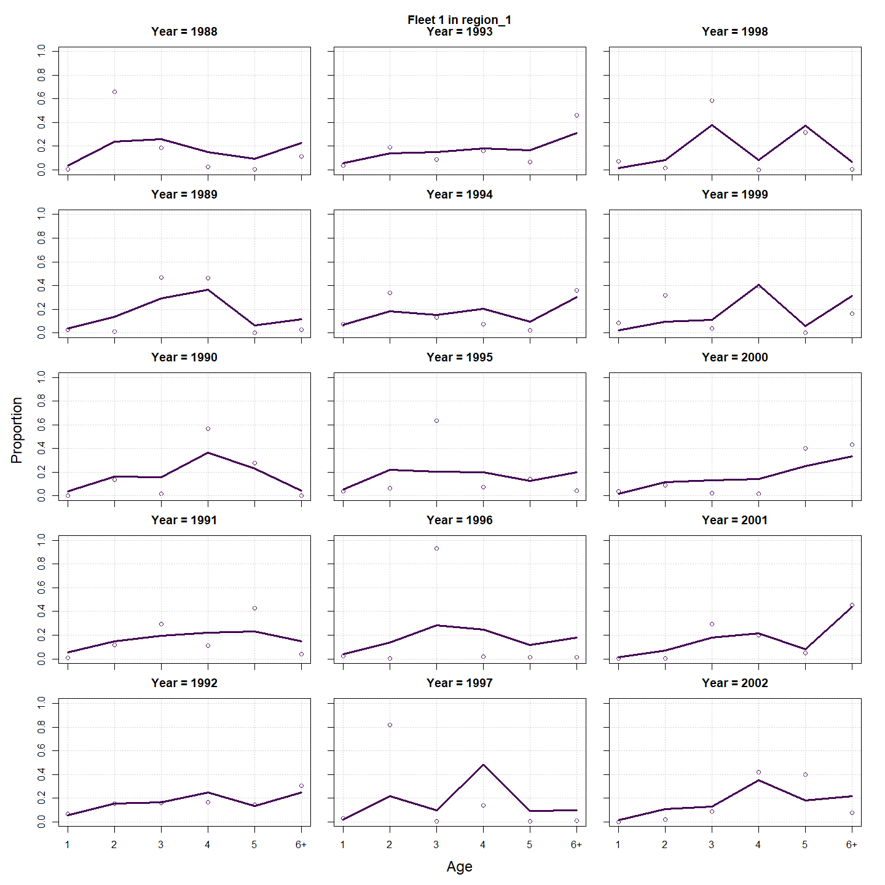
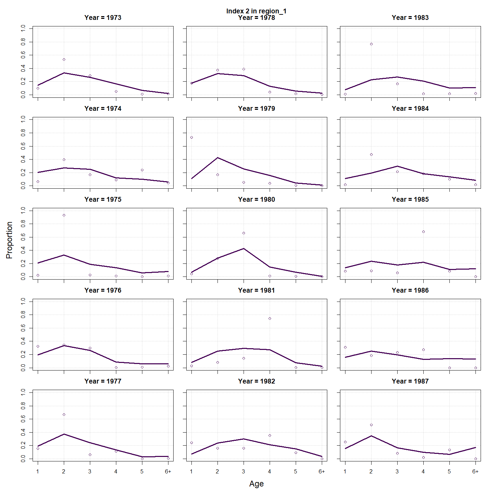
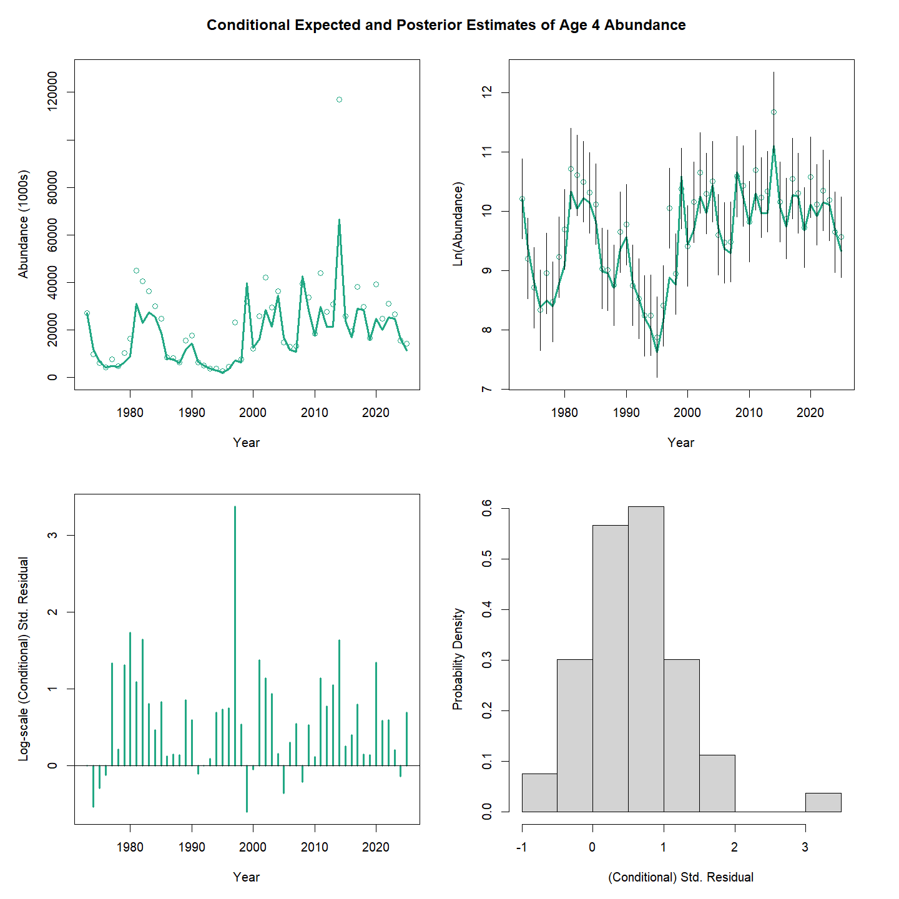
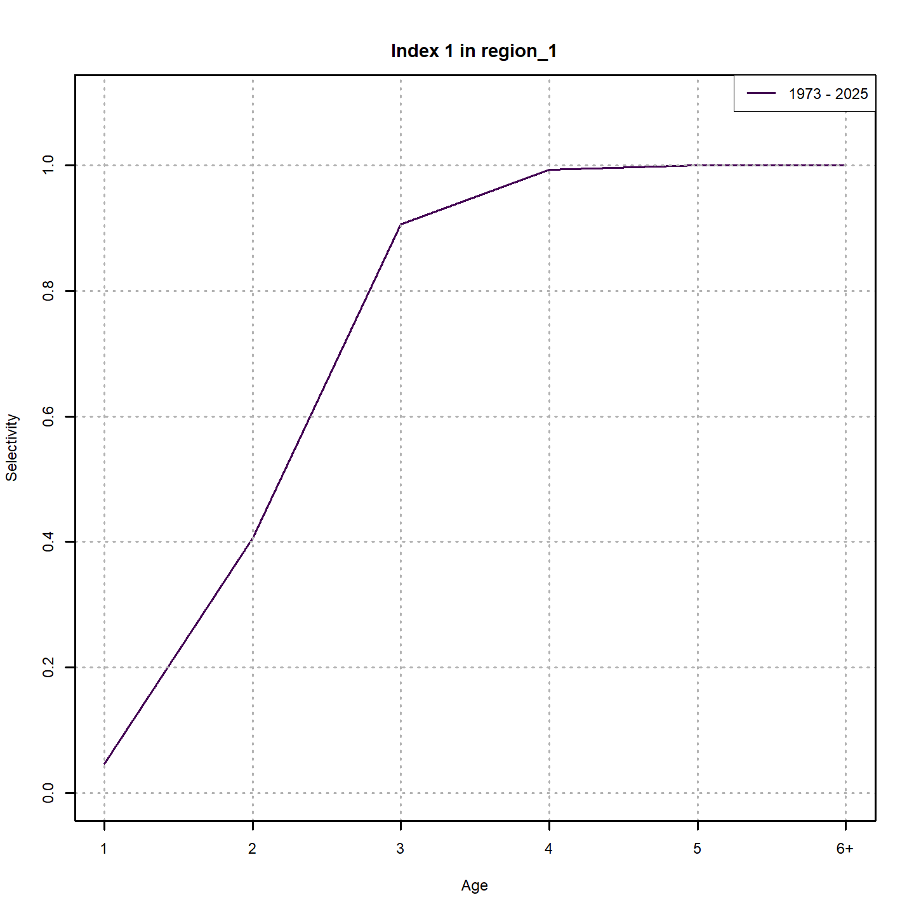
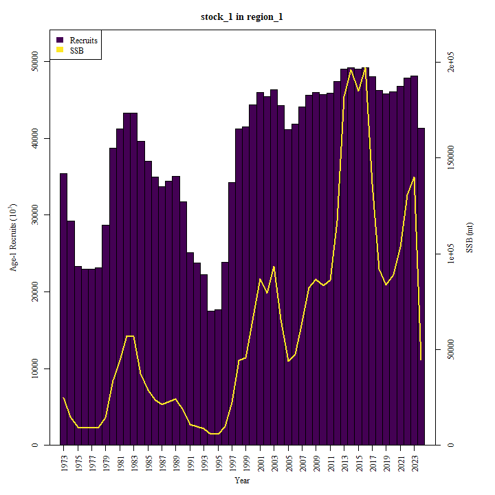
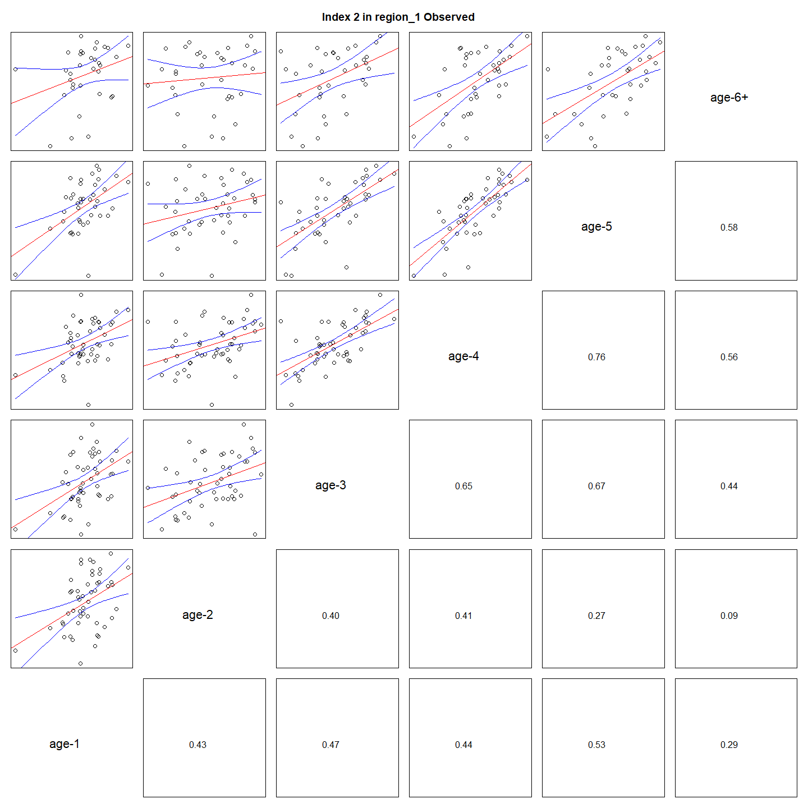
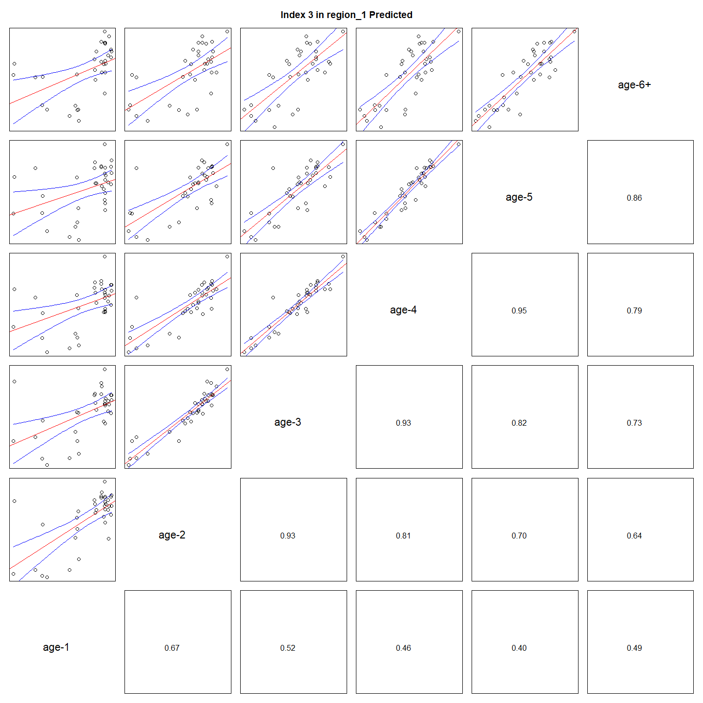

---
output:
  html_document:
    df_print: paged
    keep_md: yes
  word_document: default
  pdf_document:
    fig_caption: yes
    includes:
    keep_tex: yes
    number_sections: no
title: "WHAM Figures and Tables"
header-includes:
  - \usepackage{longtable}
  - \usepackage{booktabs}
  - \usepackage{caption,graphics}
  - \usepackage{makecell}
  - \usepackage{lscape}
  - \renewcommand\figurename{Fig.}
  - \captionsetup{labelsep=period, singlelinecheck=false}
  - \newcommand{\changesize}[1]{\fontsize{#1pt}{#1pt}\selectfont}
  - \renewcommand{\arraystretch}{1.5}
  - \renewcommand\theadfont{}
---

# {.tabset}

## Figures {.tabset}

### Input

### Diagnostics

### Results

### Retro

### Reference points

### Miscellaneous

## Tables {.tabset}

### Parameter estimates

<table class="table" style="color: black; margin-left: auto; margin-right: auto;">
<caption>Parameter estimates, standard errors, and confidence intervals. Rounded to 3 decimal places.</caption>
 <thead>
  <tr>
   <th style="text-align:left;">   </th>
   <th style="text-align:right;"> Estimate </th>
   <th style="text-align:right;"> Std. Error </th>
   <th style="text-align:right;"> 95\% CI lower </th>
   <th style="text-align:right;"> 95\% CI upper </th>
  </tr>
 </thead>
<tbody>
  <tr>
   <td style="text-align:left;"> stock 1 Mean Recruitment </td>
   <td style="text-align:right;"> $25205.521$ </td>
   <td style="text-align:right;"> $3547.118$ </td>
   <td style="text-align:right;"> $19129.690$ </td>
   <td style="text-align:right;"> $33211.112$ </td>
  </tr>
  <tr>
   <td style="text-align:left;"> stock 1 NAA $\sigma$ (age 1) </td>
   <td style="text-align:right;"> $0.184$ </td>
   <td style="text-align:right;"> $0.037$ </td>
   <td style="text-align:right;"> $0.125$ </td>
   <td style="text-align:right;"> $0.272$ </td>
  </tr>
  <tr>
   <td style="text-align:left;"> stock 1 NAA $\sigma$ (ages 2-6+) </td>
   <td style="text-align:right;"> $0.122$ </td>
   <td style="text-align:right;"> $0.015$ </td>
   <td style="text-align:right;"> $0.096$ </td>
   <td style="text-align:right;"> $0.156$ </td>
  </tr>
  <tr>
   <td style="text-align:left;"> Index 1 fully selected q </td>
   <td style="text-align:right;"> $0.296$ </td>
   <td style="text-align:right;"> $0.045$ </td>
   <td style="text-align:right;"> $0.219$ </td>
   <td style="text-align:right;"> $0.400$ </td>
  </tr>
  <tr>
   <td style="text-align:left;"> Index 2 fully selected q </td>
   <td style="text-align:right;"> $0.284$ </td>
   <td style="text-align:right;"> $0.043$ </td>
   <td style="text-align:right;"> $0.211$ </td>
   <td style="text-align:right;"> $0.383$ </td>
  </tr>
  <tr>
   <td style="text-align:left;"> Index 3 fully selected q </td>
   <td style="text-align:right;"> $0.295$ </td>
   <td style="text-align:right;"> $0.045$ </td>
   <td style="text-align:right;"> $0.219$ </td>
   <td style="text-align:right;"> $0.397$ </td>
  </tr>
  <tr>
   <td style="text-align:left;"> Index 4 fully selected q </td>
   <td style="text-align:right;"> $0.295$ </td>
   <td style="text-align:right;"> $0.045$ </td>
   <td style="text-align:right;"> $0.218$ </td>
   <td style="text-align:right;"> $0.399$ </td>
  </tr>
  <tr>
   <td style="text-align:left;"> Index 5 fully selected q </td>
   <td style="text-align:right;"> $0.301$ </td>
   <td style="text-align:right;"> $0.046$ </td>
   <td style="text-align:right;"> $0.222$ </td>
   <td style="text-align:right;"> $0.407$ </td>
  </tr>
  <tr>
   <td style="text-align:left;"> Index 6 fully selected q </td>
   <td style="text-align:right;"> $0.291$ </td>
   <td style="text-align:right;"> $0.044$ </td>
   <td style="text-align:right;"> $0.216$ </td>
   <td style="text-align:right;"> $0.392$ </td>
  </tr>
  <tr>
   <td style="text-align:left;"> Index 7 fully selected q </td>
   <td style="text-align:right;"> $0.288$ </td>
   <td style="text-align:right;"> $0.044$ </td>
   <td style="text-align:right;"> $0.213$ </td>
   <td style="text-align:right;"> $0.389$ </td>
  </tr>
  <tr>
   <td style="text-align:left;"> Index 8 fully selected q </td>
   <td style="text-align:right;"> $0.292$ </td>
   <td style="text-align:right;"> $0.045$ </td>
   <td style="text-align:right;"> $0.217$ </td>
   <td style="text-align:right;"> $0.394$ </td>
  </tr>
  <tr>
   <td style="text-align:left;"> Index 9 fully selected q </td>
   <td style="text-align:right;"> $0.302$ </td>
   <td style="text-align:right;"> $0.046$ </td>
   <td style="text-align:right;"> $0.224$ </td>
   <td style="text-align:right;"> $0.407$ </td>
  </tr>
  <tr>
   <td style="text-align:left;"> Fleet 1 $a_{50}$ (Block 1) </td>
   <td style="text-align:right;"> $5.180$ </td>
   <td style="text-align:right;"> $0.237$ </td>
   <td style="text-align:right;"> $4.598$ </td>
   <td style="text-align:right;"> $5.545$ </td>
  </tr>
  <tr>
   <td style="text-align:left;"> Fleet 1 1/slope (increasing) (Block 1) </td>
   <td style="text-align:right;"> $0.983$ </td>
   <td style="text-align:right;"> $0.056$ </td>
   <td style="text-align:right;"> $0.877$ </td>
   <td style="text-align:right;"> $1.099$ </td>
  </tr>
  <tr>
   <td style="text-align:left;"> Index 1 $a_{50}$ (Block 2) </td>
   <td style="text-align:right;"> $2.106$ </td>
   <td style="text-align:right;"> $0.205$ </td>
   <td style="text-align:right;"> $1.723$ </td>
   <td style="text-align:right;"> $2.524$ </td>
  </tr>
  <tr>
   <td style="text-align:left;"> Index 1 1/slope (increasing) (Block 2) </td>
   <td style="text-align:right;"> $1.057$ </td>
   <td style="text-align:right;"> $0.140$ </td>
   <td style="text-align:right;"> $0.809$ </td>
   <td style="text-align:right;"> $1.361$ </td>
  </tr>
  <tr>
   <td style="text-align:left;"> Index 2 $a_{50}$ (Block 3) </td>
   <td style="text-align:right;"> $2.018$ </td>
   <td style="text-align:right;"> $0.154$ </td>
   <td style="text-align:right;"> $1.728$ </td>
   <td style="text-align:right;"> $2.330$ </td>
  </tr>
  <tr>
   <td style="text-align:left;"> Index 2 1/slope (increasing) (Block 3) </td>
   <td style="text-align:right;"> $0.870$ </td>
   <td style="text-align:right;"> $0.101$ </td>
   <td style="text-align:right;"> $0.690$ </td>
   <td style="text-align:right;"> $1.088$ </td>
  </tr>
  <tr>
   <td style="text-align:left;"> Index 3 $a_{50}$ (Block 4) </td>
   <td style="text-align:right;"> $2.187$ </td>
   <td style="text-align:right;"> $0.165$ </td>
   <td style="text-align:right;"> $1.875$ </td>
   <td style="text-align:right;"> $2.519$ </td>
  </tr>
  <tr>
   <td style="text-align:left;"> Index 3 1/slope (increasing) (Block 4) </td>
   <td style="text-align:right;"> $0.903$ </td>
   <td style="text-align:right;"> $0.102$ </td>
   <td style="text-align:right;"> $0.721$ </td>
   <td style="text-align:right;"> $1.121$ </td>
  </tr>
  <tr>
   <td style="text-align:left;"> Index 4 $a_{50}$ (Block 5) </td>
   <td style="text-align:right;"> $2.261$ </td>
   <td style="text-align:right;"> $0.250$ </td>
   <td style="text-align:right;"> $1.796$ </td>
   <td style="text-align:right;"> $2.766$ </td>
  </tr>
  <tr>
   <td style="text-align:left;"> Index 4 1/slope (increasing) (Block 5) </td>
   <td style="text-align:right;"> $1.199$ </td>
   <td style="text-align:right;"> $0.164$ </td>
   <td style="text-align:right;"> $0.908$ </td>
   <td style="text-align:right;"> $1.553$ </td>
  </tr>
  <tr>
   <td style="text-align:left;"> Index 5 $a_{50}$ (Block 6) </td>
   <td style="text-align:right;"> $2.197$ </td>
   <td style="text-align:right;"> $0.211$ </td>
   <td style="text-align:right;"> $1.802$ </td>
   <td style="text-align:right;"> $2.624$ </td>
  </tr>
  <tr>
   <td style="text-align:left;"> Index 5 1/slope (increasing) (Block 6) </td>
   <td style="text-align:right;"> $1.052$ </td>
   <td style="text-align:right;"> $0.138$ </td>
   <td style="text-align:right;"> $0.808$ </td>
   <td style="text-align:right;"> $1.351$ </td>
  </tr>
  <tr>
   <td style="text-align:left;"> Index 6 $a_{50}$ (Block 7) </td>
   <td style="text-align:right;"> $2.032$ </td>
   <td style="text-align:right;"> $0.159$ </td>
   <td style="text-align:right;"> $1.733$ </td>
   <td style="text-align:right;"> $2.354$ </td>
  </tr>
  <tr>
   <td style="text-align:left;"> Index 6 1/slope (increasing) (Block 7) </td>
   <td style="text-align:right;"> $0.898$ </td>
   <td style="text-align:right;"> $0.106$ </td>
   <td style="text-align:right;"> $0.710$ </td>
   <td style="text-align:right;"> $1.125$ </td>
  </tr>
  <tr>
   <td style="text-align:left;"> Index 7 $a_{50}$ (Block 8) </td>
   <td style="text-align:right;"> $2.209$ </td>
   <td style="text-align:right;"> $0.203$ </td>
   <td style="text-align:right;"> $1.829$ </td>
   <td style="text-align:right;"> $2.619$ </td>
  </tr>
  <tr>
   <td style="text-align:left;"> Index 7 1/slope (increasing) (Block 8) </td>
   <td style="text-align:right;"> $1.083$ </td>
   <td style="text-align:right;"> $0.130$ </td>
   <td style="text-align:right;"> $0.851$ </td>
   <td style="text-align:right;"> $1.363$ </td>
  </tr>
  <tr>
   <td style="text-align:left;"> Index 8 $a_{50}$ (Block 9) </td>
   <td style="text-align:right;"> $2.042$ </td>
   <td style="text-align:right;"> $0.169$ </td>
   <td style="text-align:right;"> $1.724$ </td>
   <td style="text-align:right;"> $2.386$ </td>
  </tr>
  <tr>
   <td style="text-align:left;"> Index 8 1/slope (increasing) (Block 9) </td>
   <td style="text-align:right;"> $0.880$ </td>
   <td style="text-align:right;"> $0.115$ </td>
   <td style="text-align:right;"> $0.678$ </td>
   <td style="text-align:right;"> $1.129$ </td>
  </tr>
  <tr>
   <td style="text-align:left;"> Index 9 $a_{50}$ (Block 10) </td>
   <td style="text-align:right;"> $2.205$ </td>
   <td style="text-align:right;"> $0.201$ </td>
   <td style="text-align:right;"> $1.827$ </td>
   <td style="text-align:right;"> $2.612$ </td>
  </tr>
  <tr>
   <td style="text-align:left;"> Index 9 1/slope (increasing) (Block 10) </td>
   <td style="text-align:right;"> $1.082$ </td>
   <td style="text-align:right;"> $0.130$ </td>
   <td style="text-align:right;"> $0.849$ </td>
   <td style="text-align:right;"> $1.361$ </td>
  </tr>
</tbody>
</table>

### Abundance at age

<table class="table" style="color: black; margin-left: auto; margin-right: auto;">
<caption>Abundance at age (1000s) for stock 1 in region 1.</caption>
 <thead>
  <tr>
   <th style="text-align:left;">   </th>
   <th style="text-align:right;"> 1 </th>
   <th style="text-align:right;"> 2 </th>
   <th style="text-align:right;"> 3 </th>
   <th style="text-align:right;"> 4 </th>
   <th style="text-align:right;"> 5 </th>
   <th style="text-align:right;"> 6+ </th>
  </tr>
 </thead>
<tbody>
  <tr>
   <td style="text-align:left;"> 1 </td>
   <td style="text-align:right;"> 22176 </td>
   <td style="text-align:right;"> 18120 </td>
   <td style="text-align:right;"> 14756 </td>
   <td style="text-align:right;"> 11914 </td>
   <td style="text-align:right;"> 9439 </td>
   <td style="text-align:right;"> 28034 </td>
  </tr>
  <tr>
   <td style="text-align:left;"> 2 </td>
   <td style="text-align:right;"> 28439 </td>
   <td style="text-align:right;"> 21531 </td>
   <td style="text-align:right;"> 17456 </td>
   <td style="text-align:right;"> 13198 </td>
   <td style="text-align:right;"> 10401 </td>
   <td style="text-align:right;"> 27403 </td>
  </tr>
  <tr>
   <td style="text-align:left;"> 3 </td>
   <td style="text-align:right;"> 30381 </td>
   <td style="text-align:right;"> 24585 </td>
   <td style="text-align:right;"> 16071 </td>
   <td style="text-align:right;"> 16732 </td>
   <td style="text-align:right;"> 9523 </td>
   <td style="text-align:right;"> 24577 </td>
  </tr>
  <tr>
   <td style="text-align:left;"> 4 </td>
   <td style="text-align:right;"> 24266 </td>
   <td style="text-align:right;"> 25363 </td>
   <td style="text-align:right;"> 22960 </td>
   <td style="text-align:right;"> 10783 </td>
   <td style="text-align:right;"> 12502 </td>
   <td style="text-align:right;"> 28496 </td>
  </tr>
  <tr>
   <td style="text-align:left;"> 5 </td>
   <td style="text-align:right;"> 22936 </td>
   <td style="text-align:right;"> 17687 </td>
   <td style="text-align:right;"> 16381 </td>
   <td style="text-align:right;"> 18179 </td>
   <td style="text-align:right;"> 7919 </td>
   <td style="text-align:right;"> 26670 </td>
  </tr>
  <tr>
   <td style="text-align:left;"> 6 </td>
   <td style="text-align:right;"> 28265 </td>
   <td style="text-align:right;"> 15654 </td>
   <td style="text-align:right;"> 13234 </td>
   <td style="text-align:right;"> 11337 </td>
   <td style="text-align:right;"> 13581 </td>
   <td style="text-align:right;"> 22287 </td>
  </tr>
  <tr>
   <td style="text-align:left;"> 7 </td>
   <td style="text-align:right;"> 19600 </td>
   <td style="text-align:right;"> 22426 </td>
   <td style="text-align:right;"> 12934 </td>
   <td style="text-align:right;"> 11111 </td>
   <td style="text-align:right;"> 8568 </td>
   <td style="text-align:right;"> 23642 </td>
  </tr>
  <tr>
   <td style="text-align:left;"> 8 </td>
   <td style="text-align:right;"> 25494 </td>
   <td style="text-align:right;"> 16941 </td>
   <td style="text-align:right;"> 16427 </td>
   <td style="text-align:right;"> 12949 </td>
   <td style="text-align:right;"> 8422 </td>
   <td style="text-align:right;"> 21287 </td>
  </tr>
  <tr>
   <td style="text-align:left;"> 9 </td>
   <td style="text-align:right;"> 23030 </td>
   <td style="text-align:right;"> 18954 </td>
   <td style="text-align:right;"> 14973 </td>
   <td style="text-align:right;"> 13067 </td>
   <td style="text-align:right;"> 10918 </td>
   <td style="text-align:right;"> 18963 </td>
  </tr>
  <tr>
   <td style="text-align:left;"> 10 </td>
   <td style="text-align:right;"> 23033 </td>
   <td style="text-align:right;"> 19240 </td>
   <td style="text-align:right;"> 13601 </td>
   <td style="text-align:right;"> 10248 </td>
   <td style="text-align:right;"> 10615 </td>
   <td style="text-align:right;"> 19720 </td>
  </tr>
  <tr>
   <td style="text-align:left;"> 11 </td>
   <td style="text-align:right;"> 22669 </td>
   <td style="text-align:right;"> 19962 </td>
   <td style="text-align:right;"> 17728 </td>
   <td style="text-align:right;"> 12143 </td>
   <td style="text-align:right;"> 8063 </td>
   <td style="text-align:right;"> 19741 </td>
  </tr>
  <tr>
   <td style="text-align:left;"> 12 </td>
   <td style="text-align:right;"> 22350 </td>
   <td style="text-align:right;"> 15336 </td>
   <td style="text-align:right;"> 15767 </td>
   <td style="text-align:right;"> 13896 </td>
   <td style="text-align:right;"> 9593 </td>
   <td style="text-align:right;"> 18725 </td>
  </tr>
  <tr>
   <td style="text-align:left;"> 13 </td>
   <td style="text-align:right;"> 37463 </td>
   <td style="text-align:right;"> 19277 </td>
   <td style="text-align:right;"> 10804 </td>
   <td style="text-align:right;"> 13282 </td>
   <td style="text-align:right;"> 10596 </td>
   <td style="text-align:right;"> 18939 </td>
  </tr>
  <tr>
   <td style="text-align:left;"> 14 </td>
   <td style="text-align:right;"> 27705 </td>
   <td style="text-align:right;"> 37773 </td>
   <td style="text-align:right;"> 15338 </td>
   <td style="text-align:right;"> 7724 </td>
   <td style="text-align:right;"> 10428 </td>
   <td style="text-align:right;"> 23867 </td>
  </tr>
  <tr>
   <td style="text-align:left;"> 15 </td>
   <td style="text-align:right;"> 29794 </td>
   <td style="text-align:right;"> 26030 </td>
   <td style="text-align:right;"> 30302 </td>
   <td style="text-align:right;"> 11770 </td>
   <td style="text-align:right;"> 5909 </td>
   <td style="text-align:right;"> 21474 </td>
  </tr>
  <tr>
   <td style="text-align:left;"> 16 </td>
   <td style="text-align:right;"> 20417 </td>
   <td style="text-align:right;"> 25644 </td>
   <td style="text-align:right;"> 19271 </td>
   <td style="text-align:right;"> 22167 </td>
   <td style="text-align:right;"> 9063 </td>
   <td style="text-align:right;"> 18677 </td>
  </tr>
  <tr>
   <td style="text-align:left;"> 17 </td>
   <td style="text-align:right;"> 28475 </td>
   <td style="text-align:right;"> 16716 </td>
   <td style="text-align:right;"> 22029 </td>
   <td style="text-align:right;"> 15294 </td>
   <td style="text-align:right;"> 17168 </td>
   <td style="text-align:right;"> 17804 </td>
  </tr>
  <tr>
   <td style="text-align:left;"> 18 </td>
   <td style="text-align:right;"> 20818 </td>
   <td style="text-align:right;"> 24895 </td>
   <td style="text-align:right;"> 13446 </td>
   <td style="text-align:right;"> 20600 </td>
   <td style="text-align:right;"> 12650 </td>
   <td style="text-align:right;"> 19814 </td>
  </tr>
  <tr>
   <td style="text-align:left;"> 19 </td>
   <td style="text-align:right;"> 21603 </td>
   <td style="text-align:right;"> 16459 </td>
   <td style="text-align:right;"> 20390 </td>
   <td style="text-align:right;"> 10305 </td>
   <td style="text-align:right;"> 14485 </td>
   <td style="text-align:right;"> 22171 </td>
  </tr>
  <tr>
   <td style="text-align:left;"> 20 </td>
   <td style="text-align:right;"> 29955 </td>
   <td style="text-align:right;"> 15634 </td>
   <td style="text-align:right;"> 13408 </td>
   <td style="text-align:right;"> 16167 </td>
   <td style="text-align:right;"> 7857 </td>
   <td style="text-align:right;"> 29788 </td>
  </tr>
</tbody>
</table>

### Fishing mortality at age by region

<table class="table" style="color: black; margin-left: auto; margin-right: auto;">
<caption>Total fishing mortality at age in region 1.</caption>
 <thead>
  <tr>
   <th style="text-align:left;">   </th>
   <th style="text-align:right;"> 1 </th>
   <th style="text-align:right;"> 2 </th>
   <th style="text-align:right;"> 3 </th>
   <th style="text-align:right;"> 4 </th>
   <th style="text-align:right;"> 5 </th>
   <th style="text-align:right;"> 6+ </th>
  </tr>
 </thead>
<tbody>
  <tr>
   <td style="text-align:left;"> 1 </td>
   <td style="text-align:right;"> 0.004 </td>
   <td style="text-align:right;"> 0.011 </td>
   <td style="text-align:right;"> 0.028 </td>
   <td style="text-align:right;"> 0.065 </td>
   <td style="text-align:right;"> 0.128 </td>
   <td style="text-align:right;"> 0.196 </td>
  </tr>
  <tr>
   <td style="text-align:left;"> 2 </td>
   <td style="text-align:right;"> 0.004 </td>
   <td style="text-align:right;"> 0.010 </td>
   <td style="text-align:right;"> 0.026 </td>
   <td style="text-align:right;"> 0.061 </td>
   <td style="text-align:right;"> 0.120 </td>
   <td style="text-align:right;"> 0.185 </td>
  </tr>
  <tr>
   <td style="text-align:left;"> 3 </td>
   <td style="text-align:right;"> 0.004 </td>
   <td style="text-align:right;"> 0.010 </td>
   <td style="text-align:right;"> 0.027 </td>
   <td style="text-align:right;"> 0.064 </td>
   <td style="text-align:right;"> 0.126 </td>
   <td style="text-align:right;"> 0.193 </td>
  </tr>
  <tr>
   <td style="text-align:left;"> 4 </td>
   <td style="text-align:right;"> 0.004 </td>
   <td style="text-align:right;"> 0.011 </td>
   <td style="text-align:right;"> 0.030 </td>
   <td style="text-align:right;"> 0.070 </td>
   <td style="text-align:right;"> 0.138 </td>
   <td style="text-align:right;"> 0.212 </td>
  </tr>
  <tr>
   <td style="text-align:left;"> 5 </td>
   <td style="text-align:right;"> 0.005 </td>
   <td style="text-align:right;"> 0.014 </td>
   <td style="text-align:right;"> 0.036 </td>
   <td style="text-align:right;"> 0.085 </td>
   <td style="text-align:right;"> 0.168 </td>
   <td style="text-align:right;"> 0.257 </td>
  </tr>
  <tr>
   <td style="text-align:left;"> 6 </td>
   <td style="text-align:right;"> 0.004 </td>
   <td style="text-align:right;"> 0.011 </td>
   <td style="text-align:right;"> 0.028 </td>
   <td style="text-align:right;"> 0.065 </td>
   <td style="text-align:right;"> 0.129 </td>
   <td style="text-align:right;"> 0.197 </td>
  </tr>
  <tr>
   <td style="text-align:left;"> 7 </td>
   <td style="text-align:right;"> 0.005 </td>
   <td style="text-align:right;"> 0.013 </td>
   <td style="text-align:right;"> 0.035 </td>
   <td style="text-align:right;"> 0.082 </td>
   <td style="text-align:right;"> 0.161 </td>
   <td style="text-align:right;"> 0.247 </td>
  </tr>
  <tr>
   <td style="text-align:left;"> 8 </td>
   <td style="text-align:right;"> 0.004 </td>
   <td style="text-align:right;"> 0.012 </td>
   <td style="text-align:right;"> 0.031 </td>
   <td style="text-align:right;"> 0.072 </td>
   <td style="text-align:right;"> 0.142 </td>
   <td style="text-align:right;"> 0.218 </td>
  </tr>
  <tr>
   <td style="text-align:left;"> 9 </td>
   <td style="text-align:right;"> 0.004 </td>
   <td style="text-align:right;"> 0.012 </td>
   <td style="text-align:right;"> 0.030 </td>
   <td style="text-align:right;"> 0.072 </td>
   <td style="text-align:right;"> 0.141 </td>
   <td style="text-align:right;"> 0.217 </td>
  </tr>
  <tr>
   <td style="text-align:left;"> 10 </td>
   <td style="text-align:right;"> 0.005 </td>
   <td style="text-align:right;"> 0.012 </td>
   <td style="text-align:right;"> 0.032 </td>
   <td style="text-align:right;"> 0.074 </td>
   <td style="text-align:right;"> 0.146 </td>
   <td style="text-align:right;"> 0.224 </td>
  </tr>
  <tr>
   <td style="text-align:left;"> 11 </td>
   <td style="text-align:right;"> 0.004 </td>
   <td style="text-align:right;"> 0.010 </td>
   <td style="text-align:right;"> 0.027 </td>
   <td style="text-align:right;"> 0.064 </td>
   <td style="text-align:right;"> 0.126 </td>
   <td style="text-align:right;"> 0.193 </td>
  </tr>
  <tr>
   <td style="text-align:left;"> 12 </td>
   <td style="text-align:right;"> 0.004 </td>
   <td style="text-align:right;"> 0.010 </td>
   <td style="text-align:right;"> 0.025 </td>
   <td style="text-align:right;"> 0.059 </td>
   <td style="text-align:right;"> 0.115 </td>
   <td style="text-align:right;"> 0.177 </td>
  </tr>
  <tr>
   <td style="text-align:left;"> 13 </td>
   <td style="text-align:right;"> 0.003 </td>
   <td style="text-align:right;"> 0.009 </td>
   <td style="text-align:right;"> 0.023 </td>
   <td style="text-align:right;"> 0.054 </td>
   <td style="text-align:right;"> 0.106 </td>
   <td style="text-align:right;"> 0.163 </td>
  </tr>
  <tr>
   <td style="text-align:left;"> 14 </td>
   <td style="text-align:right;"> 0.005 </td>
   <td style="text-align:right;"> 0.012 </td>
   <td style="text-align:right;"> 0.031 </td>
   <td style="text-align:right;"> 0.074 </td>
   <td style="text-align:right;"> 0.146 </td>
   <td style="text-align:right;"> 0.224 </td>
  </tr>
  <tr>
   <td style="text-align:left;"> 15 </td>
   <td style="text-align:right;"> 0.003 </td>
   <td style="text-align:right;"> 0.009 </td>
   <td style="text-align:right;"> 0.023 </td>
   <td style="text-align:right;"> 0.055 </td>
   <td style="text-align:right;"> 0.109 </td>
   <td style="text-align:right;"> 0.167 </td>
  </tr>
  <tr>
   <td style="text-align:left;"> 16 </td>
   <td style="text-align:right;"> 0.004 </td>
   <td style="text-align:right;"> 0.010 </td>
   <td style="text-align:right;"> 0.026 </td>
   <td style="text-align:right;"> 0.062 </td>
   <td style="text-align:right;"> 0.121 </td>
   <td style="text-align:right;"> 0.186 </td>
  </tr>
  <tr>
   <td style="text-align:left;"> 17 </td>
   <td style="text-align:right;"> 0.005 </td>
   <td style="text-align:right;"> 0.013 </td>
   <td style="text-align:right;"> 0.033 </td>
   <td style="text-align:right;"> 0.077 </td>
   <td style="text-align:right;"> 0.151 </td>
   <td style="text-align:right;"> 0.231 </td>
  </tr>
  <tr>
   <td style="text-align:left;"> 18 </td>
   <td style="text-align:right;"> 0.005 </td>
   <td style="text-align:right;"> 0.012 </td>
   <td style="text-align:right;"> 0.032 </td>
   <td style="text-align:right;"> 0.075 </td>
   <td style="text-align:right;"> 0.147 </td>
   <td style="text-align:right;"> 0.226 </td>
  </tr>
  <tr>
   <td style="text-align:left;"> 19 </td>
   <td style="text-align:right;"> 0.005 </td>
   <td style="text-align:right;"> 0.013 </td>
   <td style="text-align:right;"> 0.033 </td>
   <td style="text-align:right;"> 0.079 </td>
   <td style="text-align:right;"> 0.155 </td>
   <td style="text-align:right;"> 0.237 </td>
  </tr>
  <tr>
   <td style="text-align:left;"> 20 </td>
   <td style="text-align:right;"> 0.004 </td>
   <td style="text-align:right;"> 0.010 </td>
   <td style="text-align:right;"> 0.026 </td>
   <td style="text-align:right;"> 0.060 </td>
   <td style="text-align:right;"> 0.119 </td>
   <td style="text-align:right;"> 0.182 </td>
  </tr>
</tbody>
</table>

### Fishing mortality at age by fleet

<table class="table" style="color: black; margin-left: auto; margin-right: auto;">
<caption>Total fishing mortality at age in Fleet 1.</caption>
 <thead>
  <tr>
   <th style="text-align:left;">   </th>
   <th style="text-align:right;"> 1 </th>
   <th style="text-align:right;"> 2 </th>
   <th style="text-align:right;"> 3 </th>
   <th style="text-align:right;"> 4 </th>
   <th style="text-align:right;"> 5 </th>
   <th style="text-align:right;"> 6+ </th>
  </tr>
 </thead>
<tbody>
  <tr>
   <td style="text-align:left;"> 1 </td>
   <td style="text-align:right;"> 0.004 </td>
   <td style="text-align:right;"> 0.011 </td>
   <td style="text-align:right;"> 0.028 </td>
   <td style="text-align:right;"> 0.065 </td>
   <td style="text-align:right;"> 0.128 </td>
   <td style="text-align:right;"> 0.196 </td>
  </tr>
  <tr>
   <td style="text-align:left;"> 2 </td>
   <td style="text-align:right;"> 0.004 </td>
   <td style="text-align:right;"> 0.010 </td>
   <td style="text-align:right;"> 0.026 </td>
   <td style="text-align:right;"> 0.061 </td>
   <td style="text-align:right;"> 0.120 </td>
   <td style="text-align:right;"> 0.185 </td>
  </tr>
  <tr>
   <td style="text-align:left;"> 3 </td>
   <td style="text-align:right;"> 0.004 </td>
   <td style="text-align:right;"> 0.010 </td>
   <td style="text-align:right;"> 0.027 </td>
   <td style="text-align:right;"> 0.064 </td>
   <td style="text-align:right;"> 0.126 </td>
   <td style="text-align:right;"> 0.193 </td>
  </tr>
  <tr>
   <td style="text-align:left;"> 4 </td>
   <td style="text-align:right;"> 0.004 </td>
   <td style="text-align:right;"> 0.011 </td>
   <td style="text-align:right;"> 0.030 </td>
   <td style="text-align:right;"> 0.070 </td>
   <td style="text-align:right;"> 0.138 </td>
   <td style="text-align:right;"> 0.212 </td>
  </tr>
  <tr>
   <td style="text-align:left;"> 5 </td>
   <td style="text-align:right;"> 0.005 </td>
   <td style="text-align:right;"> 0.014 </td>
   <td style="text-align:right;"> 0.036 </td>
   <td style="text-align:right;"> 0.085 </td>
   <td style="text-align:right;"> 0.168 </td>
   <td style="text-align:right;"> 0.257 </td>
  </tr>
  <tr>
   <td style="text-align:left;"> 6 </td>
   <td style="text-align:right;"> 0.004 </td>
   <td style="text-align:right;"> 0.011 </td>
   <td style="text-align:right;"> 0.028 </td>
   <td style="text-align:right;"> 0.065 </td>
   <td style="text-align:right;"> 0.129 </td>
   <td style="text-align:right;"> 0.197 </td>
  </tr>
  <tr>
   <td style="text-align:left;"> 7 </td>
   <td style="text-align:right;"> 0.005 </td>
   <td style="text-align:right;"> 0.013 </td>
   <td style="text-align:right;"> 0.035 </td>
   <td style="text-align:right;"> 0.082 </td>
   <td style="text-align:right;"> 0.161 </td>
   <td style="text-align:right;"> 0.247 </td>
  </tr>
  <tr>
   <td style="text-align:left;"> 8 </td>
   <td style="text-align:right;"> 0.004 </td>
   <td style="text-align:right;"> 0.012 </td>
   <td style="text-align:right;"> 0.031 </td>
   <td style="text-align:right;"> 0.072 </td>
   <td style="text-align:right;"> 0.142 </td>
   <td style="text-align:right;"> 0.218 </td>
  </tr>
  <tr>
   <td style="text-align:left;"> 9 </td>
   <td style="text-align:right;"> 0.004 </td>
   <td style="text-align:right;"> 0.012 </td>
   <td style="text-align:right;"> 0.030 </td>
   <td style="text-align:right;"> 0.072 </td>
   <td style="text-align:right;"> 0.141 </td>
   <td style="text-align:right;"> 0.217 </td>
  </tr>
  <tr>
   <td style="text-align:left;"> 10 </td>
   <td style="text-align:right;"> 0.005 </td>
   <td style="text-align:right;"> 0.012 </td>
   <td style="text-align:right;"> 0.032 </td>
   <td style="text-align:right;"> 0.074 </td>
   <td style="text-align:right;"> 0.146 </td>
   <td style="text-align:right;"> 0.224 </td>
  </tr>
  <tr>
   <td style="text-align:left;"> 11 </td>
   <td style="text-align:right;"> 0.004 </td>
   <td style="text-align:right;"> 0.010 </td>
   <td style="text-align:right;"> 0.027 </td>
   <td style="text-align:right;"> 0.064 </td>
   <td style="text-align:right;"> 0.126 </td>
   <td style="text-align:right;"> 0.193 </td>
  </tr>
  <tr>
   <td style="text-align:left;"> 12 </td>
   <td style="text-align:right;"> 0.004 </td>
   <td style="text-align:right;"> 0.010 </td>
   <td style="text-align:right;"> 0.025 </td>
   <td style="text-align:right;"> 0.059 </td>
   <td style="text-align:right;"> 0.115 </td>
   <td style="text-align:right;"> 0.177 </td>
  </tr>
  <tr>
   <td style="text-align:left;"> 13 </td>
   <td style="text-align:right;"> 0.003 </td>
   <td style="text-align:right;"> 0.009 </td>
   <td style="text-align:right;"> 0.023 </td>
   <td style="text-align:right;"> 0.054 </td>
   <td style="text-align:right;"> 0.106 </td>
   <td style="text-align:right;"> 0.163 </td>
  </tr>
  <tr>
   <td style="text-align:left;"> 14 </td>
   <td style="text-align:right;"> 0.005 </td>
   <td style="text-align:right;"> 0.012 </td>
   <td style="text-align:right;"> 0.031 </td>
   <td style="text-align:right;"> 0.074 </td>
   <td style="text-align:right;"> 0.146 </td>
   <td style="text-align:right;"> 0.224 </td>
  </tr>
  <tr>
   <td style="text-align:left;"> 15 </td>
   <td style="text-align:right;"> 0.003 </td>
   <td style="text-align:right;"> 0.009 </td>
   <td style="text-align:right;"> 0.023 </td>
   <td style="text-align:right;"> 0.055 </td>
   <td style="text-align:right;"> 0.109 </td>
   <td style="text-align:right;"> 0.167 </td>
  </tr>
  <tr>
   <td style="text-align:left;"> 16 </td>
   <td style="text-align:right;"> 0.004 </td>
   <td style="text-align:right;"> 0.010 </td>
   <td style="text-align:right;"> 0.026 </td>
   <td style="text-align:right;"> 0.062 </td>
   <td style="text-align:right;"> 0.121 </td>
   <td style="text-align:right;"> 0.186 </td>
  </tr>
  <tr>
   <td style="text-align:left;"> 17 </td>
   <td style="text-align:right;"> 0.005 </td>
   <td style="text-align:right;"> 0.013 </td>
   <td style="text-align:right;"> 0.033 </td>
   <td style="text-align:right;"> 0.077 </td>
   <td style="text-align:right;"> 0.151 </td>
   <td style="text-align:right;"> 0.231 </td>
  </tr>
  <tr>
   <td style="text-align:left;"> 18 </td>
   <td style="text-align:right;"> 0.005 </td>
   <td style="text-align:right;"> 0.012 </td>
   <td style="text-align:right;"> 0.032 </td>
   <td style="text-align:right;"> 0.075 </td>
   <td style="text-align:right;"> 0.147 </td>
   <td style="text-align:right;"> 0.226 </td>
  </tr>
  <tr>
   <td style="text-align:left;"> 19 </td>
   <td style="text-align:right;"> 0.005 </td>
   <td style="text-align:right;"> 0.013 </td>
   <td style="text-align:right;"> 0.033 </td>
   <td style="text-align:right;"> 0.079 </td>
   <td style="text-align:right;"> 0.155 </td>
   <td style="text-align:right;"> 0.237 </td>
  </tr>
  <tr>
   <td style="text-align:left;"> 20 </td>
   <td style="text-align:right;"> 0.004 </td>
   <td style="text-align:right;"> 0.010 </td>
   <td style="text-align:right;"> 0.026 </td>
   <td style="text-align:right;"> 0.060 </td>
   <td style="text-align:right;"> 0.119 </td>
   <td style="text-align:right;"> 0.182 </td>
  </tr>
</tbody>
</table>
