---
output:
  html_document:
    df_print: paged
    keep_md: yes
  word_document: default
  pdf_document:
    fig_caption: yes
    includes:
    keep_tex: yes
    number_sections: no
title: "WHAM Figures and Tables"
header-includes:
  - \usepackage{longtable}
  - \usepackage{booktabs}
  - \usepackage{caption,graphics}
  - \usepackage{makecell}
  - \usepackage{lscape}
  - \renewcommand\figurename{Fig.}
  - \captionsetup{labelsep=period, singlelinecheck=false}
  - \newcommand{\changesize}[1]{\fontsize{#1pt}{#1pt}\selectfont}
  - \renewcommand{\arraystretch}{1.5}
  - \renewcommand\theadfont{}
---

# {.tabset}

## Figures {.tabset}

### Input

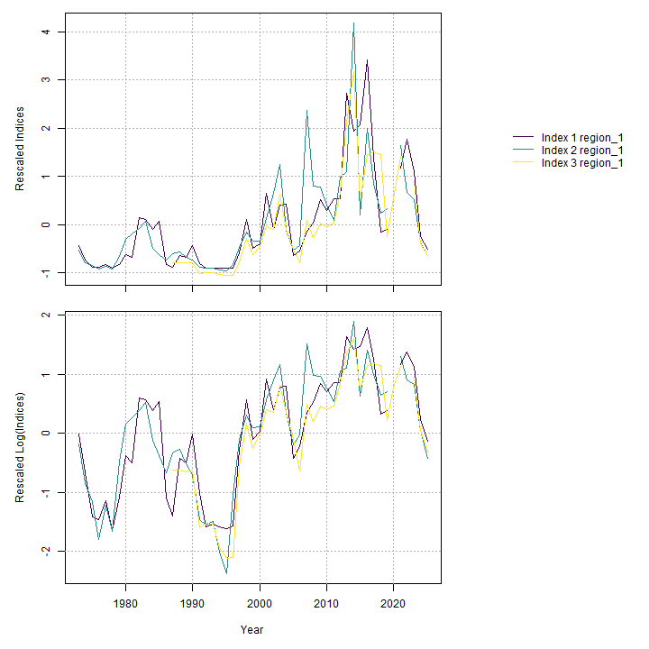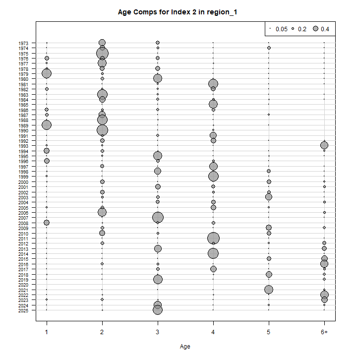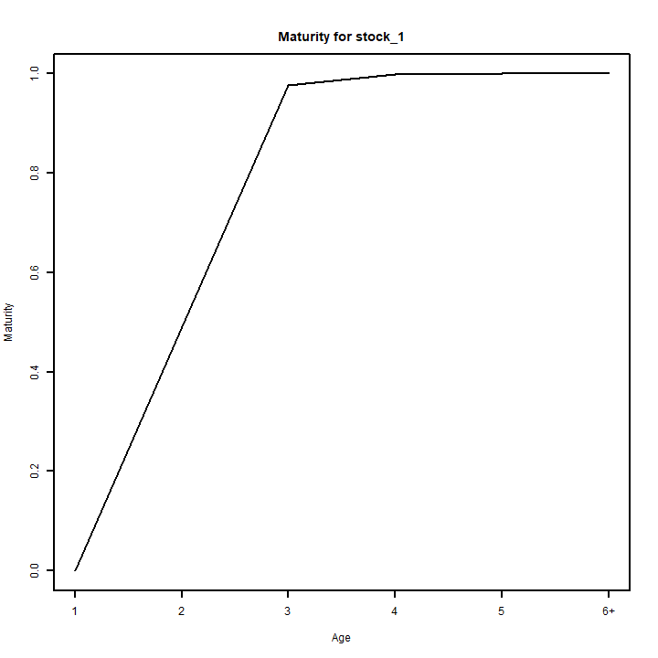

### Diagnostics

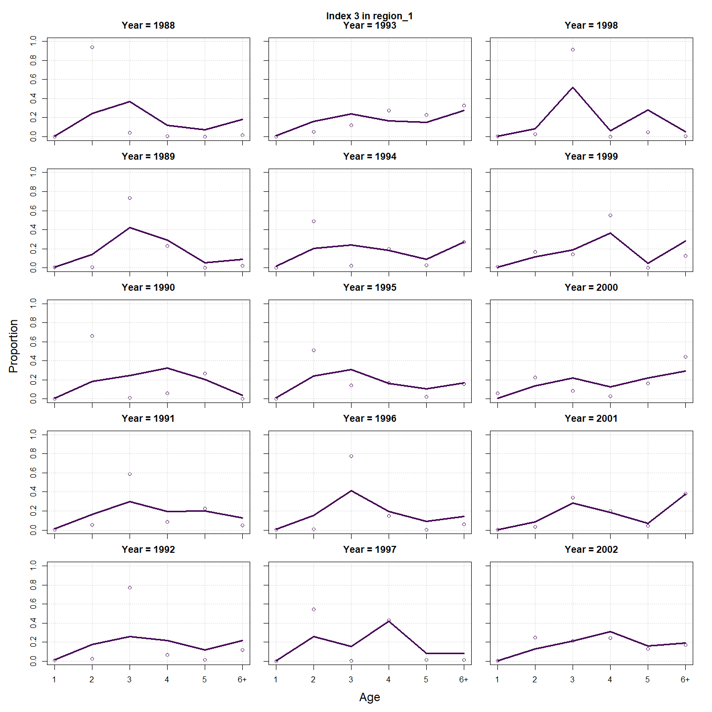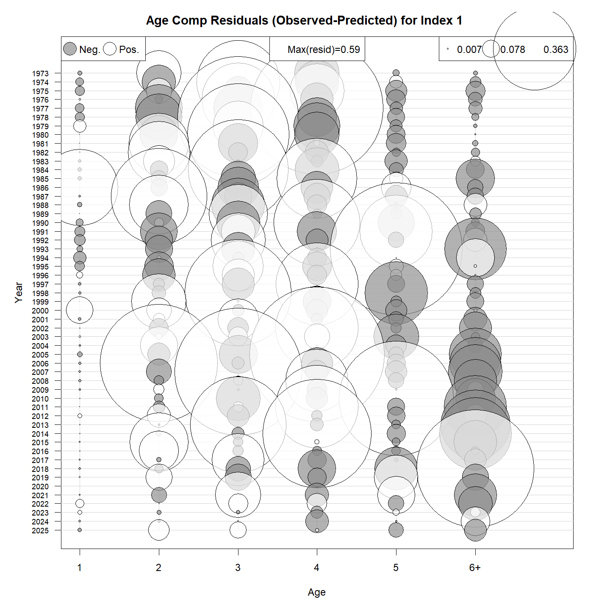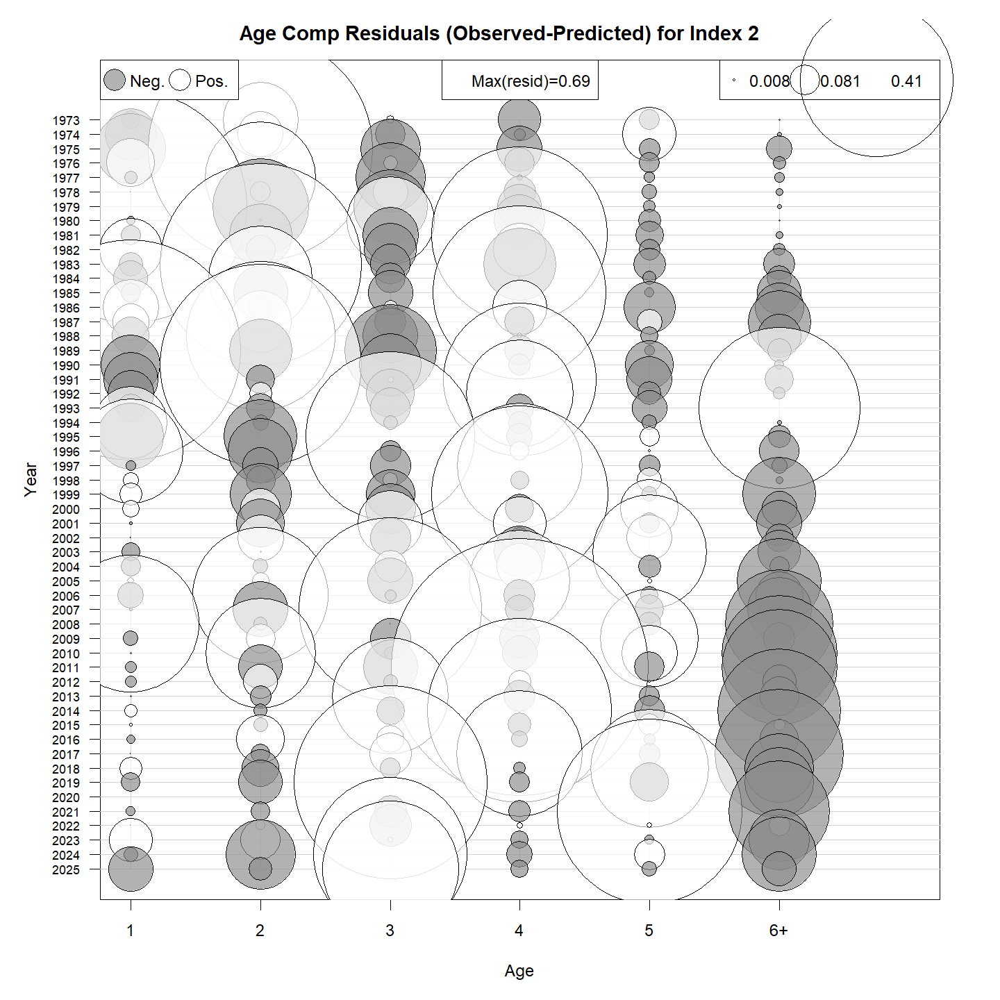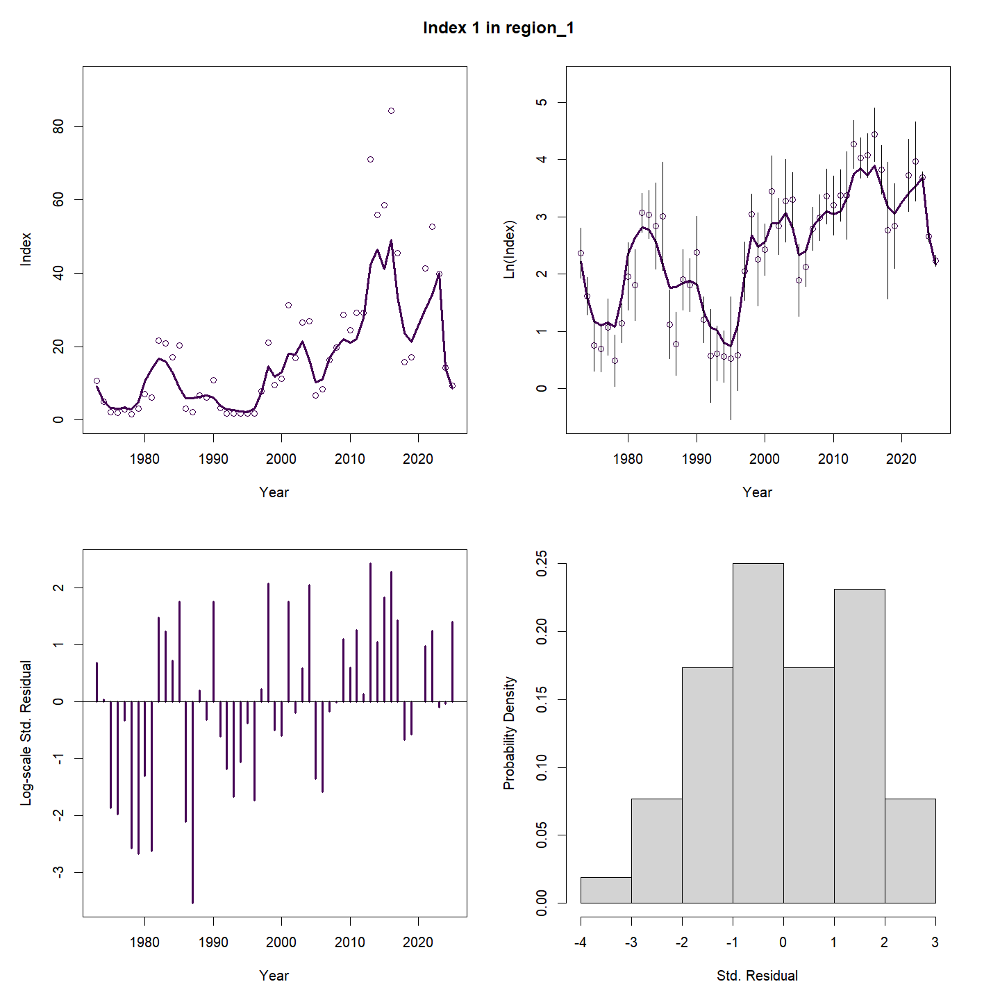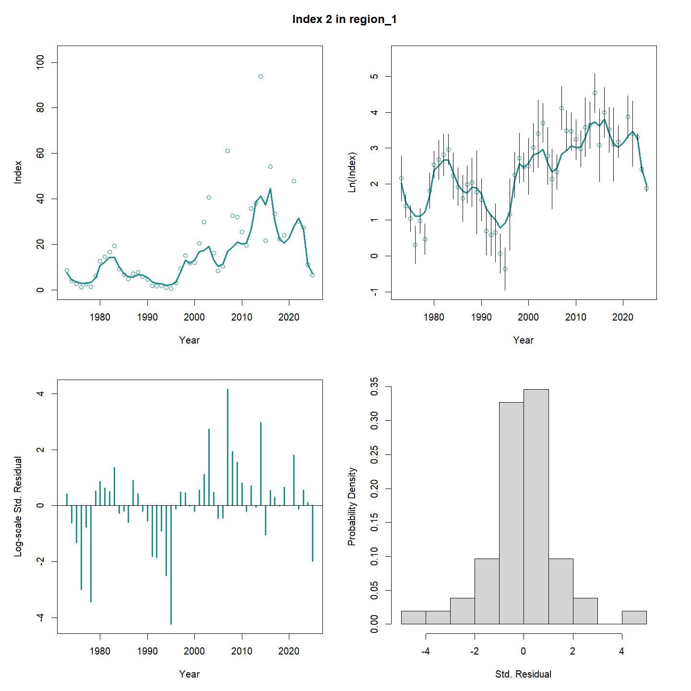

### Results

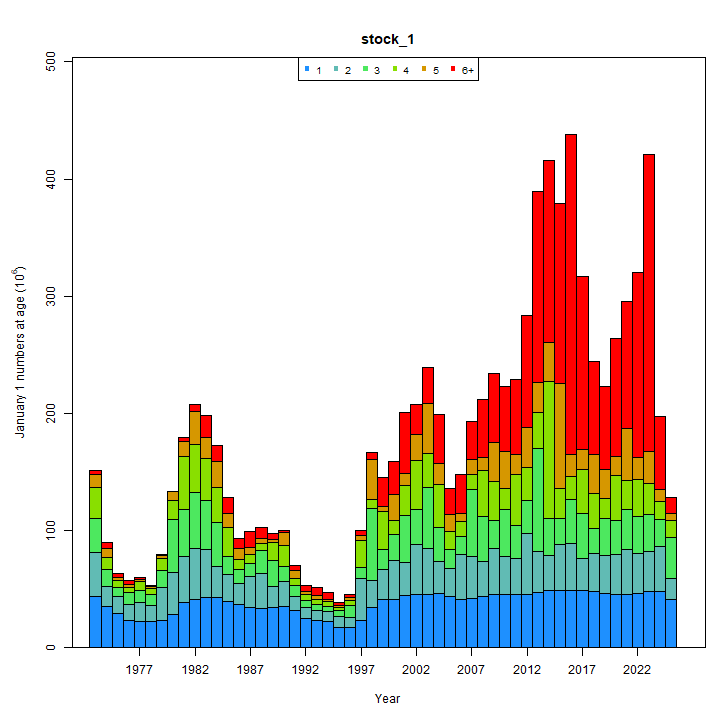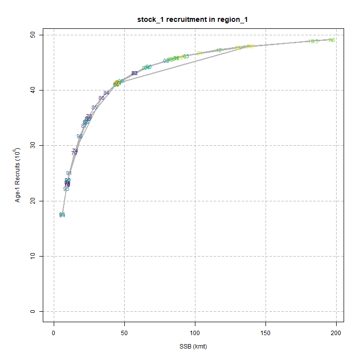

### Retro

### Reference points

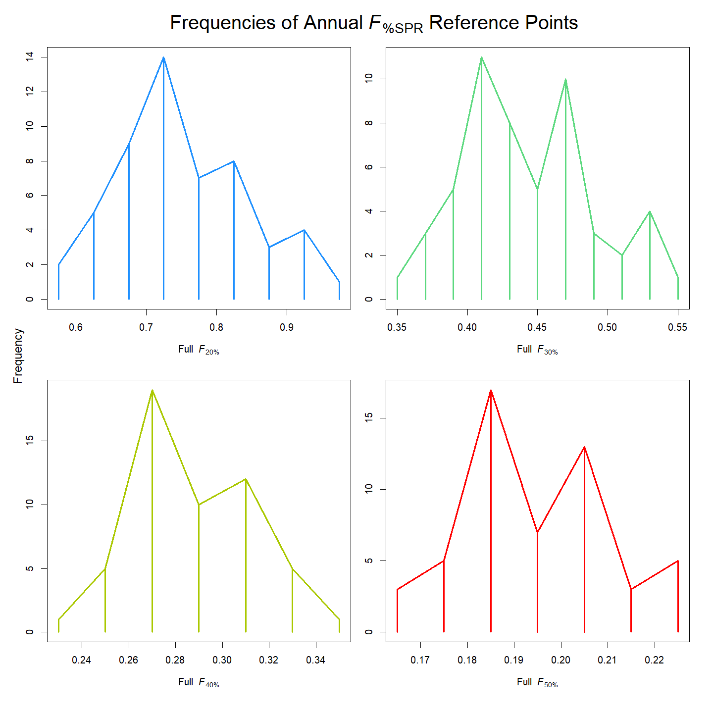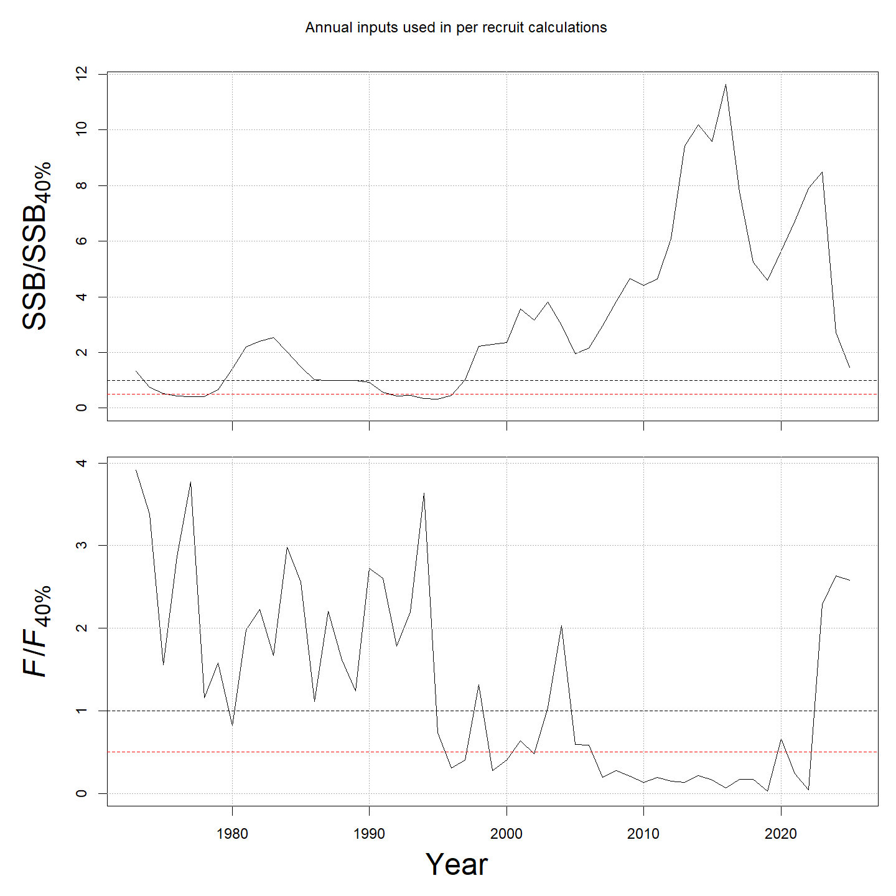

### Miscellaneous

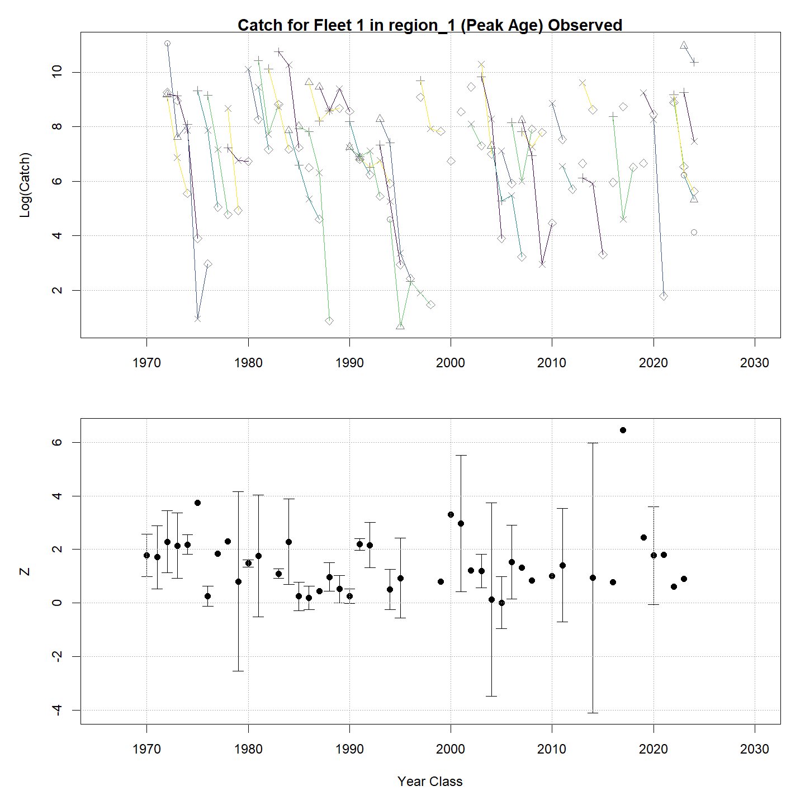

## Tables {.tabset}

### Parameter estimates

<table class="table" style="color: black; margin-left: auto; margin-right: auto;">
<caption>Parameter estimates, standard errors, and confidence intervals. Rounded to 3 decimal places.</caption>
 <thead>
  <tr>
   <th style="text-align:left;">   </th>
   <th style="text-align:right;"> Estimate </th>
   <th style="text-align:right;"> Std. Error </th>
   <th style="text-align:right;"> 95\% CI lower </th>
   <th style="text-align:right;"> 95\% CI upper </th>
  </tr>
 </thead>
<tbody>
  <tr>
   <td style="text-align:left;"> stock 1 B-H a </td>
   <td style="text-align:right;"> $4.394$ </td>
   <td style="text-align:right;"> $1.143$ </td>
   <td style="text-align:right;"> $2.639$ </td>
   <td style="text-align:right;"> $7.316$ </td>
  </tr>
  <tr>
   <td style="text-align:left;"> stock 1 B-H b </td>
   <td style="text-align:right;"> $5.800\times 10^{-5}$ </td>
   <td style="text-align:right;"> $3.372\times 10^{-5}$ </td>
   <td style="text-align:right;"> $1.856\times 10^{-5}$ </td>
   <td style="text-align:right;"> $1.812\times 10^{-4}$ </td>
  </tr>
  <tr>
   <td style="text-align:left;"> stock 1 NAA $\sigma$ (age 1) </td>
   <td style="text-align:right;"> $0.767$ </td>
   <td style="text-align:right;"> $0.101$ </td>
   <td style="text-align:right;"> $0.593$ </td>
   <td style="text-align:right;"> $0.992$ </td>
  </tr>
  <tr>
   <td style="text-align:left;"> stock 1 NAA $\sigma$ (ages 2-6+) </td>
   <td style="text-align:right;"> $0.736$ </td>
   <td style="text-align:right;"> $0.043$ </td>
   <td style="text-align:right;"> $0.655$ </td>
   <td style="text-align:right;"> $0.826$ </td>
  </tr>
  <tr>
   <td style="text-align:left;"> Index 1 fully selected q </td>
   <td style="text-align:right;"> $2.134\times 10^{-4}$ </td>
   <td style="text-align:right;"> $2.535\times 10^{-5}$ </td>
   <td style="text-align:right;"> $1.691\times 10^{-4}$ </td>
   <td style="text-align:right;"> $2.694\times 10^{-4}$ </td>
  </tr>
  <tr>
   <td style="text-align:left;"> Index 2 fully selected q </td>
   <td style="text-align:right;"> $2.267\times 10^{-4}$ </td>
   <td style="text-align:right;"> $3.177\times 10^{-5}$ </td>
   <td style="text-align:right;"> $1.722\times 10^{-4}$ </td>
   <td style="text-align:right;"> $2.983\times 10^{-4}$ </td>
  </tr>
  <tr>
   <td style="text-align:left;"> Index 3 fully selected q </td>
   <td style="text-align:right;"> $2.727\times 10^{-4}$ </td>
   <td style="text-align:right;"> $3.274\times 10^{-5}$ </td>
   <td style="text-align:right;"> $2.155\times 10^{-4}$ </td>
   <td style="text-align:right;"> $3.450\times 10^{-4}$ </td>
  </tr>
  <tr>
   <td style="text-align:left;"> Fleet 1 Mean Selectivity for age 1 (Block 1) </td>
   <td style="text-align:right;"> $0.016$ </td>
   <td style="text-align:right;"> $0.006$ </td>
   <td style="text-align:right;"> $0.008$ </td>
   <td style="text-align:right;"> $0.032$ </td>
  </tr>
  <tr>
   <td style="text-align:left;"> Fleet 1 Mean Selectivity for age 2 (Block 1) </td>
   <td style="text-align:right;"> $0.242$ </td>
   <td style="text-align:right;"> $0.065$ </td>
   <td style="text-align:right;"> $0.137$ </td>
   <td style="text-align:right;"> $0.391$ </td>
  </tr>
  <tr>
   <td style="text-align:left;"> Fleet 1 Mean Selectivity for age 3 (Block 1) </td>
   <td style="text-align:right;"> $0.743$ </td>
   <td style="text-align:right;"> $0.079$ </td>
   <td style="text-align:right;"> $0.562$ </td>
   <td style="text-align:right;"> $0.867$ </td>
  </tr>
  <tr>
   <td style="text-align:left;"> Fleet 1 Mean Selectivity for age 4 (Block 1) </td>
   <td style="text-align:right;"> $1.000$ </td>
   <td style="text-align:right;"> -- </td>
   <td style="text-align:right;"> -- </td>
   <td style="text-align:right;"> -- </td>
  </tr>
  <tr>
   <td style="text-align:left;"> Fleet 1 Mean Selectivity for age 5 (Block 1) </td>
   <td style="text-align:right;"> $1.000$ </td>
   <td style="text-align:right;"> -- </td>
   <td style="text-align:right;"> -- </td>
   <td style="text-align:right;"> -- </td>
  </tr>
  <tr>
   <td style="text-align:left;"> Fleet 1 Mean Selectivity for age 6+ (Block 1) </td>
   <td style="text-align:right;"> $1.000$ </td>
   <td style="text-align:right;"> -- </td>
   <td style="text-align:right;"> -- </td>
   <td style="text-align:right;"> -- </td>
  </tr>
  <tr>
   <td style="text-align:left;"> Index 1 $a_{50}$ (Block 2) </td>
   <td style="text-align:right;"> $2.319$ </td>
   <td style="text-align:right;"> $0.109$ </td>
   <td style="text-align:right;"> $2.109$ </td>
   <td style="text-align:right;"> $2.536$ </td>
  </tr>
  <tr>
   <td style="text-align:left;"> Index 1 1/slope (increasing) (Block 2) </td>
   <td style="text-align:right;"> $0.327$ </td>
   <td style="text-align:right;"> $0.031$ </td>
   <td style="text-align:right;"> $0.271$ </td>
   <td style="text-align:right;"> $0.395$ </td>
  </tr>
  <tr>
   <td style="text-align:left;"> Index 2 $a_{50}$ (Block 3) </td>
   <td style="text-align:right;"> $1.635$ </td>
   <td style="text-align:right;"> $0.181$ </td>
   <td style="text-align:right;"> $1.305$ </td>
   <td style="text-align:right;"> $2.013$ </td>
  </tr>
  <tr>
   <td style="text-align:left;"> Index 2 1/slope (increasing) (Block 3) </td>
   <td style="text-align:right;"> $0.480$ </td>
   <td style="text-align:right;"> $0.098$ </td>
   <td style="text-align:right;"> $0.320$ </td>
   <td style="text-align:right;"> $0.711$ </td>
  </tr>
  <tr>
   <td style="text-align:left;"> Index 3 $a_{50}$ (Block 4) </td>
   <td style="text-align:right;"> $2.152$ </td>
   <td style="text-align:right;"> $0.082$ </td>
   <td style="text-align:right;"> $1.993$ </td>
   <td style="text-align:right;"> $2.316$ </td>
  </tr>
  <tr>
   <td style="text-align:left;"> Index 3 1/slope (increasing) (Block 4) </td>
   <td style="text-align:right;"> $0.217$ </td>
   <td style="text-align:right;"> $0.018$ </td>
   <td style="text-align:right;"> $0.185$ </td>
   <td style="text-align:right;"> $0.254$ </td>
  </tr>
  <tr>
   <td style="text-align:left;"> Fleet 1 Selectivity RE $\sigma$ (Block 1) </td>
   <td style="text-align:right;"> $1.058$ </td>
   <td style="text-align:right;"> $0.168$ </td>
   <td style="text-align:right;"> $0.775$ </td>
   <td style="text-align:right;"> $1.444$ </td>
  </tr>
  <tr>
   <td style="text-align:left;"> Fleet 1 Selectivity RE AR1 $\rho$ (year) (Block 1) </td>
   <td style="text-align:right;"> $0.508$ </td>
   <td style="text-align:right;"> $0.160$ </td>
   <td style="text-align:right;"> $0.137$ </td>
   <td style="text-align:right;"> $0.754$ </td>
  </tr>
  <tr>
   <td style="text-align:left;"> Fleet 1 age comp, logistic-normal: $\sigma$ </td>
   <td style="text-align:right;"> $3.308$ </td>
   <td style="text-align:right;"> $0.355$ </td>
   <td style="text-align:right;"> $2.681$ </td>
   <td style="text-align:right;"> $4.082$ </td>
  </tr>
  <tr>
   <td style="text-align:left;"> Index 1 age comp, logistic-normal: $\sigma$ </td>
   <td style="text-align:right;"> $4.702$ </td>
   <td style="text-align:right;"> $0.281$ </td>
   <td style="text-align:right;"> $4.183$ </td>
   <td style="text-align:right;"> $5.286$ </td>
  </tr>
  <tr>
   <td style="text-align:left;"> Index 2 age comp, logistic-normal: $\sigma$ </td>
   <td style="text-align:right;"> $5.238$ </td>
   <td style="text-align:right;"> $0.323$ </td>
   <td style="text-align:right;"> $4.642$ </td>
   <td style="text-align:right;"> $5.911$ </td>
  </tr>
  <tr>
   <td style="text-align:left;"> Index 3 age comp, logistic-normal: $\sigma$ </td>
   <td style="text-align:right;"> $5.498$ </td>
   <td style="text-align:right;"> $0.356$ </td>
   <td style="text-align:right;"> $4.843$ </td>
   <td style="text-align:right;"> $6.241$ </td>
  </tr>
</tbody>
</table>

### Abundance at age

<table class="table" style="color: black; margin-left: auto; margin-right: auto;">
<caption>Abundance at age (1000s) for stock 1 in region 1.</caption>
 <thead>
  <tr>
   <th style="text-align:left;">   </th>
   <th style="text-align:right;"> 1 </th>
   <th style="text-align:right;"> 2 </th>
   <th style="text-align:right;"> 3 </th>
   <th style="text-align:right;"> 4 </th>
   <th style="text-align:right;"> 5 </th>
   <th style="text-align:right;"> 6+ </th>
  </tr>
 </thead>
<tbody>
  <tr>
   <td style="text-align:left;"> 1973 </td>
   <td style="text-align:right;"> 90369 </td>
   <td style="text-align:right;"> 50797 </td>
   <td style="text-align:right;"> 32951 </td>
   <td style="text-align:right;"> 15892 </td>
   <td style="text-align:right;"> 5445 </td>
   <td style="text-align:right;"> 2882 </td>
  </tr>
  <tr>
   <td style="text-align:left;"> 1974 </td>
   <td style="text-align:right;"> 116855 </td>
   <td style="text-align:right;"> 41007 </td>
   <td style="text-align:right;"> 17466 </td>
   <td style="text-align:right;"> 12390 </td>
   <td style="text-align:right;"> 4737 </td>
   <td style="text-align:right;"> 2669 </td>
  </tr>
  <tr>
   <td style="text-align:left;"> 1975 </td>
   <td style="text-align:right;"> 106412 </td>
   <td style="text-align:right;"> 58553 </td>
   <td style="text-align:right;"> 12520 </td>
   <td style="text-align:right;"> 5308 </td>
   <td style="text-align:right;"> 3408 </td>
   <td style="text-align:right;"> 1449 </td>
  </tr>
  <tr>
   <td style="text-align:left;"> 1976 </td>
   <td style="text-align:right;"> 28840 </td>
   <td style="text-align:right;"> 53903 </td>
   <td style="text-align:right;"> 14478 </td>
   <td style="text-align:right;"> 2684 </td>
   <td style="text-align:right;"> 1148 </td>
   <td style="text-align:right;"> 1420 </td>
  </tr>
  <tr>
   <td style="text-align:left;"> 1977 </td>
   <td style="text-align:right;"> 18410 </td>
   <td style="text-align:right;"> 28191 </td>
   <td style="text-align:right;"> 16833 </td>
   <td style="text-align:right;"> 3610 </td>
   <td style="text-align:right;"> 668 </td>
   <td style="text-align:right;"> 645 </td>
  </tr>
  <tr>
   <td style="text-align:left;"> 1978 </td>
   <td style="text-align:right;"> 157250 </td>
   <td style="text-align:right;"> 12648 </td>
   <td style="text-align:right;"> 8850 </td>
   <td style="text-align:right;"> 3514 </td>
   <td style="text-align:right;"> 881 </td>
   <td style="text-align:right;"> 271 </td>
  </tr>
  <tr>
   <td style="text-align:left;"> 1979 </td>
   <td style="text-align:right;"> 26202 </td>
   <td style="text-align:right;"> 39732 </td>
   <td style="text-align:right;"> 6031 </td>
   <td style="text-align:right;"> 2374 </td>
   <td style="text-align:right;"> 916 </td>
   <td style="text-align:right;"> 632 </td>
  </tr>
  <tr>
   <td style="text-align:left;"> 1980 </td>
   <td style="text-align:right;"> 26053 </td>
   <td style="text-align:right;"> 35971 </td>
   <td style="text-align:right;"> 40979 </td>
   <td style="text-align:right;"> 3370 </td>
   <td style="text-align:right;"> 753 </td>
   <td style="text-align:right;"> 363 </td>
  </tr>
  <tr>
   <td style="text-align:left;"> 1981 </td>
   <td style="text-align:right;"> 29536 </td>
   <td style="text-align:right;"> 16447 </td>
   <td style="text-align:right;"> 15794 </td>
   <td style="text-align:right;"> 8956 </td>
   <td style="text-align:right;"> 1479 </td>
   <td style="text-align:right;"> 406 </td>
  </tr>
  <tr>
   <td style="text-align:left;"> 1982 </td>
   <td style="text-align:right;"> 40720 </td>
   <td style="text-align:right;"> 46653 </td>
   <td style="text-align:right;"> 15258 </td>
   <td style="text-align:right;"> 6476 </td>
   <td style="text-align:right;"> 1715 </td>
   <td style="text-align:right;"> 237 </td>
  </tr>
  <tr>
   <td style="text-align:left;"> 1983 </td>
   <td style="text-align:right;"> 13537 </td>
   <td style="text-align:right;"> 24116 </td>
   <td style="text-align:right;"> 25136 </td>
   <td style="text-align:right;"> 5311 </td>
   <td style="text-align:right;"> 1321 </td>
   <td style="text-align:right;"> 484 </td>
  </tr>
  <tr>
   <td style="text-align:left;"> 1984 </td>
   <td style="text-align:right;"> 17379 </td>
   <td style="text-align:right;"> 5002 </td>
   <td style="text-align:right;"> 7221 </td>
   <td style="text-align:right;"> 6509 </td>
   <td style="text-align:right;"> 2049 </td>
   <td style="text-align:right;"> 695 </td>
  </tr>
  <tr>
   <td style="text-align:left;"> 1985 </td>
   <td style="text-align:right;"> 28487 </td>
   <td style="text-align:right;"> 13286 </td>
   <td style="text-align:right;"> 2182 </td>
   <td style="text-align:right;"> 1486 </td>
   <td style="text-align:right;"> 851 </td>
   <td style="text-align:right;"> 156 </td>
  </tr>
  <tr>
   <td style="text-align:left;"> 1986 </td>
   <td style="text-align:right;"> 9096 </td>
   <td style="text-align:right;"> 18735 </td>
   <td style="text-align:right;"> 3624 </td>
   <td style="text-align:right;"> 741 </td>
   <td style="text-align:right;"> 473 </td>
   <td style="text-align:right;"> 271 </td>
  </tr>
  <tr>
   <td style="text-align:left;"> 1987 </td>
   <td style="text-align:right;"> 7404 </td>
   <td style="text-align:right;"> 6046 </td>
   <td style="text-align:right;"> 4351 </td>
   <td style="text-align:right;"> 1388 </td>
   <td style="text-align:right;"> 387 </td>
   <td style="text-align:right;"> 254 </td>
  </tr>
  <tr>
   <td style="text-align:left;"> 1988 </td>
   <td style="text-align:right;"> 7590 </td>
   <td style="text-align:right;"> 6008 </td>
   <td style="text-align:right;"> 3271 </td>
   <td style="text-align:right;"> 1143 </td>
   <td style="text-align:right;"> 353 </td>
   <td style="text-align:right;"> 78 </td>
  </tr>
  <tr>
   <td style="text-align:left;"> 1989 </td>
   <td style="text-align:right;"> 10163 </td>
   <td style="text-align:right;"> 8561 </td>
   <td style="text-align:right;"> 2813 </td>
   <td style="text-align:right;"> 872 </td>
   <td style="text-align:right;"> 229 </td>
   <td style="text-align:right;"> 78 </td>
  </tr>
  <tr>
   <td style="text-align:left;"> 1990 </td>
   <td style="text-align:right;"> 7308 </td>
   <td style="text-align:right;"> 6548 </td>
   <td style="text-align:right;"> 10693 </td>
   <td style="text-align:right;"> 2084 </td>
   <td style="text-align:right;"> 369 </td>
   <td style="text-align:right;"> 69 </td>
  </tr>
  <tr>
   <td style="text-align:left;"> 1991 </td>
   <td style="text-align:right;"> 55342 </td>
   <td style="text-align:right;"> 2924 </td>
   <td style="text-align:right;"> 3737 </td>
   <td style="text-align:right;"> 4759 </td>
   <td style="text-align:right;"> 666 </td>
   <td style="text-align:right;"> 106 </td>
  </tr>
  <tr>
   <td style="text-align:left;"> 1992 </td>
   <td style="text-align:right;"> 13492 </td>
   <td style="text-align:right;"> 21288 </td>
   <td style="text-align:right;"> 6824 </td>
   <td style="text-align:right;"> 2169 </td>
   <td style="text-align:right;"> 930 </td>
   <td style="text-align:right;"> 84 </td>
  </tr>
  <tr>
   <td style="text-align:left;"> 1993 </td>
   <td style="text-align:right;"> 35921 </td>
   <td style="text-align:right;"> 7196 </td>
   <td style="text-align:right;"> 8466 </td>
   <td style="text-align:right;"> 4305 </td>
   <td style="text-align:right;"> 491 </td>
   <td style="text-align:right;"> 166 </td>
  </tr>
  <tr>
   <td style="text-align:left;"> 1994 </td>
   <td style="text-align:right;"> 9201 </td>
   <td style="text-align:right;"> 9249 </td>
   <td style="text-align:right;"> 9282 </td>
   <td style="text-align:right;"> 4283 </td>
   <td style="text-align:right;"> 1079 </td>
   <td style="text-align:right;"> 399 </td>
  </tr>
  <tr>
   <td style="text-align:left;"> 1995 </td>
   <td style="text-align:right;"> 12334 </td>
   <td style="text-align:right;"> 7647 </td>
   <td style="text-align:right;"> 6930 </td>
   <td style="text-align:right;"> 2931 </td>
   <td style="text-align:right;"> 606 </td>
   <td style="text-align:right;"> 109 </td>
  </tr>
  <tr>
   <td style="text-align:left;"> 1996 </td>
   <td style="text-align:right;"> 28560 </td>
   <td style="text-align:right;"> 14579 </td>
   <td style="text-align:right;"> 17301 </td>
   <td style="text-align:right;"> 6224 </td>
   <td style="text-align:right;"> 1383 </td>
   <td style="text-align:right;"> 200 </td>
  </tr>
  <tr>
   <td style="text-align:left;"> 1997 </td>
   <td style="text-align:right;"> 21781 </td>
   <td style="text-align:right;"> 22061 </td>
   <td style="text-align:right;"> 23806 </td>
   <td style="text-align:right;"> 19602 </td>
   <td style="text-align:right;"> 2942 </td>
   <td style="text-align:right;"> 765 </td>
  </tr>
  <tr>
   <td style="text-align:left;"> 1998 </td>
   <td style="text-align:right;"> 61113 </td>
   <td style="text-align:right;"> 24981 </td>
   <td style="text-align:right;"> 13537 </td>
   <td style="text-align:right;"> 8876 </td>
   <td style="text-align:right;"> 5615 </td>
   <td style="text-align:right;"> 616 </td>
  </tr>
  <tr>
   <td style="text-align:left;"> 1999 </td>
   <td style="text-align:right;"> 55805 </td>
   <td style="text-align:right;"> 59154 </td>
   <td style="text-align:right;"> 48434 </td>
   <td style="text-align:right;"> 10633 </td>
   <td style="text-align:right;"> 6746 </td>
   <td style="text-align:right;"> 2689 </td>
  </tr>
  <tr>
   <td style="text-align:left;"> 2000 </td>
   <td style="text-align:right;"> 35917 </td>
   <td style="text-align:right;"> 52342 </td>
   <td style="text-align:right;"> 46816 </td>
   <td style="text-align:right;"> 23568 </td>
   <td style="text-align:right;"> 6256 </td>
   <td style="text-align:right;"> 3955 </td>
  </tr>
  <tr>
   <td style="text-align:left;"> 2001 </td>
   <td style="text-align:right;"> 47602 </td>
   <td style="text-align:right;"> 52070 </td>
   <td style="text-align:right;"> 48690 </td>
   <td style="text-align:right;"> 21310 </td>
   <td style="text-align:right;"> 7392 </td>
   <td style="text-align:right;"> 3321 </td>
  </tr>
  <tr>
   <td style="text-align:left;"> 2002 </td>
   <td style="text-align:right;"> 66901 </td>
   <td style="text-align:right;"> 61981 </td>
   <td style="text-align:right;"> 44261 </td>
   <td style="text-align:right;"> 18686 </td>
   <td style="text-align:right;"> 7437 </td>
   <td style="text-align:right;"> 3407 </td>
  </tr>
  <tr>
   <td style="text-align:left;"> 2003 </td>
   <td style="text-align:right;"> 58794 </td>
   <td style="text-align:right;"> 46469 </td>
   <td style="text-align:right;"> 29733 </td>
   <td style="text-align:right;"> 12226 </td>
   <td style="text-align:right;"> 4059 </td>
   <td style="text-align:right;"> 3685 </td>
  </tr>
  <tr>
   <td style="text-align:left;"> 2004 </td>
   <td style="text-align:right;"> 35480 </td>
   <td style="text-align:right;"> 35265 </td>
   <td style="text-align:right;"> 16785 </td>
   <td style="text-align:right;"> 7934 </td>
   <td style="text-align:right;"> 3567 </td>
   <td style="text-align:right;"> 2396 </td>
  </tr>
  <tr>
   <td style="text-align:left;"> 2005 </td>
   <td style="text-align:right;"> 46417 </td>
   <td style="text-align:right;"> 28941 </td>
   <td style="text-align:right;"> 27288 </td>
   <td style="text-align:right;"> 7680 </td>
   <td style="text-align:right;"> 1754 </td>
   <td style="text-align:right;"> 765 </td>
  </tr>
  <tr>
   <td style="text-align:left;"> 2006 </td>
   <td style="text-align:right;"> 132237 </td>
   <td style="text-align:right;"> 52250 </td>
   <td style="text-align:right;"> 18233 </td>
   <td style="text-align:right;"> 5750 </td>
   <td style="text-align:right;"> 1590 </td>
   <td style="text-align:right;"> 604 </td>
  </tr>
  <tr>
   <td style="text-align:left;"> 2007 </td>
   <td style="text-align:right;"> 65033 </td>
   <td style="text-align:right;"> 90105 </td>
   <td style="text-align:right;"> 35233 </td>
   <td style="text-align:right;"> 8836 </td>
   <td style="text-align:right;"> 1621 </td>
   <td style="text-align:right;"> 523 </td>
  </tr>
  <tr>
   <td style="text-align:left;"> 2008 </td>
   <td style="text-align:right;"> 24343 </td>
   <td style="text-align:right;"> 65253 </td>
   <td style="text-align:right;"> 42746 </td>
   <td style="text-align:right;"> 12233 </td>
   <td style="text-align:right;"> 2556 </td>
   <td style="text-align:right;"> 199 </td>
  </tr>
  <tr>
   <td style="text-align:left;"> 2009 </td>
   <td style="text-align:right;"> 42336 </td>
   <td style="text-align:right;"> 26057 </td>
   <td style="text-align:right;"> 46224 </td>
   <td style="text-align:right;"> 22400 </td>
   <td style="text-align:right;"> 7206 </td>
   <td style="text-align:right;"> 1504 </td>
  </tr>
  <tr>
   <td style="text-align:left;"> 2010 </td>
   <td style="text-align:right;"> 25111 </td>
   <td style="text-align:right;"> 20299 </td>
   <td style="text-align:right;"> 23819 </td>
   <td style="text-align:right;"> 20583 </td>
   <td style="text-align:right;"> 6128 </td>
   <td style="text-align:right;"> 2716 </td>
  </tr>
  <tr>
   <td style="text-align:left;"> 2011 </td>
   <td style="text-align:right;"> 25814 </td>
   <td style="text-align:right;"> 17347 </td>
   <td style="text-align:right;"> 18143 </td>
   <td style="text-align:right;"> 12275 </td>
   <td style="text-align:right;"> 4053 </td>
   <td style="text-align:right;"> 738 </td>
  </tr>
  <tr>
   <td style="text-align:left;"> 2012 </td>
   <td style="text-align:right;"> 25714 </td>
   <td style="text-align:right;"> 12675 </td>
   <td style="text-align:right;"> 13404 </td>
   <td style="text-align:right;"> 11687 </td>
   <td style="text-align:right;"> 4237 </td>
   <td style="text-align:right;"> 660 </td>
  </tr>
  <tr>
   <td style="text-align:left;"> 2013 </td>
   <td style="text-align:right;"> 31020 </td>
   <td style="text-align:right;"> 5949 </td>
   <td style="text-align:right;"> 4152 </td>
   <td style="text-align:right;"> 3888 </td>
   <td style="text-align:right;"> 2292 </td>
   <td style="text-align:right;"> 646 </td>
  </tr>
  <tr>
   <td style="text-align:left;"> 2014 </td>
   <td style="text-align:right;"> 14003 </td>
   <td style="text-align:right;"> 7497 </td>
   <td style="text-align:right;"> 3444 </td>
   <td style="text-align:right;"> 2286 </td>
   <td style="text-align:right;"> 1235 </td>
   <td style="text-align:right;"> 497 </td>
  </tr>
  <tr>
   <td style="text-align:left;"> 2015 </td>
   <td style="text-align:right;"> 6030 </td>
   <td style="text-align:right;"> 4602 </td>
   <td style="text-align:right;"> 3206 </td>
   <td style="text-align:right;"> 1569 </td>
   <td style="text-align:right;"> 1104 </td>
   <td style="text-align:right;"> 380 </td>
  </tr>
  <tr>
   <td style="text-align:left;"> 2016 </td>
   <td style="text-align:right;"> 3329 </td>
   <td style="text-align:right;"> 1209 </td>
   <td style="text-align:right;"> 2110 </td>
   <td style="text-align:right;"> 1484 </td>
   <td style="text-align:right;"> 767 </td>
   <td style="text-align:right;"> 576 </td>
  </tr>
  <tr>
   <td style="text-align:left;"> 2017 </td>
   <td style="text-align:right;"> 3027 </td>
   <td style="text-align:right;"> 734 </td>
   <td style="text-align:right;"> 528 </td>
   <td style="text-align:right;"> 748 </td>
   <td style="text-align:right;"> 673 </td>
   <td style="text-align:right;"> 801 </td>
  </tr>
  <tr>
   <td style="text-align:left;"> 2018 </td>
   <td style="text-align:right;"> 4239 </td>
   <td style="text-align:right;"> 676 </td>
   <td style="text-align:right;"> 345 </td>
   <td style="text-align:right;"> 147 </td>
   <td style="text-align:right;"> 314 </td>
   <td style="text-align:right;"> 814 </td>
  </tr>
  <tr>
   <td style="text-align:left;"> 2019 </td>
   <td style="text-align:right;"> 14395 </td>
   <td style="text-align:right;"> 818 </td>
   <td style="text-align:right;"> 219 </td>
   <td style="text-align:right;"> 140 </td>
   <td style="text-align:right;"> 72 </td>
   <td style="text-align:right;"> 717 </td>
  </tr>
  <tr>
   <td style="text-align:left;"> 2020 </td>
   <td style="text-align:right;"> 2819 </td>
   <td style="text-align:right;"> 1016 </td>
   <td style="text-align:right;"> 681 </td>
   <td style="text-align:right;"> 252 </td>
   <td style="text-align:right;"> 61 </td>
   <td style="text-align:right;"> 170 </td>
  </tr>
  <tr>
   <td style="text-align:left;"> 2021 </td>
   <td style="text-align:right;"> 691 </td>
   <td style="text-align:right;"> 578 </td>
   <td style="text-align:right;"> 1144 </td>
   <td style="text-align:right;"> 701 </td>
   <td style="text-align:right;"> 164 </td>
   <td style="text-align:right;"> 237 </td>
  </tr>
  <tr>
   <td style="text-align:left;"> 2022 </td>
   <td style="text-align:right;"> 4818 </td>
   <td style="text-align:right;"> 189 </td>
   <td style="text-align:right;"> 219 </td>
   <td style="text-align:right;"> 589 </td>
   <td style="text-align:right;"> 381 </td>
   <td style="text-align:right;"> 298 </td>
  </tr>
</tbody>
</table>

### Fishing mortality at age by region

<table class="table" style="color: black; margin-left: auto; margin-right: auto;">
<caption>Total fishing mortality at age in region 1.</caption>
 <thead>
  <tr>
   <th style="text-align:left;">   </th>
   <th style="text-align:right;"> 1 </th>
   <th style="text-align:right;"> 2 </th>
   <th style="text-align:right;"> 3 </th>
   <th style="text-align:right;"> 4 </th>
   <th style="text-align:right;"> 5 </th>
   <th style="text-align:right;"> 6+ </th>
  </tr>
 </thead>
<tbody>
  <tr>
   <td style="text-align:left;"> 1973 </td>
   <td style="text-align:right;"> 0.008 </td>
   <td style="text-align:right;"> 0.137 </td>
   <td style="text-align:right;"> 0.624 </td>
   <td style="text-align:right;"> 1.119 </td>
   <td style="text-align:right;"> 1.119 </td>
   <td style="text-align:right;"> 1.119 </td>
  </tr>
  <tr>
   <td style="text-align:left;"> 1974 </td>
   <td style="text-align:right;"> 0.029 </td>
   <td style="text-align:right;"> 0.380 </td>
   <td style="text-align:right;"> 0.955 </td>
   <td style="text-align:right;"> 1.175 </td>
   <td style="text-align:right;"> 1.175 </td>
   <td style="text-align:right;"> 1.175 </td>
  </tr>
  <tr>
   <td style="text-align:left;"> 1975 </td>
   <td style="text-align:right;"> 0.054 </td>
   <td style="text-align:right;"> 0.641 </td>
   <td style="text-align:right;"> 1.370 </td>
   <td style="text-align:right;"> 1.594 </td>
   <td style="text-align:right;"> 1.594 </td>
   <td style="text-align:right;"> 1.594 </td>
  </tr>
  <tr>
   <td style="text-align:left;"> 1976 </td>
   <td style="text-align:right;"> 0.056 </td>
   <td style="text-align:right;"> 0.640 </td>
   <td style="text-align:right;"> 1.323 </td>
   <td style="text-align:right;"> 1.525 </td>
   <td style="text-align:right;"> 1.525 </td>
   <td style="text-align:right;"> 1.525 </td>
  </tr>
  <tr>
   <td style="text-align:left;"> 1977 </td>
   <td style="text-align:right;"> 0.032 </td>
   <td style="text-align:right;"> 0.425 </td>
   <td style="text-align:right;"> 1.088 </td>
   <td style="text-align:right;"> 1.349 </td>
   <td style="text-align:right;"> 1.349 </td>
   <td style="text-align:right;"> 1.349 </td>
  </tr>
  <tr>
   <td style="text-align:left;"> 1978 </td>
   <td style="text-align:right;"> 0.052 </td>
   <td style="text-align:right;"> 0.554 </td>
   <td style="text-align:right;"> 1.057 </td>
   <td style="text-align:right;"> 1.191 </td>
   <td style="text-align:right;"> 1.191 </td>
   <td style="text-align:right;"> 1.191 </td>
  </tr>
  <tr>
   <td style="text-align:left;"> 1979 </td>
   <td style="text-align:right;"> 0.030 </td>
   <td style="text-align:right;"> 0.385 </td>
   <td style="text-align:right;"> 0.917 </td>
   <td style="text-align:right;"> 1.107 </td>
   <td style="text-align:right;"> 1.107 </td>
   <td style="text-align:right;"> 1.107 </td>
  </tr>
  <tr>
   <td style="text-align:left;"> 1980 </td>
   <td style="text-align:right;"> 0.012 </td>
   <td style="text-align:right;"> 0.152 </td>
   <td style="text-align:right;"> 0.338 </td>
   <td style="text-align:right;"> 0.399 </td>
   <td style="text-align:right;"> 0.399 </td>
   <td style="text-align:right;"> 0.399 </td>
  </tr>
  <tr>
   <td style="text-align:left;"> 1981 </td>
   <td style="text-align:right;"> 0.009 </td>
   <td style="text-align:right;"> 0.141 </td>
   <td style="text-align:right;"> 0.541 </td>
   <td style="text-align:right;"> 0.836 </td>
   <td style="text-align:right;"> 0.836 </td>
   <td style="text-align:right;"> 0.836 </td>
  </tr>
  <tr>
   <td style="text-align:left;"> 1982 </td>
   <td style="text-align:right;"> 0.074 </td>
   <td style="text-align:right;"> 0.577 </td>
   <td style="text-align:right;"> 0.864 </td>
   <td style="text-align:right;"> 0.921 </td>
   <td style="text-align:right;"> 0.921 </td>
   <td style="text-align:right;"> 0.921 </td>
  </tr>
  <tr>
   <td style="text-align:left;"> 1983 </td>
   <td style="text-align:right;"> 0.114 </td>
   <td style="text-align:right;"> 0.698 </td>
   <td style="text-align:right;"> 0.934 </td>
   <td style="text-align:right;"> 0.975 </td>
   <td style="text-align:right;"> 0.975 </td>
   <td style="text-align:right;"> 0.975 </td>
  </tr>
  <tr>
   <td style="text-align:left;"> 1984 </td>
   <td style="text-align:right;"> 0.065 </td>
   <td style="text-align:right;"> 0.717 </td>
   <td style="text-align:right;"> 1.405 </td>
   <td style="text-align:right;"> 1.595 </td>
   <td style="text-align:right;"> 1.595 </td>
   <td style="text-align:right;"> 1.595 </td>
  </tr>
  <tr>
   <td style="text-align:left;"> 1985 </td>
   <td style="text-align:right;"> 0.047 </td>
   <td style="text-align:right;"> 0.476 </td>
   <td style="text-align:right;"> 0.863 </td>
   <td style="text-align:right;"> 0.960 </td>
   <td style="text-align:right;"> 0.960 </td>
   <td style="text-align:right;"> 0.960 </td>
  </tr>
  <tr>
   <td style="text-align:left;"> 1986 </td>
   <td style="text-align:right;"> 0.039 </td>
   <td style="text-align:right;"> 0.413 </td>
   <td style="text-align:right;"> 0.778 </td>
   <td style="text-align:right;"> 0.874 </td>
   <td style="text-align:right;"> 0.874 </td>
   <td style="text-align:right;"> 0.874 </td>
  </tr>
  <tr>
   <td style="text-align:left;"> 1987 </td>
   <td style="text-align:right;"> 0.063 </td>
   <td style="text-align:right;"> 0.704 </td>
   <td style="text-align:right;"> 1.408 </td>
   <td style="text-align:right;"> 1.608 </td>
   <td style="text-align:right;"> 1.608 </td>
   <td style="text-align:right;"> 1.608 </td>
  </tr>
  <tr>
   <td style="text-align:left;"> 1988 </td>
   <td style="text-align:right;"> 0.075 </td>
   <td style="text-align:right;"> 0.686 </td>
   <td style="text-align:right;"> 1.143 </td>
   <td style="text-align:right;"> 1.246 </td>
   <td style="text-align:right;"> 1.246 </td>
   <td style="text-align:right;"> 1.246 </td>
  </tr>
  <tr>
   <td style="text-align:left;"> 1989 </td>
   <td style="text-align:right;"> 0.033 </td>
   <td style="text-align:right;"> 0.346 </td>
   <td style="text-align:right;"> 0.646 </td>
   <td style="text-align:right;"> 0.724 </td>
   <td style="text-align:right;"> 0.724 </td>
   <td style="text-align:right;"> 0.724 </td>
  </tr>
  <tr>
   <td style="text-align:left;"> 1990 </td>
   <td style="text-align:right;"> 0.062 </td>
   <td style="text-align:right;"> 0.580 </td>
   <td style="text-align:right;"> 0.981 </td>
   <td style="text-align:right;"> 1.072 </td>
   <td style="text-align:right;"> 1.072 </td>
   <td style="text-align:right;"> 1.072 </td>
  </tr>
  <tr>
   <td style="text-align:left;"> 1991 </td>
   <td style="text-align:right;"> 0.010 </td>
   <td style="text-align:right;"> 0.159 </td>
   <td style="text-align:right;"> 0.687 </td>
   <td style="text-align:right;"> 1.166 </td>
   <td style="text-align:right;"> 1.166 </td>
   <td style="text-align:right;"> 1.166 </td>
  </tr>
  <tr>
   <td style="text-align:left;"> 1992 </td>
   <td style="text-align:right;"> 0.163 </td>
   <td style="text-align:right;"> 0.741 </td>
   <td style="text-align:right;"> 0.897 </td>
   <td style="text-align:right;"> 0.921 </td>
   <td style="text-align:right;"> 0.921 </td>
   <td style="text-align:right;"> 0.921 </td>
  </tr>
  <tr>
   <td style="text-align:left;"> 1993 </td>
   <td style="text-align:right;"> 0.104 </td>
   <td style="text-align:right;"> 0.665 </td>
   <td style="text-align:right;"> 0.903 </td>
   <td style="text-align:right;"> 0.945 </td>
   <td style="text-align:right;"> 0.945 </td>
   <td style="text-align:right;"> 0.945 </td>
  </tr>
  <tr>
   <td style="text-align:left;"> 1994 </td>
   <td style="text-align:right;"> 0.008 </td>
   <td style="text-align:right;"> 0.147 </td>
   <td style="text-align:right;"> 0.769 </td>
   <td style="text-align:right;"> 1.624 </td>
   <td style="text-align:right;"> 1.624 </td>
   <td style="text-align:right;"> 1.624 </td>
  </tr>
  <tr>
   <td style="text-align:left;"> 1995 </td>
   <td style="text-align:right;"> 0.002 </td>
   <td style="text-align:right;"> 0.039 </td>
   <td style="text-align:right;"> 0.215 </td>
   <td style="text-align:right;"> 0.487 </td>
   <td style="text-align:right;"> 0.487 </td>
   <td style="text-align:right;"> 0.487 </td>
  </tr>
  <tr>
   <td style="text-align:left;"> 1996 </td>
   <td style="text-align:right;"> 0.007 </td>
   <td style="text-align:right;"> 0.076 </td>
   <td style="text-align:right;"> 0.146 </td>
   <td style="text-align:right;"> 0.165 </td>
   <td style="text-align:right;"> 0.165 </td>
   <td style="text-align:right;"> 0.165 </td>
  </tr>
  <tr>
   <td style="text-align:left;"> 1997 </td>
   <td style="text-align:right;"> 0.004 </td>
   <td style="text-align:right;"> 0.049 </td>
   <td style="text-align:right;"> 0.110 </td>
   <td style="text-align:right;"> 0.130 </td>
   <td style="text-align:right;"> 0.130 </td>
   <td style="text-align:right;"> 0.130 </td>
  </tr>
  <tr>
   <td style="text-align:left;"> 1998 </td>
   <td style="text-align:right;"> 0.007 </td>
   <td style="text-align:right;"> 0.100 </td>
   <td style="text-align:right;"> 0.260 </td>
   <td style="text-align:right;"> 0.325 </td>
   <td style="text-align:right;"> 0.325 </td>
   <td style="text-align:right;"> 0.325 </td>
  </tr>
  <tr>
   <td style="text-align:left;"> 1999 </td>
   <td style="text-align:right;"> 0.004 </td>
   <td style="text-align:right;"> 0.053 </td>
   <td style="text-align:right;"> 0.123 </td>
   <td style="text-align:right;"> 0.147 </td>
   <td style="text-align:right;"> 0.147 </td>
   <td style="text-align:right;"> 0.147 </td>
  </tr>
  <tr>
   <td style="text-align:left;"> 2000 </td>
   <td style="text-align:right;"> 0.006 </td>
   <td style="text-align:right;"> 0.070 </td>
   <td style="text-align:right;"> 0.146 </td>
   <td style="text-align:right;"> 0.169 </td>
   <td style="text-align:right;"> 0.169 </td>
   <td style="text-align:right;"> 0.169 </td>
  </tr>
  <tr>
   <td style="text-align:left;"> 2001 </td>
   <td style="text-align:right;"> 0.003 </td>
   <td style="text-align:right;"> 0.049 </td>
   <td style="text-align:right;"> 0.149 </td>
   <td style="text-align:right;"> 0.200 </td>
   <td style="text-align:right;"> 0.200 </td>
   <td style="text-align:right;"> 0.200 </td>
  </tr>
  <tr>
   <td style="text-align:left;"> 2002 </td>
   <td style="text-align:right;"> 0.001 </td>
   <td style="text-align:right;"> 0.023 </td>
   <td style="text-align:right;"> 0.103 </td>
   <td style="text-align:right;"> 0.182 </td>
   <td style="text-align:right;"> 0.182 </td>
   <td style="text-align:right;"> 0.182 </td>
  </tr>
  <tr>
   <td style="text-align:left;"> 2003 </td>
   <td style="text-align:right;"> 0.003 </td>
   <td style="text-align:right;"> 0.047 </td>
   <td style="text-align:right;"> 0.191 </td>
   <td style="text-align:right;"> 0.305 </td>
   <td style="text-align:right;"> 0.305 </td>
   <td style="text-align:right;"> 0.305 </td>
  </tr>
  <tr>
   <td style="text-align:left;"> 2004 </td>
   <td style="text-align:right;"> 0.002 </td>
   <td style="text-align:right;"> 0.036 </td>
   <td style="text-align:right;"> 0.246 </td>
   <td style="text-align:right;"> 0.887 </td>
   <td style="text-align:right;"> 0.887 </td>
   <td style="text-align:right;"> 0.887 </td>
  </tr>
  <tr>
   <td style="text-align:left;"> 2005 </td>
   <td style="text-align:right;"> 0.002 </td>
   <td style="text-align:right;"> 0.042 </td>
   <td style="text-align:right;"> 0.186 </td>
   <td style="text-align:right;"> 0.325 </td>
   <td style="text-align:right;"> 0.325 </td>
   <td style="text-align:right;"> 0.325 </td>
  </tr>
  <tr>
   <td style="text-align:left;"> 2006 </td>
   <td style="text-align:right;"> 0.001 </td>
   <td style="text-align:right;"> 0.012 </td>
   <td style="text-align:right;"> 0.088 </td>
   <td style="text-align:right;"> 0.358 </td>
   <td style="text-align:right;"> 0.358 </td>
   <td style="text-align:right;"> 0.358 </td>
  </tr>
  <tr>
   <td style="text-align:left;"> 2007 </td>
   <td style="text-align:right;"> 0.001 </td>
   <td style="text-align:right;"> 0.014 </td>
   <td style="text-align:right;"> 0.063 </td>
   <td style="text-align:right;"> 0.116 </td>
   <td style="text-align:right;"> 0.116 </td>
   <td style="text-align:right;"> 0.116 </td>
  </tr>
  <tr>
   <td style="text-align:left;"> 2008 </td>
   <td style="text-align:right;"> 0.000 </td>
   <td style="text-align:right;"> 0.007 </td>
   <td style="text-align:right;"> 0.042 </td>
   <td style="text-align:right;"> 0.100 </td>
   <td style="text-align:right;"> 0.100 </td>
   <td style="text-align:right;"> 0.100 </td>
  </tr>
  <tr>
   <td style="text-align:left;"> 2009 </td>
   <td style="text-align:right;"> 0.001 </td>
   <td style="text-align:right;"> 0.011 </td>
   <td style="text-align:right;"> 0.041 </td>
   <td style="text-align:right;"> 0.062 </td>
   <td style="text-align:right;"> 0.062 </td>
   <td style="text-align:right;"> 0.062 </td>
  </tr>
  <tr>
   <td style="text-align:left;"> 2010 </td>
   <td style="text-align:right;"> 0.001 </td>
   <td style="text-align:right;"> 0.011 </td>
   <td style="text-align:right;"> 0.037 </td>
   <td style="text-align:right;"> 0.051 </td>
   <td style="text-align:right;"> 0.051 </td>
   <td style="text-align:right;"> 0.051 </td>
  </tr>
  <tr>
   <td style="text-align:left;"> 2011 </td>
   <td style="text-align:right;"> 0.000 </td>
   <td style="text-align:right;"> 0.009 </td>
   <td style="text-align:right;"> 0.045 </td>
   <td style="text-align:right;"> 0.094 </td>
   <td style="text-align:right;"> 0.094 </td>
   <td style="text-align:right;"> 0.094 </td>
  </tr>
  <tr>
   <td style="text-align:left;"> 2012 </td>
   <td style="text-align:right;"> 0.000 </td>
   <td style="text-align:right;"> 0.008 </td>
   <td style="text-align:right;"> 0.035 </td>
   <td style="text-align:right;"> 0.060 </td>
   <td style="text-align:right;"> 0.060 </td>
   <td style="text-align:right;"> 0.060 </td>
  </tr>
  <tr>
   <td style="text-align:left;"> 2013 </td>
   <td style="text-align:right;"> 0.000 </td>
   <td style="text-align:right;"> 0.005 </td>
   <td style="text-align:right;"> 0.025 </td>
   <td style="text-align:right;"> 0.045 </td>
   <td style="text-align:right;"> 0.045 </td>
   <td style="text-align:right;"> 0.045 </td>
  </tr>
  <tr>
   <td style="text-align:left;"> 2014 </td>
   <td style="text-align:right;"> 0.000 </td>
   <td style="text-align:right;"> 0.003 </td>
   <td style="text-align:right;"> 0.020 </td>
   <td style="text-align:right;"> 0.059 </td>
   <td style="text-align:right;"> 0.059 </td>
   <td style="text-align:right;"> 0.059 </td>
  </tr>
  <tr>
   <td style="text-align:left;"> 2015 </td>
   <td style="text-align:right;"> 0.000 </td>
   <td style="text-align:right;"> 0.003 </td>
   <td style="text-align:right;"> 0.017 </td>
   <td style="text-align:right;"> 0.059 </td>
   <td style="text-align:right;"> 0.059 </td>
   <td style="text-align:right;"> 0.059 </td>
  </tr>
  <tr>
   <td style="text-align:left;"> 2016 </td>
   <td style="text-align:right;"> 0.000 </td>
   <td style="text-align:right;"> 0.002 </td>
   <td style="text-align:right;"> 0.009 </td>
   <td style="text-align:right;"> 0.025 </td>
   <td style="text-align:right;"> 0.025 </td>
   <td style="text-align:right;"> 0.025 </td>
  </tr>
  <tr>
   <td style="text-align:left;"> 2017 </td>
   <td style="text-align:right;"> 0.000 </td>
   <td style="text-align:right;"> 0.007 </td>
   <td style="text-align:right;"> 0.037 </td>
   <td style="text-align:right;"> 0.075 </td>
   <td style="text-align:right;"> 0.075 </td>
   <td style="text-align:right;"> 0.075 </td>
  </tr>
  <tr>
   <td style="text-align:left;"> 2018 </td>
   <td style="text-align:right;"> 0.000 </td>
   <td style="text-align:right;"> 0.003 </td>
   <td style="text-align:right;"> 0.019 </td>
   <td style="text-align:right;"> 0.057 </td>
   <td style="text-align:right;"> 0.057 </td>
   <td style="text-align:right;"> 0.057 </td>
  </tr>
  <tr>
   <td style="text-align:left;"> 2019 </td>
   <td style="text-align:right;"> 0.000 </td>
   <td style="text-align:right;"> 0.003 </td>
   <td style="text-align:right;"> 0.008 </td>
   <td style="text-align:right;"> 0.011 </td>
   <td style="text-align:right;"> 0.011 </td>
   <td style="text-align:right;"> 0.011 </td>
  </tr>
  <tr>
   <td style="text-align:left;"> 2020 </td>
   <td style="text-align:right;"> 0.001 </td>
   <td style="text-align:right;"> 0.025 </td>
   <td style="text-align:right;"> 0.121 </td>
   <td style="text-align:right;"> 0.230 </td>
   <td style="text-align:right;"> 0.230 </td>
   <td style="text-align:right;"> 0.230 </td>
  </tr>
  <tr>
   <td style="text-align:left;"> 2021 </td>
   <td style="text-align:right;"> 0.000 </td>
   <td style="text-align:right;"> 0.008 </td>
   <td style="text-align:right;"> 0.037 </td>
   <td style="text-align:right;"> 0.069 </td>
   <td style="text-align:right;"> 0.069 </td>
   <td style="text-align:right;"> 0.069 </td>
  </tr>
  <tr>
   <td style="text-align:left;"> 2022 </td>
   <td style="text-align:right;"> 0.001 </td>
   <td style="text-align:right;"> 0.007 </td>
   <td style="text-align:right;"> 0.017 </td>
   <td style="text-align:right;"> 0.020 </td>
   <td style="text-align:right;"> 0.020 </td>
   <td style="text-align:right;"> 0.020 </td>
  </tr>
</tbody>
</table>

### Fishing mortality at age by fleet

<table class="table" style="color: black; margin-left: auto; margin-right: auto;">
<caption>Total fishing mortality at age in Fleet 1.</caption>
 <thead>
  <tr>
   <th style="text-align:left;">   </th>
   <th style="text-align:right;"> 1 </th>
   <th style="text-align:right;"> 2 </th>
   <th style="text-align:right;"> 3 </th>
   <th style="text-align:right;"> 4 </th>
   <th style="text-align:right;"> 5 </th>
   <th style="text-align:right;"> 6+ </th>
  </tr>
 </thead>
<tbody>
  <tr>
   <td style="text-align:left;"> 1973 </td>
   <td style="text-align:right;"> 0.008 </td>
   <td style="text-align:right;"> 0.137 </td>
   <td style="text-align:right;"> 0.624 </td>
   <td style="text-align:right;"> 1.119 </td>
   <td style="text-align:right;"> 1.119 </td>
   <td style="text-align:right;"> 1.119 </td>
  </tr>
  <tr>
   <td style="text-align:left;"> 1974 </td>
   <td style="text-align:right;"> 0.029 </td>
   <td style="text-align:right;"> 0.380 </td>
   <td style="text-align:right;"> 0.955 </td>
   <td style="text-align:right;"> 1.175 </td>
   <td style="text-align:right;"> 1.175 </td>
   <td style="text-align:right;"> 1.175 </td>
  </tr>
  <tr>
   <td style="text-align:left;"> 1975 </td>
   <td style="text-align:right;"> 0.054 </td>
   <td style="text-align:right;"> 0.641 </td>
   <td style="text-align:right;"> 1.370 </td>
   <td style="text-align:right;"> 1.594 </td>
   <td style="text-align:right;"> 1.594 </td>
   <td style="text-align:right;"> 1.594 </td>
  </tr>
  <tr>
   <td style="text-align:left;"> 1976 </td>
   <td style="text-align:right;"> 0.056 </td>
   <td style="text-align:right;"> 0.640 </td>
   <td style="text-align:right;"> 1.323 </td>
   <td style="text-align:right;"> 1.525 </td>
   <td style="text-align:right;"> 1.525 </td>
   <td style="text-align:right;"> 1.525 </td>
  </tr>
  <tr>
   <td style="text-align:left;"> 1977 </td>
   <td style="text-align:right;"> 0.032 </td>
   <td style="text-align:right;"> 0.425 </td>
   <td style="text-align:right;"> 1.088 </td>
   <td style="text-align:right;"> 1.349 </td>
   <td style="text-align:right;"> 1.349 </td>
   <td style="text-align:right;"> 1.349 </td>
  </tr>
  <tr>
   <td style="text-align:left;"> 1978 </td>
   <td style="text-align:right;"> 0.052 </td>
   <td style="text-align:right;"> 0.554 </td>
   <td style="text-align:right;"> 1.057 </td>
   <td style="text-align:right;"> 1.191 </td>
   <td style="text-align:right;"> 1.191 </td>
   <td style="text-align:right;"> 1.191 </td>
  </tr>
  <tr>
   <td style="text-align:left;"> 1979 </td>
   <td style="text-align:right;"> 0.030 </td>
   <td style="text-align:right;"> 0.385 </td>
   <td style="text-align:right;"> 0.917 </td>
   <td style="text-align:right;"> 1.107 </td>
   <td style="text-align:right;"> 1.107 </td>
   <td style="text-align:right;"> 1.107 </td>
  </tr>
  <tr>
   <td style="text-align:left;"> 1980 </td>
   <td style="text-align:right;"> 0.012 </td>
   <td style="text-align:right;"> 0.152 </td>
   <td style="text-align:right;"> 0.338 </td>
   <td style="text-align:right;"> 0.399 </td>
   <td style="text-align:right;"> 0.399 </td>
   <td style="text-align:right;"> 0.399 </td>
  </tr>
  <tr>
   <td style="text-align:left;"> 1981 </td>
   <td style="text-align:right;"> 0.009 </td>
   <td style="text-align:right;"> 0.141 </td>
   <td style="text-align:right;"> 0.541 </td>
   <td style="text-align:right;"> 0.836 </td>
   <td style="text-align:right;"> 0.836 </td>
   <td style="text-align:right;"> 0.836 </td>
  </tr>
  <tr>
   <td style="text-align:left;"> 1982 </td>
   <td style="text-align:right;"> 0.074 </td>
   <td style="text-align:right;"> 0.577 </td>
   <td style="text-align:right;"> 0.864 </td>
   <td style="text-align:right;"> 0.921 </td>
   <td style="text-align:right;"> 0.921 </td>
   <td style="text-align:right;"> 0.921 </td>
  </tr>
  <tr>
   <td style="text-align:left;"> 1983 </td>
   <td style="text-align:right;"> 0.114 </td>
   <td style="text-align:right;"> 0.698 </td>
   <td style="text-align:right;"> 0.934 </td>
   <td style="text-align:right;"> 0.975 </td>
   <td style="text-align:right;"> 0.975 </td>
   <td style="text-align:right;"> 0.975 </td>
  </tr>
  <tr>
   <td style="text-align:left;"> 1984 </td>
   <td style="text-align:right;"> 0.065 </td>
   <td style="text-align:right;"> 0.717 </td>
   <td style="text-align:right;"> 1.405 </td>
   <td style="text-align:right;"> 1.595 </td>
   <td style="text-align:right;"> 1.595 </td>
   <td style="text-align:right;"> 1.595 </td>
  </tr>
  <tr>
   <td style="text-align:left;"> 1985 </td>
   <td style="text-align:right;"> 0.047 </td>
   <td style="text-align:right;"> 0.476 </td>
   <td style="text-align:right;"> 0.863 </td>
   <td style="text-align:right;"> 0.960 </td>
   <td style="text-align:right;"> 0.960 </td>
   <td style="text-align:right;"> 0.960 </td>
  </tr>
  <tr>
   <td style="text-align:left;"> 1986 </td>
   <td style="text-align:right;"> 0.039 </td>
   <td style="text-align:right;"> 0.413 </td>
   <td style="text-align:right;"> 0.778 </td>
   <td style="text-align:right;"> 0.874 </td>
   <td style="text-align:right;"> 0.874 </td>
   <td style="text-align:right;"> 0.874 </td>
  </tr>
  <tr>
   <td style="text-align:left;"> 1987 </td>
   <td style="text-align:right;"> 0.063 </td>
   <td style="text-align:right;"> 0.704 </td>
   <td style="text-align:right;"> 1.408 </td>
   <td style="text-align:right;"> 1.608 </td>
   <td style="text-align:right;"> 1.608 </td>
   <td style="text-align:right;"> 1.608 </td>
  </tr>
  <tr>
   <td style="text-align:left;"> 1988 </td>
   <td style="text-align:right;"> 0.075 </td>
   <td style="text-align:right;"> 0.686 </td>
   <td style="text-align:right;"> 1.143 </td>
   <td style="text-align:right;"> 1.246 </td>
   <td style="text-align:right;"> 1.246 </td>
   <td style="text-align:right;"> 1.246 </td>
  </tr>
  <tr>
   <td style="text-align:left;"> 1989 </td>
   <td style="text-align:right;"> 0.033 </td>
   <td style="text-align:right;"> 0.346 </td>
   <td style="text-align:right;"> 0.646 </td>
   <td style="text-align:right;"> 0.724 </td>
   <td style="text-align:right;"> 0.724 </td>
   <td style="text-align:right;"> 0.724 </td>
  </tr>
  <tr>
   <td style="text-align:left;"> 1990 </td>
   <td style="text-align:right;"> 0.062 </td>
   <td style="text-align:right;"> 0.580 </td>
   <td style="text-align:right;"> 0.981 </td>
   <td style="text-align:right;"> 1.072 </td>
   <td style="text-align:right;"> 1.072 </td>
   <td style="text-align:right;"> 1.072 </td>
  </tr>
  <tr>
   <td style="text-align:left;"> 1991 </td>
   <td style="text-align:right;"> 0.010 </td>
   <td style="text-align:right;"> 0.159 </td>
   <td style="text-align:right;"> 0.687 </td>
   <td style="text-align:right;"> 1.166 </td>
   <td style="text-align:right;"> 1.166 </td>
   <td style="text-align:right;"> 1.166 </td>
  </tr>
  <tr>
   <td style="text-align:left;"> 1992 </td>
   <td style="text-align:right;"> 0.163 </td>
   <td style="text-align:right;"> 0.741 </td>
   <td style="text-align:right;"> 0.897 </td>
   <td style="text-align:right;"> 0.921 </td>
   <td style="text-align:right;"> 0.921 </td>
   <td style="text-align:right;"> 0.921 </td>
  </tr>
  <tr>
   <td style="text-align:left;"> 1993 </td>
   <td style="text-align:right;"> 0.104 </td>
   <td style="text-align:right;"> 0.665 </td>
   <td style="text-align:right;"> 0.903 </td>
   <td style="text-align:right;"> 0.945 </td>
   <td style="text-align:right;"> 0.945 </td>
   <td style="text-align:right;"> 0.945 </td>
  </tr>
  <tr>
   <td style="text-align:left;"> 1994 </td>
   <td style="text-align:right;"> 0.008 </td>
   <td style="text-align:right;"> 0.147 </td>
   <td style="text-align:right;"> 0.769 </td>
   <td style="text-align:right;"> 1.624 </td>
   <td style="text-align:right;"> 1.624 </td>
   <td style="text-align:right;"> 1.624 </td>
  </tr>
  <tr>
   <td style="text-align:left;"> 1995 </td>
   <td style="text-align:right;"> 0.002 </td>
   <td style="text-align:right;"> 0.039 </td>
   <td style="text-align:right;"> 0.215 </td>
   <td style="text-align:right;"> 0.487 </td>
   <td style="text-align:right;"> 0.487 </td>
   <td style="text-align:right;"> 0.487 </td>
  </tr>
  <tr>
   <td style="text-align:left;"> 1996 </td>
   <td style="text-align:right;"> 0.007 </td>
   <td style="text-align:right;"> 0.076 </td>
   <td style="text-align:right;"> 0.146 </td>
   <td style="text-align:right;"> 0.165 </td>
   <td style="text-align:right;"> 0.165 </td>
   <td style="text-align:right;"> 0.165 </td>
  </tr>
  <tr>
   <td style="text-align:left;"> 1997 </td>
   <td style="text-align:right;"> 0.004 </td>
   <td style="text-align:right;"> 0.049 </td>
   <td style="text-align:right;"> 0.110 </td>
   <td style="text-align:right;"> 0.130 </td>
   <td style="text-align:right;"> 0.130 </td>
   <td style="text-align:right;"> 0.130 </td>
  </tr>
  <tr>
   <td style="text-align:left;"> 1998 </td>
   <td style="text-align:right;"> 0.007 </td>
   <td style="text-align:right;"> 0.100 </td>
   <td style="text-align:right;"> 0.260 </td>
   <td style="text-align:right;"> 0.325 </td>
   <td style="text-align:right;"> 0.325 </td>
   <td style="text-align:right;"> 0.325 </td>
  </tr>
  <tr>
   <td style="text-align:left;"> 1999 </td>
   <td style="text-align:right;"> 0.004 </td>
   <td style="text-align:right;"> 0.053 </td>
   <td style="text-align:right;"> 0.123 </td>
   <td style="text-align:right;"> 0.147 </td>
   <td style="text-align:right;"> 0.147 </td>
   <td style="text-align:right;"> 0.147 </td>
  </tr>
  <tr>
   <td style="text-align:left;"> 2000 </td>
   <td style="text-align:right;"> 0.006 </td>
   <td style="text-align:right;"> 0.070 </td>
   <td style="text-align:right;"> 0.146 </td>
   <td style="text-align:right;"> 0.169 </td>
   <td style="text-align:right;"> 0.169 </td>
   <td style="text-align:right;"> 0.169 </td>
  </tr>
  <tr>
   <td style="text-align:left;"> 2001 </td>
   <td style="text-align:right;"> 0.003 </td>
   <td style="text-align:right;"> 0.049 </td>
   <td style="text-align:right;"> 0.149 </td>
   <td style="text-align:right;"> 0.200 </td>
   <td style="text-align:right;"> 0.200 </td>
   <td style="text-align:right;"> 0.200 </td>
  </tr>
  <tr>
   <td style="text-align:left;"> 2002 </td>
   <td style="text-align:right;"> 0.001 </td>
   <td style="text-align:right;"> 0.023 </td>
   <td style="text-align:right;"> 0.103 </td>
   <td style="text-align:right;"> 0.182 </td>
   <td style="text-align:right;"> 0.182 </td>
   <td style="text-align:right;"> 0.182 </td>
  </tr>
  <tr>
   <td style="text-align:left;"> 2003 </td>
   <td style="text-align:right;"> 0.003 </td>
   <td style="text-align:right;"> 0.047 </td>
   <td style="text-align:right;"> 0.191 </td>
   <td style="text-align:right;"> 0.305 </td>
   <td style="text-align:right;"> 0.305 </td>
   <td style="text-align:right;"> 0.305 </td>
  </tr>
  <tr>
   <td style="text-align:left;"> 2004 </td>
   <td style="text-align:right;"> 0.002 </td>
   <td style="text-align:right;"> 0.036 </td>
   <td style="text-align:right;"> 0.246 </td>
   <td style="text-align:right;"> 0.887 </td>
   <td style="text-align:right;"> 0.887 </td>
   <td style="text-align:right;"> 0.887 </td>
  </tr>
  <tr>
   <td style="text-align:left;"> 2005 </td>
   <td style="text-align:right;"> 0.002 </td>
   <td style="text-align:right;"> 0.042 </td>
   <td style="text-align:right;"> 0.186 </td>
   <td style="text-align:right;"> 0.325 </td>
   <td style="text-align:right;"> 0.325 </td>
   <td style="text-align:right;"> 0.325 </td>
  </tr>
  <tr>
   <td style="text-align:left;"> 2006 </td>
   <td style="text-align:right;"> 0.001 </td>
   <td style="text-align:right;"> 0.012 </td>
   <td style="text-align:right;"> 0.088 </td>
   <td style="text-align:right;"> 0.358 </td>
   <td style="text-align:right;"> 0.358 </td>
   <td style="text-align:right;"> 0.358 </td>
  </tr>
  <tr>
   <td style="text-align:left;"> 2007 </td>
   <td style="text-align:right;"> 0.001 </td>
   <td style="text-align:right;"> 0.014 </td>
   <td style="text-align:right;"> 0.063 </td>
   <td style="text-align:right;"> 0.116 </td>
   <td style="text-align:right;"> 0.116 </td>
   <td style="text-align:right;"> 0.116 </td>
  </tr>
  <tr>
   <td style="text-align:left;"> 2008 </td>
   <td style="text-align:right;"> 0.000 </td>
   <td style="text-align:right;"> 0.007 </td>
   <td style="text-align:right;"> 0.042 </td>
   <td style="text-align:right;"> 0.100 </td>
   <td style="text-align:right;"> 0.100 </td>
   <td style="text-align:right;"> 0.100 </td>
  </tr>
  <tr>
   <td style="text-align:left;"> 2009 </td>
   <td style="text-align:right;"> 0.001 </td>
   <td style="text-align:right;"> 0.011 </td>
   <td style="text-align:right;"> 0.041 </td>
   <td style="text-align:right;"> 0.062 </td>
   <td style="text-align:right;"> 0.062 </td>
   <td style="text-align:right;"> 0.062 </td>
  </tr>
  <tr>
   <td style="text-align:left;"> 2010 </td>
   <td style="text-align:right;"> 0.001 </td>
   <td style="text-align:right;"> 0.011 </td>
   <td style="text-align:right;"> 0.037 </td>
   <td style="text-align:right;"> 0.051 </td>
   <td style="text-align:right;"> 0.051 </td>
   <td style="text-align:right;"> 0.051 </td>
  </tr>
  <tr>
   <td style="text-align:left;"> 2011 </td>
   <td style="text-align:right;"> 0.000 </td>
   <td style="text-align:right;"> 0.009 </td>
   <td style="text-align:right;"> 0.045 </td>
   <td style="text-align:right;"> 0.094 </td>
   <td style="text-align:right;"> 0.094 </td>
   <td style="text-align:right;"> 0.094 </td>
  </tr>
  <tr>
   <td style="text-align:left;"> 2012 </td>
   <td style="text-align:right;"> 0.000 </td>
   <td style="text-align:right;"> 0.008 </td>
   <td style="text-align:right;"> 0.035 </td>
   <td style="text-align:right;"> 0.060 </td>
   <td style="text-align:right;"> 0.060 </td>
   <td style="text-align:right;"> 0.060 </td>
  </tr>
  <tr>
   <td style="text-align:left;"> 2013 </td>
   <td style="text-align:right;"> 0.000 </td>
   <td style="text-align:right;"> 0.005 </td>
   <td style="text-align:right;"> 0.025 </td>
   <td style="text-align:right;"> 0.045 </td>
   <td style="text-align:right;"> 0.045 </td>
   <td style="text-align:right;"> 0.045 </td>
  </tr>
  <tr>
   <td style="text-align:left;"> 2014 </td>
   <td style="text-align:right;"> 0.000 </td>
   <td style="text-align:right;"> 0.003 </td>
   <td style="text-align:right;"> 0.020 </td>
   <td style="text-align:right;"> 0.059 </td>
   <td style="text-align:right;"> 0.059 </td>
   <td style="text-align:right;"> 0.059 </td>
  </tr>
  <tr>
   <td style="text-align:left;"> 2015 </td>
   <td style="text-align:right;"> 0.000 </td>
   <td style="text-align:right;"> 0.003 </td>
   <td style="text-align:right;"> 0.017 </td>
   <td style="text-align:right;"> 0.059 </td>
   <td style="text-align:right;"> 0.059 </td>
   <td style="text-align:right;"> 0.059 </td>
  </tr>
  <tr>
   <td style="text-align:left;"> 2016 </td>
   <td style="text-align:right;"> 0.000 </td>
   <td style="text-align:right;"> 0.002 </td>
   <td style="text-align:right;"> 0.009 </td>
   <td style="text-align:right;"> 0.025 </td>
   <td style="text-align:right;"> 0.025 </td>
   <td style="text-align:right;"> 0.025 </td>
  </tr>
  <tr>
   <td style="text-align:left;"> 2017 </td>
   <td style="text-align:right;"> 0.000 </td>
   <td style="text-align:right;"> 0.007 </td>
   <td style="text-align:right;"> 0.037 </td>
   <td style="text-align:right;"> 0.075 </td>
   <td style="text-align:right;"> 0.075 </td>
   <td style="text-align:right;"> 0.075 </td>
  </tr>
  <tr>
   <td style="text-align:left;"> 2018 </td>
   <td style="text-align:right;"> 0.000 </td>
   <td style="text-align:right;"> 0.003 </td>
   <td style="text-align:right;"> 0.019 </td>
   <td style="text-align:right;"> 0.057 </td>
   <td style="text-align:right;"> 0.057 </td>
   <td style="text-align:right;"> 0.057 </td>
  </tr>
  <tr>
   <td style="text-align:left;"> 2019 </td>
   <td style="text-align:right;"> 0.000 </td>
   <td style="text-align:right;"> 0.003 </td>
   <td style="text-align:right;"> 0.008 </td>
   <td style="text-align:right;"> 0.011 </td>
   <td style="text-align:right;"> 0.011 </td>
   <td style="text-align:right;"> 0.011 </td>
  </tr>
  <tr>
   <td style="text-align:left;"> 2020 </td>
   <td style="text-align:right;"> 0.001 </td>
   <td style="text-align:right;"> 0.025 </td>
   <td style="text-align:right;"> 0.121 </td>
   <td style="text-align:right;"> 0.230 </td>
   <td style="text-align:right;"> 0.230 </td>
   <td style="text-align:right;"> 0.230 </td>
  </tr>
  <tr>
   <td style="text-align:left;"> 2021 </td>
   <td style="text-align:right;"> 0.000 </td>
   <td style="text-align:right;"> 0.008 </td>
   <td style="text-align:right;"> 0.037 </td>
   <td style="text-align:right;"> 0.069 </td>
   <td style="text-align:right;"> 0.069 </td>
   <td style="text-align:right;"> 0.069 </td>
  </tr>
  <tr>
   <td style="text-align:left;"> 2022 </td>
   <td style="text-align:right;"> 0.001 </td>
   <td style="text-align:right;"> 0.007 </td>
   <td style="text-align:right;"> 0.017 </td>
   <td style="text-align:right;"> 0.020 </td>
   <td style="text-align:right;"> 0.020 </td>
   <td style="text-align:right;"> 0.020 </td>
  </tr>
</tbody>
</table>
