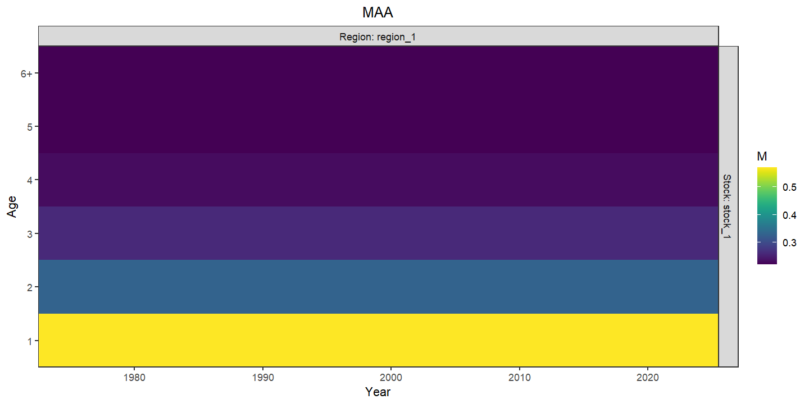
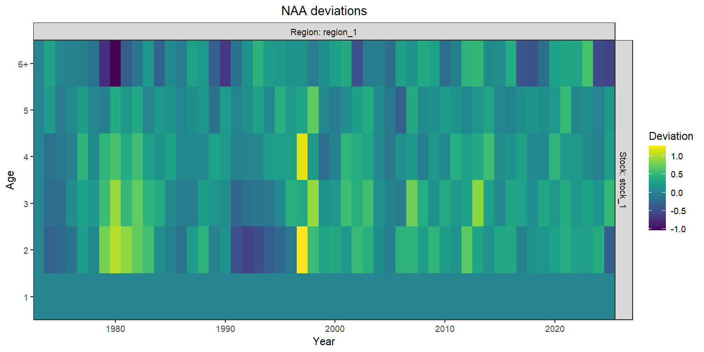
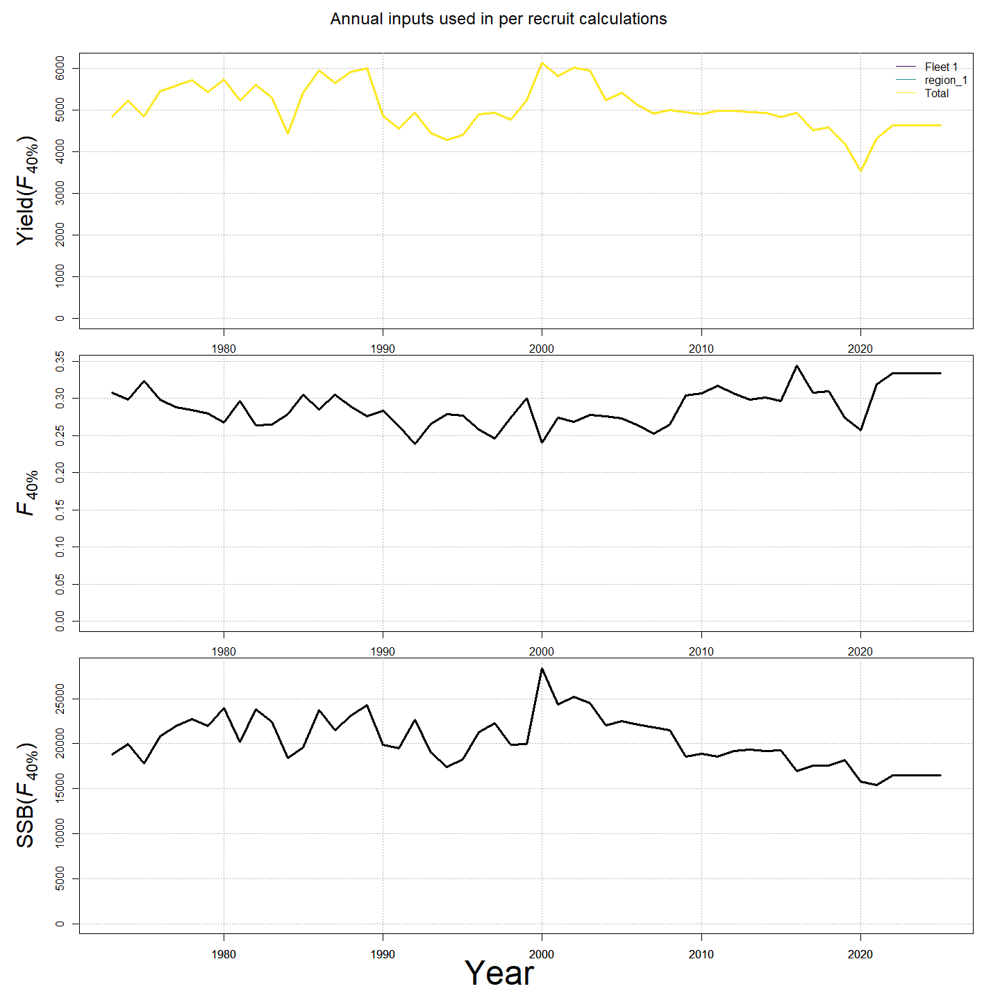

---
output:
  html_document:
    df_print: paged
    keep_md: yes
  word_document: default
  pdf_document:
    fig_caption: yes
    includes:
    keep_tex: yes
    number_sections: no
title: "WHAM Figures and Tables"
header-includes:
  - \usepackage{longtable}
  - \usepackage{booktabs}
  - \usepackage{caption,graphics}
  - \usepackage{makecell}
  - \usepackage{lscape}
  - \renewcommand\figurename{Fig.}
  - \captionsetup{labelsep=period, singlelinecheck=false}
  - \newcommand{\changesize}[1]{\fontsize{#1pt}{#1pt}\selectfont}
  - \renewcommand{\arraystretch}{1.5}
  - \renewcommand\theadfont{}
---

# {.tabset}

## Figures {.tabset}

### Input

<!-- --><!-- --><!-- --><!-- --><!-- --><!-- --><!-- --><!-- --><!-- --><!-- --><!-- --><!-- -->

### Diagnostics

<!-- --><!-- --><!-- --><!-- --><!-- --><!-- --><!-- --><!-- --><!-- --><!-- --><!-- --><!-- --><!-- --><!-- --><!-- --><!-- --><!-- --><!-- --><!-- --><!-- --><!-- --><!-- --><!-- --><!-- --><!-- --><!-- --><!-- --><!-- --><!-- --><!-- --><!-- --><!-- --><!-- -->

### Results

<!-- --><!-- --><!-- --><!-- --><!-- --><!-- --><!-- --><!-- --><!-- --><!-- --><!-- --><!-- --><!-- --><!-- --><!-- --><!-- --><!-- --><!-- --><!-- -->

### Retro

### Reference points

<!-- --><!-- --><!-- --><!-- --><!-- --><!-- --><!-- --><!-- --><!-- --><!-- -->

### Miscellaneous

<!-- --><!-- --><!-- --><!-- --><!-- --><!-- --><!-- --><!-- --><!-- --><!-- --><!-- --><!-- --><!-- --><!-- --><!-- --><!-- -->

## Tables {.tabset}

### Parameter estimates

<table class="table" style="color: black; margin-left: auto; margin-right: auto;">
<caption>Parameter estimates, standard errors, and confidence intervals. Rounded to 3 decimal places.</caption>
 <thead>
  <tr>
   <th style="text-align:left;">   </th>
   <th style="text-align:right;"> Estimate </th>
   <th style="text-align:right;"> Std. Error </th>
   <th style="text-align:right;"> 95\% CI lower </th>
   <th style="text-align:right;"> 95\% CI upper </th>
  </tr>
 </thead>
<tbody>
  <tr>
   <td style="text-align:left;"> INDEX-1 fully selected q </td>
   <td style="text-align:right;"> $2.166\times 10^{-4}$ </td>
   <td style="text-align:right;"> NA </td>
   <td style="text-align:right;"> NA </td>
   <td style="text-align:right;"> NA </td>
  </tr>
  <tr>
   <td style="text-align:left;"> INDEX-2 fully selected q </td>
   <td style="text-align:right;"> $2.852\times 10^{-4}$ </td>
   <td style="text-align:right;"> NA </td>
   <td style="text-align:right;"> NA </td>
   <td style="text-align:right;"> NA </td>
  </tr>
  <tr>
   <td style="text-align:left;"> INDEX-3 fully selected q </td>
   <td style="text-align:right;"> $2.163\times 10^{-4}$ </td>
   <td style="text-align:right;"> NA </td>
   <td style="text-align:right;"> NA </td>
   <td style="text-align:right;"> NA </td>
  </tr>
  <tr>
   <td style="text-align:left;"> # commercial Selectivity for age 1 (Block 1) </td>
   <td style="text-align:right;"> $0.037$ </td>
   <td style="text-align:right;"> NA </td>
   <td style="text-align:right;"> NA </td>
   <td style="text-align:right;"> NA </td>
  </tr>
  <tr>
   <td style="text-align:left;"> # commercial Selectivity for age 2 (Block 1) </td>
   <td style="text-align:right;"> $1.000$ </td>
   <td style="text-align:right;"> NA </td>
   <td style="text-align:right;"> NA </td>
   <td style="text-align:right;"> NA </td>
  </tr>
  <tr>
   <td style="text-align:left;"> # commercial Selectivity for age 3 (Block 1) </td>
   <td style="text-align:right;"> $1.000$ </td>
   <td style="text-align:right;"> NA </td>
   <td style="text-align:right;"> NA </td>
   <td style="text-align:right;"> NA </td>
  </tr>
  <tr>
   <td style="text-align:left;"> # commercial Selectivity for age 4 (Block 1) </td>
   <td style="text-align:right;"> $1.000$ </td>
   <td style="text-align:right;"> NA </td>
   <td style="text-align:right;"> NA </td>
   <td style="text-align:right;"> NA </td>
  </tr>
  <tr>
   <td style="text-align:left;"> # commercial Selectivity for age 5 (Block 1) </td>
   <td style="text-align:right;"> $1.000$ </td>
   <td style="text-align:right;"> NA </td>
   <td style="text-align:right;"> NA </td>
   <td style="text-align:right;"> NA </td>
  </tr>
  <tr>
   <td style="text-align:left;"> # commercial Selectivity for age 6+ (Block 1) </td>
   <td style="text-align:right;"> $1.000$ </td>
   <td style="text-align:right;"> NA </td>
   <td style="text-align:right;"> NA </td>
   <td style="text-align:right;"> NA </td>
  </tr>
  <tr>
   <td style="text-align:left;"> INDEX-1 $a_{50}$ (Block 2) </td>
   <td style="text-align:right;"> $2.037$ </td>
   <td style="text-align:right;"> NA </td>
   <td style="text-align:right;"> NA </td>
   <td style="text-align:right;"> NA </td>
  </tr>
  <tr>
   <td style="text-align:left;"> INDEX-1 1/slope (increasing) (Block 2) </td>
   <td style="text-align:right;"> $0.296$ </td>
   <td style="text-align:right;"> NA </td>
   <td style="text-align:right;"> NA </td>
   <td style="text-align:right;"> NA </td>
  </tr>
  <tr>
   <td style="text-align:left;"> INDEX-2 $a_{50}$ (Block 3) </td>
   <td style="text-align:right;"> $1.447$ </td>
   <td style="text-align:right;"> NA </td>
   <td style="text-align:right;"> NA </td>
   <td style="text-align:right;"> NA </td>
  </tr>
  <tr>
   <td style="text-align:left;"> INDEX-2 1/slope (increasing) (Block 3) </td>
   <td style="text-align:right;"> $0.246$ </td>
   <td style="text-align:right;"> NA </td>
   <td style="text-align:right;"> NA </td>
   <td style="text-align:right;"> NA </td>
  </tr>
  <tr>
   <td style="text-align:left;"> INDEX-3 $a_{50}$ (Block 4) </td>
   <td style="text-align:right;"> $1.157$ </td>
   <td style="text-align:right;"> NA </td>
   <td style="text-align:right;"> NA </td>
   <td style="text-align:right;"> NA </td>
  </tr>
  <tr>
   <td style="text-align:left;"> INDEX-3 1/slope (increasing) (Block 4) </td>
   <td style="text-align:right;"> $0.037$ </td>
   <td style="text-align:right;"> NA </td>
   <td style="text-align:right;"> NA </td>
   <td style="text-align:right;"> NA </td>
  </tr>
  <tr>
   <td style="text-align:left;"> # commercial age comp, logistic-normal: $\sigma$ </td>
   <td style="text-align:right;"> $9.487$ </td>
   <td style="text-align:right;"> NA </td>
   <td style="text-align:right;"> NA </td>
   <td style="text-align:right;"> NA </td>
  </tr>
  <tr>
   <td style="text-align:left;"> INDEX-1 age comp, logistic-normal: $\sigma$ </td>
   <td style="text-align:right;"> $8.313$ </td>
   <td style="text-align:right;"> NA </td>
   <td style="text-align:right;"> NA </td>
   <td style="text-align:right;"> NA </td>
  </tr>
  <tr>
   <td style="text-align:left;"> INDEX-2 age comp, logistic-normal: $\sigma$ </td>
   <td style="text-align:right;"> $10.587$ </td>
   <td style="text-align:right;"> NA </td>
   <td style="text-align:right;"> NA </td>
   <td style="text-align:right;"> NA </td>
  </tr>
  <tr>
   <td style="text-align:left;"> INDEX-3 age comp, logistic-normal: $\sigma$ </td>
   <td style="text-align:right;"> $10.626$ </td>
   <td style="text-align:right;"> NA </td>
   <td style="text-align:right;"> NA </td>
   <td style="text-align:right;"> NA </td>
  </tr>
</tbody>
</table>

### Abundance at age

<table class="table" style="color: black; margin-left: auto; margin-right: auto;">
<caption>Abundance at age (1000s) for stock 1 in region 1.</caption>
 <thead>
  <tr>
   <th style="text-align:left;">   </th>
   <th style="text-align:right;"> 1 </th>
   <th style="text-align:right;"> 2 </th>
   <th style="text-align:right;"> 3 </th>
   <th style="text-align:right;"> 4 </th>
   <th style="text-align:right;"> 5 </th>
   <th style="text-align:right;"> 6+ </th>
  </tr>
 </thead>
<tbody>
  <tr>
   <td style="text-align:left;"> 1973 </td>
   <td style="text-align:right;"> 56813 </td>
   <td style="text-align:right;"> 43038 </td>
   <td style="text-align:right;"> 33459 </td>
   <td style="text-align:right;"> 9335 </td>
   <td style="text-align:right;"> 4945 </td>
   <td style="text-align:right;"> 2866 </td>
  </tr>
  <tr>
   <td style="text-align:left;"> 1974 </td>
   <td style="text-align:right;"> 108333 </td>
   <td style="text-align:right;"> 37151 </td>
   <td style="text-align:right;"> 14692 </td>
   <td style="text-align:right;"> 11422 </td>
   <td style="text-align:right;"> 3187 </td>
   <td style="text-align:right;"> 2666 </td>
  </tr>
  <tr>
   <td style="text-align:left;"> 1975 </td>
   <td style="text-align:right;"> 62732 </td>
   <td style="text-align:right;"> 70041 </td>
   <td style="text-align:right;"> 9308 </td>
   <td style="text-align:right;"> 3681 </td>
   <td style="text-align:right;"> 2862 </td>
   <td style="text-align:right;"> 1466 </td>
  </tr>
  <tr>
   <td style="text-align:left;"> 1976 </td>
   <td style="text-align:right;"> 48723 </td>
   <td style="text-align:right;"> 40613 </td>
   <td style="text-align:right;"> 18204 </td>
   <td style="text-align:right;"> 2419 </td>
   <td style="text-align:right;"> 957 </td>
   <td style="text-align:right;"> 1125 </td>
  </tr>
  <tr>
   <td style="text-align:left;"> 1977 </td>
   <td style="text-align:right;"> 33492 </td>
   <td style="text-align:right;"> 31372 </td>
   <td style="text-align:right;"> 9102 </td>
   <td style="text-align:right;"> 4080 </td>
   <td style="text-align:right;"> 542 </td>
   <td style="text-align:right;"> 466 </td>
  </tr>
  <tr>
   <td style="text-align:left;"> 1978 </td>
   <td style="text-align:right;"> 49152 </td>
   <td style="text-align:right;"> 21635 </td>
   <td style="text-align:right;"> 7676 </td>
   <td style="text-align:right;"> 2227 </td>
   <td style="text-align:right;"> 998 </td>
   <td style="text-align:right;"> 247 </td>
  </tr>
  <tr>
   <td style="text-align:left;"> 1979 </td>
   <td style="text-align:right;"> 76636 </td>
   <td style="text-align:right;"> 31878 </td>
   <td style="text-align:right;"> 5902 </td>
   <td style="text-align:right;"> 2094 </td>
   <td style="text-align:right;"> 607 </td>
   <td style="text-align:right;"> 340 </td>
  </tr>
  <tr>
   <td style="text-align:left;"> 1980 </td>
   <td style="text-align:right;"> 29830 </td>
   <td style="text-align:right;"> 50015 </td>
   <td style="text-align:right;"> 10315 </td>
   <td style="text-align:right;"> 1910 </td>
   <td style="text-align:right;"> 677 </td>
   <td style="text-align:right;"> 306 </td>
  </tr>
  <tr>
   <td style="text-align:left;"> 1981 </td>
   <td style="text-align:right;"> 73123 </td>
   <td style="text-align:right;"> 19646 </td>
   <td style="text-align:right;"> 20732 </td>
   <td style="text-align:right;"> 4276 </td>
   <td style="text-align:right;"> 792 </td>
   <td style="text-align:right;"> 408 </td>
  </tr>
  <tr>
   <td style="text-align:left;"> 1982 </td>
   <td style="text-align:right;"> 62630 </td>
   <td style="text-align:right;"> 48092 </td>
   <td style="text-align:right;"> 7841 </td>
   <td style="text-align:right;"> 8274 </td>
   <td style="text-align:right;"> 1706 </td>
   <td style="text-align:right;"> 479 </td>
  </tr>
  <tr>
   <td style="text-align:left;"> 1983 </td>
   <td style="text-align:right;"> 17623 </td>
   <td style="text-align:right;"> 40711 </td>
   <td style="text-align:right;"> 13959 </td>
   <td style="text-align:right;"> 2276 </td>
   <td style="text-align:right;"> 2402 </td>
   <td style="text-align:right;"> 634 </td>
  </tr>
  <tr>
   <td style="text-align:left;"> 1984 </td>
   <td style="text-align:right;"> 21979 </td>
   <td style="text-align:right;"> 11392 </td>
   <td style="text-align:right;"> 10146 </td>
   <td style="text-align:right;"> 3479 </td>
   <td style="text-align:right;"> 567 </td>
   <td style="text-align:right;"> 757 </td>
  </tr>
  <tr>
   <td style="text-align:left;"> 1985 </td>
   <td style="text-align:right;"> 16846 </td>
   <td style="text-align:right;"> 13989 </td>
   <td style="text-align:right;"> 1862 </td>
   <td style="text-align:right;"> 1658 </td>
   <td style="text-align:right;"> 568 </td>
   <td style="text-align:right;"> 216 </td>
  </tr>
  <tr>
   <td style="text-align:left;"> 1986 </td>
   <td style="text-align:right;"> 12317 </td>
   <td style="text-align:right;"> 11013 </td>
   <td style="text-align:right;"> 4735 </td>
   <td style="text-align:right;"> 630 </td>
   <td style="text-align:right;"> 561 </td>
   <td style="text-align:right;"> 266 </td>
  </tr>
  <tr>
   <td style="text-align:left;"> 1987 </td>
   <td style="text-align:right;"> 14251 </td>
   <td style="text-align:right;"> 8024 </td>
   <td style="text-align:right;"> 3396 </td>
   <td style="text-align:right;"> 1460 </td>
   <td style="text-align:right;"> 194 </td>
   <td style="text-align:right;"> 255 </td>
  </tr>
  <tr>
   <td style="text-align:left;"> 1988 </td>
   <td style="text-align:right;"> 13766 </td>
   <td style="text-align:right;"> 9140 </td>
   <td style="text-align:right;"> 1612 </td>
   <td style="text-align:right;"> 682 </td>
   <td style="text-align:right;"> 293 </td>
   <td style="text-align:right;"> 90 </td>
  </tr>
  <tr>
   <td style="text-align:left;"> 1989 </td>
   <td style="text-align:right;"> 29888 </td>
   <td style="text-align:right;"> 8867 </td>
   <td style="text-align:right;"> 2071 </td>
   <td style="text-align:right;"> 365 </td>
   <td style="text-align:right;"> 155 </td>
   <td style="text-align:right;"> 87 </td>
  </tr>
  <tr>
   <td style="text-align:left;"> 1990 </td>
   <td style="text-align:right;"> 21512 </td>
   <td style="text-align:right;"> 19599 </td>
   <td style="text-align:right;"> 3268 </td>
   <td style="text-align:right;"> 763 </td>
   <td style="text-align:right;"> 135 </td>
   <td style="text-align:right;"> 89 </td>
  </tr>
  <tr>
   <td style="text-align:left;"> 1991 </td>
   <td style="text-align:right;"> 32144 </td>
   <td style="text-align:right;"> 13939 </td>
   <td style="text-align:right;"> 5213 </td>
   <td style="text-align:right;"> 869 </td>
   <td style="text-align:right;"> 203 </td>
   <td style="text-align:right;"> 59 </td>
  </tr>
  <tr>
   <td style="text-align:left;"> 1992 </td>
   <td style="text-align:right;"> 28743 </td>
   <td style="text-align:right;"> 21019 </td>
   <td style="text-align:right;"> 4755 </td>
   <td style="text-align:right;"> 1778 </td>
   <td style="text-align:right;"> 297 </td>
   <td style="text-align:right;"> 90 </td>
  </tr>
  <tr>
   <td style="text-align:left;"> 1993 </td>
   <td style="text-align:right;"> 30234 </td>
   <td style="text-align:right;"> 18535 </td>
   <td style="text-align:right;"> 4904 </td>
   <td style="text-align:right;"> 1109 </td>
   <td style="text-align:right;"> 415 </td>
   <td style="text-align:right;"> 90 </td>
  </tr>
  <tr>
   <td style="text-align:left;"> 1994 </td>
   <td style="text-align:right;"> 17415 </td>
   <td style="text-align:right;"> 19594 </td>
   <td style="text-align:right;"> 4952 </td>
   <td style="text-align:right;"> 1310 </td>
   <td style="text-align:right;"> 296 </td>
   <td style="text-align:right;"> 135 </td>
  </tr>
  <tr>
   <td style="text-align:left;"> 1995 </td>
   <td style="text-align:right;"> 39896 </td>
   <td style="text-align:right;"> 11283 </td>
   <td style="text-align:right;"> 5201 </td>
   <td style="text-align:right;"> 1315 </td>
   <td style="text-align:right;"> 348 </td>
   <td style="text-align:right;"> 114 </td>
  </tr>
  <tr>
   <td style="text-align:left;"> 1996 </td>
   <td style="text-align:right;"> 45970 </td>
   <td style="text-align:right;"> 26519 </td>
   <td style="text-align:right;"> 6013 </td>
   <td style="text-align:right;"> 2772 </td>
   <td style="text-align:right;"> 701 </td>
   <td style="text-align:right;"> 246 </td>
  </tr>
  <tr>
   <td style="text-align:left;"> 1997 </td>
   <td style="text-align:right;"> 25423 </td>
   <td style="text-align:right;"> 30605 </td>
   <td style="text-align:right;"> 14766 </td>
   <td style="text-align:right;"> 3348 </td>
   <td style="text-align:right;"> 1543 </td>
   <td style="text-align:right;"> 527 </td>
  </tr>
  <tr>
   <td style="text-align:left;"> 1998 </td>
   <td style="text-align:right;"> 97740 </td>
   <td style="text-align:right;"> 16929 </td>
   <td style="text-align:right;"> 17118 </td>
   <td style="text-align:right;"> 8259 </td>
   <td style="text-align:right;"> 1873 </td>
   <td style="text-align:right;"> 1158 </td>
  </tr>
  <tr>
   <td style="text-align:left;"> 1999 </td>
   <td style="text-align:right;"> 50258 </td>
   <td style="text-align:right;"> 64845 </td>
   <td style="text-align:right;"> 8567 </td>
   <td style="text-align:right;"> 8663 </td>
   <td style="text-align:right;"> 4180 </td>
   <td style="text-align:right;"> 1534 </td>
  </tr>
  <tr>
   <td style="text-align:left;"> 2000 </td>
   <td style="text-align:right;"> 38705 </td>
   <td style="text-align:right;"> 33472 </td>
   <td style="text-align:right;"> 36457 </td>
   <td style="text-align:right;"> 4817 </td>
   <td style="text-align:right;"> 4871 </td>
   <td style="text-align:right;"> 3212 </td>
  </tr>
  <tr>
   <td style="text-align:left;"> 2001 </td>
   <td style="text-align:right;"> 33314 </td>
   <td style="text-align:right;"> 25720 </td>
   <td style="text-align:right;"> 17697 </td>
   <td style="text-align:right;"> 19276 </td>
   <td style="text-align:right;"> 2547 </td>
   <td style="text-align:right;"> 4274 </td>
  </tr>
  <tr>
   <td style="text-align:left;"> 2002 </td>
   <td style="text-align:right;"> 26784 </td>
   <td style="text-align:right;"> 22102 </td>
   <td style="text-align:right;"> 13013 </td>
   <td style="text-align:right;"> 8954 </td>
   <td style="text-align:right;"> 9753 </td>
   <td style="text-align:right;"> 3451 </td>
  </tr>
  <tr>
   <td style="text-align:left;"> 2003 </td>
   <td style="text-align:right;"> 27356 </td>
   <td style="text-align:right;"> 17797 </td>
   <td style="text-align:right;"> 11667 </td>
   <td style="text-align:right;"> 6869 </td>
   <td style="text-align:right;"> 4727 </td>
   <td style="text-align:right;"> 6970 </td>
  </tr>
  <tr>
   <td style="text-align:left;"> 2004 </td>
   <td style="text-align:right;"> 33967 </td>
   <td style="text-align:right;"> 18110 </td>
   <td style="text-align:right;"> 8495 </td>
   <td style="text-align:right;"> 5569 </td>
   <td style="text-align:right;"> 3279 </td>
   <td style="text-align:right;"> 5583 </td>
  </tr>
  <tr>
   <td style="text-align:left;"> 2005 </td>
   <td style="text-align:right;"> 49436 </td>
   <td style="text-align:right;"> 22319 </td>
   <td style="text-align:right;"> 7049 </td>
   <td style="text-align:right;"> 3306 </td>
   <td style="text-align:right;"> 2167 </td>
   <td style="text-align:right;"> 3449 </td>
  </tr>
  <tr>
   <td style="text-align:left;"> 2006 </td>
   <td style="text-align:right;"> 38443 </td>
   <td style="text-align:right;"> 32775 </td>
   <td style="text-align:right;"> 11081 </td>
   <td style="text-align:right;"> 3499 </td>
   <td style="text-align:right;"> 1641 </td>
   <td style="text-align:right;"> 2788 </td>
  </tr>
  <tr>
   <td style="text-align:left;"> 2007 </td>
   <td style="text-align:right;"> 28738 </td>
   <td style="text-align:right;"> 25648 </td>
   <td style="text-align:right;"> 19324 </td>
   <td style="text-align:right;"> 6533 </td>
   <td style="text-align:right;"> 2063 </td>
   <td style="text-align:right;"> 2612 </td>
  </tr>
  <tr>
   <td style="text-align:left;"> 2008 </td>
   <td style="text-align:right;"> 20898 </td>
   <td style="text-align:right;"> 19197 </td>
   <td style="text-align:right;"> 15651 </td>
   <td style="text-align:right;"> 11792 </td>
   <td style="text-align:right;"> 3987 </td>
   <td style="text-align:right;"> 2853 </td>
  </tr>
  <tr>
   <td style="text-align:left;"> 2009 </td>
   <td style="text-align:right;"> 15293 </td>
   <td style="text-align:right;"> 13969 </td>
   <td style="text-align:right;"> 11917 </td>
   <td style="text-align:right;"> 9715 </td>
   <td style="text-align:right;"> 7320 </td>
   <td style="text-align:right;"> 4246 </td>
  </tr>
  <tr>
   <td style="text-align:left;"> 2010 </td>
   <td style="text-align:right;"> 9866 </td>
   <td style="text-align:right;"> 10214 </td>
   <td style="text-align:right;"> 8486 </td>
   <td style="text-align:right;"> 7239 </td>
   <td style="text-align:right;"> 5902 </td>
   <td style="text-align:right;"> 7026 </td>
  </tr>
  <tr>
   <td style="text-align:left;"> 2011 </td>
   <td style="text-align:right;"> 7622 </td>
   <td style="text-align:right;"> 6596 </td>
   <td style="text-align:right;"> 6362 </td>
   <td style="text-align:right;"> 5286 </td>
   <td style="text-align:right;"> 4509 </td>
   <td style="text-align:right;"> 8053 </td>
  </tr>
  <tr>
   <td style="text-align:left;"> 2012 </td>
   <td style="text-align:right;"> 4896 </td>
   <td style="text-align:right;"> 5092 </td>
   <td style="text-align:right;"> 4047 </td>
   <td style="text-align:right;"> 3904 </td>
   <td style="text-align:right;"> 3243 </td>
   <td style="text-align:right;"> 7707 </td>
  </tr>
  <tr>
   <td style="text-align:left;"> 2013 </td>
   <td style="text-align:right;"> 3998 </td>
   <td style="text-align:right;"> 3274 </td>
   <td style="text-align:right;"> 3194 </td>
   <td style="text-align:right;"> 2538 </td>
   <td style="text-align:right;"> 2449 </td>
   <td style="text-align:right;"> 6869 </td>
  </tr>
  <tr>
   <td style="text-align:left;"> 2014 </td>
   <td style="text-align:right;"> 2605 </td>
   <td style="text-align:right;"> 2677 </td>
   <td style="text-align:right;"> 2142 </td>
   <td style="text-align:right;"> 2090 </td>
   <td style="text-align:right;"> 1661 </td>
   <td style="text-align:right;"> 6095 </td>
  </tr>
  <tr>
   <td style="text-align:left;"> 2015 </td>
   <td style="text-align:right;"> 1019 </td>
   <td style="text-align:right;"> 1745 </td>
   <td style="text-align:right;"> 1756 </td>
   <td style="text-align:right;"> 1405 </td>
   <td style="text-align:right;"> 1371 </td>
   <td style="text-align:right;"> 5087 </td>
  </tr>
  <tr>
   <td style="text-align:left;"> 2016 </td>
   <td style="text-align:right;"> 792 </td>
   <td style="text-align:right;"> 683 </td>
   <td style="text-align:right;"> 1146 </td>
   <td style="text-align:right;"> 1153 </td>
   <td style="text-align:right;"> 923 </td>
   <td style="text-align:right;"> 4241 </td>
  </tr>
  <tr>
   <td style="text-align:left;"> 2017 </td>
   <td style="text-align:right;"> 1038 </td>
   <td style="text-align:right;"> 531 </td>
   <td style="text-align:right;"> 452 </td>
   <td style="text-align:right;"> 759 </td>
   <td style="text-align:right;"> 764 </td>
   <td style="text-align:right;"> 3422 </td>
  </tr>
  <tr>
   <td style="text-align:left;"> 2018 </td>
   <td style="text-align:right;"> 1490 </td>
   <td style="text-align:right;"> 695 </td>
   <td style="text-align:right;"> 344 </td>
   <td style="text-align:right;"> 294 </td>
   <td style="text-align:right;"> 493 </td>
   <td style="text-align:right;"> 2717 </td>
  </tr>
  <tr>
   <td style="text-align:left;"> 2019 </td>
   <td style="text-align:right;"> 1961 </td>
   <td style="text-align:right;"> 998 </td>
   <td style="text-align:right;"> 456 </td>
   <td style="text-align:right;"> 226 </td>
   <td style="text-align:right;"> 193 </td>
   <td style="text-align:right;"> 2109 </td>
  </tr>
  <tr>
   <td style="text-align:left;"> 2020 </td>
   <td style="text-align:right;"> 754 </td>
   <td style="text-align:right;"> 1315 </td>
   <td style="text-align:right;"> 666 </td>
   <td style="text-align:right;"> 305 </td>
   <td style="text-align:right;"> 151 </td>
   <td style="text-align:right;"> 1537 </td>
  </tr>
  <tr>
   <td style="text-align:left;"> 2021 </td>
   <td style="text-align:right;"> 472 </td>
   <td style="text-align:right;"> 505 </td>
   <td style="text-align:right;"> 842 </td>
   <td style="text-align:right;"> 427 </td>
   <td style="text-align:right;"> 195 </td>
   <td style="text-align:right;"> 1080 </td>
  </tr>
  <tr>
   <td style="text-align:left;"> 2022 </td>
   <td style="text-align:right;"> 3716 </td>
   <td style="text-align:right;"> 316 </td>
   <td style="text-align:right;"> 324 </td>
   <td style="text-align:right;"> 541 </td>
   <td style="text-align:right;"> 274 </td>
   <td style="text-align:right;"> 819 </td>
  </tr>
</tbody>
</table>

### Fishing mortality at age by region

<table class="table" style="color: black; margin-left: auto; margin-right: auto;">
<caption>Total fishing mortality at age in region 1.</caption>
 <thead>
  <tr>
   <th style="text-align:left;">   </th>
   <th style="text-align:right;"> 1 </th>
   <th style="text-align:right;"> 2 </th>
   <th style="text-align:right;"> 3 </th>
   <th style="text-align:right;"> 4 </th>
   <th style="text-align:right;"> 5 </th>
   <th style="text-align:right;"> 6+ </th>
  </tr>
 </thead>
<tbody>
  <tr>
   <td style="text-align:left;"> 1973 </td>
   <td style="text-align:right;"> 0.025 </td>
   <td style="text-align:right;"> 0.675 </td>
   <td style="text-align:right;"> 0.675 </td>
   <td style="text-align:right;"> 0.675 </td>
   <td style="text-align:right;"> 0.675 </td>
   <td style="text-align:right;"> 0.675 </td>
  </tr>
  <tr>
   <td style="text-align:left;"> 1974 </td>
   <td style="text-align:right;"> 0.036 </td>
   <td style="text-align:right;"> 0.984 </td>
   <td style="text-align:right;"> 0.984 </td>
   <td style="text-align:right;"> 0.984 </td>
   <td style="text-align:right;"> 0.984 </td>
   <td style="text-align:right;"> 0.984 </td>
  </tr>
  <tr>
   <td style="text-align:left;"> 1975 </td>
   <td style="text-align:right;"> 0.035 </td>
   <td style="text-align:right;"> 0.947 </td>
   <td style="text-align:right;"> 0.947 </td>
   <td style="text-align:right;"> 0.947 </td>
   <td style="text-align:right;"> 0.947 </td>
   <td style="text-align:right;"> 0.947 </td>
  </tr>
  <tr>
   <td style="text-align:left;"> 1976 </td>
   <td style="text-align:right;"> 0.040 </td>
   <td style="text-align:right;"> 1.096 </td>
   <td style="text-align:right;"> 1.096 </td>
   <td style="text-align:right;"> 1.096 </td>
   <td style="text-align:right;"> 1.096 </td>
   <td style="text-align:right;"> 1.096 </td>
  </tr>
  <tr>
   <td style="text-align:left;"> 1977 </td>
   <td style="text-align:right;"> 0.037 </td>
   <td style="text-align:right;"> 1.008 </td>
   <td style="text-align:right;"> 1.008 </td>
   <td style="text-align:right;"> 1.008 </td>
   <td style="text-align:right;"> 1.008 </td>
   <td style="text-align:right;"> 1.008 </td>
  </tr>
  <tr>
   <td style="text-align:left;"> 1978 </td>
   <td style="text-align:right;"> 0.033 </td>
   <td style="text-align:right;"> 0.899 </td>
   <td style="text-align:right;"> 0.899 </td>
   <td style="text-align:right;"> 0.899 </td>
   <td style="text-align:right;"> 0.899 </td>
   <td style="text-align:right;"> 0.899 </td>
  </tr>
  <tr>
   <td style="text-align:left;"> 1979 </td>
   <td style="text-align:right;"> 0.027 </td>
   <td style="text-align:right;"> 0.728 </td>
   <td style="text-align:right;"> 0.728 </td>
   <td style="text-align:right;"> 0.728 </td>
   <td style="text-align:right;"> 0.728 </td>
   <td style="text-align:right;"> 0.728 </td>
  </tr>
  <tr>
   <td style="text-align:left;"> 1980 </td>
   <td style="text-align:right;"> 0.018 </td>
   <td style="text-align:right;"> 0.481 </td>
   <td style="text-align:right;"> 0.481 </td>
   <td style="text-align:right;"> 0.481 </td>
   <td style="text-align:right;"> 0.481 </td>
   <td style="text-align:right;"> 0.481 </td>
  </tr>
  <tr>
   <td style="text-align:left;"> 1981 </td>
   <td style="text-align:right;"> 0.019 </td>
   <td style="text-align:right;"> 0.518 </td>
   <td style="text-align:right;"> 0.518 </td>
   <td style="text-align:right;"> 0.518 </td>
   <td style="text-align:right;"> 0.518 </td>
   <td style="text-align:right;"> 0.518 </td>
  </tr>
  <tr>
   <td style="text-align:left;"> 1982 </td>
   <td style="text-align:right;"> 0.031 </td>
   <td style="text-align:right;"> 0.837 </td>
   <td style="text-align:right;"> 0.837 </td>
   <td style="text-align:right;"> 0.837 </td>
   <td style="text-align:right;"> 0.837 </td>
   <td style="text-align:right;"> 0.837 </td>
  </tr>
  <tr>
   <td style="text-align:left;"> 1983 </td>
   <td style="text-align:right;"> 0.036 </td>
   <td style="text-align:right;"> 0.989 </td>
   <td style="text-align:right;"> 0.989 </td>
   <td style="text-align:right;"> 0.989 </td>
   <td style="text-align:right;"> 0.989 </td>
   <td style="text-align:right;"> 0.989 </td>
  </tr>
  <tr>
   <td style="text-align:left;"> 1984 </td>
   <td style="text-align:right;"> 0.052 </td>
   <td style="text-align:right;"> 1.411 </td>
   <td style="text-align:right;"> 1.411 </td>
   <td style="text-align:right;"> 1.411 </td>
   <td style="text-align:right;"> 1.411 </td>
   <td style="text-align:right;"> 1.411 </td>
  </tr>
  <tr>
   <td style="text-align:left;"> 1985 </td>
   <td style="text-align:right;"> 0.025 </td>
   <td style="text-align:right;"> 0.683 </td>
   <td style="text-align:right;"> 0.683 </td>
   <td style="text-align:right;"> 0.683 </td>
   <td style="text-align:right;"> 0.683 </td>
   <td style="text-align:right;"> 0.683 </td>
  </tr>
  <tr>
   <td style="text-align:left;"> 1986 </td>
   <td style="text-align:right;"> 0.029 </td>
   <td style="text-align:right;"> 0.776 </td>
   <td style="text-align:right;"> 0.776 </td>
   <td style="text-align:right;"> 0.776 </td>
   <td style="text-align:right;"> 0.776 </td>
   <td style="text-align:right;"> 0.776 </td>
  </tr>
  <tr>
   <td style="text-align:left;"> 1987 </td>
   <td style="text-align:right;"> 0.044 </td>
   <td style="text-align:right;"> 1.205 </td>
   <td style="text-align:right;"> 1.205 </td>
   <td style="text-align:right;"> 1.205 </td>
   <td style="text-align:right;"> 1.205 </td>
   <td style="text-align:right;"> 1.205 </td>
  </tr>
  <tr>
   <td style="text-align:left;"> 1988 </td>
   <td style="text-align:right;"> 0.040 </td>
   <td style="text-align:right;"> 1.085 </td>
   <td style="text-align:right;"> 1.085 </td>
   <td style="text-align:right;"> 1.085 </td>
   <td style="text-align:right;"> 1.085 </td>
   <td style="text-align:right;"> 1.085 </td>
  </tr>
  <tr>
   <td style="text-align:left;"> 1989 </td>
   <td style="text-align:right;"> 0.022 </td>
   <td style="text-align:right;"> 0.598 </td>
   <td style="text-align:right;"> 0.598 </td>
   <td style="text-align:right;"> 0.598 </td>
   <td style="text-align:right;"> 0.598 </td>
   <td style="text-align:right;"> 0.598 </td>
  </tr>
  <tr>
   <td style="text-align:left;"> 1990 </td>
   <td style="text-align:right;"> 0.034 </td>
   <td style="text-align:right;"> 0.924 </td>
   <td style="text-align:right;"> 0.924 </td>
   <td style="text-align:right;"> 0.924 </td>
   <td style="text-align:right;"> 0.924 </td>
   <td style="text-align:right;"> 0.924 </td>
  </tr>
  <tr>
   <td style="text-align:left;"> 1991 </td>
   <td style="text-align:right;"> 0.025 </td>
   <td style="text-align:right;"> 0.676 </td>
   <td style="text-align:right;"> 0.676 </td>
   <td style="text-align:right;"> 0.676 </td>
   <td style="text-align:right;"> 0.676 </td>
   <td style="text-align:right;"> 0.676 </td>
  </tr>
  <tr>
   <td style="text-align:left;"> 1992 </td>
   <td style="text-align:right;"> 0.039 </td>
   <td style="text-align:right;"> 1.055 </td>
   <td style="text-align:right;"> 1.055 </td>
   <td style="text-align:right;"> 1.055 </td>
   <td style="text-align:right;"> 1.055 </td>
   <td style="text-align:right;"> 1.055 </td>
  </tr>
  <tr>
   <td style="text-align:left;"> 1993 </td>
   <td style="text-align:right;"> 0.034 </td>
   <td style="text-align:right;"> 0.920 </td>
   <td style="text-align:right;"> 0.920 </td>
   <td style="text-align:right;"> 0.920 </td>
   <td style="text-align:right;"> 0.920 </td>
   <td style="text-align:right;"> 0.920 </td>
  </tr>
  <tr>
   <td style="text-align:left;"> 1994 </td>
   <td style="text-align:right;"> 0.034 </td>
   <td style="text-align:right;"> 0.926 </td>
   <td style="text-align:right;"> 0.926 </td>
   <td style="text-align:right;"> 0.926 </td>
   <td style="text-align:right;"> 0.926 </td>
   <td style="text-align:right;"> 0.926 </td>
  </tr>
  <tr>
   <td style="text-align:left;"> 1995 </td>
   <td style="text-align:right;"> 0.008 </td>
   <td style="text-align:right;"> 0.229 </td>
   <td style="text-align:right;"> 0.229 </td>
   <td style="text-align:right;"> 0.229 </td>
   <td style="text-align:right;"> 0.229 </td>
   <td style="text-align:right;"> 0.229 </td>
  </tr>
  <tr>
   <td style="text-align:left;"> 1996 </td>
   <td style="text-align:right;"> 0.007 </td>
   <td style="text-align:right;"> 0.185 </td>
   <td style="text-align:right;"> 0.185 </td>
   <td style="text-align:right;"> 0.185 </td>
   <td style="text-align:right;"> 0.185 </td>
   <td style="text-align:right;"> 0.185 </td>
  </tr>
  <tr>
   <td style="text-align:left;"> 1997 </td>
   <td style="text-align:right;"> 0.007 </td>
   <td style="text-align:right;"> 0.181 </td>
   <td style="text-align:right;"> 0.181 </td>
   <td style="text-align:right;"> 0.181 </td>
   <td style="text-align:right;"> 0.181 </td>
   <td style="text-align:right;"> 0.181 </td>
  </tr>
  <tr>
   <td style="text-align:left;"> 1998 </td>
   <td style="text-align:right;"> 0.010 </td>
   <td style="text-align:right;"> 0.281 </td>
   <td style="text-align:right;"> 0.281 </td>
   <td style="text-align:right;"> 0.281 </td>
   <td style="text-align:right;"> 0.281 </td>
   <td style="text-align:right;"> 0.281 </td>
  </tr>
  <tr>
   <td style="text-align:left;"> 1999 </td>
   <td style="text-align:right;"> 0.006 </td>
   <td style="text-align:right;"> 0.176 </td>
   <td style="text-align:right;"> 0.176 </td>
   <td style="text-align:right;"> 0.176 </td>
   <td style="text-align:right;"> 0.176 </td>
   <td style="text-align:right;"> 0.176 </td>
  </tr>
  <tr>
   <td style="text-align:left;"> 2000 </td>
   <td style="text-align:right;"> 0.009 </td>
   <td style="text-align:right;"> 0.237 </td>
   <td style="text-align:right;"> 0.237 </td>
   <td style="text-align:right;"> 0.237 </td>
   <td style="text-align:right;"> 0.237 </td>
   <td style="text-align:right;"> 0.237 </td>
  </tr>
  <tr>
   <td style="text-align:left;"> 2001 </td>
   <td style="text-align:right;"> 0.010 </td>
   <td style="text-align:right;"> 0.281 </td>
   <td style="text-align:right;"> 0.281 </td>
   <td style="text-align:right;"> 0.281 </td>
   <td style="text-align:right;"> 0.281 </td>
   <td style="text-align:right;"> 0.281 </td>
  </tr>
  <tr>
   <td style="text-align:left;"> 2002 </td>
   <td style="text-align:right;"> 0.009 </td>
   <td style="text-align:right;"> 0.239 </td>
   <td style="text-align:right;"> 0.239 </td>
   <td style="text-align:right;"> 0.239 </td>
   <td style="text-align:right;"> 0.239 </td>
   <td style="text-align:right;"> 0.239 </td>
  </tr>
  <tr>
   <td style="text-align:left;"> 2003 </td>
   <td style="text-align:right;"> 0.012 </td>
   <td style="text-align:right;"> 0.340 </td>
   <td style="text-align:right;"> 0.340 </td>
   <td style="text-align:right;"> 0.340 </td>
   <td style="text-align:right;"> 0.340 </td>
   <td style="text-align:right;"> 0.340 </td>
  </tr>
  <tr>
   <td style="text-align:left;"> 2004 </td>
   <td style="text-align:right;"> 0.020 </td>
   <td style="text-align:right;"> 0.544 </td>
   <td style="text-align:right;"> 0.544 </td>
   <td style="text-align:right;"> 0.544 </td>
   <td style="text-align:right;"> 0.544 </td>
   <td style="text-align:right;"> 0.544 </td>
  </tr>
  <tr>
   <td style="text-align:left;"> 2005 </td>
   <td style="text-align:right;"> 0.011 </td>
   <td style="text-align:right;"> 0.300 </td>
   <td style="text-align:right;"> 0.300 </td>
   <td style="text-align:right;"> 0.300 </td>
   <td style="text-align:right;"> 0.300 </td>
   <td style="text-align:right;"> 0.300 </td>
  </tr>
  <tr>
   <td style="text-align:left;"> 2006 </td>
   <td style="text-align:right;"> 0.005 </td>
   <td style="text-align:right;"> 0.128 </td>
   <td style="text-align:right;"> 0.128 </td>
   <td style="text-align:right;"> 0.128 </td>
   <td style="text-align:right;"> 0.128 </td>
   <td style="text-align:right;"> 0.128 </td>
  </tr>
  <tr>
   <td style="text-align:left;"> 2007 </td>
   <td style="text-align:right;"> 0.003 </td>
   <td style="text-align:right;"> 0.094 </td>
   <td style="text-align:right;"> 0.094 </td>
   <td style="text-align:right;"> 0.094 </td>
   <td style="text-align:right;"> 0.094 </td>
   <td style="text-align:right;"> 0.094 </td>
  </tr>
  <tr>
   <td style="text-align:left;"> 2008 </td>
   <td style="text-align:right;"> 0.003 </td>
   <td style="text-align:right;"> 0.077 </td>
   <td style="text-align:right;"> 0.077 </td>
   <td style="text-align:right;"> 0.077 </td>
   <td style="text-align:right;"> 0.077 </td>
   <td style="text-align:right;"> 0.077 </td>
  </tr>
  <tr>
   <td style="text-align:left;"> 2009 </td>
   <td style="text-align:right;"> 0.004 </td>
   <td style="text-align:right;"> 0.098 </td>
   <td style="text-align:right;"> 0.098 </td>
   <td style="text-align:right;"> 0.098 </td>
   <td style="text-align:right;"> 0.098 </td>
   <td style="text-align:right;"> 0.098 </td>
  </tr>
  <tr>
   <td style="text-align:left;"> 2010 </td>
   <td style="text-align:right;"> 0.003 </td>
   <td style="text-align:right;"> 0.073 </td>
   <td style="text-align:right;"> 0.073 </td>
   <td style="text-align:right;"> 0.073 </td>
   <td style="text-align:right;"> 0.073 </td>
   <td style="text-align:right;"> 0.073 </td>
  </tr>
  <tr>
   <td style="text-align:left;"> 2011 </td>
   <td style="text-align:right;"> 0.003 </td>
   <td style="text-align:right;"> 0.089 </td>
   <td style="text-align:right;"> 0.089 </td>
   <td style="text-align:right;"> 0.089 </td>
   <td style="text-align:right;"> 0.089 </td>
   <td style="text-align:right;"> 0.089 </td>
  </tr>
  <tr>
   <td style="text-align:left;"> 2012 </td>
   <td style="text-align:right;"> 0.002 </td>
   <td style="text-align:right;"> 0.066 </td>
   <td style="text-align:right;"> 0.066 </td>
   <td style="text-align:right;"> 0.066 </td>
   <td style="text-align:right;"> 0.066 </td>
   <td style="text-align:right;"> 0.066 </td>
  </tr>
  <tr>
   <td style="text-align:left;"> 2013 </td>
   <td style="text-align:right;"> 0.001 </td>
   <td style="text-align:right;"> 0.024 </td>
   <td style="text-align:right;"> 0.024 </td>
   <td style="text-align:right;"> 0.024 </td>
   <td style="text-align:right;"> 0.024 </td>
   <td style="text-align:right;"> 0.024 </td>
  </tr>
  <tr>
   <td style="text-align:left;"> 2014 </td>
   <td style="text-align:right;"> 0.001 </td>
   <td style="text-align:right;"> 0.022 </td>
   <td style="text-align:right;"> 0.022 </td>
   <td style="text-align:right;"> 0.022 </td>
   <td style="text-align:right;"> 0.022 </td>
   <td style="text-align:right;"> 0.022 </td>
  </tr>
  <tr>
   <td style="text-align:left;"> 2015 </td>
   <td style="text-align:right;"> 0.001 </td>
   <td style="text-align:right;"> 0.020 </td>
   <td style="text-align:right;"> 0.020 </td>
   <td style="text-align:right;"> 0.020 </td>
   <td style="text-align:right;"> 0.020 </td>
   <td style="text-align:right;"> 0.020 </td>
  </tr>
  <tr>
   <td style="text-align:left;"> 2016 </td>
   <td style="text-align:right;"> 0.000 </td>
   <td style="text-align:right;"> 0.011 </td>
   <td style="text-align:right;"> 0.011 </td>
   <td style="text-align:right;"> 0.011 </td>
   <td style="text-align:right;"> 0.011 </td>
   <td style="text-align:right;"> 0.011 </td>
  </tr>
  <tr>
   <td style="text-align:left;"> 2017 </td>
   <td style="text-align:right;"> 0.001 </td>
   <td style="text-align:right;"> 0.032 </td>
   <td style="text-align:right;"> 0.032 </td>
   <td style="text-align:right;"> 0.032 </td>
   <td style="text-align:right;"> 0.032 </td>
   <td style="text-align:right;"> 0.032 </td>
  </tr>
  <tr>
   <td style="text-align:left;"> 2018 </td>
   <td style="text-align:right;"> 0.001 </td>
   <td style="text-align:right;"> 0.020 </td>
   <td style="text-align:right;"> 0.020 </td>
   <td style="text-align:right;"> 0.020 </td>
   <td style="text-align:right;"> 0.020 </td>
   <td style="text-align:right;"> 0.020 </td>
  </tr>
  <tr>
   <td style="text-align:left;"> 2019 </td>
   <td style="text-align:right;"> 0.000 </td>
   <td style="text-align:right;"> 0.004 </td>
   <td style="text-align:right;"> 0.004 </td>
   <td style="text-align:right;"> 0.004 </td>
   <td style="text-align:right;"> 0.004 </td>
   <td style="text-align:right;"> 0.004 </td>
  </tr>
  <tr>
   <td style="text-align:left;"> 2020 </td>
   <td style="text-align:right;"> 0.002 </td>
   <td style="text-align:right;"> 0.046 </td>
   <td style="text-align:right;"> 0.046 </td>
   <td style="text-align:right;"> 0.046 </td>
   <td style="text-align:right;"> 0.046 </td>
   <td style="text-align:right;"> 0.046 </td>
  </tr>
  <tr>
   <td style="text-align:left;"> 2021 </td>
   <td style="text-align:right;"> 0.002 </td>
   <td style="text-align:right;"> 0.042 </td>
   <td style="text-align:right;"> 0.042 </td>
   <td style="text-align:right;"> 0.042 </td>
   <td style="text-align:right;"> 0.042 </td>
   <td style="text-align:right;"> 0.042 </td>
  </tr>
  <tr>
   <td style="text-align:left;"> 2022 </td>
   <td style="text-align:right;"> 0.001 </td>
   <td style="text-align:right;"> 0.015 </td>
   <td style="text-align:right;"> 0.015 </td>
   <td style="text-align:right;"> 0.015 </td>
   <td style="text-align:right;"> 0.015 </td>
   <td style="text-align:right;"> 0.015 </td>
  </tr>
</tbody>
</table>

### Fishing mortality at age by fleet

<table class="table" style="color: black; margin-left: auto; margin-right: auto;">
<caption>Total fishing mortality at age in # commercial.</caption>
 <thead>
  <tr>
   <th style="text-align:left;">   </th>
   <th style="text-align:right;"> 1 </th>
   <th style="text-align:right;"> 2 </th>
   <th style="text-align:right;"> 3 </th>
   <th style="text-align:right;"> 4 </th>
   <th style="text-align:right;"> 5 </th>
   <th style="text-align:right;"> 6+ </th>
  </tr>
 </thead>
<tbody>
  <tr>
   <td style="text-align:left;"> 1973 </td>
   <td style="text-align:right;"> 0.025 </td>
   <td style="text-align:right;"> 0.675 </td>
   <td style="text-align:right;"> 0.675 </td>
   <td style="text-align:right;"> 0.675 </td>
   <td style="text-align:right;"> 0.675 </td>
   <td style="text-align:right;"> 0.675 </td>
  </tr>
  <tr>
   <td style="text-align:left;"> 1974 </td>
   <td style="text-align:right;"> 0.036 </td>
   <td style="text-align:right;"> 0.984 </td>
   <td style="text-align:right;"> 0.984 </td>
   <td style="text-align:right;"> 0.984 </td>
   <td style="text-align:right;"> 0.984 </td>
   <td style="text-align:right;"> 0.984 </td>
  </tr>
  <tr>
   <td style="text-align:left;"> 1975 </td>
   <td style="text-align:right;"> 0.035 </td>
   <td style="text-align:right;"> 0.947 </td>
   <td style="text-align:right;"> 0.947 </td>
   <td style="text-align:right;"> 0.947 </td>
   <td style="text-align:right;"> 0.947 </td>
   <td style="text-align:right;"> 0.947 </td>
  </tr>
  <tr>
   <td style="text-align:left;"> 1976 </td>
   <td style="text-align:right;"> 0.040 </td>
   <td style="text-align:right;"> 1.096 </td>
   <td style="text-align:right;"> 1.096 </td>
   <td style="text-align:right;"> 1.096 </td>
   <td style="text-align:right;"> 1.096 </td>
   <td style="text-align:right;"> 1.096 </td>
  </tr>
  <tr>
   <td style="text-align:left;"> 1977 </td>
   <td style="text-align:right;"> 0.037 </td>
   <td style="text-align:right;"> 1.008 </td>
   <td style="text-align:right;"> 1.008 </td>
   <td style="text-align:right;"> 1.008 </td>
   <td style="text-align:right;"> 1.008 </td>
   <td style="text-align:right;"> 1.008 </td>
  </tr>
  <tr>
   <td style="text-align:left;"> 1978 </td>
   <td style="text-align:right;"> 0.033 </td>
   <td style="text-align:right;"> 0.899 </td>
   <td style="text-align:right;"> 0.899 </td>
   <td style="text-align:right;"> 0.899 </td>
   <td style="text-align:right;"> 0.899 </td>
   <td style="text-align:right;"> 0.899 </td>
  </tr>
  <tr>
   <td style="text-align:left;"> 1979 </td>
   <td style="text-align:right;"> 0.027 </td>
   <td style="text-align:right;"> 0.728 </td>
   <td style="text-align:right;"> 0.728 </td>
   <td style="text-align:right;"> 0.728 </td>
   <td style="text-align:right;"> 0.728 </td>
   <td style="text-align:right;"> 0.728 </td>
  </tr>
  <tr>
   <td style="text-align:left;"> 1980 </td>
   <td style="text-align:right;"> 0.018 </td>
   <td style="text-align:right;"> 0.481 </td>
   <td style="text-align:right;"> 0.481 </td>
   <td style="text-align:right;"> 0.481 </td>
   <td style="text-align:right;"> 0.481 </td>
   <td style="text-align:right;"> 0.481 </td>
  </tr>
  <tr>
   <td style="text-align:left;"> 1981 </td>
   <td style="text-align:right;"> 0.019 </td>
   <td style="text-align:right;"> 0.518 </td>
   <td style="text-align:right;"> 0.518 </td>
   <td style="text-align:right;"> 0.518 </td>
   <td style="text-align:right;"> 0.518 </td>
   <td style="text-align:right;"> 0.518 </td>
  </tr>
  <tr>
   <td style="text-align:left;"> 1982 </td>
   <td style="text-align:right;"> 0.031 </td>
   <td style="text-align:right;"> 0.837 </td>
   <td style="text-align:right;"> 0.837 </td>
   <td style="text-align:right;"> 0.837 </td>
   <td style="text-align:right;"> 0.837 </td>
   <td style="text-align:right;"> 0.837 </td>
  </tr>
  <tr>
   <td style="text-align:left;"> 1983 </td>
   <td style="text-align:right;"> 0.036 </td>
   <td style="text-align:right;"> 0.989 </td>
   <td style="text-align:right;"> 0.989 </td>
   <td style="text-align:right;"> 0.989 </td>
   <td style="text-align:right;"> 0.989 </td>
   <td style="text-align:right;"> 0.989 </td>
  </tr>
  <tr>
   <td style="text-align:left;"> 1984 </td>
   <td style="text-align:right;"> 0.052 </td>
   <td style="text-align:right;"> 1.411 </td>
   <td style="text-align:right;"> 1.411 </td>
   <td style="text-align:right;"> 1.411 </td>
   <td style="text-align:right;"> 1.411 </td>
   <td style="text-align:right;"> 1.411 </td>
  </tr>
  <tr>
   <td style="text-align:left;"> 1985 </td>
   <td style="text-align:right;"> 0.025 </td>
   <td style="text-align:right;"> 0.683 </td>
   <td style="text-align:right;"> 0.683 </td>
   <td style="text-align:right;"> 0.683 </td>
   <td style="text-align:right;"> 0.683 </td>
   <td style="text-align:right;"> 0.683 </td>
  </tr>
  <tr>
   <td style="text-align:left;"> 1986 </td>
   <td style="text-align:right;"> 0.029 </td>
   <td style="text-align:right;"> 0.776 </td>
   <td style="text-align:right;"> 0.776 </td>
   <td style="text-align:right;"> 0.776 </td>
   <td style="text-align:right;"> 0.776 </td>
   <td style="text-align:right;"> 0.776 </td>
  </tr>
  <tr>
   <td style="text-align:left;"> 1987 </td>
   <td style="text-align:right;"> 0.044 </td>
   <td style="text-align:right;"> 1.205 </td>
   <td style="text-align:right;"> 1.205 </td>
   <td style="text-align:right;"> 1.205 </td>
   <td style="text-align:right;"> 1.205 </td>
   <td style="text-align:right;"> 1.205 </td>
  </tr>
  <tr>
   <td style="text-align:left;"> 1988 </td>
   <td style="text-align:right;"> 0.040 </td>
   <td style="text-align:right;"> 1.085 </td>
   <td style="text-align:right;"> 1.085 </td>
   <td style="text-align:right;"> 1.085 </td>
   <td style="text-align:right;"> 1.085 </td>
   <td style="text-align:right;"> 1.085 </td>
  </tr>
  <tr>
   <td style="text-align:left;"> 1989 </td>
   <td style="text-align:right;"> 0.022 </td>
   <td style="text-align:right;"> 0.598 </td>
   <td style="text-align:right;"> 0.598 </td>
   <td style="text-align:right;"> 0.598 </td>
   <td style="text-align:right;"> 0.598 </td>
   <td style="text-align:right;"> 0.598 </td>
  </tr>
  <tr>
   <td style="text-align:left;"> 1990 </td>
   <td style="text-align:right;"> 0.034 </td>
   <td style="text-align:right;"> 0.924 </td>
   <td style="text-align:right;"> 0.924 </td>
   <td style="text-align:right;"> 0.924 </td>
   <td style="text-align:right;"> 0.924 </td>
   <td style="text-align:right;"> 0.924 </td>
  </tr>
  <tr>
   <td style="text-align:left;"> 1991 </td>
   <td style="text-align:right;"> 0.025 </td>
   <td style="text-align:right;"> 0.676 </td>
   <td style="text-align:right;"> 0.676 </td>
   <td style="text-align:right;"> 0.676 </td>
   <td style="text-align:right;"> 0.676 </td>
   <td style="text-align:right;"> 0.676 </td>
  </tr>
  <tr>
   <td style="text-align:left;"> 1992 </td>
   <td style="text-align:right;"> 0.039 </td>
   <td style="text-align:right;"> 1.055 </td>
   <td style="text-align:right;"> 1.055 </td>
   <td style="text-align:right;"> 1.055 </td>
   <td style="text-align:right;"> 1.055 </td>
   <td style="text-align:right;"> 1.055 </td>
  </tr>
  <tr>
   <td style="text-align:left;"> 1993 </td>
   <td style="text-align:right;"> 0.034 </td>
   <td style="text-align:right;"> 0.920 </td>
   <td style="text-align:right;"> 0.920 </td>
   <td style="text-align:right;"> 0.920 </td>
   <td style="text-align:right;"> 0.920 </td>
   <td style="text-align:right;"> 0.920 </td>
  </tr>
  <tr>
   <td style="text-align:left;"> 1994 </td>
   <td style="text-align:right;"> 0.034 </td>
   <td style="text-align:right;"> 0.926 </td>
   <td style="text-align:right;"> 0.926 </td>
   <td style="text-align:right;"> 0.926 </td>
   <td style="text-align:right;"> 0.926 </td>
   <td style="text-align:right;"> 0.926 </td>
  </tr>
  <tr>
   <td style="text-align:left;"> 1995 </td>
   <td style="text-align:right;"> 0.008 </td>
   <td style="text-align:right;"> 0.229 </td>
   <td style="text-align:right;"> 0.229 </td>
   <td style="text-align:right;"> 0.229 </td>
   <td style="text-align:right;"> 0.229 </td>
   <td style="text-align:right;"> 0.229 </td>
  </tr>
  <tr>
   <td style="text-align:left;"> 1996 </td>
   <td style="text-align:right;"> 0.007 </td>
   <td style="text-align:right;"> 0.185 </td>
   <td style="text-align:right;"> 0.185 </td>
   <td style="text-align:right;"> 0.185 </td>
   <td style="text-align:right;"> 0.185 </td>
   <td style="text-align:right;"> 0.185 </td>
  </tr>
  <tr>
   <td style="text-align:left;"> 1997 </td>
   <td style="text-align:right;"> 0.007 </td>
   <td style="text-align:right;"> 0.181 </td>
   <td style="text-align:right;"> 0.181 </td>
   <td style="text-align:right;"> 0.181 </td>
   <td style="text-align:right;"> 0.181 </td>
   <td style="text-align:right;"> 0.181 </td>
  </tr>
  <tr>
   <td style="text-align:left;"> 1998 </td>
   <td style="text-align:right;"> 0.010 </td>
   <td style="text-align:right;"> 0.281 </td>
   <td style="text-align:right;"> 0.281 </td>
   <td style="text-align:right;"> 0.281 </td>
   <td style="text-align:right;"> 0.281 </td>
   <td style="text-align:right;"> 0.281 </td>
  </tr>
  <tr>
   <td style="text-align:left;"> 1999 </td>
   <td style="text-align:right;"> 0.006 </td>
   <td style="text-align:right;"> 0.176 </td>
   <td style="text-align:right;"> 0.176 </td>
   <td style="text-align:right;"> 0.176 </td>
   <td style="text-align:right;"> 0.176 </td>
   <td style="text-align:right;"> 0.176 </td>
  </tr>
  <tr>
   <td style="text-align:left;"> 2000 </td>
   <td style="text-align:right;"> 0.009 </td>
   <td style="text-align:right;"> 0.237 </td>
   <td style="text-align:right;"> 0.237 </td>
   <td style="text-align:right;"> 0.237 </td>
   <td style="text-align:right;"> 0.237 </td>
   <td style="text-align:right;"> 0.237 </td>
  </tr>
  <tr>
   <td style="text-align:left;"> 2001 </td>
   <td style="text-align:right;"> 0.010 </td>
   <td style="text-align:right;"> 0.281 </td>
   <td style="text-align:right;"> 0.281 </td>
   <td style="text-align:right;"> 0.281 </td>
   <td style="text-align:right;"> 0.281 </td>
   <td style="text-align:right;"> 0.281 </td>
  </tr>
  <tr>
   <td style="text-align:left;"> 2002 </td>
   <td style="text-align:right;"> 0.009 </td>
   <td style="text-align:right;"> 0.239 </td>
   <td style="text-align:right;"> 0.239 </td>
   <td style="text-align:right;"> 0.239 </td>
   <td style="text-align:right;"> 0.239 </td>
   <td style="text-align:right;"> 0.239 </td>
  </tr>
  <tr>
   <td style="text-align:left;"> 2003 </td>
   <td style="text-align:right;"> 0.012 </td>
   <td style="text-align:right;"> 0.340 </td>
   <td style="text-align:right;"> 0.340 </td>
   <td style="text-align:right;"> 0.340 </td>
   <td style="text-align:right;"> 0.340 </td>
   <td style="text-align:right;"> 0.340 </td>
  </tr>
  <tr>
   <td style="text-align:left;"> 2004 </td>
   <td style="text-align:right;"> 0.020 </td>
   <td style="text-align:right;"> 0.544 </td>
   <td style="text-align:right;"> 0.544 </td>
   <td style="text-align:right;"> 0.544 </td>
   <td style="text-align:right;"> 0.544 </td>
   <td style="text-align:right;"> 0.544 </td>
  </tr>
  <tr>
   <td style="text-align:left;"> 2005 </td>
   <td style="text-align:right;"> 0.011 </td>
   <td style="text-align:right;"> 0.300 </td>
   <td style="text-align:right;"> 0.300 </td>
   <td style="text-align:right;"> 0.300 </td>
   <td style="text-align:right;"> 0.300 </td>
   <td style="text-align:right;"> 0.300 </td>
  </tr>
  <tr>
   <td style="text-align:left;"> 2006 </td>
   <td style="text-align:right;"> 0.005 </td>
   <td style="text-align:right;"> 0.128 </td>
   <td style="text-align:right;"> 0.128 </td>
   <td style="text-align:right;"> 0.128 </td>
   <td style="text-align:right;"> 0.128 </td>
   <td style="text-align:right;"> 0.128 </td>
  </tr>
  <tr>
   <td style="text-align:left;"> 2007 </td>
   <td style="text-align:right;"> 0.003 </td>
   <td style="text-align:right;"> 0.094 </td>
   <td style="text-align:right;"> 0.094 </td>
   <td style="text-align:right;"> 0.094 </td>
   <td style="text-align:right;"> 0.094 </td>
   <td style="text-align:right;"> 0.094 </td>
  </tr>
  <tr>
   <td style="text-align:left;"> 2008 </td>
   <td style="text-align:right;"> 0.003 </td>
   <td style="text-align:right;"> 0.077 </td>
   <td style="text-align:right;"> 0.077 </td>
   <td style="text-align:right;"> 0.077 </td>
   <td style="text-align:right;"> 0.077 </td>
   <td style="text-align:right;"> 0.077 </td>
  </tr>
  <tr>
   <td style="text-align:left;"> 2009 </td>
   <td style="text-align:right;"> 0.004 </td>
   <td style="text-align:right;"> 0.098 </td>
   <td style="text-align:right;"> 0.098 </td>
   <td style="text-align:right;"> 0.098 </td>
   <td style="text-align:right;"> 0.098 </td>
   <td style="text-align:right;"> 0.098 </td>
  </tr>
  <tr>
   <td style="text-align:left;"> 2010 </td>
   <td style="text-align:right;"> 0.003 </td>
   <td style="text-align:right;"> 0.073 </td>
   <td style="text-align:right;"> 0.073 </td>
   <td style="text-align:right;"> 0.073 </td>
   <td style="text-align:right;"> 0.073 </td>
   <td style="text-align:right;"> 0.073 </td>
  </tr>
  <tr>
   <td style="text-align:left;"> 2011 </td>
   <td style="text-align:right;"> 0.003 </td>
   <td style="text-align:right;"> 0.089 </td>
   <td style="text-align:right;"> 0.089 </td>
   <td style="text-align:right;"> 0.089 </td>
   <td style="text-align:right;"> 0.089 </td>
   <td style="text-align:right;"> 0.089 </td>
  </tr>
  <tr>
   <td style="text-align:left;"> 2012 </td>
   <td style="text-align:right;"> 0.002 </td>
   <td style="text-align:right;"> 0.066 </td>
   <td style="text-align:right;"> 0.066 </td>
   <td style="text-align:right;"> 0.066 </td>
   <td style="text-align:right;"> 0.066 </td>
   <td style="text-align:right;"> 0.066 </td>
  </tr>
  <tr>
   <td style="text-align:left;"> 2013 </td>
   <td style="text-align:right;"> 0.001 </td>
   <td style="text-align:right;"> 0.024 </td>
   <td style="text-align:right;"> 0.024 </td>
   <td style="text-align:right;"> 0.024 </td>
   <td style="text-align:right;"> 0.024 </td>
   <td style="text-align:right;"> 0.024 </td>
  </tr>
  <tr>
   <td style="text-align:left;"> 2014 </td>
   <td style="text-align:right;"> 0.001 </td>
   <td style="text-align:right;"> 0.022 </td>
   <td style="text-align:right;"> 0.022 </td>
   <td style="text-align:right;"> 0.022 </td>
   <td style="text-align:right;"> 0.022 </td>
   <td style="text-align:right;"> 0.022 </td>
  </tr>
  <tr>
   <td style="text-align:left;"> 2015 </td>
   <td style="text-align:right;"> 0.001 </td>
   <td style="text-align:right;"> 0.020 </td>
   <td style="text-align:right;"> 0.020 </td>
   <td style="text-align:right;"> 0.020 </td>
   <td style="text-align:right;"> 0.020 </td>
   <td style="text-align:right;"> 0.020 </td>
  </tr>
  <tr>
   <td style="text-align:left;"> 2016 </td>
   <td style="text-align:right;"> 0.000 </td>
   <td style="text-align:right;"> 0.011 </td>
   <td style="text-align:right;"> 0.011 </td>
   <td style="text-align:right;"> 0.011 </td>
   <td style="text-align:right;"> 0.011 </td>
   <td style="text-align:right;"> 0.011 </td>
  </tr>
  <tr>
   <td style="text-align:left;"> 2017 </td>
   <td style="text-align:right;"> 0.001 </td>
   <td style="text-align:right;"> 0.032 </td>
   <td style="text-align:right;"> 0.032 </td>
   <td style="text-align:right;"> 0.032 </td>
   <td style="text-align:right;"> 0.032 </td>
   <td style="text-align:right;"> 0.032 </td>
  </tr>
  <tr>
   <td style="text-align:left;"> 2018 </td>
   <td style="text-align:right;"> 0.001 </td>
   <td style="text-align:right;"> 0.020 </td>
   <td style="text-align:right;"> 0.020 </td>
   <td style="text-align:right;"> 0.020 </td>
   <td style="text-align:right;"> 0.020 </td>
   <td style="text-align:right;"> 0.020 </td>
  </tr>
  <tr>
   <td style="text-align:left;"> 2019 </td>
   <td style="text-align:right;"> 0.000 </td>
   <td style="text-align:right;"> 0.004 </td>
   <td style="text-align:right;"> 0.004 </td>
   <td style="text-align:right;"> 0.004 </td>
   <td style="text-align:right;"> 0.004 </td>
   <td style="text-align:right;"> 0.004 </td>
  </tr>
  <tr>
   <td style="text-align:left;"> 2020 </td>
   <td style="text-align:right;"> 0.002 </td>
   <td style="text-align:right;"> 0.046 </td>
   <td style="text-align:right;"> 0.046 </td>
   <td style="text-align:right;"> 0.046 </td>
   <td style="text-align:right;"> 0.046 </td>
   <td style="text-align:right;"> 0.046 </td>
  </tr>
  <tr>
   <td style="text-align:left;"> 2021 </td>
   <td style="text-align:right;"> 0.002 </td>
   <td style="text-align:right;"> 0.042 </td>
   <td style="text-align:right;"> 0.042 </td>
   <td style="text-align:right;"> 0.042 </td>
   <td style="text-align:right;"> 0.042 </td>
   <td style="text-align:right;"> 0.042 </td>
  </tr>
  <tr>
   <td style="text-align:left;"> 2022 </td>
   <td style="text-align:right;"> 0.001 </td>
   <td style="text-align:right;"> 0.015 </td>
   <td style="text-align:right;"> 0.015 </td>
   <td style="text-align:right;"> 0.015 </td>
   <td style="text-align:right;"> 0.015 </td>
   <td style="text-align:right;"> 0.015 </td>
  </tr>
</tbody>
</table>
